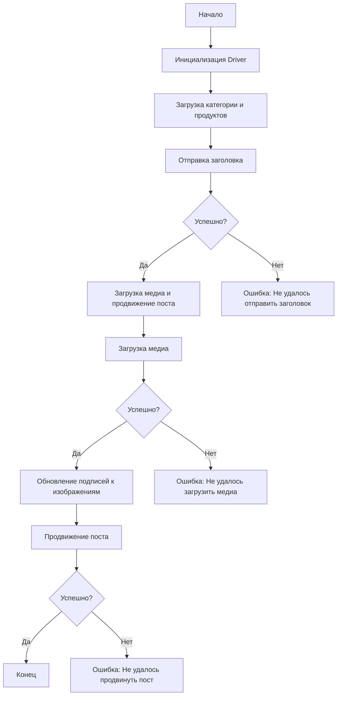

### **Анализ кода модуля `post_message_async.ru.md`**

#### **Качество кода**:
- **Соответствие стандартам**: 7/10
- **Плюсы**:
  - Подробное описание функциональности скрипта.
  - Наличие диаграммы структуры модуля.
  - Описание основных функций и их параметров.
  - Примеры использования и указания зависимостей.
- **Минусы**:
  - Отсутствие docstring в коде.
  - Смешанный формат (Markdown и rst).
  - Отсутствие обработки исключений и логирования.

#### **Рекомендации по улучшению**:
1. **Унификация формата**:
   - Привести весь документ к единому стилю Markdown, отказавшись от rst вставок.

2. **Документирование функций**:
   - Добавить docstring к каждой функции в соответствии со стандартом, указанным в системных инструкциях.

3. **Обработка ошибок и логирование**:
   - Добавить обработку исключений и логирование для обеспечения надежности скрипта.

4. **Примеры использования**:
   - Улучшить примеры использования, сделав их более конкретными и понятными.

5. **Зависимости**:
   - Указать версии зависимостей.

6. **Перевод на русский**:
   - Обеспечить полный перевод документации и комментариев на русский язык.

#### **Оптимизированный код**:

```markdown
### **Анализ кода модуля `post_message_async.ru.md`**

#### **Обзор**

Этот скрипт предназначен для автоматизации процесса публикации сообщений на Facebook. Он взаимодействует со страницей Facebook, используя локаторы для выполнения различных действий, таких как отправка заголовков и описаний, загрузка медиафайлов и обновление подписей.

#### **Основные возможности**

1. **Отправка заголовка и описания**: Отправляет заголовок и описание кампании в поле сообщения на Facebook.
2. **Загрузка медиафайлов**: Загружает медиафайлы (изображения и видео) на пост Facebook и обновляет их подписи.
3. **Продвижение поста**: Управляет всем процессом продвижения поста с заголовком, описанием и медиафайлами.

#### **Структура модуля**



#### **Легенда**

1. **Start**: Начало выполнения скрипта.
2. **InitDriver**: Создание экземпляра класса `Driver`.
3. **LoadCategoryAndProducts**: Загрузка данных категории и продуктов.
4. **SendTitle**: Вызов функции `post_title` для отправки заголовка.
5. **CheckTitleSuccess**: Проверка успешности отправки заголовка.
   - **Да**: Переход к загрузке медиа и продвижению поста.
   - **Нет**: Вывод ошибки "Не удалось отправить заголовок".
6. **UploadMediaAndPromotePost**: Вызов функции `promote_post`.
7. **UploadMedia**: Вызов функции `upload_media` для загрузки медиафайлов.
8. **CheckMediaSuccess**: Проверка успешности загрузки медиа.
   - **Да**: Переход к обновлению подписей к изображениям.
   - **Нет**: Вывод ошибки "Не удалось загрузить медиа".
9. **UpdateCaptions**: Вызов функции `update_images_captions` для обновления подписей.
10. **PromotePost**: Завершение процесса продвижения поста.
11. **CheckPromoteSuccess**: Проверка успешности продвижения поста.
    - **Да**: Конец выполнения скрипта.
    - **Нет**: Вывод ошибки "Не удалось продвинуть пост".

#### **Функции**

- **`post_title(d: Driver, category: SimpleNamespace) -> bool`**:
    ```python
    def post_title(d: Driver, category: SimpleNamespace) -> bool:
        """
        Отправляет заголовок и описание кампании в поле сообщения на Facebook.

        Args:
            d (Driver): Экземпляр `Driver` для взаимодействия с веб-страницей.
            category (SimpleNamespace): Категория, содержащая заголовок и описание для отправки.

        Returns:
            bool: `True`, если заголовок и описание были успешно отправлены, иначе `False`.

        Example:
            >>> from src.webdriver import Driver
            >>> from types import SimpleNamespace
            >>> # Предположим, что driver и category уже инициализированы
            >>> # result = post_title(driver, category)
            >>> # print(result)
            True
        """
        ...
    ```

- **`upload_media(d: Driver, products: List[SimpleNamespace], no_video: bool = False) -> bool`**:
    ```python
    def upload_media(d: Driver, products: List[SimpleNamespace], no_video: bool = False) -> bool:
        """
        Загружает медиафайлы на пост Facebook.

        Args:
            d (Driver): Экземпляр `Driver` для взаимодействия с веб-страницей.
            products (List[SimpleNamespace]): Список продуктов, содержащих пути к медиафайлам.
            no_video (bool, optional): Флаг, указывающий, следует ли пропустить загрузку видео. По умолчанию `False`.

        Returns:
            bool: `True`, если медиафайлы были успешно загружены, иначе `False`.

        Example:
            >>> from src.webdriver import Driver
            >>> from types import SimpleNamespace
            >>> # Предположим, что driver и products уже инициализированы
            >>> # result = upload_media(driver, products)
            >>> # print(result)
            True
        """
        ...
    ```

- **`update_images_captions(d: Driver, products: List[SimpleNamespace], textarea_list: List[WebElement]) -> None`**:
    ```python
    def update_images_captions(d: Driver, products: List[SimpleNamespace], textarea_list: List[WebElement]) -> None:
        """
        Асинхронно добавляет описания к загруженным медиафайлам.

        Args:
            d (Driver): Экземпляр `Driver` для взаимодействия с веб-страницей.
            products (List[SimpleNamespace]): Список продуктов с деталями для обновления.
            textarea_list (List[WebElement]): Список текстовых полей, куда добавляются подписи.

        Returns:
            None

        Example:
            >>> from src.webdriver import Driver
            >>> from types import SimpleNamespace
            >>> from selenium.webdriver.remote.webelement import WebElement
            >>> # Предположим, что driver, products и textarea_list уже инициализированы
            >>> # update_images_captions(driver, products, textarea_list)
        """
        ...
    ```

- **`promote_post(d: Driver, category: SimpleNamespace, products: List[SimpleNamespace], no_video: bool = False) -> bool`**:
    ```python
    def promote_post(d: Driver, category: SimpleNamespace, products: List[SimpleNamespace], no_video: bool = False) -> bool:
        """
        Управляет процессом продвижения поста с заголовком, описанием и медиафайлами.

        Args:
            d (Driver): Экземпляр `Driver` для взаимодействия с веб-страницей.
            category (SimpleNamespace): Детали категории, используемые для заголовка и описания поста.
            products (List[SimpleNamespace]): Список продуктов, содержащих медиа и детали для публикации.
            no_video (bool, optional): Флаг, указывающий, следует ли пропустить загрузку видео. По умолчанию `False`.

        Returns:
            bool: `True`, если пост был успешно продвинут, иначе `False`.

        Example:
            >>> from src.webdriver import Driver
            >>> from types import SimpleNamespace
            >>> # Предположим, что driver, category и products уже инициализированы
            >>> # result = promote_post(driver, category, products)
            >>> # print(result)
            True
        """
        ...
    ```

#### **Использование**

Для использования этого скрипта выполните следующие шаги:

1. **Инициализация Driver**: Создайте экземпляр класса `Driver`.
2. **Загрузка локаторов**: Загрузите локаторы из JSON-файла.
3. **Вызов функций**: Используйте предоставленные функции для отправки заголовка, загрузки медиа и продвижения поста.

#### **Пример**

```python
from src.webdriver import Driver
from types import SimpleNamespace

# Инициализация Driver
driver = Driver(Firefox)  # пример для Firefox

# Загрузка категории и продуктов
category = SimpleNamespace(title='Заголовок кампании', description='Описание кампании')
products = [SimpleNamespace(local_image_path='путь/к/изображению.jpg')]

# Отправка заголовка
post_title(driver, category)

# Загрузка медиа и продвижение поста
promote_post(driver, category, products)
```

#### **Зависимости**

- `selenium`: Для веб-автоматизации.
- `asyncio`: Для асинхронных операций.
- `pathlib`: Для обработки путей к файлам.
- `types`: Для создания простых пространств имен.
- `typing`: Для аннотаций типов.
- `webdriver`:  `hypotez/src/webdriver`

#### **Обработка ошибок**

Скрипт включает обработку ошибок, чтобы обеспечить продолжение выполнения даже в случае, если некоторые элементы не найдены или если возникли проблемы с веб-страницей.

#### **Вклад**

Вклад в этот скрипт приветствуется. Пожалуйста, убедитесь, что любые изменения хорошо документированы и включают соответствующие тесты.

#### **Лицензия**

Этот скрипт лицензирован под MIT License. Подробности смотрите в файле `LICENSE`.
```