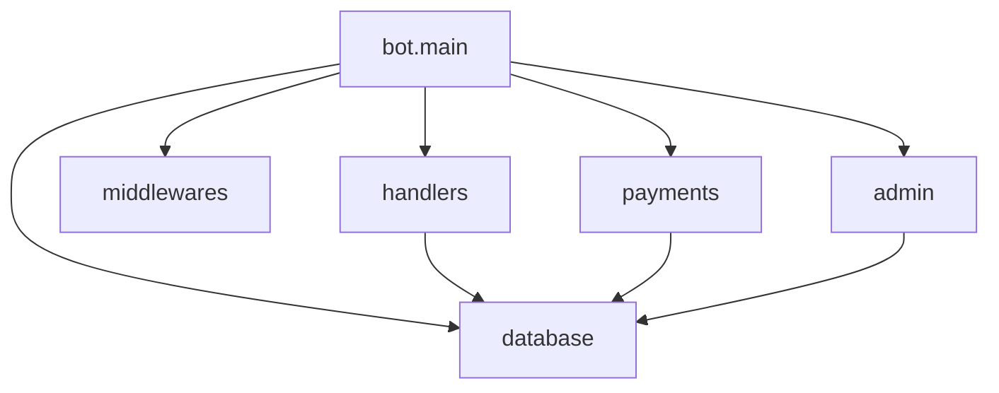

### **Анализ кода модуля `README.md`**

## Качество кода:

- **Соответствие стандартам**: 7/10
- **Плюсы**:
    - Хорошее описание проекта, его целей и функциональности.
    - Четкие инструкции по установке и настройке.
    - Указаны используемые технологии и версии.
    - Приведены примеры использования и тестовые данные.
    - Документация содержит ссылки на демонстрационные видео и работающего бота.
- **Минусы**:
    - Отсутствует описание структуры кода и взаимодействия между модулями.
    - Нет документации по API и функциям бота.
    - Не хватает информации о процессе разработки и архитектурных решениях.
    - Не указаны возможные проблемы и пути их решения.
    - Нет информации о расширении функциональности и внесении изменений.

## Рекомендации по улучшению:

1.  **Добавить информацию о структуре проекта**:
    - Описать основные модули и их назначение.
    - Показать взаимосвязи между модулями и классами.
    - Добавить диаграмму классов или архитектурную схему.
2.  **Добавить документацию по API**:
    - Описать основные функции и методы бота.
    - Указать параметры и возвращаемые значения.
    - Привести примеры использования API.
3.  **Добавить информацию о процессе разработки**:
    - Описать этапы разработки и принятые решения.
    - Указать используемые инструменты и практики.
    - Добавить информацию о тестировании и отладке.
4.  **Добавить информацию о возможных проблемах и решениях**:
    - Описать типичные проблемы, возникающие при установке и настройке.
    - Привести решения для каждой проблемы.
    - Добавить раздел FAQ.
5.  **Добавить информацию о расширении функциональности**:
    - Описать процесс добавления новых функций и модулей.
    - Указать требования к коду и документации.
    - Привести примеры расширения функциональности.
6.  **Улучшить форматирование и структуру документации**:
    - Использовать заголовки и подзаголовки для структурирования информации.
    - Добавить оглавление для удобной навигации.
    - Использовать списки и таблицы для представления информации.

## Оптимизированный код:

```markdown
### **Digital Market Hook** — это учебный проект, представляющий собой пример Telegram-бота для цифрового интернет-магазина,
разработанный с использованием современных технологий Python. Бот работает с использованием технологии веб-хуков и 
интегрирован с тремя платежными системами: ЮКасса, Telegram-Stars и Robocassa. В проекте предусмотрены админ-панель, 
профиль пользователя и каталог товаров с разбивкой на категории.

## Описание

Данный бот использует технологию веб-хуков, что обеспечивает высокую производительность. Хуки реализованы через aiohttp 
и используются как для поднятия бота, так и для обработки платежей с Robocassa. 

Бот включает в себя три вида оплаты:

- **ЮKassa** — интеграция через BotFather.
- **Telegram-Stars** — интеграция для осуществления платежей.
- **Robocassa** — интеграция напрямую в обход BotFather, обслуживаемая через веб-хуки.

## Технологии

В проекте используются следующие технологии:

- **aiogram** 3.15.0 — асинхронный фреймворк для разработки Telegram-ботов.
- **aiosqlite** 0.20.0 — асинхронный драйвер для работы с SQLite.
- **loguru** 0.7.2 — библиотека для продвинутого логирования.
- **pydantic-settings** 2.7.0 — управление настройками с использованием Pydantic.
- **SQLAlchemy** 2.0.35 — SQL-библиотека и ORM для Python.
- **pydantic** >=2.4.1,<2.10 — библиотека для валидации данных и управления настройками.
- **alembic** 1.14.0 — инструмент для управления миграциями базы данных.
- **aiohttp** 3.10.11 — веб-сервер для обслуживания веб-хуков в боте.

## Установка

1.  Клонируйте репозиторий:

    ```bash
    git clone https://github.com/Yakvenalex/DigitalMarketHookBot.git
    ```

2.  Перейдите в директорию проекта:

    ```bash
    cd DigitalMarketHookBot
    ```

3.  Создайте и активируйте виртуальное окружение:

    ```bash
    python -m venv venv
    source venv/bin/activate  # Для Windows: venv\\Scripts\\activate
    ```

4.  Получите токен бота через [@BotFather](https://t.me/BotFather).
5.  Получите платежный токен ЮКассы через [@BotFather](https://t.me/BotFather) (подойдет тестовый).
6.  Зарегистрируйтесь в ЮКассе и Робокассе, создайте магазины для обработки платежей.
7.  Установите зависимости:

    ```bash
    pip install -r requirements.txt
    ```

8.  Создайте файл `.env` в корне проекта:

    ```
    BOT_TOKEN=ВАШ_ТОКЕН
    ADMIN_IDS=[ADMIN_TG1, ADMIN_TG2, ADMIN_TG3]
    PROVIDER_TOKEN=ТОКЕН_Ю_КАССЫ
    SITE_URL=ВЕБ_САЙТ_ДЛЯ_ХУКОВ
    SITE_HOST=0.0.0.0
    SITE_PORT=8000
    MRH_LOGIN=ЛОГИН_С_РОБОКАССЫ
    MRH_PASS_1=ПАРОЛЬ_1_С_РОБОКАССЫ
    MRH_PASS_2=ПАРОЛЬ_2_С_РОБОКАССЫ
    IN_TEST=1/0
    ```

    Параметр IN_TEST со значением 1 указывает на то, что платежка ROBOCASSA должна работать в тестовом режиме. 0 - 
    указывает на боевой режим.

9.  Для работы с вебхуками необходимо активировать туннель на локальной машине, например, через **Ngrok**:

    *   Скачайте Ngrok с [официального сайта](https://ngrok.com/download).
    *   Запустите Ngrok, указав локальный порт вашего сервера (например, 8000):

        ```bash
        ngrok http 8000
        ```

    *   Ngrok предоставит вам временный публичный URL, который вы можете использовать в качестве `SITE_URL`.

10. Запустите бота:

    ```bash
    python -m bot.main
    ```

## Использование

После запуска бота вы можете взаимодействовать с ним в Telegram. Бот предоставляет функциональность цифрового 
интернет-магазина с возможностью тестовой оплаты через ЮKassa, Робокасса и Telegram Stars. При оплате Telegram Stars 
реализован автоматический возврат звезд сразу после  оплаты.

### Тестовые данные для оплаты

-   **Карта:** 1111 1111 1111 1026
-   **Годен до:** 12/26
-   **CVC-код:** 000

## Структура проекта

### Основные модули:

-   `bot.main`: Главный модуль, запускающий бота.
-   `handlers`: Модуль, содержащий обработчики команд и сообщений.
-   `middlewares`: Модуль, содержащий middlewares для обработки запросов.
-   `database`: Модуль, содержащий классы для работы с базой данных.
-   `payments`: Модуль, содержащий классы для работы с платежными системами.
-   `admin`: Модуль, содержащий функциональность для администрирования бота.

### Взаимосвязи между модулями:



## API

### Основные функции:

-   `start(message: types.Message)`: Обработчик команды `/start`.
    *   Параметры:
        *   `message (types.Message)`: Объект сообщения Telegram.
    *   Возвращаемое значение: `None`.
-   `help(message: types.Message)`: Обработчик команды `/help`.
    *   Параметры:
        *   `message (types.Message)`: Объект сообщения Telegram.
    *   Возвращаемое значение: `None`.
-   `process_payment(update: types.Update)`: Обработчик платежей.
    *   Параметры:
        *   `update (types.Update)`: Объект обновления Telegram.
    *   Возвращаемое значение: `None`.

## Автор

**Алексей Яковенко** [Telegram](https://t.me/yakvenalexx) — разработчик данного учебного проекта.

## Лицензия

Этот проект распространяется под лицензией MIT.

## Демонстрация функционала

Я подготовил наглядные примеры работы проекта, чтобы вы могли оценить его функционал и увидеть, как он функционирует в реальных условиях.

### 1. Полная демонстрация функционала

Посмотрите **[видео-демонстрацию проекта](https://rutube.ru/video/f57c1617bd03368611ee8aeb44ccb2e5/)**, где показаны основные возможности бота. Вы сможете увидеть, как выполняются все этапы работы, начиная от взаимодействия с пользователем и заканчивая оплатой через Robokassa.

### 2. Дополнительные оплаты

Второе **[видео](https://rutube.ru/video/bbf601d7f0dab962ba24cb57df706640/)** демонстрирует процесс работы с дополнительными платежами. Здесь вы увидите, как бот обрабатывает различные сценарии взаимодействия с системой оплаты.

### 3. Попробуйте сами!

Чтобы лично оценить функционал бота, вы можете воспользоваться **[работающим ботом](https://t.me/DigitalMarketAiogramHookBot)**. Взаимодействуйте с ботом, тестируйте различные функции, включая оплату, и убедитесь в удобстве его использования.

## Дополнительная информация

Для более подробного изучения кода и архитектуры проекта рекомендуется ознакомиться с исходным кодом и комментариями 
в репозитории.

> **Примечание:** Проект создан в образовательных целях и не предназначен для использования в реальных коммерческих 
> проектах без соответствующей доработки и тестирования.