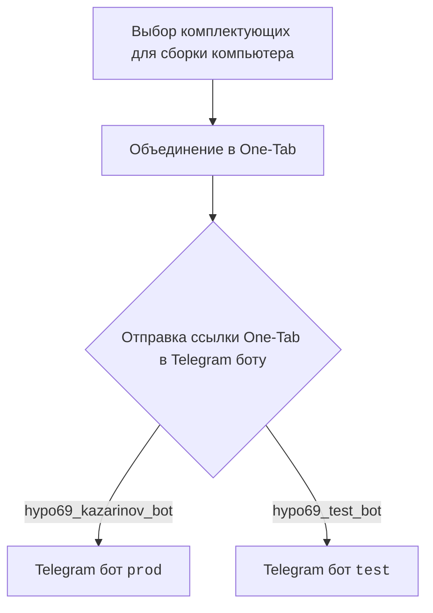
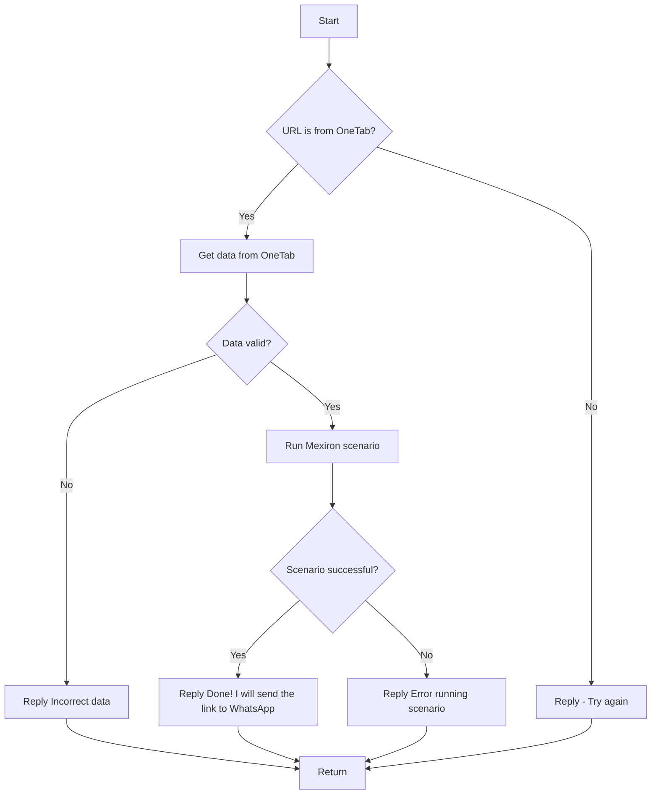

### **Анализ кода модуля `README.MD`**

## \file /hypotez/src/endpoints/kazarinov/README.MD

**Качество кода:**

- **Соответствие стандартам**: 6/10
- **Плюсы**:
    - Наличие визуальных схем (диаграмм Mermaid) для описания логики работы и взаимодействия компонентов.
    - Предоставлены ссылки на используемые ресурсы и документацию.
    - Описание клиентской и серверной сторон взаимодействия.
- **Минусы**:
    - Отсутствует подробное описание каждого этапа процесса.
    - Нет инструкций по развертыванию и использованию бота.
    - Документация представлена в формате, требующем некоторой доработки для соответствия стандартам оформления.
    - Не хватает docstring в соответствии с заданным форматом.
    - Нет информации об обработке исключений и логировании.

**Рекомендации по улучшению:**

1.  **Документирование кода**:
    *   Добавить заголовки для каждого файла с кратким описанием содержимого.
    *   Описать все функции и классы, включая их параметры, возвращаемые значения и возможные исключения.
    *   Привести примеры использования основных функций и классов.
2.  **Улучшение структуры документации**:
    *   Организовать информацию в логическом порядке, начиная с обзора модуля и заканчивая детальным описанием компонентов.
    *   Добавить разделы с инструкциями по установке и настройке бота.
    *   Включить примеры использования бота и сценарии работы.
3.  **Добавление информации об обработке исключений и логировании**:
    *   Описать, как обрабатываются ошибки в различных частях кода.
    *   Указать, какие события логируются и как использовать логи для отладки.
4.  **Актуализация ссылок и ресурсов**:
    *   Проверить актуальность предоставленных ссылок и, при необходимости, обновить их.
    *   Добавить ссылки на другие полезные ресурсы и документацию.
5.  **Использование единого стиля оформления**:
    *   Привести весь код и документацию к единому стилю оформления (например, PEP8 для Python кода).
    *   Использовать Markdown для форматирования документации.
6.  **Улучшение диаграмм Mermaid**:
    *   Убедиться, что диаграммы легко читаемы и понятны.
    *   Добавить описания к каждому элементу диаграммы.

**Оптимизированный код:**

```markdown
# Анализ кода модуля Kazarinov

## Описание

Данный модуль содержит документацию по работе Telegram-бота Kazarinov, используемого для создания PDF-документов Mexiron на основе данных, полученных из One-Tab.

## Структура

-   Содержит информацию о клиентской и серверной сторонах взаимодействия.
-   Визуальные схемы (диаграммы Mermaid) для описания логики работы.
-   Ссылки на используемые ресурсы.

## Клиентская сторона (Kazarinov)



## Серверная сторона (Code side)



## Ссылки

-   [Root ↑](https://github.com/hypo69/hypotez/blob/master/readme.ru.md)
-   [Русский](https://github.com/hypo69/hypotez/blob/master/src/endpoints/kazarinov/readme.ru.md)
-   [KazarinovTelegramBot](https://one-tab.co.il)
-   [KazarinovTelegramBot](https://morlevi.co.il)
-   [KazarinovTelegramBot](https://grandavance.co.il)
-   [KazarinovTelegramBot](https://ivory.co.il)
-   [KazarinovTelegramBot](https://ksp.co.il)
-   [Kazarinov bot](https://github.com/hypo69/hypotez/blob/master/src/endpoints/kazarinov/kazarinov_bot.md)
-   [Scenario Execution](https://github.com/hypo69/hypotez/blob/master/src/endpoints/kazarinov/scenarios/README.MD)

## Описание процесса

1.  **Выбор комплектующих**: Пользователь выбирает комплектующие для сборки компьютера.
2.  **Объединение в One-Tab**: Комплектующие объединяются в One-Tab для удобной передачи.
3.  **Отправка ссылки в Telegram бот**: Ссылка One-Tab отправляется в Telegram бот (`prod` или `test`).
4.  **Обработка ссылки**:
    *   Бот проверяет, является ли URL ссылкой One-Tab.
    *   Извлекает данные из One-Tab.
    *   Проверяет валидность данных.
    *   Запускает сценарий Mexiron.
    *   В случае успеха отправляет ссылку в WhatsApp.
    *   В случае ошибки возвращает сообщение об ошибке.

## Далее

-   [Kazarinov bot](https://github.com/hypo69/hypotez/blob/master/src/endpoints/kazarinov/kazarinov_bot.md)
-   [Scenario Execution](https://github.com/hypo69/hypotez/blob/master/src/endpoints/kazarinov/scenarios/README.MD)