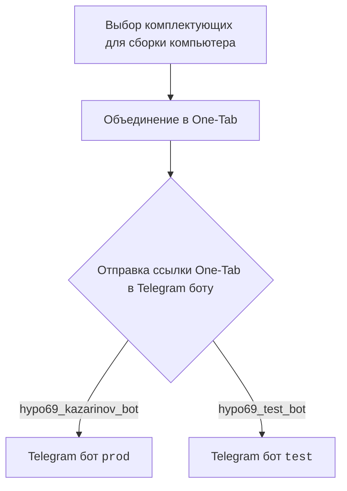
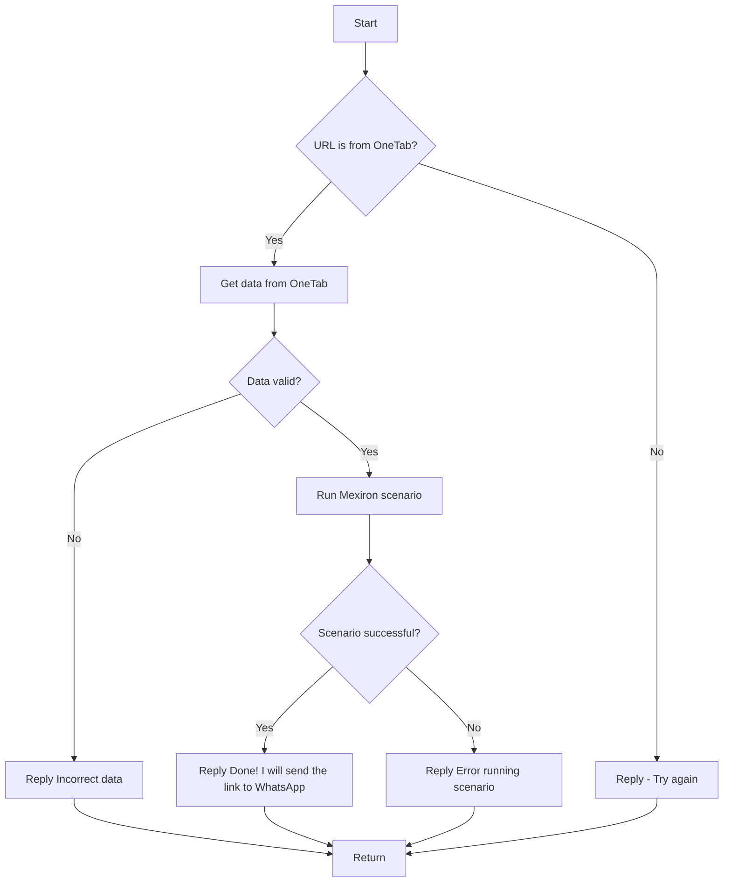

### **Анализ кода модуля `README.MD`**

2. **Качество кода**:
   - **Соответствие стандартам**: 7/10
   - **Плюсы**:
     - Хорошее использование диаграмм Mermaid для визуализации логики работы бота.
     - Наличие ссылок на другие важные компоненты и файлы проекта.
   - **Минусы**:
     - Отсутствует структурированное описание функциональности модуля, как это требуется в инструкции.
     - Не хватает подробных комментариев и docstring, объясняющих назначение каждой части кода.
     - Не все элементы документа оформлены единообразно (например, ссылки).

3. **Рекомендации по улучшению**:
   - Добавить подробное описание модуля, его целей и задач в соответствии с форматом, указанным в инструкции.
   - Привести все ссылки к единому стилю оформления Markdown.
   - Добавить больше текстового описания процессов, чтобы облегчить понимание для новых разработчиков.
   - Улучшить структуру документа, разделив его на логические разделы с четкими заголовками.
   - Добавить описание взаимодействия клиентской и серверной частей.

4. **Оптимизированный код**:

```markdown
### **Модуль: Описание работы Kazarinov Telegram Bot и логики обработки данных**

=================================================

Этот модуль содержит описание работы Telegram-бота Kazarinov, включая клиентскую и серверную стороны, а также логику обработки данных и взаимодействие со сценариями Mexiron.

#### **Описание**

Модуль предоставляет информацию о структуре и логике работы Telegram-бота, используемого для обработки данных, полученных от пользователей, и запуска сценариев Mexiron. Включает в себя описание клиентской стороны (выбор комплектующих) и серверной стороны (обработка URL, проверка данных, запуск сценариев).

#### **Клиентская сторона (Kazarinov)**

Клиентская сторона представляет собой процесс выбора комплектующих для сборки компьютера и объединения их в One-Tab. Пользователь отправляет ссылку One-Tab в Telegram бот.



#### **Серверная сторона (BotHandler)**

Серверная сторона отвечает за обработку URL, проверку данных и запуск сценариев Mexiron.



- **Start**: Начало процесса.
- **URL is from OneTab?**: Проверка, является ли URL ссылкой OneTab.
- **Get data from OneTab**: Получение данных из OneTab.
- **Reply - Try again**: Ответ с просьбой повторить попытку.
- **Data valid?**: Проверка валидности данных.
- **Reply Incorrect data**: Ответ о некорректных данных.
- **Run Mexiron scenario**: Запуск сценария Mexiron.
- **Scenario successful?**: Проверка успешности выполнения сценария.
- **Reply Done! I will send the link to WhatsApp**: Ответ об успешном выполнении и отправке ссылки в WhatsApp.
- **Reply Error running scenario**: Ответ об ошибке выполнения сценария.
- **Return**: Завершение процесса.

#### **Ссылки**

- [Root ↑](https://github.com/hypo69/hypotez/blob/master/readme.ru.md)
- [Русский](https://github.com/hypo69/hypotez/blob/master/src/endpoints/kazarinov/readme.ru.md)
- [Kazarinov bot](https://github.com/hypo69/hypotez/blob/master/src/endpoints/kazarinov/kazarinov_bot.md)
- [Scenario Execution](https://github.com/hypo69/hypotez/blob/master/src/endpoints/kazarinov/scenarios/README.MD)

#### **Дополнительные ресурсы**

- [One-tab.co.il](https://one-tab.co.il)
- [Morlevi.co.il](https://morlevi.co.il)
- [Grandavance.co.il](https://grandavance.co.il)
- [Ivory.co.il](https://ivory.co.il)
- [Ksp.co.il](https://ksp.co.il)