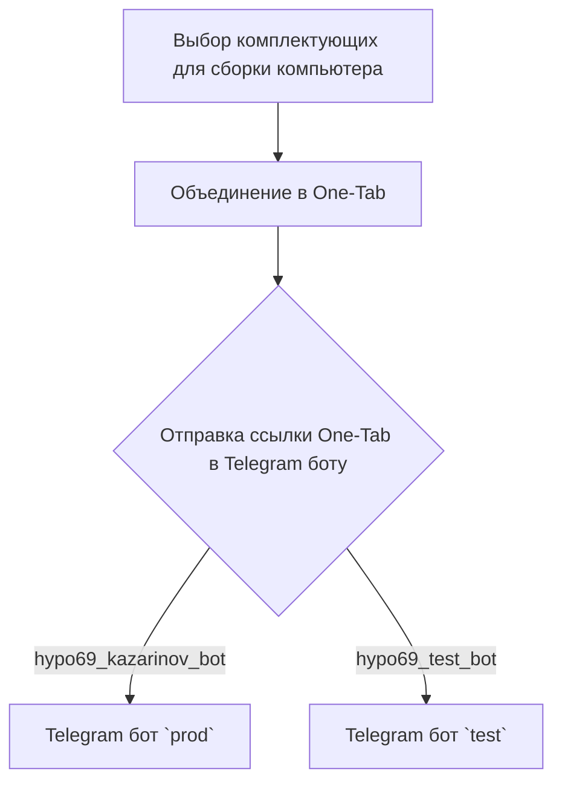
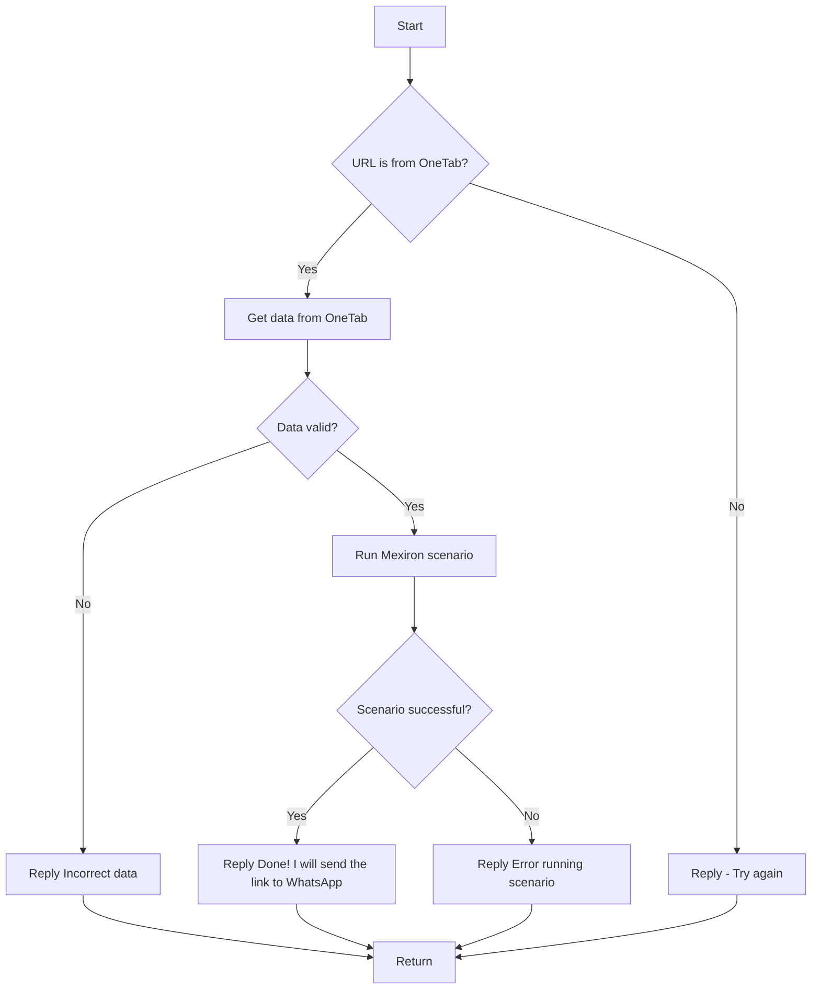

### **Анализ кода модуля `readme.ru.md`**

2. **Качество кода**:
   - **Соответствие стандартам**: 6/10
   - **Плюсы**:
     - Наличие диаграмм Mermaid для визуализации логики работы.
     - Описание основных шагов обработки данных.
     - Структурированное описание взаимодействия между клиентом и ботом.
   - **Минусы**:
     - Отсутствует четкая структура Markdown-документа.
     - Неполное описание функциональности (отсутствуют детали реализации).
     - Смешанный стиль оформления (использование HTML-тегов наряду с Markdown).
     - Нет примеров использования кода.
     - Отсутствуют docstring в коде.

3. **Рекомендации по улучшению**:
   - Переформатировать документ в соответствии со стандартами Markdown.
   - Заменить HTML-теги на Markdown-аналоги.
   - Добавить подробное описание каждого этапа обработки данных, включая примеры кода.
   - Улучшить описание сценариев и их выполнения.
   - Добавить ссылки на соответствующие модули и классы в проекте.
   - Ввести описание всех функций с использованием docstring.
   - Перевести на русский язык, если это необходимо.
   - Использовать `logger` для логирования.
   - Добавить заголовки и подзаголовки для улучшения структуры документа.

4. **Оптимизированный код**:

```markdown
### Модуль для создания прайслиста для Казаринова
==================================================

Этот модуль содержит описание логики работы Telegram-бота `KazarinovTelegramBot`,
который используется для создания прайслистов на основе данных, полученных от клиентов.

**Ссылки:**
- [Root ↑](https://github.com/hypo69/hypotez/blob/master/README.MD)
- [English](https://github.com/hypo69/hypotez/blob/master/src/endpoints/kazarinov/README.MD)

**Описание функциональности**
-----------------------------

Модуль предназначен для обработки запросов пользователей через Telegram-бота и формирования прайслистов.
Основные компоненты:

- `KazarinovTelegramBot`: Telegram-бот для взаимодействия с пользователями.
- `BotHandler`: Обработчик сообщений от пользователей.

**Схема работы на стороне клиента**
----------------------------------



**Схема работы на стороне кода**
--------------------------------

Основной сценарий обработки сообщений:

- `kazarinov_bot.handle_message()` -> `kazarinov.scenarios.run_scenario()`



**Подробное описание сценария**
------------------------------

1.  **Начало**: Пользователь отправляет ссылку One-Tab в Telegram-бот.
2.  **Проверка URL**: Бот проверяет, является ли URL ссылкой One-Tab.
    -   Если нет, бот отвечает с просьбой повторить попытку.
3.  **Получение данных**: Бот извлекает данные из One-Tab.
4.  **Проверка данных**: Бот проверяет валидность полученных данных.
    -   Если данные невалидны, бот отправляет сообщение об ошибке.
5.  **Запуск сценария**: Бот запускает сценарий Mexiron для обработки данных.
6.  **Проверка сценария**: Бот проверяет успешность выполнения сценария.
    -   Если сценарий выполнен успешно, бот отправляет подтверждение и ссылку на WhatsApp.
    -   Если произошла ошибка, бот отправляет сообщение об ошибке.

**Связанные модули**
--------------------

-   [Казаринов бот](https://github.com/hypo69/hypotez/blob/master/src/endpoints/kazarinov/kazarinov_bot.ru.md)
-   [Исполнение сценария](https://github.com/hypo69/hypotez/blob/master/src/endpoints/kazarinov/scenarios/readme.ru.md)