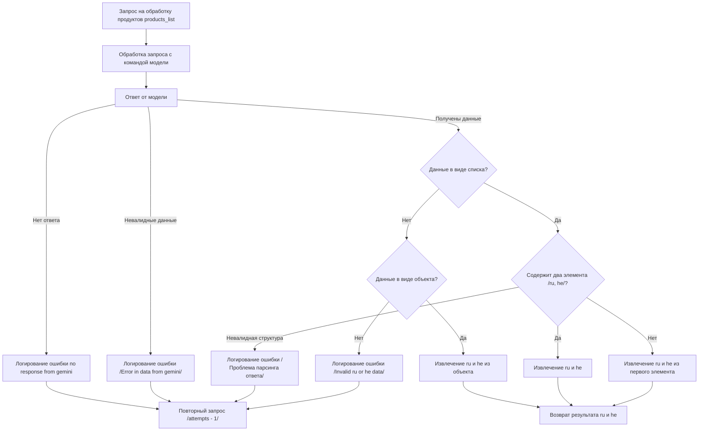

### **Анализ кода модуля `README.MD`**

## \file /hypotez/src/endpoints/kazarinov/scenarios/README.MD

**Качество кода**:
- **Соответствие стандартам**: 7/10
- **Плюсы**:
    - Описан процесс обработки запроса на продукты в виде блок-схемы.
    - Блок-схема наглядно отображает логику работы.
- **Минусы**:
    - Отсутствует описание назначения модуля.
    - Нет информации об используемых классах и функциях.
    - Нет примеров использования.
    - Нет описания каждого блока блок-схемы.

**Рекомендации по улучшению**:

1.  **Добавить заголовок модуля**:
    -   В начале файла добавить заголовок, описывающий назначение модуля и его основные функции.
2.  **Описание блок-схемы**:
    -   Добавить текстовое описание каждого блока блок-схемы, чтобы было понятно, что происходит на каждом этапе.
3.  **Улучшить описание ошибок**:
    -   Более подробно описать ошибки, которые могут возникнуть на каждом этапе, и как они обрабатываются.
4.  **Добавить примеры использования**:
    -   Добавить примеры запросов и ожидаемых результатов, чтобы было понятно, как использовать этот модуль.

**Оптимизированный код**:

```markdown
    """
    Описание модуля обработки продуктов
    =================================================

    Модуль предназначен для обработки запросов на получение информации о продуктах на двух языках (ru и he).
    Он включает в себя логику обработки запросов к модели, проверки валидности данных и извлечения необходимой информации.

    Пример использования
    ----------------------

    Для использования модуля необходимо выполнить запрос на обработку продуктов, передав список продуктов.
    Модуль вернет информацию о продуктах на русском и иврите.

    Блок-схема работы модуля
    -----------------------

    Описание каждого блока:
    - A: Запрос на обработку продуктов products_list - получение запроса на обработку списка продуктов.
    - B: Обработка запроса с командой модели - отправка запроса к модели для получения информации о продуктах.
    - C: Ответ от модели - получение ответа от модели.
    - D: Логирование ошибки no response from gemini - логирование ошибки в случае отсутствия ответа от модели.
    - E: Повторный запрос /attempts - 1/ - повторная отправка запроса к модели.
    - F: Логирование ошибки /Error in data from gemini/ - логирование ошибки в случае получения невалидных данных от модели.
    - G: Данные в виде списка? - проверка, является ли ответ от модели списком.
    - H: Содержит два элемента /ru, he/? - проверка, содержит ли список два элемента (русский и иврит).
    - I: Извлечение ru и he - извлечение информации на русском и иврите из списка.
    - J: Извлечение ru и he из первого элемента - извлечение информации на русском и иврите из первого элемента списка.
    - K: Логирование ошибки /Проблема парсинга ответа/ - логирование ошибки в случае проблем с парсингом ответа.
    - L: Данные в виде объекта? - проверка, является ли ответ от модели объектом.
    - M: Извлечение ru и he из объекта - извлечение информации на русском и иврите из объекта.
    - N: Логирование ошибки /Invalid ru or he data/ - логирование ошибки в случае невалидных данных на русском или иврите.
    - O: Возврат результата ru и he - возврат информации на русском и иврите.

    """
