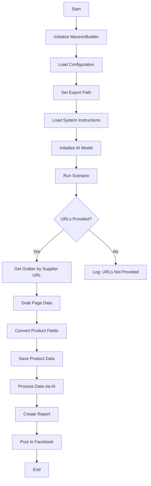

## Анализ кода модуля `scenario.md`

**Качество кода:**

- **Соответствие стандартам**: 7/10
- **Плюсы**:
    - Хорошая структурированность документации.
    - Наличие блок-схем для визуализации процессов.
    - Подробное описание класса `MexironBuilder` и его методов.
    - Описание обработки ошибок и зависимостей.
- **Минусы**:
    - Не хватает подробных комментариев внутри методов класса `MexironBuilder`.
    - Отсутствуют примеры использования методов класса.
    - Docstring написаны на английском языке, что противоречит требованиям.

**Рекомендации по улучшению:**

1.  **Документация методов**:
    *   Добавить docstring на русском языке для всех методов класса `MexironBuilder`, подробно описывая их функциональность, аргументы, возвращаемые значения и возможные исключения.

2.  **Примеры использования**:
    *   Включить примеры использования методов класса `MexironBuilder` для улучшения понимания их работы.

3.  **Комментарии в коде**:
    *   Добавить больше комментариев внутри методов для пояснения логики работы кода.

4.  **Обработка исключений**:
    *   Уточнить, как обрабатываются исключения в каждом методе, и добавить логирование ошибок с использованием модуля `src.logger`.

5.  **Соответствие PEP8**:
    *   Проверить код на соответствие стандартам PEP8, включая пробелы вокруг операторов и именование переменных.

6.  **Использование `j_loads` или `j_loads_ns`**:
    *   Если в коде используются JSON-файлы, заменить стандартное использование `open` и `json.load` на `j_loads` или `j_loads_ns`.

7.  **Аннотации типов**:
    *   Проверить наличие аннотаций типов для всех переменных и параметров функций.

**Оптимизированный код:**

```markdown
## Sergey Kazarinov's Mechiron Creation Script

### Обзор

Этот скрипт является частью директории `hypotez/src/endpoints/kazarinov/scenarios` и предназначен для автоматизации процесса создания "мехирона" для Сергея Казаринова. Скрипт извлекает, анализирует и обрабатывает данные о продуктах от различных поставщиков, подготавливает данные, обрабатывает их с помощью ИИ и интегрируется с Facebook для публикации продуктов.

### Основные функции

1.  **Извлечение и анализ данных**: Извлекает и анализирует данные о продуктах от различных поставщиков.
2.  **Обработка данных ИИ**: Обрабатывает извлеченные данные с помощью модели Google Generative AI.
3.  **Хранение данных**: Сохраняет обработанные данные в файлы.
4.  **Генерация отчетов**: Генерирует HTML и PDF отчеты из обработанных данных.
5.  **Публикация в Facebook**: Публикует обработанные данные в Facebook.

### Блок-схема модуля



### Легенда

1.  **Start**: Начало выполнения скрипта.
2.  **InitMexironBuilder**: Инициализация класса `MexironBuilder`.
3.  **LoadConfig**: Загрузка конфигурации из JSON файла.
4.  **SetExportPath**: Установка пути для экспорта данных.
5.  **LoadSystemInstruction**: Загрузка системных инструкций для AI модели.
6.  **InitModel**: Инициализация модели Google Generative AI.
7.  **RunScenario**: Выполнение основного сценария.
8.  **CheckURLs**: Проверка наличия URL для парсинга.
9.  **GetGraber**: Получение соответствующего грабера для URL поставщика.
10. **GrabPage**: Извлечение данных страницы с использованием грабера.
11. **ConvertFields**: Преобразование полей продукта в словарь.
12. **SaveData**: Сохранение данных продукта в файл.
13. **ProcessAI**: Обработка данных продукта через AI модель.
14. **CreateReport**: Создание HTML и PDF отчетов из обработанных данных.
15. **PostFacebook**: Публикация обработанных данных в Facebook.
16. **End**: Конец выполнения скрипта.

-----------------------

#### Класс: `MexironBuilder`

-   **Атрибуты**:
    -   `driver`: Экземпляр Selenium WebDriver.
    -   `export_path`: Путь для экспорта данных.
    -   `mexiron_name`: Пользовательское имя для процесса мехирона.
    -   `price`: Цена для обработки.
    -   `timestamp`: Временная метка для процесса.
    -   `products_list`: Список обработанных данных о продуктах.
    -   `model`: Модель Google Generative AI.
    -   `config`: Конфигурация, загруженная из JSON.

-   **Методы**:

    -   **`__init__(self, driver: Driver, mexiron_name: Optional[str] = None)`**:

        ```python
        def __init__(self, driver: Driver, mexiron_name: Optional[str] = None) -> None:
            """
            Инициализирует класс `MexironBuilder` с необходимыми компонентами.

            Args:
                driver (Driver): Экземпляр Selenium WebDriver.
                mexiron_name (Optional[str], optional): Пользовательское имя для процесса мехирона. По умолчанию `None`.

            """
            # Инициализация атрибутов класса
            ...
        ```

        -   **Назначение**: Инициализирует класс `MexironBuilder` с необходимыми компонентами.
        -   **Параметры**:
            -   `driver`: Экземпляр Selenium WebDriver.
            -   `mexiron_name`: Пользовательское имя для процесса мехирона.

    ----

    -   **`run_scenario(self, system_instruction: Optional[str] = None, price: Optional[str] = None, mexiron_name: Optional[str] = None, urls: Optional[str | List[str]] = None, bot = None) -> bool`**:

        ```python
        def run_scenario(self, system_instruction: Optional[str] = None, price: Optional[str] = None, mexiron_name: Optional[str] = None, urls: Optional[str | List[str]] = None, bot = None) -> bool:
            """
            Выполняет сценарий: парсит продукты, обрабатывает их через AI и сохраняет данные.

            Args:
                system_instruction (Optional[str], optional): Системные инструкции для AI модели. По умолчанию `None`.
                price (Optional[str], optional): Цена для обработки. По умолчанию `None`.
                mexiron_name (Optional[str], optional): Пользовательское имя мехирона. По умолчанию `None`.
                urls (Optional[str | List[str]], optional): URL страниц продуктов. По умолчанию `None`.

            Returns:
                bool: `True`, если сценарий выполнен успешно, иначе `False`.

            """
            # Выполнение сценария парсинга, обработки AI и сохранения данных
            ...
        ```

        -   **Назначение**: Выполняет сценарий: парсит продукты, обрабатывает их через AI и сохраняет данные.
        -   **Параметры**:
            -   `system_instruction`: Системные инструкции для AI модели.
            -   `price`: Цена для обработки.
            -   `mexiron_name`: Пользовательское имя мехирона.
            -   `urls`: URL страниц продуктов.
        -   **Возвращает**: `True`, если сценарий выполнен успешно, иначе `False`.

        -   **Блок-схема**:

            ```mermaid
            flowchart TD
            Start[Start] --> IsOneTab{URL is from OneTab?}
            IsOneTab -->|Yes| GetDataFromOneTab[Get data from OneTab]
            IsOneTab -->|No| ReplyTryAgain[Reply - Try again]
            GetDataFromOneTab --> IsDataValid{Data valid?}
            IsDataValid -->|No| ReplyIncorrectData[Reply Incorrect data]
            IsDataValid -->|Yes| RunMexironScenario[Run Mexiron scenario]
            RunMexironScenario --> IsGraberFound{Graber found?}
            IsGraberFound -->|Yes| StartParsing[Start parsing: <code>url</code>]
            IsGraberFound -->|No| LogNoGraber[Log: No graber for <code>url</code>]
            StartParsing --> IsParsingSuccessful{Parsing successful?}
            IsParsingSuccessful -->|Yes| ConvertProductFields[Convert product fields]
            IsParsingSuccessful -->|No| LogParsingFailed[Log: Failed to parse product fields]
            ConvertProductFields --> IsConversionSuccessful{Conversion successful?}
            IsConversionSuccessful -->|Yes| SaveProductData[Save product data]
            IsConversionSuccessful -->|No| LogConversionFailed[Log: Failed to convert product fields]
            SaveProductData --> IsDataSaved{Data saved?}
            IsDataSaved -->|Yes| AppendToProductsList[Append to products_list]
            IsDataSaved -->|No| LogDataNotSaved[Log: Data not saved]
            AppendToProductsList --> ProcessAIHe[AI processing lang = he]
            ProcessAIHe --> ProcessAIRu[AI processing lang = ru]
            ProcessAIRu --> SaveHeJSON{Save JSON for he?}
            SaveHeJSON -->|Yes| SaveRuJSON[Save JSON for ru]
            SaveHeJSON -->|No| LogHeJSONError[Log: Error saving he JSON]
            SaveRuJSON --> IsRuJSONSaved{Save JSON for ru?}
            IsRuJSONSaved -->|Yes| GenerateReports[Generate reports]
            IsRuJSONSaved -->|No| LogRuJSONError[Log: Error saving ru JSON]
            GenerateReports --> IsReportGenerationSuccessful{Report generation successful?}
            IsReportGenerationSuccessful -->|Yes| SendPDF[Send PDF via Telegram]
            IsReportGenerationSuccessful -->|No| LogPDFError[Log: Error creating PDF]
            SendPDF --> ReturnTrue[Return True]
            LogPDFError --> ReturnTrue[Return True]
            ReplyIncorrectData --> ReturnTrue[Return True]
            ReplyTryAgain --> ReturnTrue[Return True]
            LogNoGraber --> ReturnTrue[Return True]
            LogParsingFailed --> ReturnTrue[Return True]
            LogConversionFailed --> ReturnTrue[Return True]
            LogDataNotSaved --> ReturnTrue[Return True]
            LogHeJSONError --> ReturnTrue[Return True]
            LogRuJSONError --> ReturnTrue[Return True]
            ```

            -   **Легенда**

                1.  **Start**: Сценарий начинает выполнение.

                2.  **Проверка источника URL (IsOneTab)**:
                    -   Если URL из OneTab, данные извлекаются из OneTab.
                    -   Если URL не из OneTab, пользователю отправляется сообщение "Попробуйте снова".

                3.  **Проверка валидности данных (IsDataValid)**:
                    -   Если данные невалидны, пользователю отправляется сообщение "Некорректные данные".
                    -   Если данные валидны, запускается сценарий Mexiron.

                4.  **Поиск грабера (IsGraberFound)**:
                    -   Если грабер найден, начинается парсинг страницы.
                    -   Если грабер не найден, генерируется сообщение в лог, указывающее, что для данного URL нет грабера.

                5.  **Парсинг страницы (StartParsing)**:
                    -   Если парсинг успешен, данные преобразуются в требуемый формат.
                    -   Если парсинг не удался, регистрируется ошибка.

                6.  **Преобразование данных (ConvertProductFields)**:
                    -   Если преобразование успешно, данные сохраняются.
                    -   Если преобразование не удалось, регистрируется ошибка.

                7.  **Сохранение данных (SaveProductData)**:
                    -   Если данные сохранены, они добавляются в список продуктов.
                    -   Если данные не сохранены, регистрируется ошибка.

                8.  **AI обработка (ProcessAIHe, ProcessAIRu)**:
                    -   Данные обрабатываются AI для языков `he` (иврит) и `ru` (русский).

                9.  **Сохранение JSON (SaveHeJSON, SaveRuJSON)**:
                    -   Результаты обработки сохраняются в формате JSON для каждого языка.
                    -   Если сохранение не удается, регистрируется ошибка.

                10. **Генерация отчетов (GenerateReports)**:
                    -   HTML и PDF отчеты генерируются для каждого языка.
                    -   Если генерация отчетов не удалась, регистрируется ошибка.

                11. **Отправка PDF через Telegram (SendPDF)**:
                    -   PDF файлы отправляются через Telegram.
                    -   Если отправка не удалась, регистрируется ошибка.

                12. **Завершение (ReturnTrue)**:
                    -   Сценарий завершается возвратом `True`.

        #### **Логирование ошибок**:

        -   На каждом этапе, где могут возникать ошибки, включены узлы для регистрации ошибок (например, `LogNoGraber`, `LogParsingFailed`, `LogHeJSONError` и т. д.).

    ----

    -   **`get_graber_by_supplier_url(self, url: str)`**:

        ```python
        def get_graber_by_supplier_url(self, url: str) -> Graber | None:
            """
            Возвращает соответствующий грабер для данного URL поставщика.

            Args:
                url (str): URL страницы поставщика.

            Returns:
                Graber | None: Экземпляр грабера, если найден, иначе `None`.

            """
            # Получение грабера по URL поставщика
            ...
        ```

        -   **Назначение**: Возвращает соответствующий грабер для данного URL поставщика.
        -   **Параметры**:
            -   `url`: URL страницы поставщика.
        -   **Возвращает**: Экземпляр грабера, если найден, иначе `None`.

    ----

    -   **`convert_product_fields(self, f: ProductFields) -> dict`**:

        ```python
        def convert_product_fields(self, f: ProductFields) -> dict:
            """
            Преобразует поля продукта в словарь.

            Args:
                f (ProductFields): Объект, содержащий распарсенные данные продукта.

            Returns:
                dict: Форматированный словарь данных продукта.

            """
            # Преобразование полей продукта в словарь
            ...
        ```

        -   **Назначение**: Преобразует поля продукта в словарь.
        -   **Параметры**:
            -   `f`: Объект, содержащий распарсенные данные продукта.
        -   **Возвращает**: Форматированный словарь данных продукта.

    ----

    -   **`save_product_data(self, product_data: dict)`**:

        ```python
        def save_product_data(self, product_data: dict) -> None:
            """
            Сохраняет данные продукта в файл.

            Args:
                product_data (dict): Форматированные данные продукта.

            """
            # Сохранение данных продукта в файл
            ...
        ```

        -   **Назначение**: Сохраняет данные продукта в файл.
        -   **Параметры**:
            -   `product_data`: Форматированные данные продукта.

    ----

    -   **`process_llm(self, products_list: List[str], lang: str, attempts: int = 3) -> tuple | bool`**:

        ```python
        def process_llm(self, products_list: List[str], lang: str, attempts: int = 3) -> tuple | bool:
            """
            Обрабатывает список продуктов через AI модель.

            Args:
                products_list (List[str]): Список словарей данных продукта в виде строк.
                lang (str): Язык обработки.
                attempts (int, optional): Количество попыток повтора в случае неудачи. По умолчанию 3.

            Returns:
                tuple | bool: Обработанный ответ в форматах `ru` и `he`.

            """
            # Обработка списка продуктов через AI модель
            ...
        ```

        -   **Назначение**: Обрабатывает список продуктов через AI модель.
        -   **Параметры**:
            -   `products_list`: Список словарей данных продукта в виде строк.
            -   `attempts`: Количество попыток повтора в случае неудачи.
        -   **Возвращает**: Обработанный ответ в форматах `ru` и `he`.

    ----

    -   **`post_facebook(self, mexiron: SimpleNamespace) -> bool`**:

        ```python
        def post_facebook(self, mexiron: SimpleNamespace) -> bool:
            """
            Выполняет сценарий публикации в Facebook.

            Args:
                mexiron (SimpleNamespace): Обработанные данные для публикации.

            Returns:
                bool: `True`, если публикация успешна, иначе `False`.

            """
            # Выполнение сценария публикации в Facebook
            ...
        ```

        -   **Назначение**: Выполняет сценарий публикации в Facebook.
        -   **Параметры**:
            -   `mexiron`: Обработанные данные для публикации.
        -   **Возвращает**: `True`, если публикация успешна, иначе `False`.

    ----

    -   **`create_report(self, data: dict, html_file: Path, pdf_file: Path)`**:

        ```python
        def create_report(self, data: dict, html_file: Path, pdf_file: Path) -> None:
            """
            Генерирует HTML и PDF отчеты из обработанных данных.

            Args:
                data (dict): Обработанные данные.
                html_file (Path): Путь для сохранения HTML отчета.
                pdf_file (Path): Путь для сохранения PDF отчета.

            """
            # Генерация HTML и PDF отчетов
            ...
        ```

        -   **Назначение**: Генерирует HTML и PDF отчеты из обработанных данных.
        -   **Параметры**:
            -   `data`: Обработанные данные.
            -   `html_file`: Путь для сохранения HTML отчета.
            -   `pdf_file`: Путь для сохранения PDF отчета.

### Использование

Чтобы использовать этот скрипт, выполните следующие шаги:

1.  **Инициализация драйвера**: Создайте экземпляр класса `Driver`.
2.  **Инициализация MexironBuilder**: Создайте экземпляр класса `MexironBuilder` с драйвером.
3.  **Запуск сценария**: Вызовите метод `run_scenario` с необходимыми параметрами.

#### Пример

```python
from src.webdriver.driver import Driver
from src.endpoints.kazarinov.scenarios.scenario_pricelist import MexironBuilder

# Инициализация драйвера
driver = Driver(...)

# Инициализация MexironBuilder
mexiron_builder = MexironBuilder(driver)

# Запуск сценария
urls = ['https://example.com/product1', 'https://example.com/product2']
mexiron_builder.run_scenario(urls=urls)
```

### Зависимости

-   `selenium`: Для автоматизации веб-интерфейса.
-   `asyncio`: Для асинхронных операций.
-   `pathlib`: Для работы с путями к файлам.
-   `types`: Для создания простых пространств имен.
-   `typing`: Для аннотаций типов.
-   `src.ai.gemini`: Для обработки данных AI.
-   `src.suppliers.*.graber`: Для извлечения данных от различных поставщиков.
-   `src.endpoints.advertisement.facebook.scenarios`: Для публикации в Facebook.

### Обработка ошибок

Скрипт включает надежную обработку ошибок, чтобы обеспечить непрерывное выполнение, даже если некоторые элементы не найдены или есть проблемы с веб-страницей. Это особенно полезно для обработки динамических или нестабильных веб-страниц.

### Вклад

Вклад в этот скрипт приветствуется. Убедитесь, что любые изменения хорошо документированы и включают соответствующие тесты.

### Лицензия

Этот скрипт лицензирован в соответствии с MIT License. Подробности см. в файле `LICENSE`.