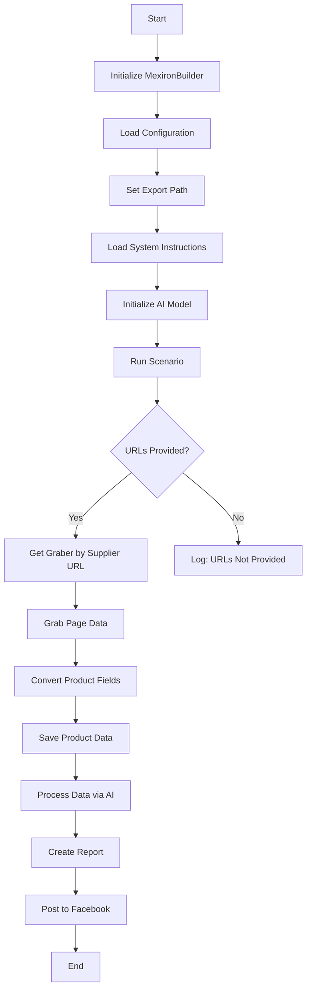
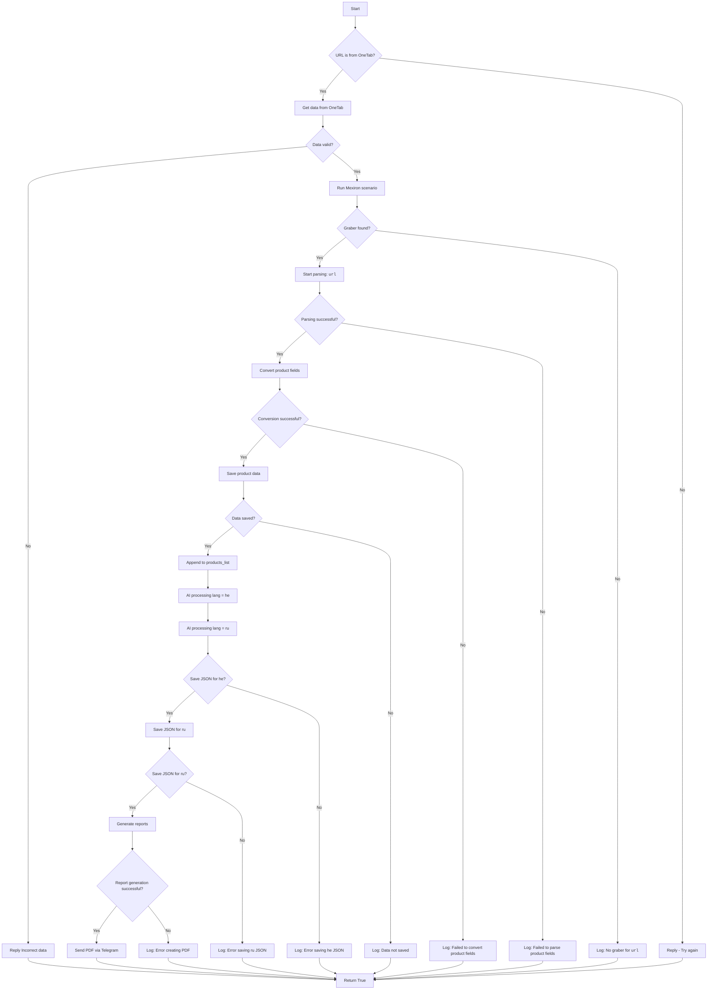

### **Анализ кода модуля `scenario`**

2. **Качество кода**:
   - **Соответствие стандартам**: 6/10
   - **Плюсы**:
     - Хорошая структурированность документации.
     - Наличие flowchart для визуализации логики.
     - Детальное описание классов и методов.
   - **Минусы**:
     - Отсутствие аннотаций типов для параметров и возвращаемых значений в описании методов класса `MexironBuilder`.
     - Документация на английском языке. Необходимо перевести на русский.
     - Не хватает подробных комментариев в коде для пояснения назначения каждой строки или блока кода.
     - Не стандартизирован формат представления информации. Где-то code block, где-то обычный текст. Надо привести к единообразию

3. **Рекомендации по улучшению**:
   - Перевести всю документацию на русский язык в формате UTF-8.
   - Добавить аннотации типов для всех параметров и возвращаемых значений в описании методов класса `MexironBuilder`.
   - Предоставить примеры использования каждого метода класса `MexironBuilder`.
   - Добавить больше деталей в комментариях к коду, чтобы пояснить сложные моменты и логику работы.
   - Заменить неточные формулировки, такие как "получаем" или "делаем", на более конкретные: "извлекаем", "проверяем", "выполняем".
   - Добавить информацию об обработке исключений и логировании ошибок.

4. **Оптимизированный код**:

```markdown
## Sergey Kazarinov's Mechiron Creation Script

### Обзор

Этот скрипт является частью директории `hypotez/src/endpoints/kazarinov/scenarios` и предназначен для автоматизации процесса создания "мехирона" для Sergey Kazarinov. Скрипт извлекает, анализирует и обрабатывает данные о продуктах от различных поставщиков, подготавливает данные, обрабатывает их с помощью ИИ и интегрируется с Facebook для публикации продукта.

### Основные функции

1.  **Извлечение и анализ данных**: Извлекает и анализирует данные о продуктах от различных поставщиков.
2.  **Обработка данных ИИ**: Обрабатывает извлеченные данные с помощью модели Google Generative AI.
3.  **Хранение данных**: Сохраняет обработанные данные в файлы.
4.  **Генерация отчетов**: Генерирует отчеты в формате HTML и PDF на основе обработанных данных.
5.  **Публикация в Facebook**: Публикует обработанные данные в Facebook.

### Блок-схема модуля


```mermaid
graph TD
    Start[Start] --> InitMexironBuilder[Initialize MexironBuilder]
    InitMexironBuilder --> LoadConfig[Load Configuration]
    LoadConfig --> SetExportPath[Set Export Path]
    SetExportPath --> LoadSystemInstruction[Load System Instructions]
    LoadSystemInstruction --> InitModel[Initialize AI Model]
    InitModel --> RunScenario[Run Scenario]
    RunScenario --> CheckURLs{URLs Provided?}
    CheckURLs -->|Yes| GetGraber[Get Graber by Supplier URL]
    CheckURLs -->|No| LogNoURLs[Log: URLs Not Provided]
    GetGraber --> GrabPage[Grab Page Data]
    GrabPage --> ConvertFields[Convert Product Fields]
    ConvertFields --> SaveData[Save Product Data]
    SaveData --> ProcessAI[Process Data via AI]
    ProcessAI --> CreateReport[Create Report]
    CreateReport --> PostFacebook[Post to Facebook]
    PostFacebook --> End[End]
```

### Описание элементов блок-схемы

1.  **Start**: Начало выполнения скрипта.
2.  **InitMexironBuilder**: Инициализация класса `MexironBuilder`.
3.  **LoadConfig**: Загрузка конфигурации из JSON-файла.
4.  **SetExportPath**: Установка пути для экспорта данных.
5.  **LoadSystemInstruction**: Загрузка системных инструкций для модели ИИ.
6.  **InitModel**: Инициализация модели Google Generative AI.
7.  **RunScenario**: Выполнение основного сценария.
8.  **CheckURLs**: Проверка наличия предоставленных URL для анализа.
9.  **GetGraber**: Получение соответствующего грабера для URL поставщика.
10. **GrabPage**: Извлечение данных со страницы с использованием грабера.
11. **ConvertFields**: Преобразование полей продукта в словарь.
12. **SaveData**: Сохранение данных о продукте в файл.
13. **ProcessAI**: Обработка данных о продукте с использованием модели ИИ.
14. **CreateReport**: Создание отчетов в форматах HTML и PDF на основе обработанных данных.
15. **PostFacebook**: Публикация обработанных данных в Facebook.
16. **End**: Завершение выполнения скрипта.

---

#### Класс: `MexironBuilder`

-   **Атрибуты**:
    -   `driver`: Экземпляр Selenium WebDriver.
    -   `export_path`: Путь для экспорта данных.
    -   `mexiron_name`: Пользовательское имя для процесса "мехирон".
    -   `price`: Цена для обработки.
    -   `timestamp`: Временная метка для процесса.
    -   `products_list`: Список обработанных данных о продуктах.
    -   `model`: Модель Google Generative AI.
    -   `config`: Конфигурация, загруженная из JSON.

-   **Методы**:
    -   **`__init__(self, driver: Driver, mexiron_name: str | None = None)`**
        -   **Назначение**: Инициализирует класс `MexironBuilder` необходимыми компонентами.
        -   **Параметры**:
            -   `driver` (Driver): Экземпляр Selenium WebDriver.
            -   `mexiron_name` (str | None, optional): Пользовательское имя для процесса "мехирон". По умолчанию `None`.
    -   **`run_scenario(self, system_instruction: str | None = None, price: str | None = None, mexiron_name: str | None = None, urls: str | list[str] | None = None, bot = None) -> bool`**
        -   **Назначение**: Выполняет сценарий: анализирует продукты, обрабатывает их с помощью ИИ и сохраняет данные.
        -   **Параметры**:
            -   `system_instruction` (str | None, optional): Системные инструкции для модели ИИ. По умолчанию `None`.
            -   `price` (str | None, optional): Цена для обработки. По умолчанию `None`.
            -   `mexiron_name` (str | None, optional): Пользовательское имя "мехирон". По умолчанию `None`.
            -   `urls` (str | list[str] | None, optional): URL-адреса страниц продуктов. По умолчанию `None`.
            -    `bot` (Any, optional): Telegram bot instance. Defaults to None.
        -   **Возвращает**:
            -   bool: `True`, если сценарий выполнен успешно, иначе `False`.
        -   **Блок-схема**:


```mermaid
flowchart TD
        Start[Start] --> IsOneTab{URL is from OneTab?}
        IsOneTab -->|Yes| GetDataFromOneTab[Get data from OneTab]
        IsOneTab -->|No| ReplyTryAgain[Reply - Try again]
        GetDataFromOneTab --> IsDataValid{Data valid?}
        IsDataValid -->|No| ReplyIncorrectData[Reply Incorrect data]
        IsDataValid -->|Yes| RunMexironScenario[Run Mexiron scenario]
        RunMexironScenario --> IsGraberFound{Graber found?}
        IsGraberFound -->|Yes| StartParsing[Start parsing: <code>url</code>]
        IsGraberFound -->|No| LogNoGraber[Log: No graber for <code>url</code>]
        StartParsing --> IsParsingSuccessful{Parsing successful?}
        IsParsingSuccessful -->|Yes| ConvertProductFields[Convert product fields]
        IsParsingSuccessful -->|No| LogParsingFailed[Log: Failed to parse product fields]
        ConvertProductFields --> IsConversionSuccessful{Conversion successful?}
        IsConversionSuccessful -->|Yes| SaveProductData[Save product data]
        IsConversionSuccessful -->|No| LogConversionFailed[Log: Failed to convert product fields]
        SaveProductData --> IsDataSaved{Data saved?}
        IsDataSaved -->|Yes| AppendToProductsList[Append to products_list]
        IsDataSaved -->|No| LogDataNotSaved[Log: Data not saved]
        AppendToProductsList --> ProcessAIHe[AI processing lang = he]
        ProcessAIHe --> ProcessAIRu[AI processing lang = ru]
        ProcessAIRu --> SaveHeJSON{Save JSON for he?}
        SaveHeJSON -->|Yes| SaveRuJSON[Save JSON for ru]
        SaveHeJSON -->|No| LogHeJSONError[Log: Error saving he JSON]
        SaveRuJSON --> IsRuJSONSaved{Save JSON for ru?}
        IsRuJSONSaved -->|Yes| GenerateReports[Generate reports]
        IsRuJSONSaved -->|No| LogRuJSONError[Log: Error saving ru JSON]
        GenerateReports --> IsReportGenerationSuccessful{Report generation successful?}
        IsReportGenerationSuccessful -->|Yes| SendPDF[Send PDF via Telegram]
        IsReportGenerationSuccessful -->|No| LogPDFError[Log: Error creating PDF]
        SendPDF --> ReturnTrue[Return True]
        LogPDFError --> ReturnTrue[Return True]
        ReplyIncorrectData --> ReturnTrue[Return True]
        ReplyTryAgain --> ReturnTrue[Return True]
        LogNoGraber --> ReturnTrue[Return True]
        LogParsingFailed --> ReturnTrue[Return True]
        LogConversionFailed --> ReturnTrue[Return True]
        LogDataNotSaved --> ReturnTrue[Return True]
        LogHeJSONError --> ReturnTrue[Return True]
        LogRuJSONError --> ReturnTrue[Return True]
```

        -   **Описание элементов блок-схемы**

    1.  **Start**: Начало выполнения сценария.

    2.  **URL Source Check (IsOneTab)**:
        -   Если URL из OneTab, данные извлекаются оттуда.
        -   Если URL не из OneTab, пользователю отправляется сообщение "Попробуйте еще раз".

    3.  **Data Validity Check (IsDataValid)**:
        -   Если данные недействительны, пользователю отправляется сообщение "Некорректные данные".
        -   Если данные действительны, запускается сценарий Mexiron.

    4.  **Grabber Search (IsGraberFound)**:
        -   Если граббер найден, начинается анализ страницы.
        -   Если граббер не найден, генерируется сообщение журнала об отсутствии граббера для данного URL.

    5.  **Page Parsing (StartParsing)**:
        -   Если анализ успешен, данные преобразуются в требуемый формат.
        -   Если анализ не удался, регистрируется ошибка.

    6.  **Data Conversion (ConvertProductFields)**:
        -   Если преобразование выполнено успешно, данные сохраняются.
        -   Если преобразование не удается, регистрируется ошибка.

    7.  **Data Saving (SaveProductData)**:
        -   Если данные сохранены, они добавляются в список продуктов.
        -   Если данные не сохранены, регистрируется ошибка.

    8.  **AI Processing (ProcessAIHe, ProcessAIRu)**:
        -   Данные обрабатываются ИИ для языков `he` (иврит) и `ru` (русский).

    9.  **JSON Saving (SaveHeJSON, SaveRuJSON)**:
        -   Результаты обработки сохраняются в формате JSON для каждого языка.
        -   Если сохранение не удается, регистрируется ошибка.

    10. **Report Generation (GenerateReports)**:
        -   HTML и PDF отчеты генерируются для каждого языка.
        -   Если создание отчета не удается, регистрируется ошибка.

    11. **PDF Sending via Telegram (SendPDF)**:
        -   PDF файлы отправляются через Telegram.
        -   Если отправка не удается, регистрируется ошибка.

    12. **Completion (ReturnTrue)**:
        -   Сценарий завершается, возвращая `True`.

#### **Error Logging**:
-   На каждом этапе, где могут возникнуть ошибки, включены узлы для регистрации ошибок (например, `LogNoGraber`, `LogParsingFailed`, `LogHeJSONError` и т.д.).

---
    -   **`get_graber_by_supplier_url(self, url: str) -> Any | None`**
        -   **Назначение**: Возвращает соответствующий грабер для заданного URL поставщика.
        -   **Параметры**:
            -   `url` (str): URL-адрес страницы поставщика.
        -   **Возвращает**:
            -   Any | None: Экземпляр грабера, если найден, иначе `None`.
    -   **`convert_product_fields(self, f: ProductFields) -> dict`**
        -   **Назначение**: Преобразует поля продукта в словарь.
        -   **Параметры**:
            -   `f` (ProductFields): Объект, содержащий проанализированные данные продукта.
        -   **Возвращает**:
            -   dict: Отформатированный словарь данных продукта.
    -   **`save_product_data(self, product_data: dict) -> None`**
        -   **Назначение**: Сохраняет данные продукта в файл.
        -   **Параметры**:
            -   `product_data` (dict): Отформатированные данные продукта.
    -   **`process_ai(self, products_list: list[str], lang: str, attempts: int = 3) -> tuple | bool`**
        -   **Назначение**: Обрабатывает список продуктов с использованием модели ИИ.
        -   **Параметры**:
            -   `products_list` (list[str]): Список словарей данных продукта в виде строк.
            -   `lang` (str): Язык обработки (`ru` или `he`).
            -   `attempts` (int, optional): Количество попыток повтора в случае сбоя. По умолчанию `3`.
        -   **Возвращает**:
            -   tuple | bool: Обработанный ответ в форматах `ru` и `he`.
    -   **`post_facebook(self, mexiron: SimpleNamespace) -> bool`**
        -   **Назначение**: Выполняет сценарий публикации в Facebook.
        -   **Параметры**:
            -   `mexiron` (SimpleNamespace): Обработанные данные для публикации.
        -   **Возвращает**:
            -   bool: `True`, если публикация прошла успешно, иначе `False`.
    -   **`create_report(self, data: dict, html_file: Path, pdf_file: Path) -> None`**
        -   **Назначение**: Генерирует отчеты в форматах HTML и PDF на основе обработанных данных.
        -   **Параметры**:
            -   `data` (dict): Обработанные данные.
            -   `html_file` (Path): Путь для сохранения HTML-отчета.
            -   `pdf_file` (Path): Путь для сохранения PDF-отчета.

### Использование

Чтобы использовать этот скрипт, выполните следующие шаги:

1.  **Инициализация драйвера**: Создайте экземпляр класса `Driver`.
2.  **Инициализация MexironBuilder**: Создайте экземпляр класса `MexironBuilder`, передав в него драйвер.
3.  **Запуск сценария**: Вызовите метод `run_scenario` с необходимыми параметрами.

#### Пример

```python
from src.webdriver.driver import Driver
from src.endpoints.kazarinov.scenarios.scenario_pricelist import MexironBuilder

# Инициализация драйвера
driver = Driver(...)

# Инициализация MexironBuilder
mexiron_builder = MexironBuilder(driver)

# Запуск сценария
urls = ['https://example.com/product1', 'https://example.com/product2']
mexiron_builder.run_scenario(urls=urls)
```

### Зависимости

-   `selenium`: Для автоматизации веб-интерфейса.
-   `asyncio`: Для асинхронных операций.
-   `pathlib`: Для работы с путями к файлам.
-   `types`: Для создания простых пространств имен.
-   `typing`: Для аннотаций типов.
-   `src.ai.gemini`: Для обработки данных с использованием ИИ.
-   `src.suppliers.*.graber`: Для извлечения данных от различных поставщиков.
-   `src.endpoints.advertisement.facebook.scenarios`: Для публикации в Facebook.

### Обработка ошибок

Скрипт включает надежную обработку ошибок для обеспечения непрерывного выполнения, даже если некоторые элементы не найдены или возникли проблемы с веб-страницей. Это особенно полезно для обработки динамических или нестабильных веб-страниц.

### Вклад

Приветствуются вклады в этот скрипт. Убедитесь, что любые изменения хорошо документированы и включают соответствующие тесты.

### Лицензия

Этот скрипт распространяется под лицензией MIT. Подробности см. в файле `LICENSE`.