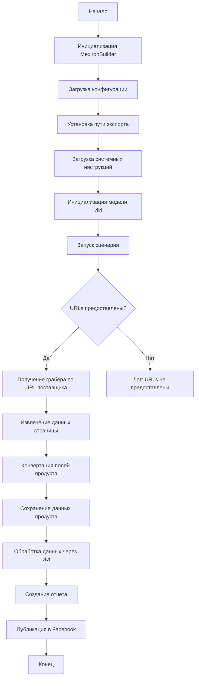

### **Анализ кода модуля `scenario.ru.md`**

**Качество кода:**

- **Соответствие стандартам**: 7/10
- **Плюсы**:
  - Хорошая структура документации, подробное описание функциональности и основных компонентов скрипта.
  - Наличие блок-схем для визуализации процессов.
  - Описание основных методов класса `MexironBuilder` и их параметров.
  - Примеры использования и указание зависимостей.
  - Описание обработки ошибок и возможностей внесения вклада.
- **Минусы**:
  - Отсутствие единообразия в стиле форматирования текста (где-то используется полужирный шрифт, где-то нет).
  - Некоторые пункты легенды блок-схем не соответствуют названиям блоков в самих блок-схемах.
  - Нет аннотаций типов для параметров методов в описании класса `MexironBuilder`.
  - Нет перевода на русский язык для некоторых частей документации, особенно в блок-схемах.

**Рекомендации по улучшению:**

1.  **Актуализировать блок-схемы**:
    - Убедиться, что названия блоков в блок-схемах соответствуют их описанию в легенде.
    - Перевести все элементы блок-схем на русский язык для единообразия документации.

2.  **Добавить аннотации типов**:
    - В разделе описания класса `MexironBuilder` добавить аннотации типов для параметров методов, чтобы улучшить понимание структуры и ожидаемых типов данных.

3.  **Унифицировать стиль форматирования**:
    - Привести к единообразному стилю все элементы документации, такие как заголовки, списки и описания, чтобы повысить читаемость.
    - Проверить и исправить все элементы, выделенные полужирным шрифтом, чтобы они соответствовали общему стилю.

4.  **Дополнить зависимости**:
    - Указать конкретные версии зависимостей, чтобы обеспечить воспроизводимость результатов.
    - Уточнить, какие именно модули из `src.suppliers.*.graber` используются.

5.  **Улучшить пример использования**:
    - В примере использования добавить конкретные значения для параметров `Driver(...)`, чтобы пример был более понятным и рабочим.

6.  **Проверить и обновить информацию**:
    - Убедиться, что вся информация в документе актуальна и соответствует текущей реализации скрипта.

7.  **Добавить информацию о настройке окружения**:
    - Описать шаги по настройке окружения для запуска скрипта, такие как установка необходимых библиотек и настройка переменных окружения.

8. **Перевести docstring на русский**
    - Необходимо перевести все docstring с английского на русский язык.

**Оптимизированный код:**

```markdown
## Сценарий создания мехирона для Сергея Казаринова

### Обзор

Этот скрипт, расположенный в директории `hypotez/src/endpoints/kazarinov/scenarios`, предназначен для автоматизации процесса создания "мехирона" для Сергея Казаринова. Скрипт извлекает, парсит и обрабатывает данные о продуктах от различных поставщиков, подготавливает данные, обрабатывает их через ИИ и интегрирует с Facebook для публикации продуктов.

### Основные возможности

1.  **Извлечение и парсинг данных**: Извлекает и парсит данные о продуктах от различных поставщиков.
2.  **Обработка данных через ИИ**: Обрабатывает извлеченные данные через модель Google Generative AI.
3.  **Хранение данных**: Сохраняет обработанные данные в файлы.
4.  **Генерация отчетов**: Генерирует HTML и PDF отчеты из обработанных данных.
5.  **Публикация в Facebook**: Публикует обработанные данные в Facebook.

### Блок-схема модуля



### Легенда

1.  **Start**: Начало выполнения скрипта.
2.  **InitMexironBuilder**: Инициализация класса `MexironBuilder`.
3.  **LoadConfig**: Загрузка конфигурации из JSON файла.
4.  **SetExportPath**: Установка пути для экспорта данных.
5.  **LoadSystemInstruction**: Загрузка системных инструкций для модели ИИ.
6.  **InitModel**: Инициализация модели Google Generative AI.
7.  **RunScenario**: Выполнение основного сценария.
8.  **CheckURLs**: Проверка, предоставлены ли URLs для парсинга.
9.  **GetGraber**: Получение соответствующего грабера для URL поставщика.
10. **GrabPage**: Извлечение данных страницы с помощью грабера.
11. **ConvertFields**: Конвертация полей продукта в словарь.
12. **SaveData**: Сохранение данных продукта в файл.
13. **ProcessAI**: Обработка данных продукта через модель ИИ.
14. **CreateReport**: Создание HTML и PDF отчетов из обработанных данных.
15. **PostFacebook**: Публикация обработанных данных в Facebook.
16. **End**: Конец выполнения скрипта.

-----------------------

#### Класс: `MexironBuilder`

-   **Атрибуты**:
    -   `driver`: Экземпляр Selenium WebDriver.
    -   `export_path`: Путь для экспорта данных.
    -   `mexiron_name`: Пользовательское имя для процесса мехирона.
    -   `price`: Цена для обработки.
    -   `timestamp`: Метка времени для процесса.
    -   `products_list`: Список обработанных данных о продуктах.
    -   `model`: Модель Google Generative AI.
    -   `config`: Конфигурация, загруженная из JSON.

-   **Методы**:
    -   **`__init__(self, driver: Driver, mexiron_name: Optional[str] = None)`**:
        -   **Назначение**: Инициализирует класс `MexironBuilder` с необходимыми компонентами.
        -   **Параметры**:
            -   `driver` (Driver): Экземпляр Selenium WebDriver.
            -   `mexiron_name` (Optional[str], optional): Пользовательское имя для процесса мехирона. По умолчанию `None`.
    ----
    -   **`run_scenario(self, system_instruction: Optional[str] = None, price: Optional[str] = None, mexiron_name: Optional[str] = None, urls: Optional[str | List[str]] = None, bot = None) -> bool`**:
        -   **Назначение**: Выполняет сценарий: парсит продукты, обрабатывает их через ИИ и сохраняет данные.
        -   **Параметры**:
            -   `system_instruction` (Optional[str], optional): Системные инструкции для модели ИИ. По умолчанию `None`.
            -   `price` (Optional[str], optional): Цена для обработки. По умолчанию `None`.
            -   `mexiron_name` (Optional[str], optional): Пользовательское имя мехирона. По умолчанию `None`.
            -   `urls` (Optional[str | List[str]], optional): URLs страниц продуктов. По умолчанию `None`.
            -   `bot`: Бот для взаимодействия (тип не указан).
        -   **Возвращает**: `True`, если сценарий выполнен успешно, иначе `False`.
        -   **Блок-схема**:

            ```mermaid
            flowchart TD
            Start[Начало] --> IsOneTab{URL из OneTab?}
            IsOneTab -->|Да| GetDataFromOneTab[Получить данные из OneTab]
            IsOneTab -->|Нет| ReplyTryAgain[Ответ - Попробуйте снова]
            GetDataFromOneTab --> IsDataValid{Данные валидны?}
            IsDataValid -->|Нет| ReplyIncorrectData[Ответ - Некорректные данные]
            IsDataValid -->|Да| RunMexironScenario[Запуск сценария Mexiron]
            RunMexironScenario --> IsGraberFound{Грабер найден?}
            IsGraberFound -->|Да| StartParsing[Начать парсинг: <code>url</code>]
            IsGraberFound -->|Нет| LogNoGraber[Лог: Нет грабера для <code>url</code>]
            StartParsing --> IsParsingSuccessful{Парсинг успешен?}
            IsParsingSuccessful -->|Да| ConvertProductFields[Преобразовать поля продукта]
            IsParsingSuccessful -->|Нет| LogParsingFailed[Лог: Не удалось распарсить поля продукта]
            ConvertProductFields --> IsConversionSuccessful{Преобразование успешно?}
            IsConversionSuccessful -->|Да| SaveProductData[Сохранить данные продукта]
            IsConversionSuccessful -->|Нет| LogConversionFailed[Лог: Не удалось преобразовать поля продукта]
            SaveProductData --> IsDataSaved{Данные сохранены?}
            IsDataSaved -->|Да| AppendToProductsList[Добавить в products_list]
            IsDataSaved -->|Нет| LogDataNotSaved[Лог: Данные не сохранены]
            AppendToProductsList --> ProcessAIHe[Обработка AI lang = he]
            ProcessAIHe --> ProcessAIRu[Обработка AI lang = ru]
            ProcessAIRu --> SaveHeJSON{Сохранить JSON для he?}
            SaveHeJSON -->|Да| SaveRuJSON[Сохранить JSON для ru]
            SaveHeJSON -->|Нет| LogHeJSONError[Лог: Ошибка сохранения he JSON]
            SaveRuJSON --> IsRuJSONSaved{JSON для ru сохранен?}
            IsRuJSONSaved -->|Да| GenerateReports[Генерировать отчеты]
            IsRuJSONSaved -->|Нет| LogRuJSONError[Лог: Ошибка сохранения ru JSON]
            GenerateReports --> IsReportGenerationSuccessful{Отчет успешно сгенерирован?}
            IsReportGenerationSuccessful -->|Да| SendPDF[Отправить PDF через Telegram]
            IsReportGenerationSuccessful -->|Нет| LogPDFError[Лог: Ошибка создания PDF]
            SendPDF --> ReturnTrue[Вернуть True]
            LogPDFError --> ReturnTrue[Вернуть True]
            ReplyIncorrectData --> ReturnTrue[Вернуть True]
            ReplyTryAgain --> ReturnTrue[Вернуть True]
            LogNoGraber --> ReturnTrue[Вернуть True]
            LogParsingFailed --> ReturnTrue[Вернуть True]
            LogConversionFailed --> ReturnTrue[Вернуть True]
            LogDataNotSaved --> ReturnTrue[Вернуть True]
            LogHeJSONError --> ReturnTrue[Вернуть True]
            LogRuJSONError --> ReturnTrue[Вернуть True]
            ```

            -   **Легенда**:

                1.  **Начало (Start)**: Сценарий начинает выполнение.

                2.  **Проверка источника URL (IsOneTab)**:
                    -   Если URL из OneTab, данные извлекаются из OneTab.
                    -   Если URL не из OneTab, пользователю отправляется сообщение "Попробуйте снова".

                3.  **Проверка валидности данных (IsDataValid)**:
                    -   Если данные не валидны, пользователю отправляется сообщение "Некорректные данные".
                    -   Если данные валидны, запускается сценарий Mexiron.

                4.  **Поиск грабера (IsGraberFound)**:
                    -   Если грабер найден, начинается парсинг страницы.
                    -   Если грабер не найден, логируется сообщение о том, что грабер отсутствует для данного URL.

                5.  **Парсинг страницы (StartParsing)**:
                    -   Если парсинг успешен, данные преобразуются в нужный формат.
                    -   Если парсинг не удался, логируется ошибка.

                6.  **Преобразование данных (ConvertProductFields)**:
                    -   Если преобразование успешно, данные сохраняются.
                    -   Если преобразование не удалось, логируется ошибка.

                7.  **Сохранение данных (SaveProductData)**:
                    -   Если данные сохранены, они добавляются в список продуктов.
                    -   Если данные не сохранены, логируется ошибка.

                8.  **Обработка через AI (ProcessAIHe, ProcessAIRu)**:
                    -   Данные обрабатываются AI для языков `he` (иврит) и `ru` (русский).

                9.  **Сохранение JSON (SaveHeJSON, SaveRuJSON)**:
                    -   Результаты обработки сохраняются в формате JSON для каждого языка.
                    -   Если сохранение не удалось, логируется ошибка.

                10. **Генерация отчетов (GenerateReports)**:
                    -   Создаются HTML и PDF отчеты для каждого языка.
                    -   Если создание отчета не удалось, логируется ошибка.

                11. **Отправка PDF через Telegram (SendPDF)**:
                    -   PDF-файлы отправляются через Telegram.
                    -   Если отправка не удалась, логируется ошибка.

                12. **Завершение (ReturnTrue)**:
                    -   Сценарий завершается, возвращая `True`.

        #### **Логи ошибок**:
        -   На каждом этапе, где возможны ошибки, добавлены узлы для логирования ошибок (например, `LogNoGraber`, `LogParsingFailed`, `LogHeJSONError` и т.д.).

    ----
    -   **`get_graber_by_supplier_url(self, url: str) -> Grabber | None`**:
        -   **Назначение**: Возвращает соответствующий грабер для данного URL поставщика.
        -   **Параметры**:
            -   `url` (str): URL страницы поставщика.
        -   **Возвращает**: Экземпляр грабера, если найден, иначе `None`.
    ----
    -   **`convert_product_fields(self, f: ProductFields) -> dict`**:
        -   **Назначение**: Конвертирует поля продукта в словарь.
        -   **Параметры**:
            -   `f` (ProductFields): Объект, содержащий парсированные данные о продукте.
        -   **Возвращает**: Форматированный словарь данных о продукте.
    ----
    -   **`save_product_data(self, product_data: dict)`**:
        -   **Назначение**: Сохраняет данные о продукте в файл.
        -   **Параметры**:
            -   `product_data` (dict): Форматированные данные о продукте.
    ----
    -   **`process_ai(self, products_list: List[str], lang: str, attempts: int = 3) -> tuple | bool`**:
        -   **Назначение**: Обрабатывает список продуктов через модель ИИ.
        -   **Параметры**:
            -   `products_list` (List[str]): Список словарей данных о продуктах в виде строки.
            -   `lang` (str): Язык обработки.
            -   `attempts` (int, optional): Количество попыток повторного запроса в случае неудачи. По умолчанию `3`.
        -   **Возвращает**: Обработанный ответ в форматах `ru` и `he`.
    ----
    -   **`post_facebook(self, mexiron: SimpleNamespace) -> bool`**:
        -   **Назначение**: Выполняет сценарий публикации в Facebook.
        -   **Параметры**:
            -   `mexiron` (SimpleNamespace): Обработанные данные для публикации.
        -   **Возвращает**: `True`, если публикация успешна, иначе `False`.
    ----
    -   **`create_report(self, data: dict, html_file: Path, pdf_file: Path)`**:
        -   **Назначение**: Генерирует HTML и PDF отчеты из обработанных данных.
        -   **Параметры**:
            -   `data` (dict): Обработанные данные.
            -   `html_file` (Path): Путь для сохранения HTML отчета.
            -   `pdf_file` (Path): Путь для сохранения PDF отчета.

### Использование

Для использования этого скрипта выполните следующие шаги:

1.  **Инициализация Driver**: Создайте экземпляр класса `Driver`.
2.  **Инициализация MexironBuilder**: Создайте экземпляр класса `MexironBuilder` с драйвером.
3.  **Запуск сценария**: Вызовите метод `run_scenario` с необходимыми параметрами.

#### Пример

```python
from src.webdriver.driver import Driver
from src.endpoints.kazarinov.scenarios.scenario_pricelist import MexironBuilder

# Инициализация Driver
driver = Driver(Chrome()) # или Driver(Firefox()), Driver(Playwright())

# Инициализация MexironBuilder
mexiron_builder = MexironBuilder(driver)

# Запуск сценария
urls = ['https://example.com/product1', 'https://example.com/product2']
mexiron_builder.run_scenario(urls=urls)
```

### Зависимости

-   `selenium`: Для веб-автоматизации.
-   `asyncio`: Для асинхронных операций.
-   `pathlib`: Для обработки путей к файлам.
-   `types`: Для создания простых пространств имен.
-   `typing`: Для аннотаций типов.
-   `src.ai.gemini`: Для обработки данных через ИИ.
-   `src.suppliers.*.graber`: Для извлечения данных от различных поставщиков.
-   `src.endpoints.advertisement.facebook.scenarios`: Для публикации в Facebook.

### Обработка ошибок

Скрипт включает надежную обработку ошибок, чтобы обеспечить продолжение выполнения даже в случае, если некоторые элементы не найдены или если возникли проблемы с веб-страницей. Это особенно полезно для обработки динамических или нестабильных веб-страниц.

### Вклад

Вклад в этот скрипт приветствуется. Пожалуйста, убедитесь, что любые изменения хорошо документированы и включают соответствующие тесты.

### Лицензия

Этот скрипт лицензирован под MIT License. Подробности смотрите в файле `LICENSE`.
```