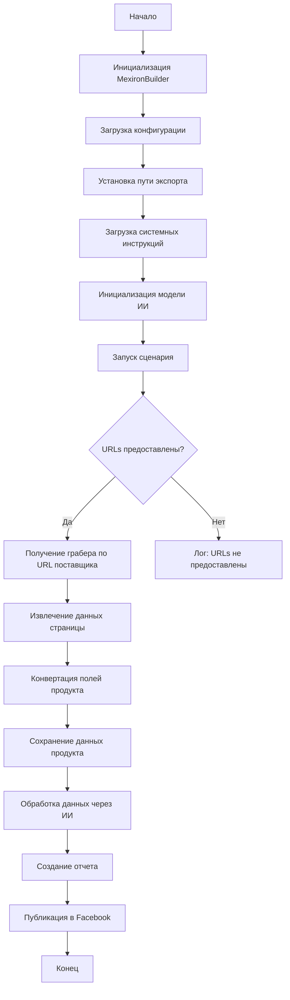

### **Анализ кода модуля `scenario.ru.md`**

#### **Качество кода**:
- **Соответствие стандартам**: 7/10
- **Плюсы**:
   - Хорошо структурированное описание функциональности модуля.
   - Наличие блок-схем для визуализации логики работы.
   - Подробное описание атрибутов и методов класса `MexironBuilder`.
   - Указаны зависимости модуля.
- **Минусы**:
   - Отсутствие единообразия в стиле оформления (использование разных стилей заголовков).
   - Нет аннотаций типов для параметров функций и методов в описании класса `MexironBuilder`.
   - Нет подробного описания обработки ошибок.
   - Описание методов класса `MexironBuilder` недостаточно подробное.
   - Не все элементы блок-схем описаны достаточно четко.

#### **Рекомендации по улучшению**:
1.  **Привести в порядок оформление**:
   - Использовать единый стиль заголовков Markdown.
   - Обеспечить согласованность в оформлении всего документа.

2.  **Документирование параметров функций и методов**:
   - Добавить аннотации типов для всех параметров и возвращаемых значений в описании класса `MexironBuilder`.

3.  **Улучшить описание обработки ошибок**:
   - Расширить раздел "Обработка ошибок", включив конкретные примеры обработки исключений.
   - Добавить информацию о том, как ошибки логируются и обрабатываются в коде.

4.  **Улучшить описание методов класса `MexironBuilder`**:
   - Предоставить более подробные описания каждого метода, включая его назначение, параметры, возвращаемые значения и возможные исключения.
   - Добавить примеры использования методов.

5.  **Улучшить блок-схемы**:
   - Убедиться, что все элементы блок-схем имеют четкие и понятные описания.
   - Проверить, соответствуют ли блок-схемы фактической логике работы кода.

6.  **Дополнить примеры использования**:
   - Расширить примеры использования, чтобы продемонстрировать различные сценарии использования модуля.

#### **Оптимизированный код**:

```markdown
### **Сценарий создания мехирона для Сергея Казаринова**

### Обзор

Этот скрипт, расположенный в директории `hypotez/src/endpoints/kazarinov/scenarios`, автоматизирует процесс создания "мехирона" для Сергея Казаринова. Он включает извлечение, парсинг и обработку данных о продуктах от различных поставщиков, их обработку через ИИ, а также интеграцию с Facebook для публикации.

### Основные возможности

1.  **Извлечение и парсинг данных**: Извлекает и парсит данные о продуктах от различных поставщиков.
2.  **Обработка данных через ИИ**: Обрабатывает извлеченные данные через модель Google Generative AI.
3.  **Хранение данных**: Сохраняет обработанные данные в файлы.
4.  **Генерация отчетов**: Генерирует HTML и PDF отчеты на основе обработанных данных.
5.  **Публикация в Facebook**: Публикует обработанные данные в Facebook.

### Блок-схема модуля


```mermaid
graph TD
    Start[Начало] --> InitMexironBuilder[Инициализация MexironBuilder]
    InitMexironBuilder --> LoadConfig[Загрузка конфигурации]
    LoadConfig --> SetExportPath[Установка пути экспорта]
    SetExportPath --> LoadSystemInstruction[Загрузка системных инструкций]
    LoadSystemInstruction --> InitModel[Инициализация модели ИИ]
    InitModel --> RunScenario[Запуск сценария]
    RunScenario --> CheckURLs{URLs предоставлены?}
    CheckURLs -->|Да| GetGraber[Получение грабера по URL поставщика]
    CheckURLs -->|Нет| LogNoURLs[Лог: URLs не предоставлены]
    GetGraber --> GrabPage[Извлечение данных страницы]
    GrabPage --> ConvertFields[Конвертация полей продукта]
    ConvertFields --> SaveData[Сохранение данных продукта]
    SaveData --> ProcessAI[Обработка данных через ИИ]
    ProcessAI --> CreateReport[Создание отчета]
    CreateReport --> PostFacebook[Публикация в Facebook]
    PostFacebook --> End[Конец]
```

### Легенда

1.  **Start**: Начало выполнения скрипта.
2.  **InitMexironBuilder**: Инициализация класса `MexironBuilder`.
3.  **LoadConfig**: Загрузка конфигурации из JSON файла.
4.  **SetExportPath**: Установка пути для экспорта данных.
5.  **LoadSystemInstruction**: Загрузка системных инструкций для модели ИИ.
6.  **InitModel**: Инициализация модели Google Generative AI.
7.  **RunScenario**: Выполнение основного сценария.
8.  **CheckURLs**: Проверка, предоставлены ли URLs для парсинга.
9.  **GetGraber**: Получение соответствующего грабера для URL поставщика.
10. **GrabPage**: Извлечение данных страницы с помощью грабера.
11. **ConvertFields**: Конвертация полей продукта в словарь.
12. **SaveData**: Сохранение данных продукта в файл.
13. **ProcessAI**: Обработка данных продукта через модель ИИ.
14. **CreateReport**: Создание HTML и PDF отчетов из обработанных данных.
15. **PostFacebook**: Публикация обработанных данных в Facebook.
16. **End**: Конец выполнения скрипта.

-----------------------

### Класс: `MexironBuilder`

Класс `MexironBuilder` предназначен для автоматизации процесса создания "мехирона" для Сергея Казаринова. Он включает методы для парсинга данных о продуктах, их обработки с использованием ИИ и публикации в Facebook.

#### Атрибуты:

-   `driver`: Экземпляр Selenium WebDriver.
-   `export_path`: Путь для экспорта данных.
-   `mexiron_name`: Пользовательское имя для процесса мехирона.
-   `price`: Цена для обработки.
-   `timestamp`: Метка времени для процесса.
-   `products_list`: Список обработанных данных о продуктах.
-   `model`: Модель Google Generative AI.
-   `config`: Конфигурация, загруженная из JSON.

#### Методы:

-   **`__init__(self, driver: Driver, mexiron_name: Optional[str] = None)`**

    ```python
    def __init__(self, driver: Driver, mexiron_name: Optional[str] = None):
        """
        Инициализирует класс `MexironBuilder` с необходимыми компонентами.

        Args:
            driver (Driver): Экземпляр Selenium WebDriver.
            mexiron_name (Optional[str], optional): Пользовательское имя для процесса мехирона. По умолчанию `None`.

        """
        ...
    ```

-   **`run_scenario(self, system_instruction: Optional[str] = None, price: Optional[str] = None, mexiron_name: Optional[str] = None, urls: Optional[str | List[str]] = None, bot = None) -> bool`**

    ```python
    def run_scenario(self, system_instruction: Optional[str] = None, price: Optional[str] = None, mexiron_name: Optional[str] = None, urls: Optional[str | List[str]] = None, bot = None) -> bool:
        """
        Выполняет сценарий: парсит продукты, обрабатывает их через ИИ и сохраняет данные.

        Args:
            system_instruction (Optional[str], optional): Системные инструкции для модели ИИ. По умолчанию `None`.
            price (Optional[str], optional): Цена для обработки. По умолчанию `None`.
            mexiron_name (Optional[str], optional): Пользовательское имя мехирона. По умолчанию `None`.
            urls (Optional[str | List[str]], optional): URLs страниц продуктов. По умолчанию `None`.
            bot (optional): Объект бота для взаимодействия (если требуется). По умолчанию `None`.

        Returns:
            bool: `True`, если сценарий выполнен успешно, иначе `False`.

        """
        ...
    ```

    **Блок-схема**:

    ```mermaid
    flowchart TD
    Start[Start] --> IsOneTab{URL is from OneTab?}
    IsOneTab -->|Yes| GetDataFromOneTab[Get data from OneTab]
    IsOneTab -->|No| ReplyTryAgain[Reply - Try again]
    GetDataFromOneTab --> IsDataValid{Data valid?}
    IsDataValid -->|No| ReplyIncorrectData[Reply Incorrect data]
    IsDataValid -->|Yes| RunMexironScenario[Run Mexiron scenario]
    RunMexironScenario --> IsGraberFound{Graber found?}
    IsGraberFound -->|Yes| StartParsing[Start parsing: <code>url</code>]
    IsGraberFound -->|No| LogNoGraber[Log: No graber for <code>url</code>]
    StartParsing --> IsParsingSuccessful{Parsing successful?}
    IsParsingSuccessful -->|Yes| ConvertProductFields[Convert product fields]
    IsParsingSuccessful -->|No| LogParsingFailed[Log: Failed to parse product fields]
    ConvertProductFields --> IsConversionSuccessful{Conversion successful?}
    IsConversionSuccessful -->|Yes| SaveProductData[Save product data]
    IsConversionSuccessful -->|No| LogConversionFailed[Log: Failed to convert product fields]
    SaveProductData --> IsDataSaved{Data saved?}
    IsDataSaved -->|Yes| AppendToProductsList[Append to products_list]
    IsDataSaved -->|No| LogDataNotSaved[Log: Data not saved]
    AppendToProductsList --> ProcessAIHe[AI processing lang = he]
    ProcessAIHe --> ProcessAIRu[AI processing lang = ru]
    ProcessAIRu --> SaveHeJSON{Save JSON for he?}
    SaveHeJSON -->|Yes| SaveRuJSON[Save JSON for ru]
    SaveHeJSON -->|No| LogHeJSONError[Log: Error saving he JSON]
    SaveRuJSON --> IsRuJSONSaved{Save JSON for ru?}
    IsRuJSONSaved -->|Yes| GenerateReports[Generate reports]
    IsRuJSONSaved -->|No| LogRuJSONError[Log: Error saving ru JSON]
    GenerateReports --> IsReportGenerationSuccessful{Report generation successful?}
    IsReportGenerationSuccessful -->|Yes| SendPDF[Send PDF via Telegram]
    IsReportGenerationSuccessful -->|No| LogPDFError[Log: Error creating PDF]
    SendPDF --> ReturnTrue[Return True]
    LogPDFError --> ReturnTrue[Return True]
    ReplyIncorrectData --> ReturnTrue[Return True]
    ReplyTryAgain --> ReturnTrue[Return True]
    LogNoGraber --> ReturnTrue[Return True]
    LogParsingFailed --> ReturnTrue[Return True]
    LogConversionFailed --> ReturnTrue[Return True]
    LogDataNotSaved --> ReturnTrue[Return True]
    LogHeJSONError --> ReturnTrue[Return True]
    LogRuJSONError --> ReturnTrue[Return True]
    ```

    **Легенда**:

    1.  **Начало (Start)**: Сценарий начинает выполнение.
    2.  **Проверка источника URL (IsOneTab)**:
        -   Если URL из OneTab, данные извлекаются из OneTab.
        -   Если URL не из OneTab, пользователю отправляется сообщение "Try again".
    3.  **Проверка валидности данных (IsDataValid)**:
        -   Если данные не валидны, пользователю отправляется сообщение "Incorrect data".
        -   Если данные валидны, запускается сценарий Mexiron.
    4.  **Поиск грабера (IsGraberFound)**:
        -   Если грабер найден, начинается парсинг страницы.
        -   Если грабер не найден, логируется сообщение о том, что грабер отсутствует для данного URL.
    5.  **Парсинг страницы (StartParsing)**:
        -   Если парсинг успешен, данные преобразуются в нужный формат.
        -   Если парсинг не удался, логируется ошибка.
    6.  **Преобразование данных (ConvertProductFields)**:
        -   Если преобразование успешно, данные сохраняются.
        -   Если преобразование не удалось, логируется ошибка.
    7.  **Сохранение данных (SaveProductData)**:
        -   Если данные сохранены, они добавляются в список продуктов.
        -   Если данные не сохранены, логируется ошибка.
    8.  **Обработка через AI (ProcessAIHe, ProcessAIRu)**:
        -   Данные обрабатываются AI для языков `he` (иврит) и `ru` (русский).
    9.  **Сохранение JSON (SaveHeJSON, SaveRuJSON)**:
        -   Результаты обработки сохраняются в формате JSON для каждого языка.
        -   Если сохранение не удалось, логируется ошибка.
    10. **Генерация отчетов (GenerateReports)**:
        -   Создаются HTML и PDF отчеты для каждого языка.
        -   Если создание отчета не удалось, логируется ошибка.
    11. **Отправка PDF через Telegram (SendPDF)**:
        -   PDF-файлы отправляются через Telegram.
        -   Если отправка не удалась, логируется ошибка.
    12. **Завершение (ReturnTrue)**:
        -   Сценарий завершается, возвращая `True`.

    **Логи ошибок**:

    На каждом этапе, где возможны ошибки, добавлены узлы для логирования ошибок (например, `LogNoGraber`, `LogParsingFailed`, `LogHeJSONError` и т.д.).

-   **`get_graber_by_supplier_url(self, url: str)`**

    ```python
    def get_graber_by_supplier_url(self, url: str) -> object | None:
        """
        Возвращает соответствующий грабер для данного URL поставщика.

        Args:
            url (str): URL страницы поставщика.

        Returns:
            object | None: Экземпляр грабера, если найден, иначе `None`.
        """
        ...
    ```

-   **`convert_product_fields(self, f: ProductFields) -> dict`**

    ```python
    def convert_product_fields(self, f: ProductFields) -> dict:
        """
        Конвертирует поля продукта в словарь.

        Args:
            f (ProductFields): Объект, содержащий парсированные данные о продукте.

        Returns:
            dict: Форматированный словарь данных о продукте.
        """
        ...
    ```

-   **`save_product_data(self, product_data: dict)`**

    ```python
    def save_product_data(self, product_data: dict) -> bool:
        """
        Сохраняет данные о продукте в файл.

        Args:
            product_data (dict): Форматированные данные о продукте.
        Returns:
            bool: True, если сохранение прошло успешно, иначе False
        """
        ...
    ```

-   **`process_ai(self, products_list: List[str], lang: str, attempts: int = 3) -> tuple | bool`**

    ```python
    def process_ai(self, products_list: List[str], lang: str, attempts: int = 3) -> tuple | bool:
        """
        Обрабатывает список продуктов через модель ИИ.

        Args:
            products_list (List[str]): Список словарей данных о продуктах в виде строки.
            lang (str): Язык обработки (`ru` или `he`).
            attempts (int, optional): Количество попыток повторного запроса в случае неудачи. По умолчанию 3.

        Returns:
            tuple | bool: Обработанный ответ в форматах `ru` и `he`, или `False` в случае неудачи.
        """
        ...
    ```

-   **`post_facebook(self, mexiron: SimpleNamespace) -> bool`**

    ```python
    def post_facebook(self, mexiron: SimpleNamespace) -> bool:
        """
        Выполняет сценарий публикации в Facebook.

        Args:
            mexiron (SimpleNamespace): Обработанные данные для публикации.

        Returns:
            bool: `True`, если публикация успешна, иначе `False`.
        """
        ...
    ```

-   **`create_report(self, data: dict, html_file: Path, pdf_file: Path)`**

    ```python
    def create_report(self, data: dict, html_file: Path, pdf_file: Path) -> None:
        """
        Генерирует HTML и PDF отчеты из обработанных данных.

        Args:
            data (dict): Обработанные данные.
            html_file (Path): Путь для сохранения HTML отчета.
            pdf_file (Path): Путь для сохранения PDF отчета.
        """
        ...
    ```

### Использование

Для использования этого скрипта выполните следующие шаги:

1.  **Инициализация Driver**: Создайте экземпляр класса `Driver`.
2.  **Инициализация MexironBuilder**: Создайте экземпляр класса `MexironBuilder` с драйвером.
3.  **Запуск сценария**: Вызовите метод `run_scenario` с необходимыми параметрами.

#### Пример

```python
from src.webdriver.driver import Driver
from src.endpoints.kazarinov.scenarios.scenario_pricelist import MexironBuilder

# Инициализация Driver
driver = Driver(...)

# Инициализация MexironBuilder
mexiron_builder = MexironBuilder(driver)

# Запуск сценария
urls = ['https://example.com/product1', 'https://example.com/product2']
mexiron_builder.run_scenario(urls=urls)
```

### Зависимости

-   `selenium`: Для веб-автоматизации.
-   `asyncio`: Для асинхронных операций.
-   `pathlib`: Для обработки путей к файлам.
-   `types`: Для создания простых пространств имен.
-   `typing`: Для аннотаций типов.
-   `src.ai.gemini`: Для обработки данных через ИИ.
-   `src.suppliers.*.graber`: Для извлечения данных от различных поставщиков.
-   `src.endpoints.advertisement.facebook.scenarios`: Для публикации в Facebook.

### Обработка ошибок

Скрипт включает надежную обработку ошибок, чтобы обеспечить продолжение выполнения даже в случае, если некоторые элементы не найдены или если возникли проблемы с веб-страницей. Это особенно полезно для обработки динамических или нестабильных веб-страниц.  На каждом этапе, где возможны ошибки, добавлены узлы для логирования ошибок (например, `LogNoGraber`, `LogParsingFailed`, `LogHeJSONError` и т.д.).

### Вклад

Вклад в этот скрипт приветствуется. Пожалуйста, убедитесь, что любые изменения хорошо документированы и включают соответствующие тесты.

### Лицензия

Этот скрипт лицензирован под MIT License. Подробности смотрите в файле `LICENSE`.
```