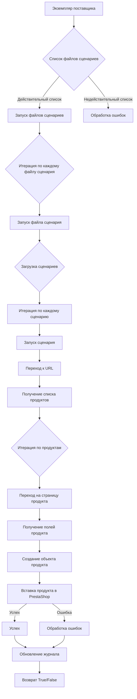

### **Анализ кода модуля `src.scenario`**

## \file /src/scenario/README.MD

**Качество кода:**

- **Соответствие стандартам**: 7/10
- **Плюсы**:
    - Четкое описание функциональности модуля.
    - Логичная структура документации.
    - Наличие схемы workflow в формате Mermaid.
    - Описание основных компонентов модуля.
- **Минусы**:
    - Отсутствует подробное описание процесса обработки исключений и логирования.
    - Нет примеров использования `j_loads` или `j_loads_ns` для чтения JSON файлов.
    - Не хватает информации о настройке и использовании веб-драйвера (хотя это подразумевается).
    - Форматирование примеров кода и JSON не всегда соответствует требованиям (использованы двойные кавычки вместо одинарных).

**Рекомендации по улучшению:**

1.  **Добавить описание обработки исключений и логирования**:
    - Описать, как именно ошибки обрабатываются в каждой из функций (`run_scenario_files`, `run_scenario_file`, `run_scenario`, `dump_journal`, `main`).
    - Указать, где и как используется модуль `logger` из `src.logger.logger`.
    - Привести примеры использования `logger.error` для логирования ошибок.

2.  **Обновить примеры использования JSON**:
    - Заменить стандартное использование `open` и `json.load` на `j_loads` или `j_loads_ns` в примерах, если это уместно.

3.  **Добавить информацию о веб-драйвере**:
    - Описать, как инициализируется и используется веб-драйвер.
    - Указать, какие классы драйверов поддерживаются (Chrome, Firefox, Playwright).
    - Привести примеры использования `driver.execute_locator(l: dict)`.

4.  **Улучшить форматирование примеров кода и JSON**:
    - Использовать одинарные кавычки (`'`) вместо двойных (`"`) в примерах кода Python.
    - Привести пример JSON к более читаемому виду с учетом требований к форматированию.

5.  **Дополнить описания функций docstring**:
    - Добавить более подробное описание того, что именно делает каждая функция.
    - Если функция вызывает внутренние функции, кратко описать их назначение.
    - Указывать все возможные исключения, которые могут быть выброшены, и причины их возникновения.

6.  **Улучшить пример сценария**:
    - Добавить пример сценария, показывающий все возможные поля и их значения.
    - Описать, как этот сценарий будет обрабатываться кодом.

7. **Документация должна быть на русском языке**:
    - Весь текст, кроме кода, должен быть переведен на русский язык.

**Оптимизированный код:**

```markdown
# Модуль `src.scenario`

## Обзор

Модуль `src.scenario` предназначен для автоматизации взаимодействия с поставщиками с использованием сценариев, описанных в файлах JSON. Он упрощает процесс извлечения и обработки данных о продуктах с веб-сайтов поставщиков и синхронизирует эту информацию с базой данных (например, PrestaShop). Модуль включает в себя функциональность для чтения сценариев, взаимодействия с веб-сайтами, обработки данных, ведения журналов выполнения и организации всего рабочего процесса.

## Содержание

* [Модуль `src.scenario`](#модуль-srcscenario)
* [Обзор](#обзор)
* [Основные функции модуля](#основные-функции-модуля)
* [Основные компоненты модуля](#основные-компоненты-модуля)
    * [`run_scenario_files(s, scenario_files_list)`](#run_scenario_files-s-scenario_files_list)
    * [`run_scenario_file(s, scenario_file)`](#run_scenario_file-s-scenario_file)
    * [`run_scenario(s, scenario)`](#run_scenario-s-scenario)
    * [`dump_journal(s, journal)`](#dump_journal-s-journal)
    * [`main()`](#main)
* [Пример сценария](#пример-сценария)
* [Как это работает](#как-это-работает)

## Основные функции модуля

1. **Чтение сценариев**: Загрузка сценариев из файлов JSON, содержащих информацию о продуктах и URL-адреса на веб-сайте поставщика.
2. **Взаимодействие с веб-сайтами**: Обработка URL-адресов из сценариев для извлечения данных о продуктах.
3. **Обработка данных**: Преобразование извлеченных данных в формат, подходящий для базы данных, и сохранение их.
4. **Ведение журнала выполнения**: Поддержание журналов с деталями выполнения сценариев и результатами для отслеживания прогресса и выявления ошибок.



## Основные компоненты модуля

### `run_scenario_files(s, scenario_files_list)`

**Описание**: Принимает список файлов сценариев и выполняет их последовательно, вызывая функцию `run_scenario_file` для каждого файла.

```python
def run_scenario_files(s, scenario_files_list: list) -> None:
    """
    Принимает список файлов сценариев и выполняет их последовательно, вызывая функцию `run_scenario_file` для каждого файла.

    Args:
        s: Объект настроек (например, для подключения к базе данных).
        scenario_files_list (list): Список путей к файлам сценариев.

    Returns:
        None

    Raises:
        FileNotFoundError: Если файл сценария не найден.
        JSONDecodeError: Если файл сценария содержит неверный JSON.
        Exception: При любых других проблемах во время выполнения сценария.

    """
    # Функция выполняет сценарии из списка файлов.
    ...
```

**Параметры**:
- `s`: Объект настроек (например, для подключения к базе данных).
- `scenario_files_list` (list): Список путей к файлам сценариев.

**Возвращает**:
- None

**Вызывает**:
- `FileNotFoundError`: Если файл сценария не найден.
- `JSONDecodeError`: Если файл сценария содержит неверный JSON.

### `run_scenario_file(s, scenario_file)`

**Описание**: Загружает сценарии из указанного файла и вызывает `run_scenario` для каждого сценария в файле.

```python
def run_scenario_file(s, scenario_file: str) -> None:
    """
    Загружает сценарии из указанного файла и вызывает `run_scenario` для каждого сценария в файле.

    Args:
        s: Объект настроек.
        scenario_file (str): Путь к файлу сценария.

    Returns:
        None

    Raises:
        FileNotFoundError: Если файл сценария не найден.
        JSONDecodeError: Если файл сценария содержит неверный JSON.
        Exception: При любых других проблемах во время выполнения сценария.
    """
    # Функция выполняет сценарии из указанного файла.
    ...
```

**Параметры**:
- `s`: Объект настроек.
- `scenario_file` (str): Путь к файлу сценария.

**Возвращает**:
- None

**Вызывает**:
- `FileNotFoundError`: Если файл сценария не найден.
- `JSONDecodeError`: Если файл сценария содержит неверный JSON.
- `Exception`: При любых других проблемах во время выполнения сценария.

### `run_scenario(s, scenario)`

**Описание**: Обрабатывает отдельный сценарий, переходя по URL, извлекая данные о продукте и сохраняя их в базу данных.

```python
def run_scenario(s, scenario: dict) -> None:
    """
    Обрабатывает отдельный сценарий, переходя по URL, извлекая данные о продукте и сохраняя их в базу данных.

    Args:
        s: Объект настроек.
        scenario (dict): Словарь, содержащий сценарий (например, с URL и категориями).

    Returns:
        None

    Raises:
        requests.exceptions.RequestException: Если возникли проблемы с запросом к веб-сайту.
        Exception: При любых других проблемах во время обработки сценария.
    """
    # Функция выполняет отдельный сценарий.
    ...
```

**Параметры**:
- `s`: Объект настроек.
- `scenario` (dict): Словарь, содержащий сценарий (например, с URL и категориями).

**Возвращает**:
- None

**Вызывает**:
- `requests.exceptions.RequestException`: Если возникли проблемы с запросом к веб-сайту.
- `Exception`: При любых других проблемах во время обработки сценария.

### `dump_journal(s, journal)`

**Описание**: Сохраняет журнал выполнения в файл для последующего анализа.

```python
def dump_journal(s, journal: list) -> None:
    """
    Сохраняет журнал выполнения в файл для последующего анализа.

    Args:
        s: Объект настроек.
        journal (list): Список записей журнала выполнения.

    Returns:
        None

    Raises:
        Exception: Если возникли проблемы при записи в файл.
    """
    # Функция сохраняет журнал выполнения в файл.
    ...
```

**Параметры**:
- `s`: Объект настроек.
- `journal` (list): Список записей журнала выполнения.

**Возвращает**:
- None

**Вызывает**:
- `Exception`: Если возникли проблемы при записи в файл.

### `main()`

**Описание**: Главная функция для запуска модуля.

```python
def main() -> None:
    """
    Главная функция для запуска модуля.

    Args:
        None

    Returns:
        None

    Raises:
        Exception: При любых критических ошибках во время выполнения.
    """
    # Главная функция модуля.
    ...
```

**Параметры**:
- None

**Возвращает**:
- None

**Вызывает**:
- `Exception`: При любых критических ошибках во время выполнения.

## Пример сценария

Пример сценария JSON описывает взаимодействие с категориями продуктов на веб-сайте. Он включает в себя URL, название категории и идентификаторы категории в базе данных PrestaShop.

```json
{
    'scenarios': {
        'mineral+creams': {
            'url': 'https://example.com/category/mineral-creams/',
            'name': 'mineral+creams',
            'presta_categories': {
                'default_category': 12345,
                'additional_categories': [12346, 12347]
            }
        }
    }
}
```
```json
{
    'scenarios': {
        'example_scenario': {
            'url': 'https://example.com/products',
            'name': 'Example Products',
            'presta_categories': {
                'default_category': 123,
                'additional_categories': [456, 789]
            },
            'pagination': {
                'type': 'infinite_scroll',
                'scroll_pause': 2  # seconds
            },
            'product_selectors': {
                'title': '.product-title',
                'price': '.product-price',
                'description': '.product-description',
                'image_url': '.product-image img @src'
            },
            'database_sync': {
                'enabled': True,
                'update_existing': True
            }
        }
    }
}
```
```python
from src.logger import logger

def example_function(param: str) -> None:
    """
    Пример функции с логированием.

    Args:
        param (str): Параметр функции.

    Returns:
        None

    """
    try:
        logger.info(f'Начало выполнения example_function с параметром: {param}')
        # Здесь какая-то логика
        result = f'Результат: {param}'
        logger.info(f'Функция выполнена успешно, результат: {result}')
    except Exception as ex:
        logger.error('Произошла ошибка в example_function', ex, exc_info=True)

def read_config_file(file_path: str) -> dict | None:
    """
    Считывает конфигурационный файл JSON.

    Args:
        file_path (str): Путь к файлу конфигурации.

    Returns:
        dict | None: Словарь с данными из файла или None в случае ошибки.

    """
    try:
        from src.utils import j_loads
        config_data = j_loads(file_path)
        logger.info(f'Конфигурационный файл {file_path} успешно загружен.')
        return config_data
    except FileNotFoundError as ex:
        logger.error(f'Файл конфигурации {file_path} не найден.', ex, exc_info=True)
        return None
    except Exception as ex:
        logger.error(f'Ошибка при чтении файла конфигурации {file_path}.', ex, exc_info=True)
        return None
```
```python
from src.webdriver import Driver, Chrome

def example_webdriver_usage(url: str, locator: dict) -> str | None:
    """
    Пример использования веб-драйвера для извлечения данных с веб-страницы.

    Args:
        url (str): URL веб-страницы.
        locator (dict): Локатор элемента для извлечения.

    Returns:
        str | None: Текст элемента или None в случае ошибки.

    """
    try:
        driver = Driver(Chrome)
        driver.get(url)
        element = driver.execute_locator(locator)
        if element:
            return element.text
        else:
            logger.warning(f'Элемент не найден по локатору: {locator}')
            return None
    except Exception as ex:
        logger.error('Ошибка при работе с веб-драйвером', ex, exc_info=True)
        return None
    finally:
        if driver:
            driver.quit()
```

## Как это работает

Модуль автоматизирует взаимодействие с веб-сайтами поставщиков для извлечения информации о продуктах. Сценарии, описанные в файлах JSON, указывают, какие URL-адреса следует посетить и какие данные извлечь. Извлеченные данные преобразуются и сохраняются в базу данных PrestaShop. Журналы выполнения позволяют отслеживать прогресс и выявлять ошибки.