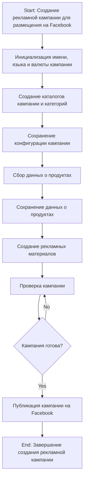
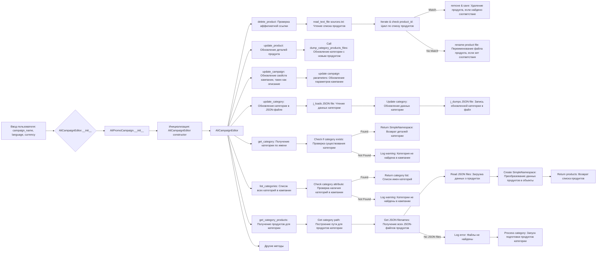
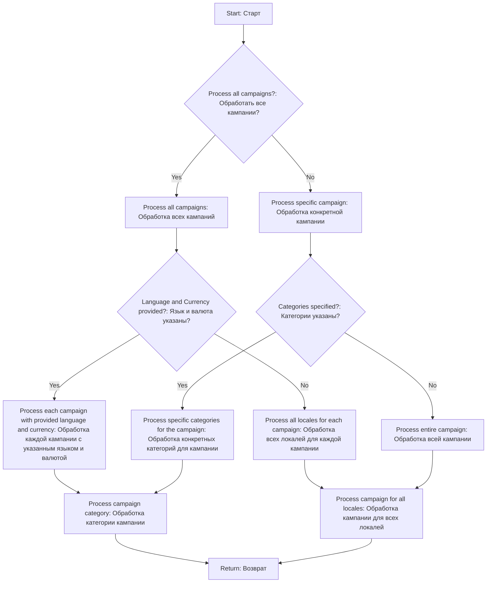

### **Анализ кода модуля `campaign`**

## Качество кода:

- **Соответствие стандартам**: 7/10
- **Плюсы**:
  - Наличие подробного описания функциональности модуля.
  - Использование блок-схем для визуализации процессов.
  - Относительно понятная структура документа.
- **Минусы**:
  - Документ в формате Markdown не соответствует PEP8.
  - Отсутствует единообразие в оформлении текста.
  - Необходимо перевести docstring на русский язык.

## Рекомендации по улучшению:

1.  **Форматирование Markdown**:
    - Привести документ в соответствие со стандартами Markdown.
    - Добавить больше акцентов на ключевые слова и фразы.

2.  **Перевод на русский**:
    - Перевести все текстовые описания и примеры на русский язык.

3.  **Улучшение структуры**:
    - Сделать структуру документа более четкой и логичной.
    - Добавить больше конкретных примеров использования.

4.  **Актуализация блок-схем**:
    - Удостовериться, что блок-схемы соответствуют актуальному состоянию кодовой базы.

## Оптимизированный код:

```markdown
```rst
.. module:: src.suppliers.aliexpress.campaign
```

### `campaign`

Модуль `campaign` предназначен для управления процессом создания и публикации рекламных кампаний на Facebook.
Он включает функциональность для инициализации параметров кампании (имя, язык, валюта), создания структуры каталогов, сохранения конфигураций для новой кампании, сбора и сохранения данных о продуктах через `ali` или `html`, генерации рекламных материалов, проверки кампании и публикации ее на Facebook.



-   **Шаг 1**: Начало - Начало процесса.

-   **Шаг 2**: Инициализация деталей кампании - Определяются имя, язык и валюта кампании. Пример: Имя кампании: "Летняя распродажа", Язык: "Русский", Валюта: "USD".

-   **Шаг 3**: Создание каталогов кампании и категорий - Создаются необходимые каталоги и файлы для кампании. Пример: Создается структура папок в файловой системе для хранения активов кампании.

-   **Шаг 4**: Сохранение конфигурации кампании - Сохраненяются инициализированные детали кампании. Пример: Данные записываются в базу данных или файл конфигурации.

-   **Шаг 5**: Сбор данных о продуктах - Собираются данные, относящиеся к продуктам, которые будут продвигаться в рамках кампании. Пример: Идентификаторы продуктов, описания, изображения и цены извлекаются из системы инвентаризации.

-   **Шаг 6**: Сохранение данных о продуктах - Сохраненяются собранные данные о продуктах. Пример: Данные записываются в таблицу базы данных, предназначенную для продуктов кампании.

-   **Шаг 7**: Создание рекламных материалов - Генерируются или выбираются графика, баннеры и другие рекламные материалы. Пример: Изображения и описания адаптируются для привлечения клиентов.

-   **Шаг 8**: Проверка кампании - Процесс проверки подтверждает готовность компонентов кампании. Пример: Человек или система оценивает качество и полноту всех компонентов кампании.

-   **Шаг 9**: Кампания готова? - Проверка, чтобы определить, является ли кампания полной и готовой к публикации. Пример: Логический флаг сигнализирует "Да", если все на месте, иначе "Нет", что вызывает возврат к предыдущему шагу для внесения исправлений.

-   **Шаг 10**: Публикация кампании - Кампания становится активной на платформе, готовой к маркетинговым усилиям. Пример: API-вызовы выполняются для публикации кампании на соответствующей платформе.

-   **Шаг 11**: Конец - Процесс создания кампании завершен.

# Редактирование кампании



# Подготовка кампании

