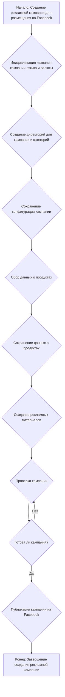

### **Анализ кода модуля `campaign`**

**Качество кода:**

- **Соответствие стандартам**: 7/10
- **Плюсы**:
    - Описание модуля и его функциональности предоставлено в начале файла.
    - Визуализация процесса создания рекламной кампании через блок-схему.
- **Минусы**:
    - Отсутствуют детали реализации функциональности (например, как именно происходит инициализация, создание директорий, сбор данных и т.д.).
    - Нет явного указания на использование стандартов кодирования (PEP8).
    - Отсутствуют примеры использования основных функций или классов модуля.
    - Нет информации о зависимостях модуля от других частей проекта.
    - Не хватает docstring для каждой функции, чтобы описать ее параметры, возвращаемые значения и возможные исключения.

**Рекомендации по улучшению:**

1.  **Документирование функций и классов**: Добавить docstring для всех функций и классов, чтобы описать их параметры, возвращаемые значения и возможные исключения.
2.  **Указание зависимостей**: Явно указать зависимости модуля от других модулей проекта.
3.  **Примеры использования**: Добавить примеры использования основных функций или классов модуля.
4.  **Детали реализации**: Добавить детали реализации основных этапов процесса (инициализация, создание директорий, сбор данных и т.д.).
5.  **Структурирование документации**: Улучшить структуру документации, добавив разделы с описанием архитектуры модуля, используемых технологий и т.д.
6. **Форматирование кода**: Привести код в соответствие со стандартами PEP8.
7. **Связь с другими модулями**: Описать связь с другими модулями и классами проекта `hypotez`.

**Оптимизированный код:**

```markdown
### `campaign`

**Описание**:
Модуль `campaign` предназначен для управления процессом создания и публикации рекламных кампаний на Facebook.
Он включает функционал для инициализации параметров кампании (название, язык, валюта), создания структуры директорий,
сохранения конфигураций для новой кампании, сбора и сохранения данных о продуктах через `ali` или `html`,
генерации рекламных материалов, проверки кампании и публикации ее на Facebook.

**Основные этапы:**

1.  **Инициализация**: Установка основных параметров кампании, таких как название, язык и валюта.
2.  **Создание структуры**: Формирование структуры каталогов для хранения данных и конфигураций кампании.
3.  **Конфигурация**: Сохранение конфигурационных параметров кампании в файлы.
4.  **Сбор данных**: Получение данных о продуктах из различных источников (`ali`, `html`).
5.  **Генерация материалов**: Создание рекламных материалов на основе собранных данных.
6.  **Проверка**: Проверка готовности кампании к публикации.
7.  **Публикация**: Размещение кампании на платформе Facebook.

**Блок-схема процесса создания рекламной кампании:**



**Пример использования:**
   ```python
   # Пример использования (будет дополнен после реализации функционала)
   # from src.suppliers.aliexpress.campaign import campaign

   # campaign.create_campaign(name='test_campaign', lang='ru', currency='RUB')
   ```
"""
Модуль для работы с рекламными кампаниями на Facebook
========================================================

Модуль содержит функции для создания, настройки и публикации рекламных кампаний на Facebook.
Он включает в себя функциональность для инициализации параметров кампании, создания структуры директорий,
сохранения конфигураций, сбора данных о продуктах, генерации рекламных материалов, проверки и публикации кампании.

Пример использования
----------------------

>>> # Пример будет дополнен после реализации функционала
>>> # from src.suppliers.aliexpress.campaign import campaign
>>> # campaign.create_campaign(name='test_campaign', lang='ru', currency='RUB')
"""