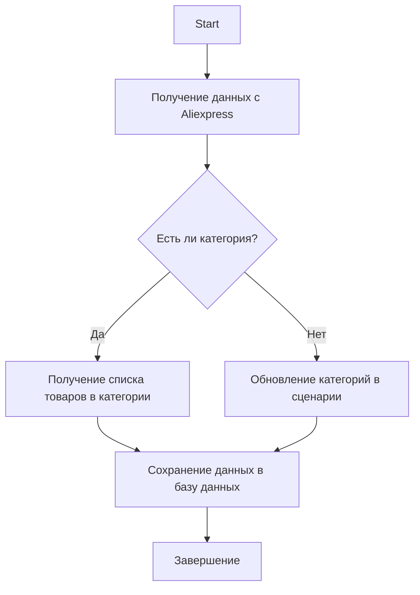

### **Анализ кода модуля `category.ru.md`**

**Качество кода**:
- **Соответствие стандартам**: 7/10
- **Плюсы**:
    - Наличие документации и описания основных функций модуля.
    - Использование блок-схемы для визуализации логики работы.
    - Примеры использования основных функций.
- **Минусы**:
    - Не хватает подробного описания каждого класса и метода.
    - Отсутствуют аннотации типов для аргументов и возвращаемых значений функций.
    - Нет обработки исключений и логирования внутри функций.

**Рекомендации по улучшению**:

1.  **Добавить подробные docstring для каждой функции и класса**:
    *   Описать назначение, аргументы, возвращаемые значения и возможные исключения.
    *   Использовать стиль Google Python Style Guide для docstring.

2.  **Добавить аннотации типов для аргументов и возвращаемых значений функций**:
    *   Это улучшит читаемость и поддерживаемость кода.

3.  **Добавить обработку исключений и логирование внутри функций**:
    *   Использовать `try-except` блоки для обработки возможных ошибок.
    *   Использовать модуль `logger` из `src.logger` для логирования ошибок и событий.

4.  **Оптимизировать примеры использования**:
    *   Добавить больше контекста и пояснений для каждого примера.

5.  **Улучшить описание класса `DBAdaptor`**:
    *   Добавить описание каждого метода класса.
    *   Указать типы данных для аргументов методов.

6.  **Перевести все комментарии на русский язык в формате UTF-8**.

**Оптимизированный код**:

```markdown
# Модуль управления категориями Aliexpress
# ==========================================

# Модуль предоставляет функциональность для работы с категориями товаров на платформе Aliexpress.
# Он включает функции для получения ссылок на товары в категории, обновления категорий на основе данных с сайта и операций с базой данных.

## Описание модуля

# Модуль предназначен для управления категориями товаров на Aliexpress.
# Он включает в себя следующие ключевые функции:

# - Получение списка товаров из категории.
# - Обновление категорий в файле сценария на основе данных с сайта.
# - Операции с базой данных для работы с категориями.



## Пример использования

### Получение списка товаров из категории

```python
# Пример использования функции get_list_products_in_category
# products = get_list_products_in_category(supplier)
```

### Обновление категорий в файле сценария

```python
# Пример использования функции update_categories_in_scenario_file
# updated = update_categories_in_scenario_file(supplier, "scenario_file.json")
```

### Операции с базой данных

```python
# Пример использования DBAdaptor для операций с базой данных
# db = DBAdaptor()
# db.select(cat_id=123)
# db.insert()
# db.update()
# db.delete()
```

## Функции модуля

### `get_list_products_in_category(s: Supplier) -> list[str]`

```python
# def get_list_products_in_category(s: Supplier) -> list[str]:
#     """
#     Считывает URL товаров со страницы категории.
#     Если есть несколько страниц с товарами, функция будет перелистывать все страницы.
#
#     Args:
#         s (Supplier): Экземпляр поставщика.
#
#     Returns:
#         list[str]: Список URL продуктов в категории.
#     """
#     ...
```

### `get_prod_urls_from_pagination(s: Supplier) -> list[str]`

```python
# def get_prod_urls_from_pagination(s: Supplier) -> list[str]:
#     """
#     Собирает ссылки на товары с страницы категории с перелистыванием страниц.
#
#     Args:
#         s (Supplier): Экземпляр поставщика.
#
#     Returns:
#         list[str]: Список ссылок на товары.
#     """
#     ...
```

### `update_categories_in_scenario_file(s: Supplier, scenario_filename: str) -> bool`

```python
# def update_categories_in_scenario_file(s: Supplier, scenario_filename: str) -> bool:
#     """
#     Проверяет изменения категорий на сайте и обновляет файл сценария.
#
#     Args:
#         s (Supplier): Экземпляр поставщика.
#         scenario_filename (str): Имя файла сценария для обновления.
#
#     Returns:
#         bool: True, если обновление прошло успешно.
#     """
#     ...
```

### `get_list_categories_from_site(s: Supplier, scenario_file: str, brand: str = '') -> list[str]`

```python
# def get_list_categories_from_site(s: Supplier, scenario_file: str, brand: str = '') -> list[str]:
#     """
#     Получает список категорий с сайта на основе файла сценария.
#
#     Args:
#         s (Supplier): Экземпляр поставщика.
#         scenario_file (str): Имя файла сценария.
#         brand (str, optional): Опциональное имя бренда.
#
#     Returns:
#         list[str]: Список категорий.
#     """
#     ...
```

### Класс `DBAdaptor`

```python
# class DBAdaptor:
#     """
#     Предоставляет методы для выполнения операций с базой данных, таких как SELECT, INSERT, UPDATE и DELETE.
#     """
#     def select(self, cat_id: int, parent_id: int, project_cat_id: int) -> list[dict]:
#         """
#         Выбирает записи из базы данных.
#
#         Args:
#             cat_id (int): ID категории.
#             parent_id (int): ID родительской категории.
#             project_cat_id (int): ID категории проекта.
#
#         Returns:
#             list[dict]: Список записей из базы данных.
#         """
#         ...
#
#     def insert(self) -> None:
#         """
#         Вставляет новые записи в базу данных.
#         """
#         ...
#
#     def update(self) -> None:
#         """
#         Обновляет записи в базе данных.
#         """
#         ...
#
#     def delete(self) -> None:
#         """
#         Удаляет записи из базы данных.
#         """
#         ...
```

## Установка

# Для работы с модулем необходимо установить зависимые пакеты, такие как `requests`,
# а также настроить соединение с базой данных через `gs.db_translations_credentials`.

### Зависимости:

# - `requests`
# - `src.utils.jjson`
# - `src.db.manager_categories.suppliers_categories`

## Логирование

# В модуле используется логирование через `src.logger`,
# которое помогает отслеживать ошибки и события в процессе выполнения.

## Автор

# Модуль разработан для внутреннего использования в проекте.
```