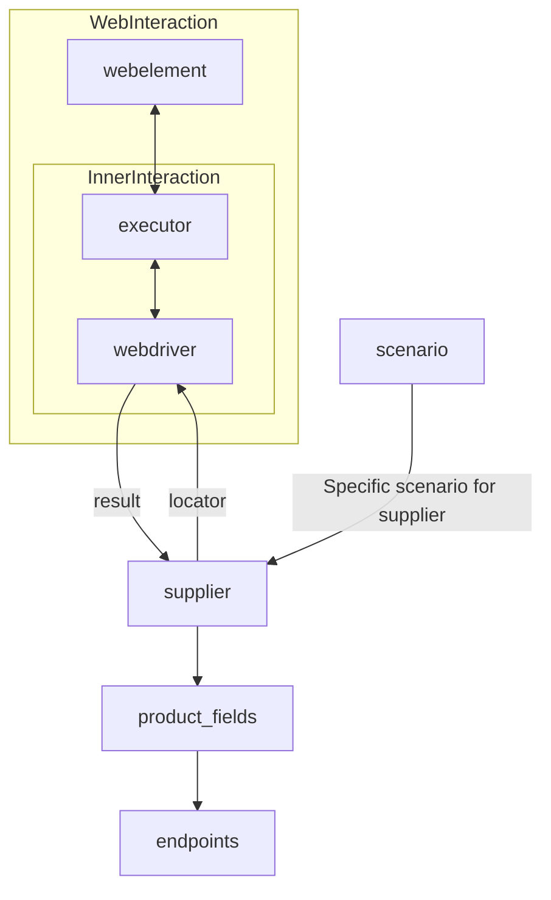

### **Анализ кода модуля `readme.md`**

---

**Расположение файла в проекте:** `hypotez/src/suppliers/readme.md`

**Назначение файла:** Документация для класса `Supplier` и списка реализованных поставщиков.

**Описание:** Файл содержит описание класса `Supplier`, который является базовым для всех поставщиков данных в проекте `hypotez`. Также в файле представлен список реализованных поставщиков и информация о взаимодействии с `WebDriver` и сценариями.

---

#### **Качество кода:**

- **Соответствие стандартам:** 7/10
- **Плюсы:**
  - Четкая структура документа.
  - Понятное описание класса `Supplier` и его роли.
  - Список реализованных поставщиков с указанием используемых технологий.
  - Наличие диаграммы, визуализирующей взаимодействие компонентов.
- **Минусы:**
  - Отсутствуют примеры использования класса `Supplier`.
  - Нет подробного описания атрибутов и методов класса `Supplier`.
  - Некоторые ссылки могут быть нерабочими или требовать уточнения (`prefixes.md`, `../webdriver`, `../scenarios`).

---

#### **Рекомендации по улучшению:**

1. **Добавить примеры использования класса `Supplier`:**
   - Привести примеры инициализации и использования класса `Supplier` для различных поставщиков.
2. **Добавить подробное описание атрибутов и методов класса `Supplier`:**
   - Описать каждый атрибут и метод класса с указанием их назначения и параметров.
3. **Проверить и уточнить ссылки:**
   - Убедиться, что все ссылки в документе ведут на существующие файлы и разделы.
   - Добавить более конкретные указания на файлы (`prefixes.md`, `../webdriver`, `../scenarios`).
4. **Добавить больше деталей о каждом поставщике:**
   - Указать особенности реализации каждого поставщика, поддерживаемые функции и ограничения.
5. **Актуализировать список реализованных поставщиков:**
   - Проверить, что список поставщиков актуален и содержит все реализованные на данный момент.
6. **Перевести текст на русский язык**
   - Весь текст в документации, включая заголовки и описания, должен быть переведен на русский язык.

---

#### **Оптимизированный код:**

```markdown
                [Русский](https://github.com/hypo69/hypotez/blob/master/README.RU.MD)

# **Класс** `Supplier`

### **Базовый класс для всех поставщиков**

*В контексте кода `Supplier` представляет собой поставщика информации.
Поставщик может быть производителем товаров, данных или информации.
Источники поставщика включают целевую страницу веб-сайта, документ, базу данных или таблицу.
Этот класс объединяет различных поставщиков под стандартизированным набором операций.
Каждый поставщик имеет уникальный префикс. ([Подробнее о префиксах](prefixes.md))*

Класс `Supplier` служит основой для управления взаимодействием с поставщиками.
Он обрабатывает инициализацию, конфигурацию, аутентификацию и выполнение рабочих процессов для различных источников данных, таких как `amazon.com`, `walmart.com`, `mouser.com` и `digikey.com`. Клиенты также могут определять дополнительных поставщиков.

---

## Список реализованных поставщиков:

[aliexpress](aliexpress)  - Реализован с двумя рабочими процессами: `webdriver` и `api`

[amazon](amazon) - `webdriver`

[bangood](bangood)  - `webdriver`

[cdata](cdata)  - `webdriver`

[chat_gpt](chat_gpt)  - Взаимодействует с интерфейсом ChatGPT (НЕ МОДЕЛЬ!)

[ebay](ebay)  - `webdriver`

[etzmaleh](etzmaleh)  - `webdriver`

[gearbest](gearbest)  - `webdriver`

[grandadvance](grandadvance)  - `webdriver`

[hb](hb)  - `webdriver`

[ivory](ivory) - `webdriver`

[ksp](ksp) - `webdriver`

[kualastyle](kualastyle) `webdriver`

[morlevi](morlevi) `webdriver`

[visualdg](visualdg) `webdriver`

[wallashop](wallashop) `webdriver`

[wallmart](wallmart) `webdriver`

[Подробнее о WebDriver :class: `Driver`](../webdriver)
[Подробнее о рабочих процессах :class: `Scenario`](../scenarios)

---

