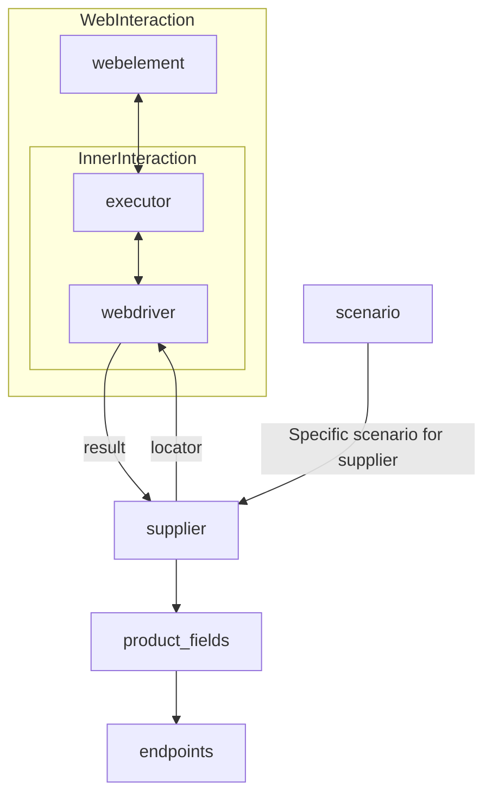

### **Анализ кода модуля `suppliers/readme.md`**

2. **Качество кода**:
   - **Соответствие стандартам**: 7/10
   - **Плюсы**:
     - Четкое и понятное описание класса `Supplier` и его роли в проекте.
     - Список реализованных поставщиков с указанием используемых workflow.
     - Наличие ссылок на другие модули (`webdriver`, `scenarios`) для получения дополнительной информации.
     - Использование Mermaid для визуализации взаимодействия компонентов.
   - **Минусы**:
     - Отсутствует подробное описание атрибутов и методов класса `Supplier`.
     - Нет примеров использования класса `Supplier`.
     - Не все названия поставщиков в списке написаны единообразно (где-то с маленькой буквы, где-то с большой).

3. **Рекомендации по улучшению**:
   - Добавить подробное описание атрибутов и методов класса `Supplier` с указанием их назначения и типов данных.
   - Предоставить примеры использования класса `Supplier` для демонстрации его функциональности.
   - Унифицировать названия поставщиков в списке (например, все с маленькой буквы).
   - Добавить описание workflow `api` и `webdriver`.
   - Перевести текст на русский язык, чтобы соответствовать требованиям.
   - Добавить заголовок файла модуля.
   - Оформить все ссылки в формате Markdown.
   - Добавить описание диаграммы Mermaid.

4. **Оптимизированный код**:

```markdown
## \file hypotez/src/suppliers/readme.md

# **Класс** `Supplier`

### **Базовый класс для всех поставщиков**

В контексте кода, `Supplier` представляет собой поставщика информации.
Поставщик может быть производителем товаров, данных или информации.
Источники поставщика включают целевую страницу веб-сайта, документ, базу данных или таблицу.
Этот класс объединяет различных поставщиков под стандартизированным набором операций.
Каждый поставщик имеет уникальный префикс. ([Подробнее о префиксах](prefixes.md))*

Класс `Supplier` служит основой для управления взаимодействиями с поставщиками.
Он обрабатывает инициализацию, конфигурацию, аутентификацию и выполнение workflow для различных источников данных, таких как `amazon.com`, `walmart.com`, `mouser.com` и `digikey.com`. Клиенты также могут определять дополнительных поставщиков.

---

## Список реализованных поставщиков:

[aliexpress](aliexpress) - Реализован с двумя workflow: `webdriver` и `api`

[amazon](amazon) - `webdriver`

[bangood](bangood) - `webdriver`

[cdata](cdata) - `webdriver`

[chat_gpt](chat_gpt) - Взаимодействует с интерфейсом ChatGPT (НЕ С МОДЕЛЬЮ!)

[ebay](ebay) - `webdriver`

[etzmaleh](etzmaleh) - `webdriver`

[gearbest](gearbest) - `webdriver`

[grandadvance](grandadvance) - `webdriver`

[hb](hb) - `webdriver`

[ivory](ivory) - `webdriver`

[ksp](ksp) - `webdriver`

[kualastyle](kualastyle) - `webdriver`

[morlevi](morlevi) - `webdriver`

[visualdg](visualdg) - `webdriver`

[wallashop](wallashop) - `webdriver`

[wallmart](wallmart) - `webdriver`

[Подробнее о WebDriver :class: `Driver`](../webdriver)
[Подробнее о workflow :class: `Scenario`](../scenarios)

---

## Диаграмма взаимодействия компонентов

Диаграмма показывает взаимодействие между основными компонентами системы при работе с поставщиками данных.

