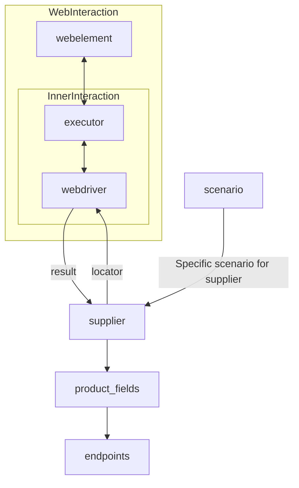

### **Анализ кода модуля `readme.ru.md`**

#### **Качество кода**:
- **Соответствие стандартам**: 7/10
- **Плюсы**:
    - Хорошая структурированность документации, особенно выделение списка реализованных поставщиков.
    - Наличие ссылок на другие важные модули и классы, такие как `Driver` и `Scenario`.
    - Описание класса `Supplier` и его роли в проекте.
- **Минусы**:
    - Отсутствует стандартный заголовок для Markdown файлов, как указано в инструкции.
    - Не хватает единообразия в описании поставщиков, например, указание технологии (`webdriver` или `api`) для каждого поставщика.
    - Отсутствуют примеры использования и интеграции класса `Supplier`.
    - Ссылки на файлы проекта даны в виде абсолютных URL, что может быть не всегда удобно. Лучше использовать относительные пути, если это возможно.

#### **Рекомендации по улучшению**:
1.  **Добавить стандартный заголовок Markdown**:
    - В начало файла добавить заголовок с названием модуля и кратким описанием.

2.  **Улучшить описание поставщиков**:
    - Добавить единообразное описание для каждого поставщика, включая используемую технологию (`webdriver` или `api`).

3.  **Добавить примеры использования**:
    - Привести примеры использования класса `Supplier` и его интеграции с другими модулями.

4.  **Использовать относительные пути для ссылок**:
    - Заменить абсолютные URL на относительные пути, чтобы улучшить переносимость документации.

5.  **Отредактировать орфографические и грамматические ошибки**:
    - Исправить замеченные опечатки и улучшить грамматику текста.

#### **Оптимизированный код**:

```markdown
### **Модуль: Описание класса `Supplier` и списка поставщиков**
=================================================

В этом файле представлена информация о классе `Supplier`, который является базовым классом для всех поставщиков в проекте `hypotez`.
Также здесь содержится список реализованных поставщиков с указанием используемых технологий.

---

#### **Класс `Supplier`**

`Supplier` - это базовый класс для всех поставщиков информации. В контексте кода `Supplier` представляет собой поставщика информации,
которым может быть производитель какого-либо товара, данных или информации. Источниками поставщика могут быть целевая страница сайта,
документ, база данных или таблица. Класс сводит разных поставщиков к единому алгоритму действий внутри класса.
У каждого поставщика есть свой уникальный префикс. Подробнее о префиксах можно узнать [здесь](prefixes.md).

Класс `Supplier` служит основой для управления взаимодействиями с поставщиками. Он выполняет инициализацию, настройку,
аутентификацию и запуск сценариев для различных источников данных, таких как `amazon.com`, `walmart.com`, `mouser.com` и `digikey.com`.
Клиент может определять дополнительные поставщики.

---

#### **Список реализованных поставщиков:**

-   [aliexpress](aliexpress/README.RU.MD) - Реализован в двух вариантах сценариев: `webdriver` и `api`
-   [amazon](amazon/README.RU.MD) - `webdriver`
-   [bangood](bangood/README.RU.MD) - `webdriver`
-   [cdata](cdata/README.RU.MD) - `webdriver`
-   [chat_gpt](chat_gpt/README.RU.MD) - Работа с чатом chatgpt (НЕ С МОДЕЛЬЮ!)
-   [ebay](ebay/README.RU.MD) - `webdriver`
-   [etzmaleh](etzmaleh/README.RU.MD) - `webdriver`
-   [gearbest](gearbest/README.RU.MD) - `webdriver`
-   [grandadvance](grandadvance/README.RU.MD) - `webdriver`
-   [hb](hb/README.RU.MD) - `webdriver`
-   [ivory](ivory/README.RU.MD) - `webdriver`
-   [ksp](ksp/README.RU.MD) - `webdriver`
-   [kualastyle](kualastyle/README.RU.MD) - `webdriver`
-   [morlevi](morlevi/README.RU.MD) - `webdriver`
-   [visualdg](visualdg/README.RU.MD) - `webdriver`
-   [wallashop](wallashop/README.RU.MD) - `webdriver`
-   [wallmart](wallmart/README.RU.MD) - `webdriver`

---

#### **Ссылки на другие модули:**

-   [Подробно о вебдрайвере class `Driver`](../webdriver/driver.py.md)
-   [Подробно о сценариях class `Scenario`](../scenario/executor.py.md)
-   [Подробно о локаторах](locator.ru.md)

---

#### **Пример использования:**

```python
# Пример инициализации класса Supplier
# from src.suppliers.supplier import Supplier  # Assuming the Supplier class is in this module

# supplier = Supplier(name='example_supplier', prefix='EX')
# supplier.setup()
```

---

