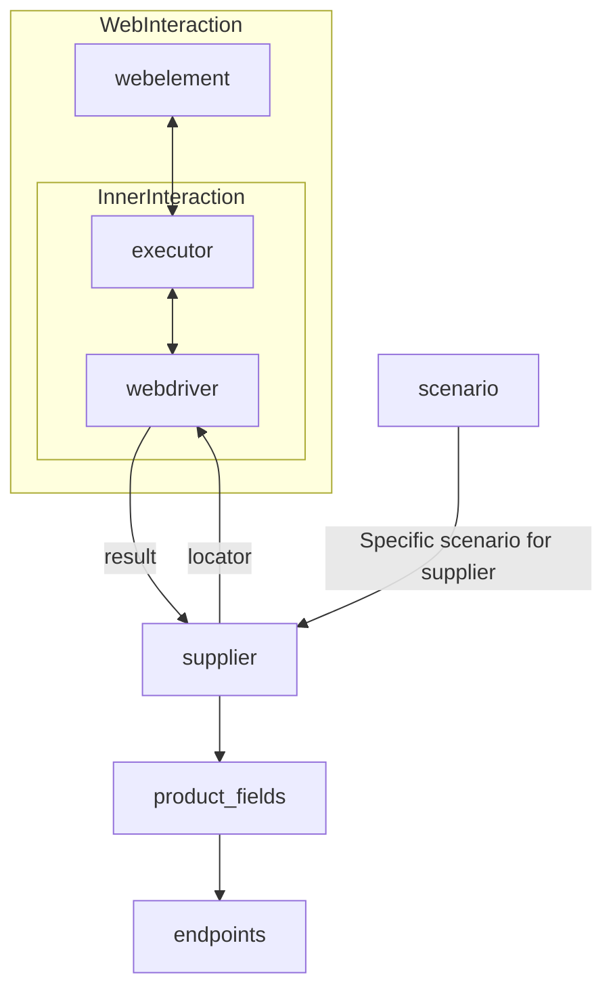

### Анализ кода модуля `readme.ru.md`

#### Качество кода:

- **Соответствие стандартам**: 7/10
- **Плюсы**:
  - Документ предоставляет обзор класса `Supplier` и его роли в проекте.
  - Описаны основные принципы работы с поставщиками данных.
  - Приведен список реализованных поставщиков со ссылками на документацию.
  - Включена диаграмма Mermaid для визуализации взаимодействия компонентов.
- **Минусы**:
  - Не хватает подробностей о структуре и атрибутах класса `Supplier`.
  - Отсутствуют примеры кода для демонстрации использования класса.
  - Нет информации о процессе добавления новых поставщиков.
  - Встречаются неточности в форматировании Markdown (например, использование `**` для заголовков вместо `#`).

#### Рекомендации по улучшению:

1.  **Добавить подробное описание класса `Supplier`**:
    - Указать атрибуты класса, их типы и назначения.
    - Описать основные методы класса и их функциональность.
    - Предоставить примеры использования класса для разных поставщиков.
2.  **Улучшить форматирование Markdown**:
    - Использовать заголовки Markdown (`#`, `##`, `###`) вместо жирного текста (`**`).
    - Проверить и исправить ссылки на другие документы.
    - Добавить отступы для списков и других элементов форматирования.
3.  **Добавить информацию о процессе добавления новых поставщиков**:
    - Описать шаги, необходимые для реализации нового поставщика.
    - Указать, какие методы класса `Supplier` необходимо переопределить.
    - Предоставить пример реализации нового поставщика.
4.  **Добавить описание диаграммы Mermaid**:
    - Объяснить, что отображает диаграмма и как она связана с классом `Supplier`.
    - Описать основные компоненты диаграммы и их взаимодействие.
5.  **Уточнить терминологию**:
    - Заменить термин "потавщик" на "поставщик".
    - Проверить текст на наличие других опечаток и грамматических ошибок.

#### Оптимизированный код:

```markdown
### **Класс** `Supplier`

### **Базовый класс для всех поставщиков**

*В контексте кода `Supplier` - поставщик информации.
Поставщиком может быть производитель какого-либо товара, данных или информации.
Источники поставщика - целевая страница сайта, документ, база данных, таблица.
Класс сводит разных поставщиков к одинаковому алгоритму действий внутри класса.
У каждого поставщика есть свой уникальный префикс. ([подробно о префиксах](prefixes.md))*

Класс `Supplier` служит основой для управления взаимодействиями с поставщиками.
Он выполняет инициализацию, настройку, аутентификацию и запуск сценариев для различных источников данных, таких как `amazon.com`, `walmart.com`, `mouser.com` и `digikey.com`. Клиент может определить дополнительные поставщики.

---

## Список реализованных поставщиков:

-   [aliexpress](aliexpress/README.RU.MD) - Реализован в двух вариантах сценариев: `webdriver` и `api`
-   [amazon](amazon/README.RU.MD) - `webdriver`
-   [bangood](bangood/README.RU.MD) - `webdriver`
-   [cdata](cdata/README.RU.MD) - `webdriver`
-   [chat\_gpt](chat_gpt/README.RU.MD) - Работа с чатом chatgpt (НЕ С МОДЕЛЬЮ!)
-   [ebay](ebay/README.RU.MD) - `webdriver`
-   [etzmaleh](etzmaleh/README.RU.MD) - `webdriver`
-   [gearbest](gearbest/README.RU.MD) - `webdriver`
-   [grandadvance](grandadvance/README.RU.MD) - `webdriver`
-   [hb](hb/README.RU.MD) - `webdriver`
-   [ivory](ivory/README.RU.MD) - `webdriver`
-   [ksp](ksp/README.RU.MD) - `webdriver`
-   [kualastyle](kualastyle/README.RU.MD) `webdriver`
-   [morlevi](morlevi/README.RU.MD) `webdriver`
-   [visualdg](visualdg/README.RU.MD) `webdriver`
-   [wallashop](wallashop/README.RU.MD) `webdriver`
-   [wallmart](wallmart/README.RU.MD) `webdriver`

[подробно о вебдрайвере class `Driver`](https://github.com/hypo69/hypotez/blob/master/docs/ru/src/webdriver/driver.py.md)

[подробно о сценариях class `Scenario`](https://github.com/hypo69/hypotez/blob/master/docs/ru/src/scenario/executor.py.md)

[подробно о локаторах](https://github.com/hypo69/hypotez/blob/master/docs/ru/src/suppliers/locator.ru.md)

---

#### Диаграмма взаимодействия компонентов



Диаграмма отображает взаимодействие между основными компонентами системы при работе с поставщиками данных.

-   `supplier`: Класс, представляющий поставщика данных.
-   `webdriver`: Инструмент для автоматизации взаимодействия с веб-страницами.
-   `executor`: Компонент, выполняющий сценарии взаимодействия с веб-элементами.
-   `webelement`: Веб-элемент на странице поставщика.
-   `product\_fields`: Поля продукта, извлекаемые из данных поставщика.
-   `endpoints`: URL-адреса, используемые для получения данных от поставщика.
-   `scenario`: Сценарий взаимодействия с поставщиком.