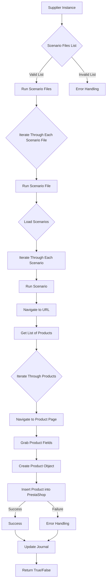

### **Анализ кода модуля `src.scenario`**

## Качество кода:

- **Соответствие стандартам**: 7/10
- **Плюсы**:
   - Документация предоставляет общее описание модуля и его компонентов.
   - Описаны основные функции и параметры.
   - Приведено описание работы модуля, а также пример сценария.
   - Есть схема работы модуля в формате Mermaid.
- **Минусы**:
   - Отсутствуют аннотации типов для параметров функций.
   - Описание функций не соответствует формату docstring.
   - В тексте используются не все правила из системной инструкции.
   - Нет обработки исключений с использованием `logger`.
   - Отсутствуют примеры использования функций.
   - Нет информации о зависимостях модуля от других модулей проекта `hypotez`.

## Рекомендации по улучшению:

1.  **Добавить аннотации типов**: Для всех функций указать типы параметров и возвращаемых значений.

2.  **Привести docstring к единому стандарту**: Необходимо привести описание каждой функции к единому формату docstring, с описанием аргументов, возвращаемых значений и возможных исключений.

3.  **Использовать `logger` для логирования**: В функциях, где ожидаются ошибки, необходимо добавить логирование с использованием `logger.error`.

4.  **Добавить примеры использования функций**: Для каждой функции добавить пример использования в docstring.

5.  **Добавить информацию о зависимостях**: Указать, от каких модулей и классов проекта `hypotez` зависит данный модуль.

6.  **Перефразировать описания**: Сделать описания функций и параметров более конкретными, избегая общих фраз.

## Оптимизированный код:

```markdown
                # Module `src.scenario`

## Overview

Модуль `src.scenario` предназначен для автоматизации взаимодействия с поставщиками на основе сценариев, описанных в файлах JSON. Он упрощает процесс извлечения и обработки данных о продуктах с веб-сайтов поставщиков и синхронизации этой информации с базой данных (например, PrestaShop). Модуль включает функциональность для чтения сценариев, взаимодействия с веб-сайтами, обработки данных, ведения журнала выполнения и организации всего рабочего процесса.

## Table of Contents

* [Module `src.scenario`](#module-src-scenario)
* [Overview](#overview)
* [Core Functions of the Module](#core-functions-of-the-module)
* [Main Components of the Module](#main-components-of-the-module)
    * [`run_scenario_files(s, scenario_files_list)`](#run_scenario_files-s-scenario_files_list)
    * [`run_scenario_file(s, scenario_file)`](#run_scenario_file-s-scenario_file)
    * [`run_scenario(s, scenario)`](#run_scenario-s-scenario)
    * [`dump_journal(s, journal)`](#dump_journal-s-journal)
    * [`main()`](#main)
* [Example Scenario](#example-scenario)
* [How It Works](#how-it-works)

## Core Functions of the Module

1. **Reading Scenarios**: Загрузка сценариев из файлов JSON, содержащих информацию о продуктах и URL-адреса на веб-сайте поставщика.
2. **Interacting with Websites**: Обработка URL-адресов из сценариев для извлечения данных о продуктах.
3. **Processing Data**: Преобразование извлеченных данных в формат, подходящий для базы данных, и сохранение их.
4. **Logging Execution**: Ведение журналов с подробностями выполнения сценариев и результатами для отслеживания прогресса и выявления ошибок.



## Main Components of the Module

### `run_scenario_files(s, scenario_files_list)`

**Description**: Принимает список файлов сценариев и последовательно выполняет их, вызывая функцию `run_scenario_file` для каждого файла.

```python
def run_scenario_files(s: object, scenario_files_list: list) -> None:
    """
    Принимает список файлов сценариев и последовательно выполняет их, вызывая функцию `run_scenario_file` для каждого файла.

    Args:
        s (object): Объект настроек (например, для подключения к базе данных).
        scenario_files_list (list): Список путей к файлам сценариев.

    Returns:
        None

    Raises:
        FileNotFoundError: Если файл сценария не найден.
        JSONDecodeError: Если файл сценария содержит неверный JSON.

    Example:
        >>> s = object() #  Предположим, что s - это объект с необходимыми настройками
        >>> scenario_files_list = ['scenario1.json', 'scenario2.json']
        >>> run_scenario_files(s, scenario_files_list)
    """
    # принимает список файлов сценариев и выполняет их, вызывая функцию `run_scenario_file` для каждого файла
    ...
```

**Parameters**:

*   `s`: A settings object (e.g., for database connection).
*   `scenario_files_list` (list): A list of paths to scenario files.

**Returns**:

*   None

**Raises**:

*   `FileNotFoundError`: If a scenario file is not found.
*   `JSONDecodeError`: If a scenario file contains invalid JSON.

### `run_scenario_file(s, scenario_file)`

**Description**: Загружает сценарии из указанного файла и вызывает `run_scenario` для каждого сценария в файле.

```python
def run_scenario_file(s: object, scenario_file: str) -> None:
    """
    Загружает сценарии из указанного файла и вызывает `run_scenario` для каждого сценария в файле.

    Args:
        s (object): Объект настроек.
        scenario_file (str): Путь к файлу сценария.

    Returns:
        None

    Raises:
        FileNotFoundError: Если файл сценария не найден.
        JSONDecodeError: Если файл сценария содержит неверный JSON.
        Exception: При любых других проблемах во время выполнения сценария.

    Example:
        >>> s = object() #  Предположим, что s - это объект с необходимыми настройками
        >>> scenario_file = 'scenario.json'
        >>> run_scenario_file(s, scenario_file)
    """
    #  Загружает сценарии из указанного файла и вызывает `run_scenario` для каждого сценария в файле.
    ...
```

**Parameters**:

*   `s`: A settings object.
*   `scenario_file` (str): Path to the scenario file.

**Returns**:

*   None

**Raises**:

*   `FileNotFoundError`: If the scenario file is not found.
*   `JSONDecodeError`: If the scenario file contains invalid JSON.
*   `Exception`: For any other issues during scenario execution.

### `run_scenario(s, scenario)`

**Description**: Обрабатывает отдельный сценарий, переходя по URL-адресу, извлекая данные о продукте и сохраняя их в базе данных.

```python
def run_scenario(s: object, scenario: dict) -> None:
    """
    Обрабатывает отдельный сценарий, переходя по URL-адресу, извлекая данные о продукте и сохраняя их в базе данных.

    Args:
        s (object): Объект настроек.
        scenario (dict): Словарь, содержащий сценарий (например, с URL-адресом и категориями).

    Returns:
        None

    Raises:
        requests.exceptions.RequestException: Если есть проблемы с запросом к веб-сайту.
        Exception: При любых других проблемах во время обработки сценария.

    Example:
        >>> s = object() #  Предположим, что s - это объект с необходимыми настройками
        >>> scenario = {"url": "https://example.com/product", "category": "example"}
        >>> run_scenario(s, scenario)
    """
    # Обрабатывает отдельный сценарий, переходя по URL-адресу, извлекая данные о продукте и сохраняя их в базе данных.
    ...
```

**Parameters**:

*   `s`: A settings object.
*   `scenario` (dict): A dictionary containing the scenario (e.g., with URL and categories).

**Returns**:

*   None

**Raises**:

*   `requests.exceptions.RequestException`: If there are issues with the website request.
*   `Exception`: For any other problems during scenario processing.

### `dump_journal(s, journal)`

**Description**: Сохраняет журнал выполнения в файл для последующего анализа.

```python
def dump_journal(s: object, journal: list) -> None:
    """
    Сохраняет журнал выполнения в файл для последующего анализа.

    Args:
        s (object): Объект настроек.
        journal (list): Список записей журнала выполнения.

    Returns:
        None

    Raises:
        Exception: Если есть проблемы с записью в файл.

    Example:
        >>> s = object() #  Предположим, что s - это объект с необходимыми настройками
        >>> journal = ["Entry 1", "Entry 2"]
        >>> dump_journal(s, journal)
    """
    # Сохраняет журнал выполнения в файл для последующего анализа.
    ...
```

**Parameters**:

*   `s`: A settings object.
*   `journal` (list): A list of execution log entries.

**Returns**:

*   None

**Raises**:

*   `Exception`: If there are issues writing to the file.

### `main()`

**Description**: Основная функция для запуска модуля.

```python
def main() -> None:
    """
    Основная функция для запуска модуля.

    Args:
        None

    Returns:
        None

    Raises:
        Exception: При любых критических ошибках во время выполнения.

    Example:
        >>> main()
    """
    #  Основная функция для запуска модуля.
    ...
```

**Parameters**:

*   None

**Returns**:

*   None

**Raises**:

*   `Exception`: For any critical errors during execution.

## Example Scenario

Пример сценария JSON описывает взаимодействие с категориями продуктов на веб-сайте. Он включает URL-адрес, название категории и идентификаторы категории в базе данных PrestaShop.

```json
{
    "scenarios": {
        "mineral+creams": {
            "url": "https://example.com/category/mineral-creams/",
            "name": "mineral+creams",
            "presta_categories": {
                "default_category": 12345,
                "additional_categories": [12346, 12347]
            }
        }
    }
}
```