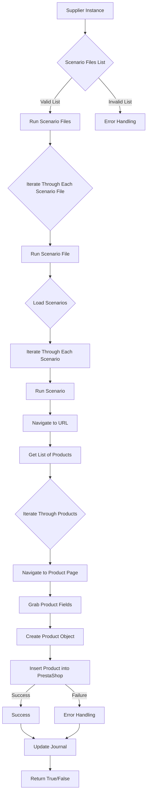

### **Анализ кода модуля `src.scenario`**

## Качество кода:

- **Соответствие стандартам**: 7/10
- **Плюсы**:
    - Документация модуля хорошо структурирована и содержит подробное описание основных компонентов и их функций.
    - Использование Mermaid-диаграммы для визуализации процесса выполнения сценария.
    - Подробное описание каждого компонента модуля с указанием параметров, возвращаемых значений и вызываемых исключений.
    - Примеры сценариев и их структуры.
- **Минусы**:
    - Документация содержит элементы, не соответствующие формату docstring, например, "Описание", "Параметры", "Возвращает", "Вызывает исключения".
    - Не все компоненты модуля документированы в формате, который можно автоматически сгенерировать (например, через Sphinx).
    - Отсутствует описание используемых библиотек и зависимостей.
    - Нет информации об обработке ошибок и ведении журнала выполнения (кроме упоминания в обзоре).
    - Нет инструкций по настройке и запуску модуля.
    - Отсутствие аннотаций типов.

## Рекомендации по улучшению:

1.  **Приведение к формату docstring**:
    - Переформатировать описание функций и методов, используя стандартный формат docstring.
    - Включить аннотации типов для параметров и возвращаемых значений.

2.  **Добавление информации о зависимостях**:
    - Указать используемые библиотеки и зависимости модуля, например, в разделе "Требования".

3.  **Описание обработки ошибок и ведения журнала**:
    - Подробно описать, как модуль обрабатывает ошибки и ведет журнал выполнения.
    - Указать, какие ошибки могут возникать и как они обрабатываются.

4.  **Инструкции по настройке и запуску**:
    - Добавить инструкции по настройке модуля (например, параметры подключения к базе данных) и запуску сценариев.

5.  **Добавление примеров использования**:
    - Предоставить примеры использования основных функций модуля, чтобы облегчить его понимание и использование.

6.  **Улучшение структуры документации**:
    - Разделить документацию на логические разделы, например, "Обзор", "Установка", "Использование", "API".

7.  **Добавление информации о вебдрайвере**:
    - Добавить описание использования вебдрайвера, если он используется в модуле.

## Оптимизированный код:

```markdown
# Модуль `src.scenario`

## Обзор

Модуль `src.scenario` предназначен для автоматизации взаимодействия с поставщиками, используя сценарии, описанные в JSON-файлах. Он адаптирует процесс извлечения и обработки данных о продуктах с веб-сайтов поставщиков и синхронизирует эту информацию с базой данных (например, PrestaShop). Модуль включает чтение сценариев, взаимодействие с веб-сайтами, обработку данных, запись журнала выполнения и организацию всего процесса.

## Оглавление

*   [Модуль `src.scenario`](#модуль-srcscenario)
*   [Обзор](#обзор)
*   [Основные функции модуля](#основные-функции-модуля)
*   [Основные компоненты модуля](#основные-компоненты-модуля)
    *   [`run_scenario_files(s: object, scenario_files_list: list)`](#run_scenario_files-s-object-scenario_files_list-list)
    *   [`run_scenario_file(s: object, scenario_file: str)`](#run_scenario_file-s-object-scenario_file-str)
    *   [`run_scenario(s: object, scenario: dict)`](#run_scenario-s-object-scenario-dict)
    *   [`dump_journal(s: object, journal: list)`](#dump_journal-s-object-journal-list)
    *   [`main()`](#main)
*   [Пример сценария](#пример-сценария)
*   [Как это работает](#как-это-работает)

## Основные функции модуля

1.  **Чтение сценариев**: Загрузка сценариев из JSON-файлов, содержащих информацию о продуктах и их URL на сайте поставщика.
2.  **Взаимодействие с веб-сайтами**: Обработка URL-адресов из сценариев для извлечения данных о продуктах.
3.  **Обработка данных**: Преобразование извлечённых данных в формат, подходящий для базы данных, и сохранение в неё.
4.  **Запись журнала выполнения**: Ведение журнала с деталями выполнения сценариев и результатами работы для отслеживания процесса и выявления ошибок.


```mermaid
graph TD
    A[Supplier Instance] --> B{Scenario Files List}
    B -- Valid List --> C[Run Scenario Files]
    B -- Invalid List --> D[Error Handling]
    C --> E{Iterate Through Each Scenario File}
    E --> F[Run Scenario File]
    F --> G{Load Scenarios}
    G --> H[Iterate Through Each Scenario]
    H --> I[Run Scenario]
    I --> J[Navigate to URL]
    J --> K[Get List of Products]
    K --> L{Iterate Through Products}
    L --> M[Navigate to Product Page]
    M --> N[Grab Product Fields]
    N --> O[Create Product Object]
    O --> P[Insert Product into PrestaShop]
    P -- Success --> Q[Success]
    P -- Failure --> R[Error Handling]
    Q --> S[Update Journal]
    R --> S
    S --> T[Return True/False]
```

## Основные компоненты модуля

### `run_scenario_files(s: object, scenario_files_list: list)`

```python
def run_scenario_files(s: object, scenario_files_list: list) -> None:
    """
    Принимает список файлов сценариев и выполняет их по очереди, вызывая функцию `run_scenario_file` для каждого файла.

    Args:
        s (object): Объект настроек (например, для соединения с базой данных).
        scenario_files_list (list): Список путей к файлам сценариев.

    Returns:
        None

    Raises:
        FileNotFoundError: Если файл сценария не найден.
        JSONDecodeError: Если файл сценария содержит невалидный JSON.

    Example:
        >>> s = {}
        >>> scenario_files_list = ['scenario1.json', 'scenario2.json']
        >>> run_scenario_files(s, scenario_files_list)
    """
    ...
```

### `run_scenario_file(s: object, scenario_file: str)`

```python
def run_scenario_file(s: object, scenario_file: str) -> None:
    """
    Загружает сценарии из указанного файла и вызывает `run_scenario` для каждого сценария в файле.

    Args:
        s (object): Объект настроек.
        scenario_file (str): Путь к файлу сценария.

    Returns:
        None

    Raises:
        FileNotFoundError: Если файл сценария не найден.
        JSONDecodeError: Если файл сценария содержит невалидный JSON.
        Exception: При любых других проблемах при работе со сценариями.

    Example:
        >>> s = {}
        >>> scenario_file = 'scenario.json'
        >>> run_scenario_file(s, scenario_file)
    """
    ...
```

### `run_scenario(s: object, scenario: dict)`

```python
def run_scenario(s: object, scenario: dict) -> None:
    """
    Обрабатывает отдельный сценарий. Переходит по URL, извлекает данные о продуктах и сохраняет их в базе данных.

    Args:
        s (object): Объект настроек.
        scenario (dict): Словарь, содержащий сценарий (например, с URL, категориями).

    Returns:
        None

    Raises:
        requests.exceptions.RequestException: Если есть проблемы с запросом к веб-сайту.
        Exception: При любых других проблемах в процессе обработки сценария.

    Example:
        >>> s = {}
        >>> scenario = {'url': 'https://example.com', 'category': 'кремы'}
        >>> run_scenario(s, scenario)
    """
    ...
```

### `dump_journal(s: object, journal: list)`

```python
def dump_journal(s: object, journal: list) -> None:
    """
    Сохраняет журнал выполнения сценариев в файл для последующего анализа.

    Args:
        s (object): Объект настроек.
        journal (list): Список записей журнала выполнения.

    Returns:
        None

    Raises:
        Exception: При проблемах с записью в файл.

    Example:
        >>> s = {}
        >>> journal = ['Запись 1', 'Запись 2']
        >>> dump_journal(s, journal)
    """
    ...
```

### `main()`

```python
def main() -> None:
    """
    Основная функция для запуска модуля.

    Args:
        None

    Returns:
        None

    Raises:
        Exception: При любых критических ошибках во время выполнения.

    Example:
        >>> main()
    """
    ...
```

## Пример сценария

Пример сценария JSON описывает взаимодействие с категориями продуктов на веб-сайте. Он содержит URL, имя категории и идентификаторы категорий в базе данных PrestaShop.

```json
{
    "scenarios": {
        "минеральные+кремы": {
            "url": "https://example.com/category/mineral-creams/",
            "name": "минеральные+кремы",
            "presta_categories": {
                "default_category": 12345,
                "additional_categories": [12346, 12347]
            }
        }
    }
}
```

## Как это работает

Модуль загружает сценарии, извлекает данные с веб-сайтов, обрабатывает их и сохраняет в базе данных. Он ведёт журнал выполнения для отслеживания процесса и выявления ошибок. В целом, модуль автоматизирует взаимодействие с поставщиками, улучшая эффективность и надежность процесса.