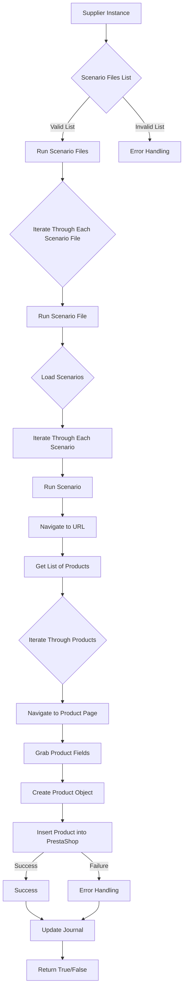

### **Анализ кода модуля `src.scenario`**

## Качество кода:

- **Соответствие стандартам**: 7/10
- **Плюсы**:
  - Документация содержит описание основных функций и компонентов модуля.
  - Приведена схема работы модуля в формате Mermaid.
  - Описан пример JSON-сценария.
- **Минусы**:
  - Отсутствуют примеры использования функций.
  - Нет четких указаний по обработке ошибок и логированию.
  - Описание функций не соответствует формату docstring.
  - В тексте используется смешение стилей оформления (например, в заголовках).

## Рекомендации по улучшению:

- Привести документацию в соответствие со стандартом Markdown, включая форматирование заголовков и списков.
- Добавить примеры использования основных функций, чтобы облегчить понимание их работы.
- Улучшить описание обработки ошибок и добавить информацию о логировании, используя `logger` из `src.logger`.
- Переформатировать описание функций в формат docstring, как указано в инструкции.
- Добавить информацию о зависимостях модуля.
- Перевести примеры на русский язык, где это необходимо.
- Уточнить, как модуль взаимодействует с базой данных PrestaShop, включая примеры запросов и обработки данных.
- Добавить информацию о том, как настраивается и используется объект настроек `s`.
- Унифицировать стиль текста, например, заменить `Ведение журнала` на `Ведение журнала выполнения`.
- Избегать сокращений типа `например` и заменять полными формами `например,`.

## Оптимизированный код:

```markdown
## Модуль `src.scenario`

### Обзор

Модуль `src.scenario` предназначен для автоматизации взаимодействия с поставщиками, используя сценарии, описанные в JSON-файлах. Он адаптирует процесс извлечения и обработки данных о товарах с веб-сайтов поставщиков и синхронизирует эту информацию с базой данных (например, PrestaShop). Модуль включает чтение сценариев, взаимодействие с веб-сайтами, обработку данных, ведение журнала выполнения и организацию всего процесса.

### Оглавление

* [Модуль `src.scenario`](#модуль-srcscenario)
* [Обзор](#обзор)
* [Основные функции модуля](#основные-функции-модуля)
* [Основные компоненты модуля](#основные-компоненты-модуля)
    * [`run_scenario_files(s, scenario_files_list)`](#run_scenario_files-s-scenario_files_list)
    * [`run_scenario_file(s, scenario_file)`](#run_scenario_file-s-scenario_file)
    * [`run_scenario(s, scenario)`](#run_scenario-s-scenario)
    * [`dump_journal(s, journal)`](#dump_journal-s-journal)
    * [`main()`](#main)
* [Пример сценария](#пример-сценария)
* [Как это работает](#как-это-работает)

### Основные функции модуля

1. **Чтение сценариев**: Загрузка сценариев из JSON-файлов, содержащих информацию о товарах и их URL на сайте поставщика.
2. **Взаимодействие с веб-сайтами**: Обработка URL-адресов из сценариев для извлечения данных о товарах.
3. **Обработка данных**: Преобразование извлеченных данных в формат, подходящий для базы данных, и сохранение в неё.
4. **Ведение журнала выполнения**: Ведение журнала с деталями выполнения сценариев и результатами работы для отслеживания процесса и выявления ошибок.



### Основные компоненты модуля

#### `run_scenario_files(s, scenario_files_list)`

**Описание**: Принимает список файлов сценариев и выполняет их по очереди, вызывая функцию `run_scenario_file` для каждого файла.

```python
def run_scenario_files(s, scenario_files_list: list) -> None:
    """
    Функция выполняет сценарии, указанные в списке файлов.

    Args:
        s: Объект настроек (например, для соединения с базой данных).
        scenario_files_list (list): Список путей к файлам сценариев.

    Returns:
        None

    Raises:
        FileNotFoundError: Если файл сценария не найден.
        JSONDecodeError: Если файл сценария содержит невалидный JSON.

    Example:
        >>> s = ... # Объект настроек
        >>> scenario_files_list = ['scenario1.json', 'scenario2.json']
        >>> run_scenario_files(s, scenario_files_list)
    """
    ...
```

#### `run_scenario_file(s, scenario_file)`

**Описание**: Загружает сценарии из указанного файла и вызывает `run_scenario` для каждого сценария в файле.

```python
def run_scenario_file(s, scenario_file: str) -> None:
    """
    Функция загружает сценарии из файла и выполняет их.

    Args:
        s: Объект настроек.
        scenario_file (str): Путь к файлу сценария.

    Returns:
        None

    Raises:
        FileNotFoundError: Если файл сценария не найден.
        JSONDecodeError: Если файл сценария содержит невалидный JSON.
        Exception: При любых других проблемах при работе со сценариями.

    Example:
        >>> s = ... # Объект настроек
        >>> scenario_file = 'scenario.json'
        >>> run_scenario_file(s, scenario_file)
    """
    ...
```

#### `run_scenario(s, scenario)`

**Описание**: Обрабатывает отдельный сценарий. Переходит по URL, извлекает данные о товарах и сохраняет их в базе данных.

```python
def run_scenario(s, scenario: dict) -> None:
    """
    Функция обрабатывает отдельный сценарий, извлекая данные о товарах и сохраняя их в базе данных.

    Args:
        s: Объект настроек.
        scenario (dict): Словарь, содержащий сценарий (например, с URL, категориями).

    Returns:
        None

    Raises:
        requests.exceptions.RequestException: Если есть проблемы с запросом к веб-сайту.
        Exception: При любых других проблемах в процессе обработки сценария.

    Example:
        >>> s = ... # Объект настроек
        >>> scenario = {
        ...     "url": "https://example.com/category/mineral-creams/",
        ...     "name": "минеральные+кремы",
        ...     "presta_categories": {
        ...         "default_category": 12345,
        ...         "additional_categories": [12346, 12347]
        ...     }
        ... }
        >>> run_scenario(s, scenario)
    """
    ...
```

#### `dump_journal(s, journal)`

**Описание**: Сохраняет журнал выполнения сценариев в файл для последующего анализа.

```python
def dump_journal(s, journal: list) -> None:
    """
    Функция сохраняет журнал выполнения сценариев в файл.

    Args:
        s: Объект настроек.
        journal (list): Список записей журнала выполнения.

    Returns:
        None

    Raises:
        Exception: При проблемах с записью в файл.

    Example:
        >>> s = ... # Объект настроек
        >>> journal = [...] # Список записей журнала
        >>> dump_journal(s, journal)
    """
    ...
```

#### `main()`

**Описание**: Основная функция для запуска модуля.

```python
def main() -> None:
    """
    Основная функция для запуска модуля.

    Args:
        None

    Returns:
        None

    Raises:
        Exception: При любых критических ошибках во время выполнения.

    Example:
        >>> main()
    """
    ...
```

### Пример сценария

Пример JSON-сценария, описывающий взаимодействие с категориями товаров на веб-сайте. Он содержит URL, название категории и идентификаторы категорий в базе данных PrestaShop.

```json
{
    "scenarios": {
        "минеральные+кремы": {
            "url": "https://example.com/category/mineral-creams/",
            "name": "минеральные+кремы",
            "presta_categories": {
                "default_category": 12345,
                "additional_categories": [12346, 12347]
            }
        }
    }
}
```

### Как это работает

Модуль загружает сценарии, извлекает данные с веб-сайтов, обрабатывает их и сохраняет в базе данных. Он ведёт журнал выполнения для отслеживания процесса и выявления ошибок. В целом, модуль автоматизирует взаимодействие с поставщиками, улучшая эффективность и надежность процесса.