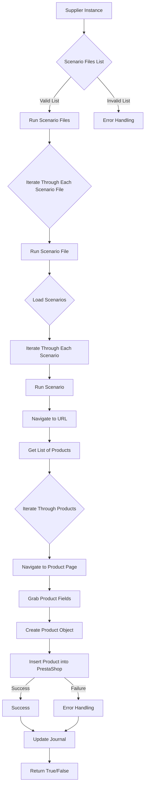

### **Анализ кода модуля `src.scenario`**

#### **Качество кода**:
- **Соответствие стандартам**: 7/10
- **Плюсы**:
    - Хорошее общее описание функциональности модуля.
    - Наличие структуры и оглавления.
    - Описание основных функций и компонентов модуля.
    - Использование Mermaid для визуализации workflow.
- **Минусы**:
    - Отсутствуют docstring в стиле `hypotez`.
    - Комментарии и описания на английском языке.
    - Нет указания на использование модуля логирования `src.logger`.
    - Не указаны импорты и зависимости.

#### **Рекомендации по улучшению**:
1.  **Перевод документации**:
    - Перевести все комментарии и описания на русский язык, используя кодировку UTF-8.
2.  **Добавление docstring**:
    - Добавить docstring к каждой функции и методу, описывая их назначение, аргументы, возвращаемые значения и возможные исключения. Использовать формат, принятый в `hypotez`.
3.  **Улучшение описаний**:
    - Сделать описания более конкретными и понятными. Избегать общих фраз, таких как "обрабатывает данные" или "взаимодействует с веб-сайтами". Вместо этого использовать точные термины, например, "извлекает данные о товарах", "выполняет HTTP-запросы к веб-сайтам поставщиков".
4.  **Зависимости и импорты**:
    - Указать все зависимости модуля и необходимые импорты.
5.  **Логирование**:
    - Добавить информацию о том, как используется модуль логирования `src.logger` для записи информации о ходе выполнения сценариев и возникающих ошибках.
6.  **Пример сценария**:
    - Добавить пример сценария с более подробным описанием каждого поля и его назначения.
7. **Единообразие**:
    - Привести код в соответствие со стандартами кодирования, принятыми в проекте `hypotez`.

#### **Оптимизированный код**:

```markdown
## \file src/suppliers/scenario/README.MD

# Модуль `src.scenario`

## Обзор

Модуль `src.scenario` предназначен для автоматизации взаимодействия с поставщиками с использованием сценариев, описанных в файлах JSON. Он оптимизирует процесс извлечения и обработки данных о товарах с веб-сайтов поставщиков и синхронизирует эту информацию с базой данных (например, PrestaShop). Модуль включает функциональность для чтения сценариев, взаимодействия с веб-сайтами, обработки данных, ведения журнала выполнения и организации всего рабочего процесса.

## Содержание

* [Модуль `src.scenario`](#модуль-srcscenario)
* [Обзор](#обзор)
* [Основные функции модуля](#основные-функции-модуля)
* [Основные компоненты модуля](#основные-компоненты-модуля)
    * [`run_scenario_files(s, scenario_files_list)`](#run_scenario_files-s-scenario_files_list)
    * [`run_scenario_file(s, scenario_file)`](#run_scenario_file-s-scenario_file)
    * [`run_scenario(s, scenario)`](#run_scenario-s-scenario)
    * [`dump_journal(s, journal)`](#dump_journal-s-journal)
    * [`main()`](#main)
* [Пример сценария](#пример-сценария)
* [Как это работает](#как-это-работает)

## Основные функции модуля

1. **Чтение сценариев**: Загрузка сценариев из файлов JSON, содержащих информацию о товарах и URL-адреса на веб-сайте поставщика.
2. **Взаимодействие с веб-сайтами**: Обработка URL-адресов из сценариев для извлечения данных о товарах.
3. **Обработка данных**: Преобразование извлеченных данных в формат, подходящий для базы данных, и сохранение их.
4. **Ведение журнала выполнения**: Ведение журналов с подробной информацией о выполнении сценариев и результатах для отслеживания прогресса и выявления ошибок.



## Основные компоненты модуля

### `run_scenario_files(s, scenario_files_list)`

**Описание**: Принимает список файлов сценариев и выполняет их последовательно, вызывая функцию `run_scenario_file` для каждого файла.

**Параметры**:
- `s`: Объект настроек (например, для подключения к базе данных).
- `scenario_files_list` (list): Список путей к файлам сценариев.

**Возвращает**:
- None

**Вызывает исключения**:
- `FileNotFoundError`: Если файл сценария не найден.
- `JSONDecodeError`: Если файл сценария содержит неверный JSON.

### `run_scenario_file(s, scenario_file)`

**Описание**: Загружает сценарии из указанного файла и вызывает `run_scenario` для каждого сценария в файле.

**Параметры**:
- `s`: Объект настроек.
- `scenario_file` (str): Путь к файлу сценария.

**Возвращает**:
- None

**Вызывает исключения**:
- `FileNotFoundError`: Если файл сценария не найден.
- `JSONDecodeError`: Если файл сценария содержит неверный JSON.
- `Exception`: При любых других проблемах во время выполнения сценария.

### `run_scenario(s, scenario)`

**Описание**: Обрабатывает отдельный сценарий, переходя по URL-адресу, извлекая данные о товаре и сохраняя их в базу данных.

**Параметры**:
- `s`: Объект настроек.
- `scenario` (dict): Словарь, содержащий сценарий (например, с URL-адресом и категориями).

**Возвращает**:
- None

**Вызывает исключения**:
- `requests.exceptions.RequestException`: Если есть проблемы с запросом к веб-сайту.
- `Exception`: При любых других проблемах во время обработки сценария.

### `dump_journal(s, journal)`

**Описание**: Сохраняет журнал выполнения в файл для последующего анализа.

**Параметры**:
- `s`: Объект настроек.
- `journal` (list): Список записей журнала выполнения.

**Возвращает**:
- None

**Вызывает исключения**:
- `Exception`: Если есть проблемы с записью в файл.

### `main()`

**Описание**: Основная функция для запуска модуля.

**Параметры**:
- None

**Возвращает**:
- None

**Вызывает исключения**:
- `Exception`: При любых критических ошибках во время выполнения.

## Пример сценария

Пример сценария JSON описывает взаимодействие с категориями товаров на веб-сайте. Он включает URL-адрес, название категории и идентификаторы категории в базе данных PrestaShop.

```json
{
    "scenarios": {
        "mineral+creams": {
            "url": "https://example.com/category/mineral-creams/",
            "name": "mineral+creams",
            "presta_categories": {
                "default_category": 12345,
                "additional_categories": [12346, 12347]
            }
        }
    }
}
```