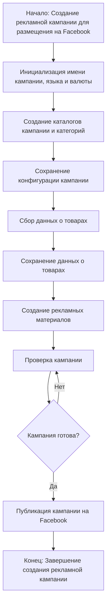

### **Анализ кода модуля `README.MD`**

**Качество кода**:
- **Соответствие стандартам**: 7/10
- **Плюсы**:
  - Четкое описание назначения модуля `campaign`.
  - Наличие блок-схем, визуализирующих основные процессы.
  - Подробное описание шагов процесса создания рекламной кампании.
- **Минусы**:
  - Отсутствие примеров использования кода.
  - Документация не соответствует формату docstring, принятому в Python.
  - Нет явного указания на связи с другими модулями проекта.

**Рекомендации по улучшению**:

1.  **Примеры использования**:
    - Добавить примеры использования основных функций и классов модуля `campaign`.
2.  **Формат документации**:
    - Перевести описание функций и классов в формат docstring, чтобы соответствовать стандартам оформления кода в Python.
3.  **Связность с другими модулями**:
    - Описать связи и зависимости модуля `campaign` с другими модулями проекта `hypotez`.
4.  **Унификация стиля**:
    - Убедиться, что все комментарии и описания в файле соответствуют русскому языку и формату UTF-8.
5.  **Детализация**:
    - Добавить детализацию по каждому шагу процесса, включая примеры кода и конфигураций.
6.  **Визуализация**:
    - Улучшить визуализацию процессов с помощью более подробных и интерактивных блок-схем.
7.  **Рекомендации по улучшению**:
    - Устранить неясные формулировки и заменить их на более точные и конкретные.

**Оптимизированный код**:

```rst
.. module:: src.suppliers.suppliers_list.aliexpress.campaign

Модуль `campaign`
=================

Модуль `campaign` предназначен для управления процессом создания и публикации рекламных кампаний на Facebook.
Он включает функциональность для инициализации параметров кампании (имя, язык, валюта), создания структуры каталогов,
сохранения конфигураций для новой кампании, сбора и сохранения данных о товарах через `ali` или `html`,
генерации рекламных материалов, проверки кампании и публикации ее на Facebook.

Пример использования
--------------------

>>> from src.suppliers.suppliers_list.aliexpress import campaign
>>> # Пример инициализации и запуска процесса подготовки кампании
>>> campaign_instance = campaign.AliCampaignEditor(campaign_name="SummerSale", language="ru", currency="RUB")
>>> campaign_instance.prepare_campaign()

Диаграмма процесса
------------------



-   **Шаг 1**: Начало - Процесс начинается.

-   **Шаг 2**: Инициализация деталей кампании - Определяются имя кампании, язык и валюта.
    Пример: Имя кампании: "Летняя распродажа", Язык: "Русский", Валюта: "RUB"

-   **Шаг 3**: Создание каталогов кампании и категорий - Создаются необходимые каталоги и файлы для кампании.
    Пример: Создается структура папок в файловой системе для хранения ресурсов кампании.

-   **Шаг 4**: Сохранение конфигурации кампании - Сохраненные детали кампании.
    Пример: Данные записываются в базу данных или файл конфигурации.

-   **Шаг 5**: Сбор данных о товарах - Собираются данные о товарах, которые будут продвигаться в рамках кампании.
    Пример: ID товаров, описания, изображения и цены извлекаются из системы инвентаризации.

-   **Шаг 6**: Сохранение данных о товарах - Собранные данные о товарах сохраняются.
    Пример: Данные записываются в таблицу базы данных, предназначенную для товаров кампании.

-   **Шаг 7**: Создание рекламных материалов - Создаются или выбираются графики, баннеры и другие рекламные ресурсы.
    Пример: Изображения и описания адаптируются для привлечения клиентов.

-   **Шаг 8**: Проверка кампании - Процесс проверки подтверждает готовность компонентов кампании.
    Пример: Человек или система оценивает качество и полноту всех компонентов кампании.

-   **Шаг 9**: Кампания готова? - Проверка, чтобы определить, является ли кампания полной и готовой к публикации.
    Пример: Логический флаг сигнализирует "Да", если все на месте, иначе "Нет", вызывая возврат к предыдущему шагу для исправления.

-   **Шаг 10**: Публикация кампании - Кампания запускается на платформе, готовая к маркетинговым усилиям.
    Пример: API-вызовы публикуют кампанию на соответствующей платформе.

-   **Шаг 11**: Конец - Процесс создания кампании завершен.

Редактирование кампании
-----------------------

```mermaid
graph LR
    A[Ввод пользователя: campaign_name, language, currency] --> B{AliCampaignEditor.__init__};
    B --> C[AliPromoCampaign.__init__];
    C --> D[Инициализация: конструктор AliCampaignEditor];
    D --> E[AliCampaignEditor];

    E --> F[delete_product: Проверка наличия партнерской ссылки];
    F --> G[read_text_file sources.txt: Чтение списка товаров];
    G --> H[Iterate & check product_id: Цикл по списку товаров];
    H -- Совпадение --> I[remove & save: Удаление товара, если найдено совпадение];
    H -- Нет совпадения --> J[rename product file: Переименование файла товара, если нет совпадения];

    E --> K[update_product: Обновление деталей товара];
    K --> L[Call dump_category_products_files: Обновление категории с новым товаром];

    E --> M[update_campaign: Обновление свойств кампании, таких как описание];
    M --> N[update campaign parameters: Обновление параметров кампании];

    E --> O[update_category: Обновление категории в JSON-файле];
    O --> P[j_loads JSON file: Чтение данных категории];
    P --> Q[Update category: Обновление данных категории];
    Q --> R[j_dumps JSON file: Запись обновленной категории в файл];

    E --> S[get_category: Получение категории по имени];
    S --> T[Check if category exists: Проверка существования категории];
    T -- Найдена --> U[Return SimpleNamespace: Возврат деталей категории];
    T -- Не найдена --> V[Log warning: Категория не найдена в кампании];

    E --> W[list_categories: Список всех категорий в кампании];
    W --> X[Check category attribute: Проверка наличия категорий в кампании];
    X -- Найдена --> Y[Return category list: Список имен категорий];
    X -- Не найдена --> Z[Log warning: Категории не найдены в кампании];

    E --> AA[get_category_products: Получение товаров для категории];
    AA --> AB[Get category path: Построение пути к товарам категории];
    AB --> AC[Get JSON filenames: Получение всех JSON-файлов товаров];
    AC --> AD[Read JSON files: Загрузка данных о товарах];
    AD --> AE[Create SimpleNamespace: Преобразование данных о товарах в объекты];
    AE --> AF[Return products: Возврат списка товаров];
    AC -- Нет JSON-файлов --> AG[Log error: Файлы не найдены];
    AG --> AH[Process category: Запуск подготовки товаров категории];

    E --> AI[Другие методы];

Подготовка кампании
--------------------

```mermaid
flowchart TD
    A[Начало] --> B{Обработать все кампании?}
    B -->|Да| C[Обработка всех кампаний]
    B -->|Нет| D[Обработка конкретной кампании]

    C --> E{Предоставлены язык и валюта?}
    E -->|Да| F[Обработка каждой кампании с предоставленным языком и валютой]
    E -->|Нет| G[Обработка всех локалей для каждой кампании]

    D --> H{Указаны категории?}
    H -->|Да| I[Обработка конкретных категорий для кампании]
    H -->|Нет| J[Обработка всей кампании]

    F --> K[Обработка категории кампании]
    G --> L[Обработка кампании для всех локалей]
    I --> K
    J --> L

    K --> M[Возврат]
    L --> M
```