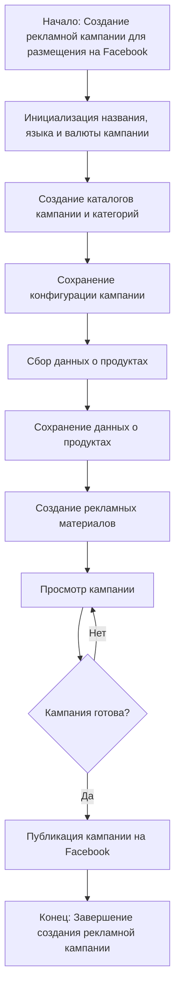
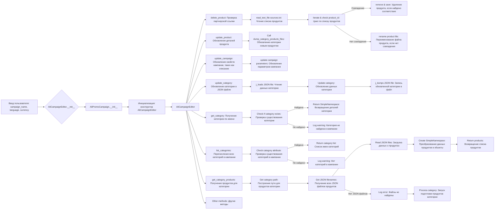

### **Анализ кода модуля `campaign`**

## \file /src/suppliers/suppliers_list/aliexpress/campaign/README.MD

#### **Качество кода**:

- **Соответствие стандартам**: 7/10
- **Плюсы**:
  - Наличие общей структуры и описания модуля.
  - Использование Mermaid для визуализации процессов.
  - Подробное описание шагов для каждой операции.
- **Минусы**:
  - Отсутствие примеров кода.
  - Не хватает подробных комментариев внутри кода.
  - Нет документации в формате Python docstrings для функций и классов.

#### **Рекомендации по улучшению**:

1. **Добавить docstring**:
   - Необходимо добавить docstring в формате Python для всех функций и классов.
   - Описать аргументы, возвращаемые значения и возможные исключения.

2. **Примеры использования**:
   - Добавить примеры использования для основных функций и классов.

3. **Комментарии в коде**:
   - Добавить комментарии, объясняющие сложные участки кода.

4. **Логирование**:
   - Добавить логирование для отслеживания процесса выполнения и ошибок.

5. **Форматирование**:
   - Улучшить форматирование в соответствии со стандартами PEP8.

#### **Оптимизированный код**:

```markdown
### Модуль `campaign`

```rst
.. module:: src.suppliers.suppliers_list.aliexpress.campaign
```

Модуль `campaign` предназначен для управления процессом создания и публикации рекламных кампаний на Facebook.
Он включает в себя функциональность для инициализации параметров кампании (имя, язык, валюта), создания структуры каталогов, сохранения конфигураций для новой кампании, сбора и сохранения данных о продуктах через `ali` или `html`, генерации рекламных материалов, просмотра кампании и публикации ее на Facebook.



- **Шаг 1**: Начало - Процесс начинается.

- **Шаг 2**: Инициализация деталей кампании - Определяются название, язык и валюта кампании. Пример: Название кампании: "Летняя распродажа", Язык: "Русский", Валюта: "USD"

- **Шаг 3**: Создание каталогов кампании и категорий - Создаются необходимые каталоги или файлы для кампании. Пример: Создается структура папок в файловой системе для хранения ресурсов кампании.

- **Шаг 4**: Сохранение конфигурации кампании - Сохраненяются инициализированные детали кампании. Пример: Данные записываются в базу данных или файл конфигурации.

- **Шаг 5**: Сбор данных о продуктах - Собираются данные, связанные с продуктами, которые будут продвигаться в рамках кампании. Пример: ID продукта, описания, изображения и цены извлекаются из системы инвентаризации.

- **Шаг 6**: Сохранение данных о продуктах - Сохраненяются собранные данные о продуктах. Пример: Данные записываются в таблицу базы данных, предназначенную для продуктов кампании.

- **Шаг 7**: Создание рекламных материалов - Создаются или выбираются графические элементы, баннеры и другие рекламные материалы. Пример: Изображения и описания адаптируются для привлечения клиентов.

- **Шаг 8**: Просмотр кампании - Процесс проверки подтверждает готовность компонентов кампании. Пример: Человек или система оценивает качество и полноту всех компонентов кампании.

- **Шаг 9**: Кампания готова? - Проверка, чтобы определить, является ли кампания полной и готовой к публикации. Пример: Логический флаг сигнализирует "Да", если все на месте, в противном случае "Нет", что вызывает возврат к предыдущему шагу для внесения исправлений.

- **Шаг 10**: Публикация кампании - Кампания становится активной на платформе и готова к маркетинговым усилиям. Пример: Вызываются API для публикации кампании на соответствующей платформе.

- **Шаг 11**: Конец - Процесс создания кампании завершен.

# Редактирование кампании



# Подготовка кампании

```mermaid
flowchart TD
    A[Начало] --> B{Обработать все кампании?}
    B -->|Да| C[Обработать все кампании]
    B -->|Нет| D[Обработать конкретную кампанию]
    
    C --> E{Указаны язык и валюта?}
    E -->|Да| F[Обработать каждую кампанию с указанным языком и валютой]
    E -->|Нет| G[Обработать все локали для каждой кампании]
    
    D --> H{Указаны категории?}
    H -->|Да| I[Обработать конкретные категории для кампании]
    H -->|Нет| J[Обработать всю кампанию]
    
    F --> K[Обработать категорию кампании]
    G --> L[Обработать кампанию для всех локалей]
    I --> K
    J --> L
    
    K --> M[Возврат]
    L --> M