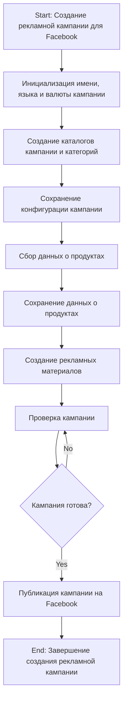
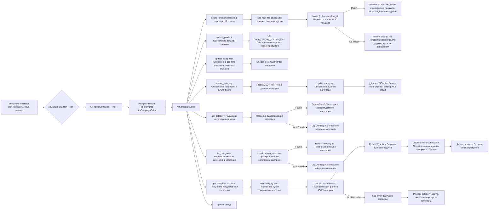

### **Анализ кода модуля `campaign`**

## \file /src/suppliers/suppliers_list/aliexpress/campaign/README.MD

Модуль `campaign` предназначен для управления процессом создания и публикации рекламных кампаний на Facebook. Он включает в себя функциональность для инициализации параметров кампании (имя, язык, валюта), создания структуры каталогов, сохранения конфигураций для новой кампании, сбора и сохранения данных о продуктах через `ali` или `html`, генерации рекламных материалов, проверки кампании и публикации ее на Facebook.

**Качество кода:**

- **Соответствие стандартам**: 7/10
- **Плюсы**:
  - Документация высокого уровня, описывающая назначение модуля и его основные этапы.
  - Использование Mermaid для визуализации рабочих процессов.
- **Минусы**:
  - Отсутствуют детали реализации и примеры кода, что затрудняет понимание и использование модуля.
  - Нет информации о зависимостях и интеграции с другими частями проекта `hypotez`.
  - Документация не соответствует формату, принятому в проекте `hypotez`

**Рекомендации по улучшению:**

1.  **Дополнить описание модуля**:
    - Добавить информацию о классах и функциях, используемых в модуле.
    - Описать взаимодействие с другими модулями проекта `hypotez`.
2.  **Добавить примеры использования**:
    - Привести примеры кода для основных этапов создания и публикации кампании.
3.  **Улучшить визуализацию**:
    - Добавить Mermaid-диаграммы для более подробного описания внутренних процессов модуля.
4.  **Привести документацию в соответствие со стандартами проекта**:
    - Использовать docstring для документирования функций и классов.
    - Описать аргументы, возвращаемые значения и возможные исключения.
    - Все комментарии и docstring должны быть на русском языке в формате UTF-8. Если в коде docsting на английском - сделай перевеод на русский
5.  **Логирование**:
    - Для логгирования Всегда Используй модуль logger из src.logger.logger.
    - Ошибки должны логироваться с использованием logger.error.

**Оптимизированный код:**

```markdown
```rst
.. module:: src.suppliers.suppliers_list.aliexpress.campaign
```

### `campaign`

Модуль предназначен для управления процессом создания и публикации рекламных кампаний на Facebook.

Модуль включает в себя функциональность для:

*   Инициализации параметров кампании (имя, язык, валюта).
*   Создания структуры каталогов.
*   Сохранения конфигураций для новой кампании.
*   Сбора и сохранения данных о продуктах через `ali` или `html`.
*   Генерации рекламных материалов.
*   Проверки кампании.
*   Публикации кампании на Facebook.


```mermaid
flowchart TD
    A[Start: Создание рекламной кампании для Facebook] --> B[Инициализация имени, языка и валюты кампании]
    B --> C[Создание каталогов кампании и категорий]
    C --> D[Сохранение конфигурации кампании]
    D --> E[Сбор данных о продуктах]
    E --> F[Сохранение данных о продуктах]
    F --> G[Создание рекламных материалов]
    G --> H[Проверка кампании]
    H --> I{Кампания готова?}
    I -- Yes --> J[Публикация кампании на Facebook]
    I -- No --> H
    J --> K[End: Завершение создания рекламной кампании]
```

**Основные этапы процесса:**

1.  **Начало**: Процесс начинается.
2.  **Инициализация деталей кампании**: Определяются имя, язык и валюта кампании.
    *   Пример: Имя кампании: "Летняя распродажа", Язык: "Русский", Валюта: "RUB".
3.  **Создание каталогов кампании и категорий**: Создаются необходимые каталоги и файлы для кампании.
    *   Пример: Создается структура папок в файловой системе для хранения ресурсов кампании.
4.  **Сохранение конфигурации кампании**: Сохраненные детали кампании.
    *   Пример: Данные записываются в базу данных или файл конфигурации.
5.  **Сбор данных о продуктах**: Собираются данные о продуктах, которые будут продвигаться в кампании.
    *   Пример: ID продуктов, описания, изображения и цены извлекаются из системы инвентаризации.
6.  **Сохранение данных о продуктах**: Сохраненные данные о продуктах.
    *   Пример: Данные записываются в таблицу базы данных, предназначенную для продуктов кампании.
7.  **Создание рекламных материалов**: Создаются или выбираются графика, баннеры и другие рекламные ресурсы.
    *   Пример: Изображения и описания адаптируются для привлечения клиентов.
8.  **Проверка кампании**: Процесс проверки подтверждает готовность компонентов кампании.
    *   Пример: Человек или система оценивает качество и полноту всех компонентов кампании.
9.  **Кампания готова?**: Проверка, чтобы определить, завершена ли кампания и готова ли к публикации.
    *   Пример: Логический флаг сигнализирует "Да", если все на месте, в противном случае "Нет", вызывая возврат к предыдущему шагу для внесения исправлений.
10. **Публикация кампании**: Кампания публикуется на платформе и готова к маркетинговым усилиям.
    *   Пример: Выполняются вызовы API для публикации кампании на соответствующей платформе.
11. **Конец**: Процесс создания кампании завершен.

# Редактирование кампании


```mermaid
graph LR
        A[Ввод пользователя: имя_кампании, язык, валюта] --> B{AliCampaignEditor.__init__};
        B --> C[AliPromoCampaign.__init__];
        C --> D[Инициализация: конструктор AliCampaignEditor];
        D --> E[AliCampaignEditor];

        E --> F[delete_product: Проверка партнерской ссылки];
        F --> G[read_text_file sources.txt: Чтение списка продуктов];
        G --> H[Iterate & check product_id: Перебор и проверка ID продукта];
        H -- Match --> I[remove & save: Удаление и сохранение продукта, если найдено совпадение];
        H -- No Match --> J[rename product file: Переименование файла продукта, если нет совпадения];

        E --> K[update_product: Обновление деталей продукта];
        K --> L[Call dump_category_products_files: Обновление категории с новым продуктом];

        E --> M[update_campaign: Обновление свойств кампании, таких как описание];
        M --> N[Обновление параметров кампании];

        E --> O[update_category: Обновление категории в JSON-файле];
        O --> P[j_loads JSON file: Чтение данных категории];
        P --> Q[Update category: Обновление данных категории];
        Q --> R[j_dumps JSON file: Запись обновленной категории в файл];

        E --> S[get_category: Получение категории по имени];
        S --> T[Проверка существования категории];
        T -- Found --> U[Return SimpleNamespace: Возврат деталей категории];
        T -- Not Found --> V[Log warning: Категория не найдена в кампании];

        E --> W[list_categories: Перечисление всех категорий в кампании];
        W --> X[Check category attribute: Проверка наличия категорий в кампании];
        X -- Found --> Y[Return category list: Перечисление имен категорий];
        X -- Not Found --> Z[Log warning: Категории не найдены в кампании];

        E --> AA[get_category_products: Получение продуктов для категории];
        AA --> AB[Get category path: Построение пути к продуктам категории];
        AB --> AC[Get JSON filenames: Получение всех файлов JSON продукта];
        AC --> AD[Read JSON files: Загрузка данных продукта];
        AD --> AE[Create SimpleNamespace: Преобразование данных продукта в объекты];
        AE --> AF[Return products: Возврат списка продуктов];
        AC -- No JSON files --> AG[Log error: Файлы не найдены];
        AG --> AH[Process category: Запуск подготовки продукта категории];

        E --> AI[Другие методы];

```

# Подготовка кампании

```mermaid
flowchart TD
    A[Start] --> B{Обработать все кампании?}
    B -->|Yes| C[Обработка всех кампаний]
    B -->|No| D[Обработка конкретной кампании]

    C --> E{Указан язык и валюта?}
    E -->|Yes| F[Обработка каждой кампании с указанным языком и валютой]
    E -->|No| G[Обработка всех локалей для каждой кампании]

    D --> H{Указаны категории?}
    H -->|Yes| I[Обработка конкретных категорий для кампании]
    H -->|No| J[Обработка всей кампании]

    F --> K[Обработка категории кампании]
    G --> L[Обработка кампании для всех локалей]
    I --> K
    J --> L

    K --> M[Return]
    L --> M