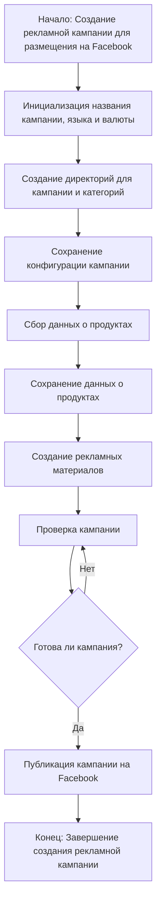

### **Анализ кода модуля `campaign`**

#### **Качество кода:**
- **Соответствие стандартам**: 7/10
- **Плюсы**:
    - Документация модуля предоставляет общее описание назначения модуля `campaign`.
    - Наличие блок-схемы в формате Mermaid помогает визуализировать процесс создания рекламной кампании.
- **Минусы**:
    - Отсутствует подробное описание каждого этапа процесса создания рекламной кампании.
    - Нет информации о зависимостях модуля от других частей проекта `hypotez`.
    - Документация не соответствует формату docstring, принятому в проекте.

#### **Рекомендации по улучшению:**
1.  **Документирование каждого этапа**:
    - Добавить подробное описание каждого этапа процесса создания рекламной кампании, включая используемые функции и классы.
    - Указать входные и выходные данные для каждого этапа.
2.  **Описание зависимостей**:
    - Явно указать зависимости модуля `campaign` от других модулей и классов проекта `hypotez`.
    - Описать, как модуль взаимодействует с другими частями проекта.
3.  **Приведение документации к формату docstring**:
    - Переписать документацию в формате docstring, как указано в системных инструкциях.
    - Добавить описание аргументов, возвращаемых значений и возможных исключений для каждой функции и класса.
4.  **Актуализация блок-схемы**:
    - Убедиться, что блок-схема отражает актуальное состояние модуля.
    - Добавить детализацию блок-схемы, чтобы она более точно соответствовала процессу создания рекламной кампании.
5.  **Использовать docstring для описания модуля**:
    - Добавить docstring в начале файла модуля, описывающий его назначение, основные классы и функции, а также примеры использования.

#### **Оптимизированный код:**

```python
"""
Модуль `campaign` предназначен для управления процессом создания и публикации 
рекламных кампаний на Facebook.
==========================================================================

Модуль включает функционал для инициализации параметров кампании (название, язык, валюта), 
создания структуры директорий, сохранения конфигураций для новой кампании, 
сбора и сохранения данных о продуктах через `ali` или `html`, 
генерации рекламных материалов, проверки кампании и публикации ее на Facebook.

Пример использования:
----------------------
>>> from src.suppliers.suppliers_list.aliexpress import campaign
>>> # Пример создания и публикации кампании (код будет добавлен позже)
>>> pass
"""

### `campaign`
# Описание:
# Модуль `campaign` предназначен для управления процессом создания и публикации рекламных кампаний на Facebook.
# Он включает функционал для инициализации параметров кампании (название, язык, валюта), создания структуры директорий,
# сохранения конфигураций для новой кампании, сбора и сохранения данных о продуктах через `ali` или `html`,
# генерации рекламных материалов, проверки кампании и публикации ее на Facebook.


```mermaid
flowchart TD
    A[Начало: Создание рекламной кампании для размещения на Facebook] --> B[Инициализация названия кампании, языка и валюты]
    B --> C[Создание директорий для кампании и категорий]
    C --> D[Сохранение конфигурации кампании]
    D --> E[Сбор данных о продуктах]
    E --> F[Сохранение данных о продуктах]
    F --> G[Создание рекламных материалов]
    G --> H[Проверка кампании]
    H --> I{Готова ли кампания?}
    I -- Да --> J[Публикация кампании на Facebook]
    I -- Нет --> H
    J --> K[Конец: Завершение создания рекламной кампании]
```