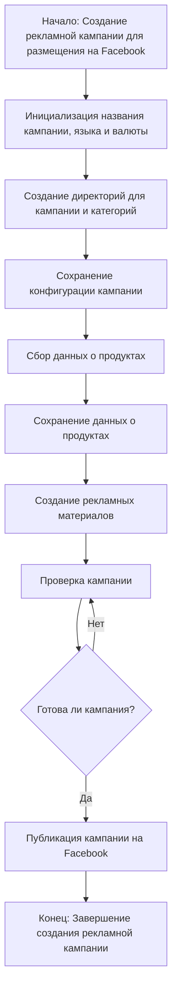

### **Анализ кода модуля `campaign`**

#### **Качество кода**:
- **Соответствие стандартам**: 7/10
- **Плюсы**:
    - Предоставлено четкое описание модуля и его назначения.
    - Имеется визуализация процесса в виде блок-схемы.
- **Минусы**:
    - Отсутствует подробное описание каждого этапа процесса.
    - Нет примеров кода или конфигураций, которые могли бы быть полезны для понимания работы модуля.
    - Не указаны конкретные инструменты или библиотеки, используемые для взаимодействия с Facebook.

#### **Рекомендации по улучшению**:
1. **Дополнить описание этапов процесса**:
   - Добавить подробное описание каждого этапа, указанного в блок-схеме. Например, описать, какие данные собираются на этапе "Сбор данных о продуктах", какие рекламные материалы создаются и т.д.

2. **Добавить примеры кода и конфигураций**:
   - Привести примеры кода для инициализации кампании, сбора данных и публикации на Facebook.
   - Добавить примеры конфигурационных файлов, используемых модулем.

3. **Указать используемые инструменты и библиотеки**:
   - Перечислить конкретные инструменты и библиотеки, используемые для работы с Facebook (например, Facebook API, Selenium и т.д.).

4. **Добавить информацию об обработке ошибок**:
   - Описать, как модуль обрабатывает ошибки на каждом этапе процесса.

5. **Привести примеры использования модуля**:
   - Добавить примеры использования модуля для создания и публикации рекламных кампаний.

#### **Оптимизированный код**:
```markdown
### `campaign`

**Описание**:
Модуль `campaign` предназначен для автоматизации процесса создания и публикации рекламных кампаний на Facebook.
Он включает функционал для инициализации параметров кампании (название, язык, валюта),
создания структуры директорий, сохранения конфигураций, сбора и сохранения данных о продуктах через `ali` или `html`,
генерации рекламных материалов, проверки кампании и публикации ее на Facebook.

**Этапы процесса**:
1. **Инициализация параметров кампании**:
   - Задание названия кампании, выбор языка и валюты.
   - Пример кода:
     ```python
     campaign_name = 'SummerSale2024'
     language = 'ru_RU'
     currency = 'RUB'
     ```

2. **Создание структуры директорий**:
   - Создание директорий для хранения конфигураций, данных о продуктах и рекламных материалов.
   - Пример структуры:
     ```
     campaign/
     ├── config/
     ├── data/
     │   ├── ali/
     │   └── html/
     └── ads/
     ```

3. **Сохранение конфигурации кампании**:
   - Сохранение параметров кампании в конфигурационном файле.
   - Пример конфигурационного файла (`config.json`):
     ```json
     {
       "campaign_name": "SummerSale2024",
       "language": "ru_RU",
       "currency": "RUB",
       "data_source": "ali"
     }
     ```

4. **Сбор данных о продуктах**:
   - Сбор данных о продуктах с использованием `ali` или `html` парсинга.
   - Пример кода:
     ```python
     # Пример сбора данных с использованием ali
     product_data = ali.get_products(campaign_name)
     ```

5. **Сохранение данных о продуктах**:
   - Сохранение собранных данных о продуктах в формате JSON или CSV.
   - Пример кода:
     ```python
     save_text_file(f'campaign/data/{campaign_name}_products.json', product_data)
     ```

6. **Создание рекламных материалов**:
   - Генерация рекламных материалов на основе данных о продуктах.
   - Пример кода:
     ```python
     ads = generate_ads(product_data)
     ```

7. **Проверка кампании**:
   - Проверка соответствия рекламных материалов требованиям Facebook.
   - Пример кода:
     ```python
     is_valid = validate_campaign(ads)
     ```

8. **Публикация кампании на Facebook**:
   - Публикация кампании на Facebook с использованием Facebook API.
   - Пример кода:
     ```python
     publish_campaign(ads)
     ```

**Визуализация процесса**:

