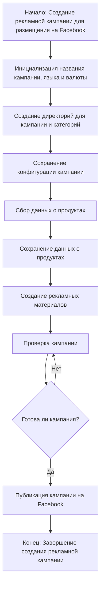

### **Анализ кода модуля `campaign`**

**Качество кода**:
- **Соответствие стандартам**: 7/10
- **Плюсы**:
  - Наличие блок-схемы, описывающей логику работы модуля.
  - Описание основных этапов создания рекламной кампании.
- **Минусы**:
  - Отсутствует подробное описание каждой функции и класса в модуле.
  - Нет примеров использования основных функций и классов.
  - Не указаны зависимости модуля.

**Рекомендации по улучшению**:

1.  **Добавить подробное описание модуля**:
    - В начале файла добавить docstring, описывающий назначение модуля, основные классы и функции.
    - Указать зависимости модуля.
    - Добавить примеры использования основных функций и классов.

2.  **Документировать каждую функцию и класс**:
    - Для каждой функции и класса добавить docstring, описывающий входные параметры, возвращаемые значения, возможные исключения и примеры использования.
    - Использовать аннотации типов для параметров и возвращаемых значений.

3.  **Добавить обработку ошибок**:
    - Предусмотреть обработку возможных исключений в коде и логировать ошибки с помощью `logger.error`.

4.  **Рекомендации по стилю кода**:
    - Использовать только одинарные кавычки (`'`) в Python-коде.
    - Добавлять пробелы вокруг оператора присваивания (`=`).

**Оптимизированный код**:

```python
"""
Модуль `campaign` предназначен для управления процессом создания и публикации
рекламных кампаний на Фейсбук.
==========================================================================

Модуль включает функционал для инициализации параметров кампании (название, язык, валюта),
создания структуры директорий, сохранения конфигураций для новой кампании,
сбора и сохранения данных о продуктах через `ali` или `html`,
генерации рекламных материалов, проверки кампании и публикации ее на Facebook.

Пример использования:
----------------------

>>> from src.suppliers.suppliers_list.aliexpress.campaign import campaign
>>> campaign.create_campaign(campaign_name='test_campaign', language='ru', currency='RUB')

Зависимости:
    - src.logger
    - src.utils
"""

### `campaign`
**Описание**:
Модуль `campaign` предназначен для управления процессом создания и публикации
рекламных кампаний на Фейсбук.
Он включает функционал для инициализации параметров кампании (название, язык, валюта),
создания структуры директорий, сохранения конфигураций для новой кампании,
сбора и сохранения данных о продуктах через `ali` или `html`,
генерации рекламных материалов, проверки кампании и публикации ее на Facebook.

