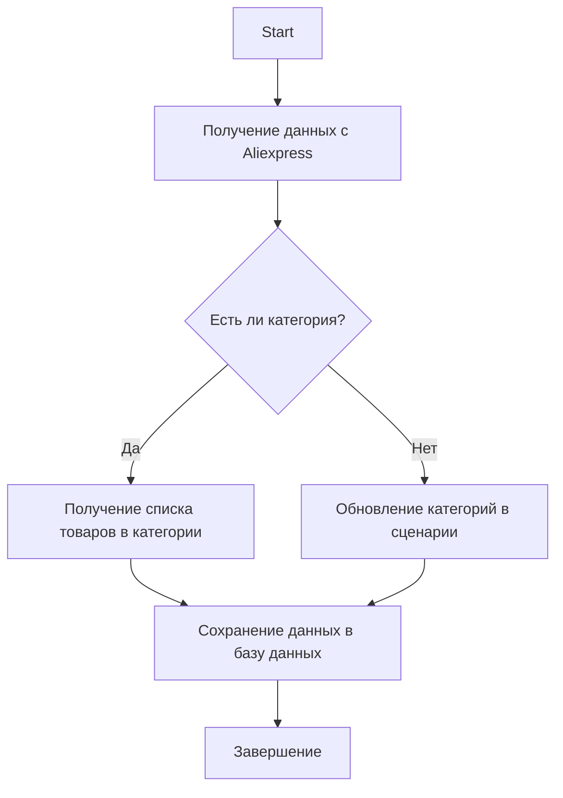

### **Анализ кода модуля `category.ru.md`**

## \file /hypotez/src/suppliers/suppliers_list/aliexpress/category.ru.md

#### **Качество кода**:

- **Соответствие стандартам**: 7/10
- **Плюсы**:
    - Наличие общей структуры и описания модуля.
    - Примеры использования функций и класса.
    - Описание основных функций и класса `DBAdaptor`.
    - Наличие информации о зависимостях и логировании.
    - Наличие блок-схемы, описывающей логику работы.
- **Минусы**:
    - Отсутствуют примеры возвращаемых значений для функций в разделе "Пример использования".
    - Не указаны типы данных для аргументов и возвращаемых значений в описании функций и методов класса `DBAdaptor`.
    - Описание установки зависимостей недостаточно подробное, не хватает конкретных шагов.
    - Слишком общее описание операций с базой данных, отсутствует конкретика по полям и структуре таблиц.
    - Нет примеров использования логирования.
    - Использование тройных кавычек в Markdown-файле для обозначения кода может быть заменено на стандартные блоки кода Markdown.

#### **Рекомендации по улучшению**:

1.  **Дополнить примеры использования**:
    - Добавить примеры возвращаемых значений для функций в разделе "Пример использования", чтобы показать, какие данные можно ожидать получить.
2.  **Указать типы данных**:
    - В описании функций и методов класса `DBAdaptor` указать типы данных для аргументов и возвращаемых значений.
3.  **Детализировать описание установки зависимостей**:
    - Предоставить конкретные шаги по установке зависимостей, например, команды `pip install`.
4.  **Конкретизировать описание операций с базой данных**:
    - Добавить конкретики по полям и структуре таблиц, с которыми работает класс `DBAdaptor`.
5.  **Добавить примеры использования логирования**:
    - Показать примеры использования `logger.info`, `logger.error` и других методов логирования.
6.  **Использовать стандартные блоки кода Markdown**:
    - Заменить тройные кавычки для обозначения кода на стандартные блоки кода Markdown (```).
7.  **Добавить информацию об авторе и лицензии**:
    - Указать автора модуля и информацию о лицензии.
8.  **Улучшить описание возвращаемых значений**:
    - Сделать описание возвращаемых значений более конкретным, указав, что именно возвращает функция в различных ситуациях.

#### **Оптимизированный код**:

```markdown
                # Модуль управления категориями Aliexpress

Модуль предоставляет функциональность для работы с категориями товаров на платформе Aliexpress. Он включает функции для получения ссылок на товары в категории, обновления категорий на основе данных с сайта и операций с базой данных.

## Описание модуля

Модуль предназначен для управления категориями товаров на Aliexpress. Он включает в себя следующие ключевые функции:

- Получение списка товаров из категории.
- Обновление категорий в сценарии на основе данных с сайта.
- Операции с базой данных для работы с категориями.



## Пример использования

### Получение списка товаров из категории

```python
# Пример использования функции get_list_products_in_category
products = get_list_products_in_category(supplier)
# Пример: products = ['url1', 'url2', ...]
```

### Обновление категорий в файле сценария

```python
# Пример использования функции update_categories_in_scenario_file
updated = update_categories_in_scenario_file(supplier, "scenario_file.json")
# Пример: updated = True
```

### Операции с базой данных

```python
# Пример использования DBAdaptor для операций с базой данных
db = DBAdaptor()
db.select(cat_id=123)
db.insert()
db.update()
db.delete()
```

## Функции модуля

### `get_list_products_in_category(s: Supplier) -> list[str]`

Считывает URL товаров со страницы категории. Если есть несколько страниц с товарами, функция будет перелистывать все страницы.

**Аргументы:**

- `s` (`Supplier`): Экземпляр поставщика.

**Возвращает:**

- (`list[str]`): Список URL продуктов в категории.

### `get_prod_urls_from_pagination(s: Supplier) -> list[str]`

Собирает ссылки на товары с страницы категории с перелистыванием страниц.

**Аргументы:**

- `s` (`Supplier`): Экземпляр поставщика.

**Возвращает:**

- (`list[str]`): Список ссылок на товары.

### `update_categories_in_scenario_file(s: Supplier, scenario_filename: str) -> bool`

Проверяет изменения категорий на сайте и обновляет файл сценария.

**Аргументы:**

- `s` (`Supplier`): Экземпляр поставщика.
- `scenario_filename` (`str`): Имя файла сценария для обновления.

**Возвращает:**

- (`bool`): `True`, если обновление прошло успешно, `False` в противном случае.

### `get_list_categories_from_site(s: Supplier, scenario_file: str, brand: str = '') -> list[str]`

Получает список категорий с сайта на основе файла сценария.

**Аргументы:**

- `s` (`Supplier`): Экземпляр поставщика.
- `scenario_file` (`str`): Имя файла сценария.
- `brand` (`str`, optional): Опциональное имя бренда.

**Возвращает:**

- (`list[str]`): Список категорий.

### Класс `DBAdaptor`

Предоставляет методы для выполнения операций с базой данных, таких как `SELECT`, `INSERT`, `UPDATE` и `DELETE`.

**Методы:**

- `select(cat_id: int, parent_id: int, project_cat_id: int) -> list[tuple]`: Выбирает записи из базы данных.
- `insert() -> None`: Вставляет новые записи в базу данных.
- `update() -> None`: Обновляет записи в базе данных.
- `delete() -> None`: Удаляет записи из базы данных.

## Установка

Для работы с модулем необходимо установить зависимые пакеты, такие как `requests`, а также настроить соединение с базой данных через `gs.db_translations_credentials`.

### Зависимости:

- `requests`
- `src.utils.jjson`
- `src.db.manager_categories.suppliers_categories`

Для установки зависимостей выполните:

```bash
pip install requests
```

## Логирование

В модуле используется логирование через `src.logger`, которое помогает отслеживать ошибки и события в процессе выполнения.

Пример использования:

```python
from src.logger import logger

logger.info("Модуль начал работу")
try:
    # какой-то код
    pass
except Exception as ex:
    logger.error("Произошла ошибка", ex, exc_info=True)
```

## Автор

Модуль разработан для внутреннего использования в проекте.

Автор: [Укажите имя автора]

Лицензия: [Укажите тип лицензии]