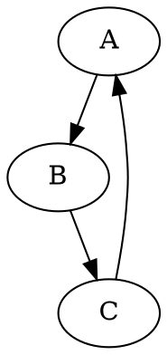

### **Анализ кода модуля `src.utils.convertors.dot`**

## \file /src/utils/convertors/dot.py
# -*- coding: utf-8 -*-
#! .pyenv/bin/python3

"""
Модуль для конвертации DOT файлов в PNG изображения с использованием библиотеки Graphviz
=======================================================================================
"""

#### **Качество кода**:
- **Соответствие стандартам**: 7/10
- **Плюсы**:
  - Четкое разделение ответственности: функция `dot2png` выполняет конкретную задачу - конвертацию DOT в PNG.
  - Обработка исключений: предусмотрена обработка `FileNotFoundError` и общих исключений `Exception`.
  - Наличие примера использования в docstring.
- **Минусы**:
  - Не используется модуль `logger` для логирования ошибок.
  - В блоке `except` используется `print` вместо `logger.error`.
  - Отсутствуют аннотации типов для переменных `dot_content`, `source`, `input_dot_file`, `output_png_file`.
  - Нет проверки существования Graphviz.

#### **Рекомендации по улучшению**:
1. **Использовать `logger`**:
   - Заменить `print` на `logger.error` для вывода сообщений об ошибках.

2. **Добавить аннотации типов**:
   - Указать типы для всех переменных.

3. **Добавить проверку Graphviz**:
   - Добавить проверку наличия Graphviz перед конвертацией.

4. **Улучшить docstring**:
   - Перевести docstring на русский язык.
   - Улучшить описание исключений, которые могут быть выброшены.

5. **Улучшить обработку ошибок**:
   - Логировать ошибки с использованием `logger.error` с передачей исключения `ex` и `exc_info=True`.

#### **Оптимизированный код**:

```python
## \file /src/utils/convertors/dot.py
# -*- coding: utf-8 -*-

#! .pyenv/bin/python3

"""
Модуль для конвертации DOT файлов в PNG изображения с использованием библиотеки Graphviz.
=======================================================================================

Модуль содержит функцию :func:`dot2png`, которая преобразует DOT файлы в PNG изображения.

Пример использования:
----------------------

>>> dot2png('example.dot', 'output.png')

Этот код преобразует DOT файл 'example.dot' в PNG изображение 'output.png'.

Содержимое sample DOT файла ('example.dot'):



Для запуска скрипта из командной строки:

```bash
python dot2png.py example.dot output.png
```

Эта команда создаст PNG файл 'output.png' из графа, определенного в 'example.dot'.
"""

import sys
from graphviz import Source
from src.logger import logger  # Импортируем logger

def dot2png(dot_file: str, png_file: str) -> None:
    """
    Преобразует DOT файл в PNG изображение.

    Args:
        dot_file (str): Путь к входному DOT файлу.
        png_file (str): Путь, куда будет сохранено выходное PNG изображение.

    Raises:
        FileNotFoundError: Если DOT файл не существует.
        Exception: При других ошибках во время конвертации.

    """
    try:
        # Функция открывает DOT файл
        with open(dot_file, 'r') as f:
            dot_content: str = f.read() # Функция считывает содержимое DOT файла

        # Функция создает объект Source из содержимого DOT файла
        source: Source = Source(dot_content)

        # Функция устанавливает формат выходного файла в PNG
        source.format = 'png'
        # Функция визуализирует DOT контент в PNG файл
        source.render(png_file, cleanup=True)
    except FileNotFoundError as ex:
        logger.error(f"Файл \'{dot_file}\' не найден.", ex, exc_info=True) # Логируем ошибку отсутствия файла
        raise
    except Exception as ex:
        logger.error(f"Произошла ошибка во время конвертации: {ex}", ex, exc_info=True) # Логируем общую ошибку
        raise


if __name__ == "__main__":
    if len(sys.argv) != 3:
        print("Использование: python dot2png.py <input_dot_file> <output_png_file>")
        sys.exit(1)

    input_dot_file: str = sys.argv[1] # Извлекает путь к входному DOT файлу из аргументов командной строки
    output_png_file: str = sys.argv[2] # Извлекает путь к выходному PNG файлу из аргументов командной строки

    dot2png(input_dot_file, output_png_file) # Функция вызывает конвертацию DOT файла в PNG