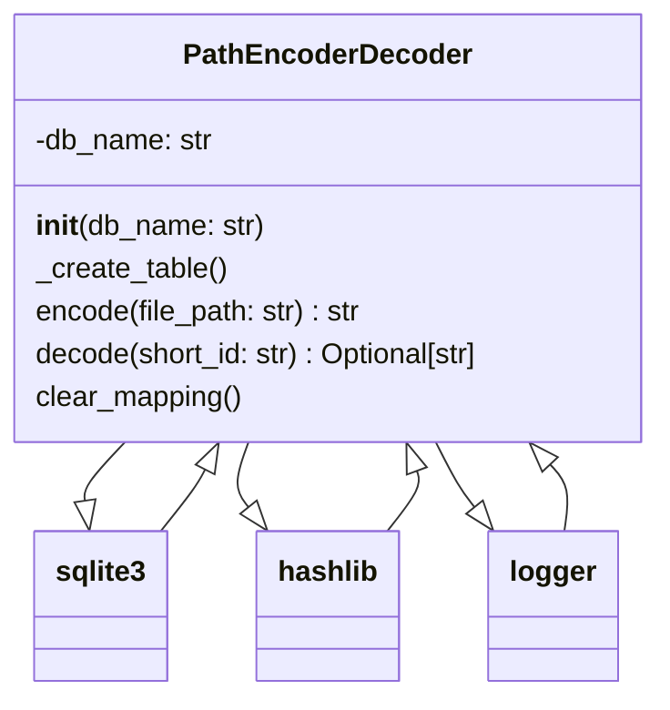

### **Анализ кода модуля `encoder_decoder_file_names.ru.md`**

## \\file hypotez/toolbox/encoder_decoder_file_names.ru.md

**1. Блок-схема**:

```mermaid
graph LR
    A[Начало] --> B{Инициализация PathEncoderDecoder}
    B --> C{_create_table()}
    C --> D{Создание таблицы path_mapping если её нет}
    D -- Да --> E[conn.commit()]
    D -- Нет --> E
    E --> F{encode(file_path)}
    F --> G[Вычисление MD5-хэша]
    G --> H[Сохранение в БД]
    H --> I{decode(short_id)}
    I --> J[Поиск file_path в БД по short_id]
    J -- Найдено --> K[Возврат file_path]
    J -- Не найдено --> L[Возврат None]
    K --> M[Конец]
    L --> M
```

**Примеры для логических блоков**:

- **Инициализация PathEncoderDecoder**:
  ```python
  encoder_decoder = PathEncoderDecoder(db_name='test.db')
  ```
- **Создание таблицы path_mapping если её нет**: Создает таблицу с полями `id` и `file_path` в базе данных SQLite.
- **Вычисление MD5-хэша**:
  ```python
  short_id = 'id-' + hashlib.md5(file_path.encode('utf-8')).hexdigest()[:8]
  ```
- **Сохранение в БД**: Запись `short_id` и `file_path` в таблицу `path_mapping`.
- **Поиск file_path в БД по short_id**:
  ```python
  cursor.execute("SELECT file_path FROM path_mapping WHERE id = ?", (short_id,))
  ```
- **Возврат file_path**: Если `short_id` найден, возвращает соответствующий `file_path`.
- **Возврат None**: Если `short_id` не найден, возвращает `None`.

**2. Диаграмма**:



**Объяснение зависимостей**:

- `PathEncoderDecoder`: Основной класс, который кодирует и декодирует пути файлов.
- `sqlite3`: Используется для взаимодействия с базой данных SQLite, где хранятся соответствия между короткими идентификаторами и полными путями файлов.
- `hashlib`: Используется для создания MD5-хэшей из путей файлов для получения коротких идентификаторов.
- `logger`: Используется для логирования информации, предупреждений и ошибок.

**3. Объяснение**:

- **Импорты**:
  - `typing.Optional`: Используется для указания, что функция может возвращать либо строку, либо `None`.
  - `hashlib`: Используется для создания MD5-хэшей для кодирования путей файлов.
  - `sqlite3`: Используется для работы с базой данных SQLite, в которой хранятся соответствия между полными путями файлов и их короткими идентификаторами.
  - `src.logger.logger`: Используется для логирования операций кодирования, декодирования и ошибок.
- **Классы**:
  - `PathEncoderDecoder`:
    - Роль: Предоставляет методы для кодирования полных путей файлов в короткие идентификаторы и их обратного декодирования.
    - Атрибуты:
      - `db_name` (str): Имя базы данных SQLite. По умолчанию `'path_mapping.db'`.
    - Методы:
      - `__init__(self, db_name: str = 'path_mapping.db')`: Инициализирует экземпляр класса, устанавливает имя базы данных и создает таблицу `path_mapping`, если она не существует.
      - `_create_table(self)`: Создает таблицу `path_mapping` в базе данных, если она не существует. Содержит поля `id` (TEXT PRIMARY KEY) и `file_path` (TEXT NOT NULL).
      - `encode(self, file_path: str) -> str`: Кодирует полный путь файла в короткий идентификатор (8 символов от MD5-хэша). Сохраняет соответствие в базе данных. Возвращает короткий идентификатор.
      - `decode(self, short_id: str) -> Optional[str]`: Декодирует короткий идентификатор в полный путь файла. Ищет соответствие в базе данных. Возвращает полный путь файла или `None`, если идентификатор не найден.
      - `clear_mapping(self)`: Очищает все записи в базе данных.
- **Функции**:
  - `__init__`: Конструктор класса, инициализирует базу данных и создает таблицу.
  - `_create_table`: Создает таблицу в базе данных для хранения соответствий между идентификаторами и путями файлов.
  - `encode`: Кодирует путь файла в короткий идентификатор, используя MD5-хэш.
    - Аргументы:
      - `file_path` (str): Полный путь к файлу.
    - Возвращаемое значение:
      - `str`: Короткий идентификатор.
    - Пример:
      ```python
      encoder_decoder = PathEncoderDecoder()
      encoded_path = encoder_decoder.encode('src/my_folder/my_file.txt')
      print(encoded_path)  # Вывод: id-9f8e7d6c (пример)
      ```
  - `decode`: Декодирует короткий идентификатор в путь файла.
    - Аргументы:
      - `short_id` (str): Короткий идентификатор.
    - Возвращаемое значение:
      - `Optional[str]`: Полный путь к файлу или `None`, если идентификатор не найден.
    - Пример:
      ```python
      encoder_decoder = PathEncoderDecoder()
      decoded_path = encoder_decoder.decode('id-9f8e7d6c')
      print(decoded_path)  # Вывод: src/my_folder/my_file.txt
      ```
  - `clear_mapping`: Очищает все записи в базе данных.
- **Переменные**:
  - `db_name`: Имя базы данных SQLite. Тип: `str`.
  - `short_id`: Короткий идентификатор, полученный из MD5-хэша. Тип: `str`.
  - `file_path`: Полный путь к файлу. Тип: `str`.
  - `conn`: Объект подключения к базе данных SQLite. Тип: `sqlite3.Connection`.
  - `cursor`: Объект курсора для выполнения SQL-запросов. Тип: `sqlite3.Cursor`.
  - `result`: Результат выполнения SQL-запроса. Тип: `sqlite3.Row`.

**Потенциальные ошибки и области для улучшения**:

- **Обработка исключений**: В блоках `try...except` логируются ошибки, но в некоторых случаях можно добавить более специфичную обработку исключений для разных типов ошибок SQLite.
- **Безопасность**: Использование MD5 для генерации идентификаторов может быть недостаточно безопасным в некоторых случаях. Можно рассмотреть использование более современных алгоритмов хеширования.
- **Закрытие соединения с БД**: Убедиться, что соединение с базой данных закрывается в блоке `finally`, чтобы избежать утечек ресурсов. Хотя в текущей реализации соединение закрывается в блоках `try`, добавление `finally` сделает код более надежным.
- **Оптимизация запросов**: Для больших объемов данных можно рассмотреть оптимизацию SQL-запросов и добавление индексов для ускорения поиска.

**Цепочка взаимосвязей с другими частями проекта**:

- Модуль `PathEncoderDecoder` использует `src.logger.logger` для логирования, что позволяет интегрировать его в общую систему логирования проекта.
- Он может использоваться другими модулями для кодирования и декодирования путей файлов, например, для хранения или передачи путей в более компактном виде.
```

**Анализ кода модуля `hypotez/toolbox/encoder_decoder_file_names.ru.md`**

**2. Качество кода**:
   - **Соответствие стандартам**: 7
   - **Плюсы**:
     - Хорошее описание функциональности и структуры модуля.
     - Наличие блок-схемы и диаграммы для визуализации работы модуля.
     - Подробное объяснение классов, функций и переменных.
     - Указаны потенциальные ошибки и области для улучшения.
   - **Минусы**:
     - Отсутствует форматирование кода в соответствии со стандартами PEP8.
     - Не все пункты оформлены в виде docstring в теле кода.

**3. Рекомендации по улучшению**:

- Преобразовать данный markdown файл в python-код с docstring.
- Добавить аннотации типов для переменных и параметров функций.
- Использовать `ex` вместо `e` в блоках обработки исключений.
- Добавить более специфичную обработку исключений для разных типов ошибок SQLite.
- Рассмотреть использование более современных алгоритмов хеширования, чем MD5.
- Убедиться, что соединение с базой данных закрывается в блоке `finally`, чтобы избежать утечек ресурсов.
- Для больших объемов данных рассмотреть оптимизацию SQL-запросов и добавление индексов для ускорения поиска.
- Привести код в соответствие со стандартами PEP8.

**4. Оптимизированный код**:

```python
## \file hypotez/toolbox/encoder_decoder_file_names.py
# -*- coding: utf-8 -*-
#! .pyenv/bin/python3

"""
Модуль для кодирования и декодирования путей файлов.
=======================================================

Модуль предоставляет класс :class:`PathEncoderDecoder`, который используется для кодирования полных путей файлов в короткие идентификаторы
и их обратного декодирования. Это полезно для хранения или передачи путей файлов в более компактном виде.

Пример использования
----------------------

>>> encoder_decoder = PathEncoderDecoder(db_name='test.db')
>>> file_path = 'src/my_folder/my_file.txt'
>>> encoded_path = encoder_decoder.encode(file_path)
>>> print(encoded_path)  # Вывод: id-9f8e7d6c (пример)
>>> decoded_path = encoder_decoder.decode(encoded_path)
>>> print(decoded_path)  # Вывод: src/my_folder/my_file.txt

"""

import hashlib
import sqlite3
from typing import Optional

from src.logger import logger


class PathEncoderDecoder:
    """
    Класс для кодирования и декодирования путей файлов.
    """

    def __init__(self, db_name: str = 'path_mapping.db') -> None:
        """
        Инициализирует экземпляр класса PathEncoderDecoder.

        Args:
            db_name (str): Имя базы данных SQLite. По умолчанию 'path_mapping.db'.
        """
        self.db_name = db_name
        self._create_table()

    def _create_table(self) -> None:
        """
        Создает таблицу path_mapping в базе данных, если она не существует.
        """
        try:
            conn = sqlite3.connect(self.db_name)
            cursor = conn.cursor()
            cursor.execute(
                """
                CREATE TABLE IF NOT EXISTS path_mapping (
                    id TEXT PRIMARY KEY,
                    file_path TEXT NOT NULL
                )
                """
            )
            conn.commit()
            conn.close()
        except sqlite3.Error as ex:
            logger.error('Ошибка при создании таблицы path_mapping', ex, exc_info=True)

    def encode(self, file_path: str) -> str:
        """
        Кодирует полный путь файла в короткий идентификатор.

        Функция вычисляет MD5-хэш пути файла, берет первые 8 символов хэша
        и сохраняет соответствие в базе данных.

        Args:
            file_path (str): Полный путь к файлу.

        Returns:
            str: Короткий идентификатор.

        Raises:
            sqlite3.Error: Если возникает ошибка при работе с базой данных.

        Example:
            >>> encoder_decoder = PathEncoderDecoder()
            >>> encoded_path = encoder_decoder.encode('src/my_folder/my_file.txt')
            >>> print(encoded_path)  # Вывод: id-9f8e7d6c (пример)
        """
        short_id = 'id-' + hashlib.md5(file_path.encode('utf-8')).hexdigest()[:8]
        try:
            conn = sqlite3.connect(self.db_name)
            cursor = conn.cursor()
            cursor.execute("INSERT INTO path_mapping (id, file_path) VALUES (?, ?)", (short_id, file_path))
            conn.commit()
            conn.close()
            return short_id
        except sqlite3.Error as ex:
            logger.error('Ошибка при кодировании пути файла', ex, exc_info=True)
            return None

    def decode(self, short_id: str) -> Optional[str]:
        """
        Декодирует короткий идентификатор в полный путь файла.

        Функция ищет соответствие в базе данных и возвращает полный путь файла.

        Args:
            short_id (str): Короткий идентификатор.

        Returns:
            Optional[str]: Полный путь к файлу или None, если идентификатор не найден.

        Raises:
            sqlite3.Error: Если возникает ошибка при работе с базой данных.

        Example:
            >>> encoder_decoder = PathEncoderDecoder()
            >>> decoded_path = encoder_decoder.decode('id-9f8e7d6c')
            >>> print(decoded_path)  # Вывод: src/my_folder/my_file.txt
        """
        try:
            conn = sqlite3.connect(self.db_name)
            cursor = conn.cursor()
            cursor.execute("SELECT file_path FROM path_mapping WHERE id = ?", (short_id,))
            result = cursor.fetchone()
            conn.close()
            if result:
                return result[0]
            else:
                return None
        except sqlite3.Error as ex:
            logger.error('Ошибка при декодировании пути файла', ex, exc_info=True)
            return None

    def clear_mapping(self) -> None:
        """
        Очищает все записи в базе данных.
        """
        try:
            conn = sqlite3.connect(self.db_name)
            cursor = conn.cursor()
            cursor.execute("DELETE FROM path_mapping")
            conn.commit()
            conn.close()
        except sqlite3.Error as ex:
            logger.error('Ошибка при очистке таблицы path_mapping', ex, exc_info=True)