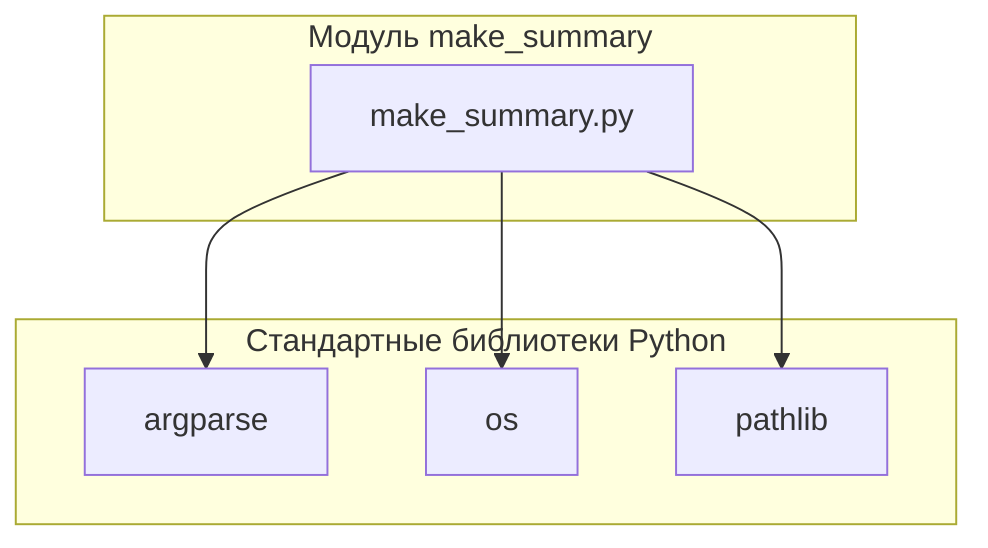

## Анализ кода модуля `make_summary.md`

### Качество кода:
- **Соответствие стандартам**: 6/10
- **Плюсы**:
    - Подробное описание функциональности модуля и функции `main`.
    - Описание аргументов командной строки и их влияния на работу скрипта.
    - Примеры запуска скрипта из командной строки.
    - Наличие блок-схемы и диаграммы зависимостей.
- **Минусы**:
    - Документ представляет собой описание, а не исполняемый код.
    - Описание не соответствует требуемому формату для docstring.
    - Отсутствуют примеры использования и описание возможных исключений в docstring.

### Рекомендации по улучшению:

1. **Преобразование в исполняемый код**:
    - Преобразовать описание модуля в исполняемый Python-скрипт.
2. **Документирование функций и классов**:
    - Добавить docstring к каждой функции и классу в соответствии с указанным форматом.
3. **Примеры использования и исключения**:
    - Добавить примеры использования и описания возможных исключений в docstring.
4. **Логирование**:
    - Добавить логирование с использованием модуля `logger` из `src.logger`.
5. **Обработка ошибок**:
    - Добавить обработку ситуаций, когда указанный язык не поддерживается (например, если указан `-lang de`).
    - Реализовать проверку на существование исходных файлов перед их добавлением в `SUMMARY.md`.
6. **Аннотации типов**:
    - Добавить аннотации типов для переменных и параметров функций.

### Оптимизированный код:

```python
## \file src/endpoints/hypo69/code_assistant/make_summary.py
# -*- coding: utf-8 -*-
#! .pyenv/bin/python3

"""
Модуль для автоматической генерации файла SUMMARY.md
=====================================================

Модуль рекурсивно обходит указанный каталог, содержащий исходные `.md` файлы,
и генерирует оглавление, включая или исключая файлы на основе указанного языка.

Зависимости:
    - argparse
    - os
    - pathlib

Пример использования:
----------------------

    python src/endpoints/hypo69/code_assistant/make_summary.py -lang ru src

.. module:: src.endpoints.hypo69.code_assistant.make_summary
"""

import argparse
import os
from pathlib import Path
from typing import Optional

from src.logger import logger  # Добавлен импорт logger

def main(lang: str, source_dir: str) -> None:
    """
    Основная функция скрипта.
    Анализирует аргументы командной строки и генерирует файл SUMMARY.md.

    Args:
        lang (str): Язык документации (ru или en).
        source_dir (str): Исходный каталог с `.md` файлами.

    Returns:
        None

    Raises:
        FileNotFoundError: Если указанный исходный каталог не существует.
        ValueError: Если указанный язык не поддерживается.
        Exception: При возникновении любых других ошибок в процессе генерации.

    Example:
        python src/endpoints/hypo69/code_assistant/make_summary.py -lang ru src
    """
    try:
        # Функция извлекает аргументы командной строки
        parser = argparse.ArgumentParser(description='Generate SUMMARY.md for mdbook')
        parser.add_argument('-lang', type=str, required=True, help='Language (ru or en)')
        parser.add_argument('source_dir', type=str, help='Source directory with .md files')
        args = parser.parse_args()
        lang = args.lang
        source_dir = args.source_dir

        # Функция проверяет существование исходного каталога
        source_path = Path(source_dir)
        if not source_path.exists():
            raise FileNotFoundError(f"Source directory not found: {source_dir}")

        # Функция проверяет указанный язык
        if lang not in ['ru', 'en']:
            raise ValueError(f"Unsupported language: {lang}")

        # Функция определяет целевой каталог
        target_dir = Path('docs')
        target_dir.mkdir(parents=True, exist_ok=True)

        # Функция формирует список файлов
        md_files = []
        for root, _, files in os.walk(source_dir):
            for file in files:
                if file.endswith('.md'):
                    md_files.append(Path(root) / file)

        # Функция фильтрует файлы по языку
        filtered_files = []
        for file in md_files:
            if lang == 'ru':
                if str(file).endswith('.ru.md'):
                    filtered_files.append(file)
            else:
                if not str(file).endswith('.ru.md'):
                    filtered_files.append(file)

        # Функция формирует содержимое файла SUMMARY.md
        summary_content = "# Summary\n\n"
        for file in filtered_files:
            # Функция извлекает путь относительно корня проекта
            relative_path = file.relative_to(Path(source_dir).resolve())
            summary_content += f"- [{file.stem}]({str(relative_path).replace(os.sep, '/')})\n"

        # Функция записывает содержимое в файл SUMMARY.md
        with open(target_dir / 'SUMMARY.md', 'w', encoding='utf-8') as f:
            f.write(summary_content)

        logger.info(f"SUMMARY.md generated successfully in {target_dir}")

    except FileNotFoundError as ex:
        logger.error(f"Source directory not found: {source_dir}", ex, exc_info=True)
        print(f"Error: Source directory not found: {source_dir}")
    except ValueError as ex:
        logger.error(f"Unsupported language: {lang}", ex, exc_info=True)
        print(f"Error: Unsupported language: {lang}")
    except Exception as ex:
        logger.error('Error while generating SUMMARY.md', ex, exc_info=True)
        print(f"An error occurred: {ex}")


if __name__ == "__main__":
    parser = argparse.ArgumentParser(description='Generate SUMMARY.md for mdbook')
    parser.add_argument('-lang', type=str, required=True, help='Language (ru or en)')
    parser.add_argument('source_dir', type=str, help='Source directory with .md files')
    args = parser.parse_args()
    main(args.lang, args.source_dir)
```
```mermaid
graph LR
    A[Начало] --> B{Аргументы командной строки};
    B -- Есть аргументы --> C{Определение целевого каталога};
    B -- Нет аргументов --> E[Вывод справки и завершение];
    C --> D{Создание целевого каталога (если необходимо)};
    D --> F{Формирование списка .md файлов};
    F --> G{Фильтрация файлов по языку};
    G -- Язык указан --> H{Формирование содержимого SUMMARY.md};
    G -- Язык не указан --> I[Включить все .md файлы];
    H --> J{Запись содержимого в SUMMARY.md};
    I --> J
    J --> K[Конец];
    K -- Успешно --> L[Файл SUMMARY.md создан];
    K -- Ошибка --> M[Вывод сообщения об ошибке];
```

