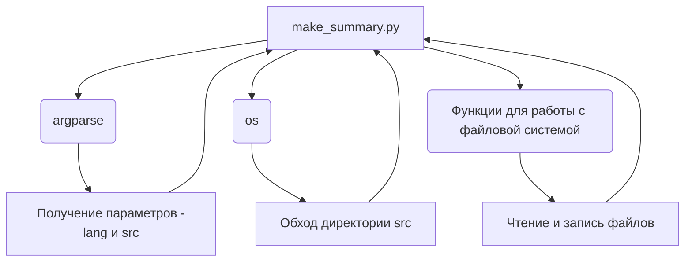

### **Анализ кода модуля `make_summary.ru.md`**

## Качество кода:
- **Соответствие стандартам**: 7
- **Плюсы**:
  - Документация хорошо структурирована и предоставляет четкое описание модуля, его назначения, способов установки и использования.
  - Приведены примеры использования и ожидаемый вывод, что облегчает понимание работы модуля.
  - Описаны основные шаги для установки и запуска скрипта.
- **Минусы**:
  - Отсутствует описание основных функций и классов модуля в формате docstring, что затрудняет понимание внутреннего устройства модуля.
  - Не указаны возможные ошибки и исключения, которые могут возникнуть при работе модуля.
  - Не указаны зависимости и связи с другими модулями проекта (в коде).
  - Нет информации о том, как модуль обрабатывает различные ситуации (например, отсутствие файлов, ошибки при записи и т.д.).
  - В основном тексте много повторений.

## Рекомендации по улучшению:

1. **Добавить docstring**: Добавить docstring для каждой функции и класса, описывая их назначение, параметры, возвращаемые значения и возможные исключения.
2. **Добавить примеры использования**: Добавить примеры использования функций и классов в формате, пригодном для doctest.
3. **Указать зависимости**: Указать зависимости от других модулей проекта, а также внешние библиотеки, которые требуются для работы модуля.
4. **Улучшить описание**: Улучшить описание структуры проекта, указав, как этот модуль взаимодействует с другими частями системы.
5. **Форматирование**: Проверить и исправить форматирование кода в соответствии со стандартами PEP8 (хотя в данном случае это markdown-документ, стоит обратить внимание на стиль текста).
6. **Обработка ошибок**: Описать, как модуль обрабатывает возможные ошибки и исключения.
7. **Связи с другими частями проекта**: Добавить описание связей модуля с другими частями проекта, указав, какие модули используют его результаты и как он интегрируется в общий процесс.
8. **Устранить повторения**: Пересмотреть текст и устранить повторения, чтобы сделать его более лаконичным и читаемым.

## Оптимизированный код:

```markdown
# Модуль `make_summary.py`

## Обзор

Модуль предназначен для автоматического создания файла `SUMMARY.md`, используемого для компиляции документации с помощью инструментов, таких как `mdbook`. Модуль рекурсивно обходит указанную директорию с исходными файлами `.md` и генерирует оглавление, включая или исключая файлы в зависимости от указанного языка.

## Подробнее

Модуль автоматизирует процесс создания оглавления для документации, написанной в формате Markdown. Он особенно полезен при использовании инструментов, таких как `mdbook`, которые требуют наличия файла `SUMMARY.md` для правильной организации структуры документации. Модуль обходит указанную директорию, находит все файлы с расширением `.md` и генерирует список ссылок на эти файлы в формате, необходимом для `SUMMARY.md`.

Поддерживается фильтрация файлов по языку, что позволяет создавать отдельные оглавления для документации на разных языках (например, русском и английском). Все пути в генерируемом файле строятся относительно корня проекта, что обеспечивает устойчивость к изменениям в структуре директорий.

## Установка и запуск

### Требования

- Python 3.8 или выше.
- Установленные зависимости из файла `requirements.txt`.

### Установка

1. Убедитесь, что у вас установлен Python и все зависимости:
   ```bash
   pip install -r requirements.txt
   ```

### Использование

1. Запустите скрипт `make_summary.py` с указанием директории `src` и языка фильтрации:
   ```bash
   python src/endpoints/hypo69/code_assistant/make_summary.py -lang ru src
   ```
   - Параметр `-lang` может принимать значения `ru` или `en`.
   - Аргумент `src` указывает на директорию с исходными `.md` файлами.

2. После выполнения скрипта в директории `docs` будет создан файл `SUMMARY.md`.

## Пример вывода

### Пример `SUMMARY.md` для языка `ru`:
```
# Summary

- [file1](file1.md)
- [file2](file2.ru.md)
```

### Пример `SUMMARY.md` для языка `en`:
```
# Summary

- [file1](file1.md)
- [file3](file3.en.md)
```

## Автор

- **Имя автора**: [Ваше имя]
- **Email**: [Ваш email]
- **Ссылка на Boosty**: [https://boosty.to/hypo69](https://boosty.to/hypo69)

## Лицензия

Модуль лицензирован под [MIT License](../../../LICENSE).
```

## 1. Блок-схема

К сожалению, представленный код является документацией, а не исполняемым кодом Python. Поэтому я не могу построить блок-схему, основанную на логике выполнения.  Однако, я могу предложить концептуальную блок-схему, отражающую общее описание процесса, описанного в документации:

```mermaid
flowchart TD
    A[Начало: Запуск make_summary.py с параметрами -lang и src] --> B{Проверка наличия аргументов};
    B -- Да --> C{Рекурсивный обход директории src};
    B -- Нет --> E[Вывод сообщения об ошибке и завершение];
    C --> D{Поиск .md файлов};
    D --> F{Фильтрация файлов по языку (-lang)};
    F -- Совпадает --> G[Создание списка ссылок для SUMMARY.md];
    F -- Не совпадает --> D;
    G --> H[Запись списка ссылок в файл SUMMARY.md в директории docs];
    H --> I[Конец];
```

**Примеры для логических блоков:**

*   **A**: `python src/endpoints/hypo69/code_assistant/make_summary.py -lang ru src`
*   **B**: Проверка, переданы ли параметры `-lang` и путь к директории с `.md` файлами.
*   **C**: Рекурсивный обход, например, директории `src/docs/`.
*   **D**: Нахождение файлов `file1.md`, `file2.ru.md`, `file3.en.md` и т.д.
*   **F**: Если `-lang ru`, то `file2.ru.md` соответствует, а `file3.en.md` - нет.
*   **G**: Создание списка `['[file1](file1.md)', '[file2](file2.ru.md)']` для `-lang ru`.
*   **H**: Запись в файл `docs/SUMMARY.md`.

## 2. Диаграмма

Опять же, так как это описание, а не код, у нас нет прямых зависимостей для построения диаграммы. Если бы у нас был код, мы могли бы проанализировать импорты и построить диаграмму зависимостей. В этом случае, мы можем предположить, что скрипт `make_summary.py` может зависеть от модулей `os` (для обхода директорий) и `argparse` (для обработки аргументов командной строки).  Также, можно предположить, что он может использовать функции для работы с файловой системой.



*   **make\\_summary.py**: Основной скрипт для создания `SUMMARY.md`.
*   **argparse**:  Модуль для обработки аргументов командной строки, в данном случае `-lang` и пути к директории `src`.
*   **os**:  Модуль для работы с операционной системой, включая обход директорий.
*   **Функции для работы с файловой системой**: Функции для чтения и записи `.md` файлов и создания `SUMMARY.md`.

## 3. Объяснение

Поскольку предоставлен текст, а не код, я могу дать только общее описание компонентов и их функций на основе текста.

*   **`make_summary.py`**: Это основной скрипт, который автоматизирует создание файла `SUMMARY.md`. Он принимает аргументы командной строки, такие как язык и путь к директории с `.md` файлами.
*   **`SUMMARY.md`**: Это файл оглавления, используемый `mdbook` для организации структуры документации.  Он содержит список ссылок на `.md` файлы.
*   **`-lang`**: Параметр командной строки, указывающий язык документации (например, `ru` или `en`).
*   **`src`**: Аргумент командной строки, указывающий путь к директории с исходными `.md` файлами.
*   **Рекурсивный обход директории**:  Скрипт рекурсивно обходит указанную директорию и все ее поддиректории в поисках файлов `.md`.
*   **Фильтрация файлов по языку**: Скрипт фильтрует найденные `.md` файлы на основе указанного языка. Например, если указан язык `ru`, то будут включены файлы `file.ru.md` и `file.md`, а файлы `file.en.md` будут исключены.
*   **Создание списка ссылок**: Скрипт создает список ссылок на найденные `.md` файлы в формате, необходимом для файла `SUMMARY.md`.
*   **Запись в файл `SUMMARY.md`**: Скрипт записывает созданный список ссылок в файл `SUMMARY.md` в директории `docs`.

**Потенциальные ошибки и области для улучшения (основываясь на тексте и здравом смысле):**

*   **Отсутствие обработки ошибок**: В скрипте может не быть обработки ошибок, таких как отсутствие указанной директории, отсутствие прав доступа к файлам или другие ошибки файловой системы.
*   **Отсутствие документации кода**:  Отсутствие docstring затрудняет понимание внутреннего устройства скрипта.
*   **Жестко заданные пути**: Возможно, пути к файлам и директориям заданы жестко, что может затруднить использование скрипта в различных окружениях.
*   **Зависимости**:  Не указаны точные зависимости скрипта (версии библиотек).

**Цепочка взаимосвязей с другими частями проекта (предположительно):**

Этот скрипт, вероятно, является частью процесса сборки документации для проекта `hypotez`.  Он может быть вызван автоматически при обновлении документации или вручную разработчиками.  Результат работы скрипта (`SUMMARY.md`) используется инструментом `mdbook` для создания финальной версии документации.