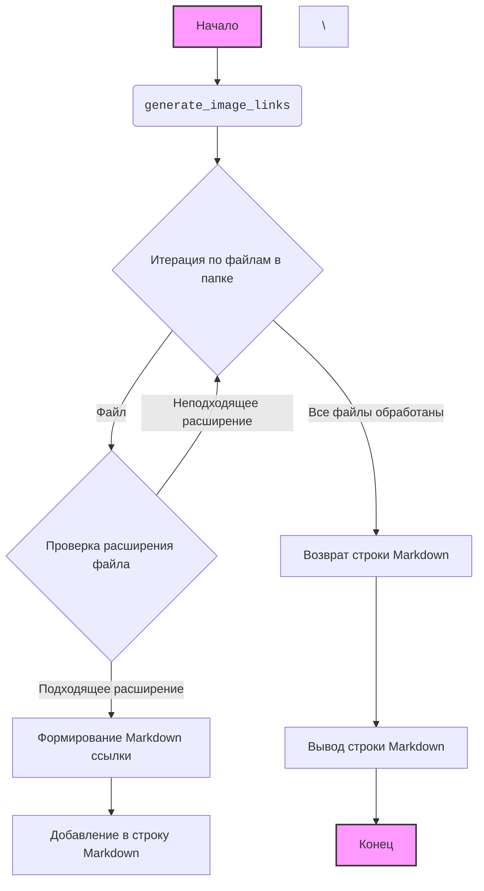

### Анализ кода модуля `png_from_dot.py.md`

### 1. Блок-схема

```mermaid
graph TD
    A[Начало: Указание пути к папке с изображениями] --> B{Получение списка файлов в папке};
    B -- Да, есть файлы --> C{Проверка расширения файла (.png, .jpg, .jpeg, .gif)?};
    C -- Да, расширение подходит --> D[Формирование Markdown ссылки на изображение];
    D --> E[Добавление ссылки в общую строку Markdown];
    C -- Нет, расширение не подходит --> B;
    B -- Нет файлов --> F[Конец: Вывод строки Markdown с изображениями];
    E --> B;
    F --> G[Вывод Markdown-строки]
```

**Примеры для каждого блока:**

-   **A (Начало: Указание пути к папке с изображениями)**:
    `folder_path = "__root__/dia"`
-   **B (Получение списка файлов в папке)**:
    `os.listdir(folder_path)` - возвращает список файлов и подпапок в указанной директории. Например, `[\'image1.png\', \'image2.jpg\', \'text.txt\']`.
-   **C (Проверка расширения файла (.png, .jpg, .jpeg, .gif)?)**:
    `filename.endswith((".png", ".jpg", ".jpeg", ".gif"))` - проверяет, заканчивается ли имя файла на одно из указанных расширений. Если `filename` равно `\'image1.png\'`, то условие истинно. Если `filename` равно `\'text.txt\'`, то условие ложно.
-   **D (Формирование Markdown ссылки на изображение)**:
    `f"\\\\n"` - формирует строку Markdown для вставки изображения. Например, если `filename` равно `\'image1.png\'` и `folder_path` равно `\'__root__/dia\'`, то строка будет выглядеть как `\'\\n\'`
-   **E (Добавление ссылки в общую строку Markdown)**:
    `markdown_images += f"\\\\n"` - добавляет сформированную строку Markdown к общей строке. Если `markdown_images` изначально была `\'\'`, а сформированная строка - `\'\\n\'`, то `markdown_images` станет `\'\\n\'`
-   **F (Конец: Вывод строки Markdown с изображениями)**:
    Функция `generate_image_links` возвращает накопленную строку `markdown_images`. Если в папке были изображения, то строка будет содержать ссылки на все эти изображения.
-   **G (Вывод Markdown-строки)**:
    `print(markdown_output)` - выводит сформированную строку Markdown в консоль.

### 2. Диаграмма



#### Объяснение зависимостей:

*   **`os`**: Этот модуль используется для взаимодействия с операционной системой, в частности, для получения списка файлов в указанной директории. Он импортируется, чтобы использовать функцию `os.listdir(folder_path)`, которая возвращает список имен файлов и поддиректорий в директории, указанной аргументом `folder_path`.

### 3. Объяснение

#### Импорты:

*   **`os`**: Модуль `os` предоставляет функции для взаимодействия с операционной системой. В данном коде он используется для получения списка файлов в указанной папке с помощью функции `os.listdir()`.\

#### Функции:

*   **`generate_image_links(folder_path: str) -> str`**:
    *   **Аргументы**:
        *   `folder_path` (str): Путь к папке, в которой находятся изображения.
    *   **Возвращаемое значение**:
        *   `str`: Строка, содержащая Markdown ссылки на все изображения в указанной папке.
    *   **Назначение**:
        Функция генерирует Markdown-форматированный список изображений из указанной папки. Она проходит по всем файлам в папке, проверяет, имеют ли они допустимые расширения (`.png`, `.jpg`, `.jpeg`, `.gif`), и если да, формирует Markdown-ссылку на каждое изображение. Затем все ссылки объединяются в одну строку, которая возвращается.
    *   **Пример**:

    ```python
    folder_path = "__root__/dia"
    markdown_output = generate_image_links(folder_path)
    print(markdown_output)
    ```

#### Переменные:

*   **`folder_path` (str)**: Содержит путь к папке, в которой хранятся изображения.
*   **`markdown_output` (str)**: Строка, содержащая сгенерированный Markdown код для вставки изображений.

#### Потенциальные ошибки и области для улучшения:

1.  **Отсутствие обработки ошибок**:
    *   Если `folder_path` не существует или недоступен, возникнет ошибка. Желательно добавить обработку исключений для таких случаев.
2.  **Не указаны аннотации типов**:
    *   В коде отсутствуют аннотации типов для параметров функций и переменных. Это затрудняет чтение и понимание кода.
3.  **Жестко заданный путь к папке**:
    *   Путь к папке `__root__/dia` жестко задан в коде. Желательно сделать его более гибким, например, передавать путь через аргумент командной строки или переменную окружения.

#### Взаимосвязи с другими частями проекта:

Данный скрипт является утилитой для разработчиков (`dev_utils`) и, вероятно, используется для автоматической генерации документации или отчетов, содержащих изображения. Он может быть вызван из других скриптов или инструментов сборки проекта для создания Markdown-файлов с ссылками на изображения.