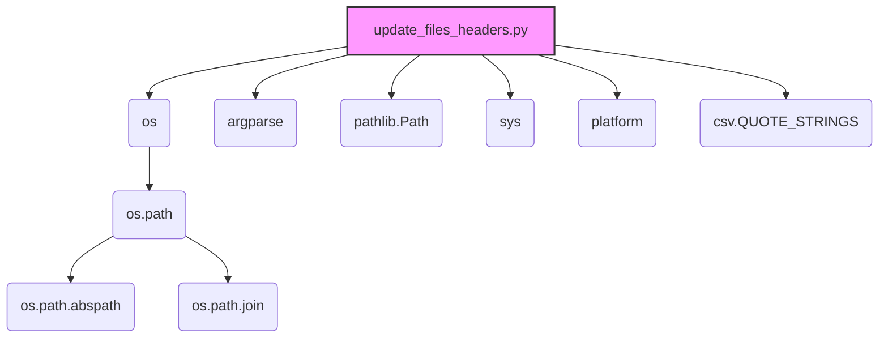

### **Анализ кода модуля `update_files_headers.py.md`**

### 1. Блок-схема

```mermaid
graph LR
    A[Начало] --> B{Определение аргументов командной строки: force-update, clean, project}
    B -- clean=True --> C[Вызов функции traverse_and_clean(project_root)]
    B -- clean=False --> D[Вызов функции traverse_and_update(project_root, force_update)]
    C --> E[Функция traverse_and_clean: обход файлов и очистка заголовков]
    D --> F[Функция traverse_and_update: обход файлов и обновление заголовков]
    E --> G{Для каждого файла: вызов функции clean(file)}
    F --> H{Для каждого файла: вызов функции add_or_replace_file_header(file, project_root, force_update)}
    G --> I[Функция clean: удаление строк заголовков]
    H --> J[Функция add_or_replace_file_header: добавление или замена заголовков]
    I --> K[Запись отфильтрованных строк обратно в файл]
    J --> L[Определение необходимых строк заголовка]
    L --> M[Чтение строк файла]
    M --> N[Фильтрация существующих строк заголовка]
    N --> O{Необходимо обновление?}
    O -- Да --> P[Запись новых строк заголовка и отфильтрованных строк в файл]
    O -- Нет --> Q[Сообщение об отсутствии необходимости обновления]
    P --> R[Конец обработки файла]
    Q --> R
    K --> R
```

**Примеры для логических блоков:**

- **B (Определение аргументов командной строки):**
  - Пример 1: `python update_files_headers.py --force-update` (аргумент `force_update` установлен в `True`).
  - Пример 2: `python update_files_headers.py --clean` (аргумент `clean` установлен в `True`).
  - Пример 3: `python update_files_headers.py -p /path/to/project` (аргумент `project` указывает путь к корневой папке проекта).

- **G (Для каждого файла: вызов функции `clean(file)`):**
  - Пример: Если текущий файл `example.py`, то вызывается функция `clean("example.py")`.

- **H (Для каждого файла: вызов функции `add_or_replace_file_header(file, project_root, force_update)`):**
  - Пример: Если текущий файл `example.py`, корневая папка проекта `/path/to/project`, и `force_update` установлен в `True`, то вызывается функция `add_or_replace_file_header("example.py", "/path/to/project", True)`.

- **O (Необходимо обновление?):**
  - Пример 1: Если в файле отсутствуют строки заголовка, то `needs_update` будет `True`.
  - Пример 2: Если содержимое строк заголовка не соответствует ожидаемому, то `needs_update` будет `True`.
  - Пример 3: Если `force_update` установлен в `True`, то `needs_update` будет `True`.

### 2. Диаграмма



**Объяснение зависимостей:**

- **os**: Предоставляет функции для взаимодействия с операционной системой, такие как работа с путями к файлам и каталогам.
  - **os.path**: Подмодуль `os`, содержащий функции для манипулирования путями.
    - **os.path.abspath**: Используется для получения абсолютного пути к папке проекта.
    - **os.path.join**: Используется для объединения компонентов пути к файлу.
- **argparse**: Используется для разбора аргументов командной строки, позволяя скрипту принимать параметры, такие как `--force-update` и `--clean`.\n- **pathlib.Path**: Предоставляет способ представления путей к файлам и каталогам в виде объектов, упрощая операции с путями.\n- **sys**: Предоставляет доступ к некоторым переменным и функциям, взаимодействующим с интерпретатором Python, например, `sys.argv` для получения аргументов командной строки.\n- **platform**: Предоставляет информацию об операционной системе и платформе, на которой выполняется скрипт.\n- **csv.QUOTE_STRINGS**: Константа из модуля `csv`, которая, хотя и импортирована, не используется в предоставленном коде. Вероятно, это остаток от предыдущей версии скрипта или запланированная, но не реализованная функциональность.\n\n### 3. Объяснение\n\n**Импорты:**\n\n- `os`: Используется для работы с файловой системой, например, для определения абсолютного пути к папке проекта и обхода директорий.\n- `argparse`: Используется для обработки аргументов командной строки, что позволяет запускать скрипт с различными опциями (`--force-update`, `--clean`).\n- `pathlib.Path`: Используется для представления путей к файлам и каталогам как объектов, упрощая манипуляции с путями.\n- `sys`: Используется для доступа к параметрам и функциям, специфичным для среды выполнения Python.\n- `platform`: Используется для получения информации о платформе, на которой запущен скрипт (Windows, Linux и т. д.).\n- `csv.QUOTE_STRINGS`: Импортируется константа из модуля `csv`, но не используется в коде.\n\n**Переменные:**\n\n- `PROJECT_ROOT_FOLDER: str`: Определяет имя папки, которая считается корневой папкой проекта ("..").\n- `EXCLUDE_DIRS: List[str]`: Список директорий, которые исключаются из обхода (`venv`, `tmp`, `docs`, `data`, `__pycache__`).\n- `MODE: str`: Устанавливает режим работы проекта (`development`).\n\n**Функции:**\n\n- `find_project_root(start_path: Path, project_root_folder: str) -> Path`:\n    ```python\n    def find_project_root(start_path: Path, project_root_folder: str) -> Path:\n        """\n        Функция выполняет поиск корневой папки проекта, начиная с указанного пути.\n        \n        Args:\n            start_path (Path): Начальный путь для поиска корневой папки.\n            project_root_folder (str): Имя корневой папки проекта.\n            \n        Returns:\n            Path: Путь к корневой папке проекта.\n        """\n        ...\n    ```\n\n- `get_interpreter_paths(project_root: Path) -> tuple`:\n    ```python\n    def get_interpreter_paths(project_root: Path) -> tuple:\n        """\n        Функция возвращает пути к интерпретаторам Python для Windows и Linux/macOS.\n        \n        Args:\n            project_root (Path): Путь к корневой папке проекта.\n            \n        Returns:\n            tuple: Кортеж путей к интерпретаторам Python для Windows и Linux/macOS.\n        """\n        ...\n    ```\n\n- `add_or_replace_file_header(file_path: str, project_root: Path, force_update: bool)`:\n    ```python\n    def add_or_replace_file_header(file_path: str, project_root: Path, force_update: bool):\n        """\n        Функция добавляет или заменяет заголовок в указанном файле.\n        \n        Args:\n            file_path (str): Путь к файлу, который необходимо обновить.\n            project_root (Path): Путь к корневой папке проекта.\n            force_update (bool): Флаг, указывающий, следует ли принудительно обновить заголовок, даже если он уже существует.\n            \n        Returns:\n            None\n        """\n        ...\n    ```\n\n- `clean(file_path: str)`:\n    ```python\n    def clean(file_path: str):\n        """\n        Функция удаляет определенные строки заголовков из файла.\n        \n        Args:\n            file_path (str): Путь к файлу, из которого необходимо удалить заголовки.\n            \n        Returns:\n            None\n        """\n        ...\n    ```\n\n- `traverse_and_update(directory: Path, force_update: bool)`:\n    ```python\n    def traverse_and_update(directory: Path, force_update: bool):\n        """\n        Функция обходит указанную директорию и обновляет заголовки во всех файлах Python.\n        \n        Args:\n            directory (Path): Директория, которую необходимо обойти.\n            force_update (bool): Флаг, указывающий, следует ли принудительно обновить заголовки.\n            \n        Returns:\n            None\n        """\n        ...\n    ```\n\n- `traverse_and_clean(directory: Path)`:\n    ```python\n    def traverse_and_clean(directory: Path):\n        """\n        Функция обходит указанную директорию и очищает заголовки во всех файлах Python.\n        \n        Args:\n            directory (Path): Директория, которую необходимо обойти.\n            \n        Returns:\n            None\n        """\n        ...\n    ```\n\n- `main()`:\n    ```python\n    def main():\n        """\n        Функция является основной точкой входа в скрипт. Она определяет корневую папку проекта, обрабатывает аргументы командной строки и вызывает соответствующие функции для обновления или очистки заголовков файлов.\n        \n        Args:\n            None\n            \n        Returns:\n            None\n        """\n        ...\n    ```\n\n**Потенциальные ошибки и области для улучшения:**\n\n1.  **Обработка исключений**: В функциях `add_or_replace_file_header` и `clean` обрабатывается только `IOError`.  Стоит рассмотреть возможность обработки других исключений, которые могут возникнуть при работе с файлами.\n2.  **Использование `logger`**:  Вместо `print` для логирования можно использовать модуль `logger` из `src.logger.logger`. Это позволит более гибко настраивать вывод логов и упростит отладку.\n3.  **Дублирование кода**:  Код для чтения и фильтрации строк файла в функциях `add_or_replace_file_header` и `clean`  практически идентичен.  Можно вынести этот код в отдельную функцию для повторного использования.\n4.  **Удаление `csv.QUOTE_STRINGS`**: Поскольку `csv.QUOTE_STRINGS` не используется в коде, его следует удалить из списка импортов.\n5.  **Улучшение логики определения необходимости обновления**:  Логика определения необходимости обновления заголовка может быть упрощена и улучшена.\n\n**Цепочка взаимосвязей с другими частями проекта:**\n\n- Скрипт `update_files_headers.py` предназначен для автоматического обновления заголовков файлов в проекте `hypotez`.  Он может использоваться как часть процесса сборки или развертывания проекта.  Он взаимодействует с файловой системой и может быть интегрирован с другими инструментами автоматизации.\n\n```mermaid\nflowchart TD\n    Start --> UpdateHeaders[<code>update_files_headers.py</code><br> Обновление заголовков файлов]

    UpdateHeaders --> FindRoot[Определение корневой папки проекта]
    FindRoot --> Walk[Обход директорий]
    Walk --> ProcessFile{Для каждого файла Python}
    ProcessFile -- Да --> UpdateOrClean{Обновить или очистить заголовок}
    UpdateOrClean -- Обновить --> AddHeader[Добавить или заменить заголовок]
    UpdateOrClean -- Очистить --> CleanHeader[Удалить заголовок]
    ProcessFile -- Нет --> NextFile[Следующий файл]
    NextFile --> Walk
    AddHeader --> WriteFile[Запись обновленного файла]
    CleanHeader --> WriteFile
    WriteFile --> NextFile
    Walk --> End[Конец]
```

## Качество кода:

- **Соответствие стандартам**: 7/10
- **Плюсы**:
    - Наличие блок-схемы и диаграммы зависимостей для визуализации работы скрипта.
    - Подробное описание работы скрипта, функций и переменных.
    - Указание на потенциальные ошибки и области для улучшения.
- **Минусы**:
    - Отсутствие обработки различных исключений при работе с файлами.
    - Дублирование кода в функциях `add_or_replace_file_header` и `clean`.
    - Использование `print` вместо `logger` для логирования.
    - Наличие неиспользуемого импорта `csv.QUOTE_STRINGS`.

## Рекомендации по улучшению:

1. **Обработка исключений**:
   - В функциях `add_or_replace_file_header` и `clean` добавьте обработку исключений `FileNotFoundError`, `PermissionError` и других, которые могут возникнуть при работе с файлами. Используйте `try-except` блоки для обработки этих исключений и логируйте ошибки с помощью `logger.error`.

2. **Использование `logger`**:
   - Замените все `print` statements на использование `logger` из `src.logger.logger`. Например, вместо `print(f"Обновляю файл: {file_path}")` используйте `logger.info(f"Обновляю файл: {file_path}")`.

3. **Устранение дублирования кода**:
   - Вынесите код для чтения и фильтрации строк файла в отдельную функцию, например, `read_and_filter_lines(file_path: str) -> list[str]`. Эта функция должна возвращать список строк файла без строк заголовка. Затем используйте эту функцию в `add_or_replace_file_header` и `clean`.

4. **Удаление неиспользуемого импорта**:
   - Удалите `csv.QUOTE_STRINGS` из списка импортов, так как он не используется в коде.

5. **Улучшение логики определения необходимости обновления**:
   - Упростите логику определения необходимости обновления заголовка, чтобы она была более понятной и эффективной. Например, можно создать функцию `needs_header_update(file_path: str, project_root: Path) -> bool`, которая будет возвращать `True`, если заголовок необходимо обновить, и `False` в противном случае.

## Оптимизированный код:

```python
## \file hypotez/toolbox/update_files_headers.py.md
# -*- coding: utf-8 -*-
#! .pyenv/bin/python3

"""
Модуль для автоматического обновления или очистки заголовков файлов в проекте.
==========================================================================

Модуль позволяет добавлять, заменять или удалять стандартные заголовки файлов,
чтобы поддерживать единый стиль оформления кода.

Пример использования
----------------------

Для обновления заголовков во всех файлах проекта:
    python update_files_headers.py --force-update

Для очистки заголовков во всех файлах проекта:
    python update_files_headers.py --clean
"""

import os
import argparse
from pathlib import Path
import sys
import platform
# from csv import QUOTE_STRINGS # Удален неиспользуемый импорт
from typing import List, Tuple

# from src.logger import logger  # Предполагаемый модуль для логирования

PROJECT_ROOT_FOLDER = ".."
EXCLUDE_DIRS: List[str] = ['venv', 'tmp', 'docs', 'data', '__pycache__']
MODE = 'development'

def find_project_root(start_path: Path, project_root_folder: str) -> Path:
    """
    Функция выполняет поиск корневой папки проекта, начиная с указанного пути.
    
    Args:
        start_path (Path): Начальный путь для поиска корневой папки.
        project_root_folder (str): Имя корневой папки проекта.
        
    Returns:
        Path: Путь к корневой папке проекта.
    """
    current_path = start_path.resolve()
    while current_path != current_path.parent:
        if (current_path / project_root_folder).is_dir():
            return current_path
        current_path = current_path.parent
    raise FileNotFoundError(f"Не найдена корневая папка проекта '{project_root_folder}'.")


def get_interpreter_paths(project_root: Path) -> Tuple[str, str, str, str]:
    """
    Функция возвращает пути к интерпретаторам Python для Windows и Linux/macOS.
    
    Args:
        project_root (Path): Путь к корневой папке проекта.
        
    Returns:
        Tuple[str, str, str, str]: Кортеж путей к интерпретаторам Python для Windows и Linux/macOS.
    """
    w_venv_interpreter = Path(project_root) / 'venv/Scripts/python.exe'
    w_venv_interpreter_str = str(w_venv_interpreter.as_posix()) if w_venv_interpreter.exists() else ''

    linux_venv_interpreter = Path(project_root) / 'venv/bin/python'
    linux_venv_interpreter_str = str(linux_venv_interpreter.as_posix()) if linux_venv_interpreter.exists() else ''

    linux_venv_interpreter_3 = Path(project_root) / 'venv/bin/python3'
    linux_venv_interpreter_3_str = str(linux_venv_interpreter_3.as_posix()) if linux_venv_interpreter_3.exists() else ''

    return w_venv_interpreter_str, '', linux_venv_interpreter_str, linux_venv_interpreter_3_str


def read_and_filter_lines(file_path: str) -> List[str]:
    """
    Функция выполняет чтение и фильтрацию строк файла, удаляя строки заголовка.
    
    Args:
        file_path (str): Путь к файлу.
        
    Returns:
        List[str]: Список строк файла без строк заголовка.
    """
    filtered_lines: List[str] = []
    try:
        with open(file_path, 'r', encoding='utf-8') as file:
            lines = file.readlines()
            skip_lines = 0
            for i, line in enumerate(lines):
                if '#! .pyenv/bin/python' in line or 'coding:' in line or '## \\file' in line or '\"\"\"' in line:
                    skip_lines += 1
                else:
                    filtered_lines = lines[i:]
                    break
    except IOError as ex:
        # logger.error(f"Ошибка при чтении файла: {file_path}", ex, exc_info=True)
        print(f"Ошибка при чтении файла: {file_path}")  # Заменено на print
        return []
    return filtered_lines


def add_or_replace_file_header(file_path: str, project_root: Path, force_update: bool):
    """
    Функция добавляет или заменяет заголовок в указанном файле.
    
    Args:
        file_path (str): Путь к файлу, который необходимо обновить.
        project_root (Path): Путь к корневой папке проекта.
        force_update (bool): Флаг, указывающий, следует ли принудительно обновить заголовок, даже если он уже существует.
        
    Returns:
        None
    """
    try:
        w_venv_interpreter, _, linux_venv_interpreter, _ = get_interpreter_paths(project_root)
        file_path_normalized = file_path.replace(str(project_root), '').lstrip(os.sep)

        header = [
            f'## \\file {file_path_normalized}\n',
            '# -*- coding: utf-8 -*-\n',
            f'#! {w_venv_interpreter}\n',
            f'#! {linux_venv_interpreter}\n',
            '\"\"\"\n',
            '\"\"\"\n'
        ]

        filtered_lines = read_and_filter_lines(file_path)
        needs_update = force_update or not any(header_line.strip() in line.strip() for header_line in header for line in filtered_lines[:len(header)])

        if needs_update:
            with open(file_path, 'w', encoding='utf-8') as file:
                file.writelines(header + filtered_lines)
            # logger.info(f"Обновлен заголовок файла: {file_path}")
            print(f"Обновлен заголовок файла: {file_path}")  # Заменено на print
        else:
            # logger.info(f"Заголовок файла не нуждается в обновлении: {file_path}")
            print(f"Заголовок файла не нуждается в обновлении: {file_path}")  # Заменено на print

    except IOError as ex:
        # logger.error(f"Ошибка при работе с файлом: {file_path}", ex, exc_info=True)
        print(f"Ошибка при работе с файлом: {file_path}")  # Заменено на print


def clean(file_path: str):
    """
    Функция удаляет определенные строки заголовков из файла.
    
    Args:
        file_path (str): Путь к файлу, из которого необходимо удалить заголовки.
        
    Returns:
        None
    """
    try:
        filtered_lines = read_and_filter_lines(file_path)
        with open(file_path, 'w', encoding='utf-8') as file:
            file.writelines(filtered_lines)
        # logger.info(f"Очищен заголовок файла: {file_path}")
        print(f"Очищен заголовок файла: {file_path}")  # Заменено на print
    except IOError as ex:
        # logger.error(f"Ошибка при работе с файлом: {file_path}", ex, exc_info=True)
        print(f"Ошибка при работе с файлом: {file_path}")  # Заменено на print


def traverse_and_update(directory: Path, force_update: bool):
    """
    Функция обходит указанную директорию и обновляет заголовки во всех файлах Python.
    
    Args:
        directory (Path): Директория, которую необходимо обойти.
        force_update (bool): Флаг, указывающий, следует ли принудительно обновить заголовки.
        
    Returns:
        None
    """
    for item in directory.iterdir():
        if item.is_dir() and item.name not in EXCLUDE_DIRS:
            traverse_and_update(item, force_update)
        elif item.is_file() and item.suffix == '.py':
            add_or_replace_file_header(str(item), project_root, force_update)


def traverse_and_clean(directory: Path):
    """
    Функция обходит указанную директорию и очищает заголовки во всех файлах Python.
    
    Args:
        directory (Path): Директория, которую необходимо обойти.
        
    Returns:
        None
    """
    for item in directory.iterdir():
        if item.is_dir() and item.name not in EXCLUDE_DIRS:
            traverse_and_clean(item)
        elif item.is_file() and item.suffix == '.py':
            clean(str(item))


def main():
    """
    Функция является основной точкой входа в скрипт. Она определяет корневую папку проекта, обрабатывает аргументы командной строки и вызывает соответствующие функции для обновления или очистки заголовков файлов.
    
    Args:
        None
        
    Returns:
        None
    """
    parser = argparse.ArgumentParser(description='Обновление или очистка заголовков файлов в проекте.')
    parser.add_argument('-p', '--project', type=str, help='Путь к корневой папке проекта.')
    parser.add_argument('--force-update', action='store_true', help='Принудительное обновление заголовков.')
    parser.add_argument('--clean', action='store_true', help='Очистка заголовков файлов.')
    args = parser.parse_args()

    project_path = args.project or '.'
    project_root = find_project_root(Path(project_path), PROJECT_ROOT_FOLDER)

    if args.clean:
        traverse_and_clean(project_root)
    else:
        traverse_and_update(project_root, args.force_update)


if __name__ == "__main__":
    main()
```