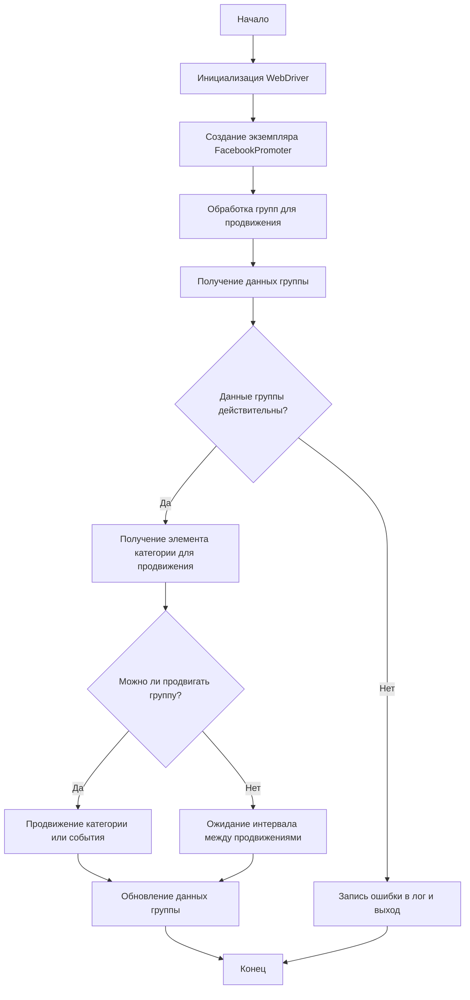

# Модуль Facebook Promoter

## Обзор

Модуль **Facebook Promoter** автоматизирует продвижение товаров и событий AliExpress в группах Facebook. Модуль обрабатывает публикацию рекламных материалов в Facebook, гарантируя, что категории и события рекламируются без дубликатов. Он использует WebDriver для автоматизации браузера, чтобы эффективно обрабатывать промо-акции.

## Функции модуля

- Продвижение категорий и событий в группах Facebook.
- Предотвращение дублирования промо-акций за счет отслеживания ранее продвигаемых товаров.
- Поддержка настройки данных группы через файлы.
- Возможность отключения загрузки видео в рекламных материалах.

## Требования

- **Python** 3.x
- Необходимые библиотеки:
  - `random`
  - `datetime`
  - `pathlib`
  - `urllib.parse`
  - `types.SimpleNamespace`
  - `src` (пользовательский модуль)

## Блок-схема



## Использование

### Пример использования класса FacebookPromoter

```python
from src.endpoints.advertisement.facebook.promoter import FacebookPromoter
from src.webdriver.driver import Driver
from src.utils.jjson import j_loads_ns

# Настройка экземпляра WebDriver (замените на фактический WebDriver)
d = Driver()

# Создание экземпляра FacebookPromoter
promoter = FacebookPromoter(
    d=d, 
    promoter="aliexpress", 
    group_file_paths=["path/to/group/file1.json", "path/to/group/file2.json"]
)

# Запуск продвижения товаров или событий
promoter.process_groups(
    campaign_name="Campaign1",
    events=[], 
    group_categories_to_adv=["sales"],
    language="en",
    currency="USD"
)
```

## Документация класса

### Класс `FacebookPromoter`

Этот класс управляет процессом продвижения товаров и событий AliExpress в группах Facebook.

#### Методы

##### `__init__(self, d: Driver, promoter: str, group_file_paths: Optional[list[str | Path] | str | Path] = None, no_video: bool = False)`

Инициализирует промоутера Facebook с необходимыми конфигурациями.

- **Аргументы:**
    - `d (Driver)`: Экземпляр WebDriver для автоматизации.
    - `promoter (str)`: Название промоутера (например, "aliexpress").
    - `group_file_paths (Optional[list[str | Path] | str | Path])`: Пути к файлам с данными о группах.
    - `no_video (bool)`: Флаг для отключения видео в публикациях. По умолчанию `False`.

##### `promote(self, group: SimpleNamespace, item: SimpleNamespace, is_event: bool = False, language: str = None, currency: str = None) -> bool`

Продвигает категорию или событие в указанной группе Facebook.

- **Аргументы:**
    - `group (SimpleNamespace)`: Данные группы.
    - `item (SimpleNamespace)`: Элемент категории или события для продвижения.
    - `is_event (bool)`: Является ли элемент событием.
    - `language (str)`: Язык продвижения.
    - `currency (str)`: Валюта для продвижения.

- **Возвращает:**
    - `bool`: Успешность продвижения.

##### `log_promotion_error(self, is_event: bool, item_name: str)`

Записывает ошибку в лог, если продвижение завершилось неудачей.

- **Аргументы:**
    - `is_event (bool)`: Является ли элемент событием.
    - `item_name (str)`: Название элемента.

##### `update_group_promotion_data(self, group: SimpleNamespace, item_name: str, is_event: bool = False)`

Обновляет данные о группе после продвижения, добавляя продвигаемый элемент в список продвигаемых категорий или событий.

- **Аргументы:**
    - `group (SimpleNamespace)`: Данные группы.
    - `item_name (str)`: Название продвигаемого элемента.
    - `is_event (bool)`: Является ли элемент событием.

##### `process_groups(self, campaign_name: str = None, events: list[SimpleNamespace] = None, is_event: bool = False, group_file_paths: list[str] = None, group_categories_to_adv: list[str] = ['sales'], language: str = None, currency: str = None)`

Обрабатывает группы для текущей кампании или продвижения события.

- **Аргументы:**
    - `campaign_name (str)`: Название кампании.
    - `events (list[SimpleNamespace])`: Список событий для продвижения.
    - `is_event (bool)`: Необходимо ли продвигать события или категории.
    - `group_file_paths (list[str])`: Пути к файлам с данными о группах.
    - `group_categories_to_adv (list[str])`: Категории для продвижения.
    - `language (str)`: Язык продвижения.
    - `currency (str)`: Валюта для продвижения.

##### `get_category_item(self, campaign_name: str, group: SimpleNamespace, language: str, currency: str) -> SimpleNamespace`

Извлекает элемент категории для продвижения на основе кампании и промоутера.

- **Аргументы:**
    - `campaign_name (str)`: Название кампании.
    - `group (SimpleNamespace)`: Данные группы.
    - `language (str)`: Язык для продвижения.
    - `currency (str)`: Валюта для продвижения.

- **Возвращает:**
    - `SimpleNamespace`: Элемент категории для продвижения.

##### `check_interval(self, group: SimpleNamespace) -> bool`

Проверяет, прошло ли достаточно времени для повторного продвижения этой группы.

- **Аргументы:**
    - `group (SimpleNamespace)`: Данные группы.

- **Возвращает:**
    - `bool`: Допускается ли продвижение группы.

##### `validate_group(self, group: SimpleNamespace) -> bool`

Проверяет данные группы, чтобы убедиться, что они содержат необходимые атрибуты.

- **Аргументы:**
    - `group (SimpleNamespace)`: Данные группы.

- **Возвращает:**
    - `bool`: Действительны ли данные группы.

## Лицензия

Этот модуль является частью более крупного пакета **Facebook Promoter** и распространяется под лицензией MIT.

```