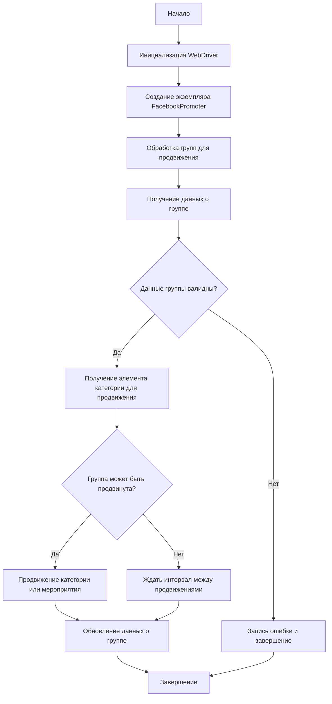

# Документация модуля Facebook Promoter

## Обзор

Модуль **Facebook Promoter** автоматизирует продвижение товаров и мероприятий AliExpress в группах Facebook. Модуль управляет публикациями рекламных материалов на Facebook, избегая дублирования. Для эффективного продвижения используется WebDriver для автоматизации браузера.

## Подробнее

Этот модуль предназначен для автоматизации процесса продвижения товаров и мероприятий AliExpress в группах Facebook. Он позволяет публиковать рекламные материалы, избегая дублирования, и использует WebDriver для автоматизации действий в браузере.

## Особенности модуля

- Продвижение категорий и мероприятий в группах Facebook.
- Избежание дублирования публикаций через отслеживание уже опубликованных элементов.
- Поддержка конфигурации данных групп через файлы.
- Возможность отключения загрузки видео в публикациях.

## Требования

- **Python** 3.x
- Необходимые библиотеки:
  - `random`
  - `datetime`
  - `pathlib`
  - `urllib.parse`
  - `types.SimpleNamespace`
  - `src` (пользовательский модуль)

## Использование

### Пример использования класса FacebookPromoter

```python
from src.endpoints.advertisement.facebook.promoter import FacebookPromoter
from src.webdriver.driver import Driver
from src.utils.jjson import j_loads_ns

# Настройка экземпляра WebDriver (замените на реальный WebDriver)
d = Driver()

# Создание экземпляра FacebookPromoter
promoter = FacebookPromoter(
    d=d, 
    promoter="aliexpress", 
    group_file_paths=["path/to/group/file1.json", "path/to/group/file2.json"]
)

# Начало продвижения товаров или мероприятий
promoter.process_groups(
    campaign_name="Campaign1",
    events=[], 
    group_categories_to_adv=["sales"],
    language="en",
    currency="USD"
)
```

## Документация классов

### Класс `FacebookPromoter`

Этот класс управляет процессом продвижения товаров и мероприятий AliExpress в группах Facebook.

**Наследует:**

Не наследует другие классы.

**Атрибуты:**

- `driver (Driver)`: Экземпляр WebDriver для автоматизации.
- `promoter (str)`: Имя промоутера (например, "aliexpress").
- `group_file_paths (Optional[list[str | Path] | str | Path])`: Пути к файлам с данными групп.
- `no_video (bool)`: Флаг для отключения видео в публикациях.

#### Методы

- `__init__(self, d: Driver, promoter: str, group_file_paths: Optional[list[str | Path] | str | Path] = None, no_video: bool = False)`
- `promote(self, group: SimpleNamespace, item: SimpleNamespace, is_event: bool = False, language: str = None, currency: str = None) -> bool`
- `log_promotion_error(self, is_event: bool, item_name: str)`
- `update_group_promotion_data(self, group: SimpleNamespace, item_name: str, is_event: bool = False)`
- `process_groups(self, campaign_name: str = None, events: list[SimpleNamespace] = None, is_event: bool = False, group_file_paths: list[str] = None, group_categories_to_adv: list[str] = ['sales'], language: str = None, currency: str = None)`
- `get_category_item(self, campaign_name: str, group: SimpleNamespace, language: str, currency: str) -> SimpleNamespace`
- `check_interval(self, group: SimpleNamespace) -> bool`
- `validate_group(self, group: SimpleNamespace) -> bool`



### `__init__`

```python
def __init__(self, d: Driver, promoter: str, group_file_paths: Optional[list[str | Path] | str | Path] = None, no_video: bool = False):
    """
    Инициализирует промоутер для Facebook с необходимыми конфигурациями.

    Args:
        d (Driver): Экземпляр WebDriver для автоматизации.
        promoter (str): Имя промоутера (например, "aliexpress").
        group_file_paths (Optional[list[str  |  Path] | str | Path]): Пути к файлам с данными групп.
        no_video (bool): Флаг для отключения видео в публикациях. По умолчанию `False`.
    """
    ...
```

**Назначение**:
Инициализирует экземпляр класса `FacebookPromoter`. Этот метод устанавливает основные параметры, необходимые для работы промоутера, такие как драйвер веб-браузера, имя промоутера и пути к файлам с данными о группах Facebook.

**Параметры**:
- `d` (Driver): Экземпляр WebDriver, используемый для автоматизации действий в браузере.
- `promoter` (str): Имя промоутера, например, `"aliexpress"`.
- `group_file_paths` (Optional[list[str  |  Path] | str | Path]): Пути к файлам, содержащим информацию о группах Facebook. Может быть как списком путей, так и одним путем. По умолчанию `None`.
- `no_video` (bool): Флаг, указывающий, нужно ли отключать загрузку видео в публикациях. По умолчанию `False`.

**Как работает функция**:
- Принимает драйвер веб-браузера, имя промоутера и пути к файлам с данными о группах.
- Устанавливает значения атрибутов экземпляра класса.
- Определяет, следует ли отключать загрузку видео в публикациях.

**Примеры**:

```python
from src.webdriver.driver import Driver
from src.endpoints.advertisement.facebook.promoter import FacebookPromoter
from pathlib import Path

# Пример с использованием экземпляра WebDriver
driver = Driver()  
promoter = FacebookPromoter(d=driver, promoter="aliexpress", group_file_paths=["groups1.json", "groups2.json"])

# Пример с указанием одного файла
promoter = FacebookPromoter(d=driver, promoter="aliexpress", group_file_paths="groups.json")

# Пример с отключением загрузки видео
promoter = FacebookPromoter(d=driver, promoter="aliexpress", group_file_paths="groups.json", no_video=True)
```

### `promote`

```python
def promote(self, group: SimpleNamespace, item: SimpleNamespace, is_event: bool = False, language: str = None, currency: str = None) -> bool:
    """
    Продвигает категорию или мероприятие в указанной группе Facebook.

    Args:
        group (SimpleNamespace): Данные группы.
        item (SimpleNamespace): Категория или мероприятие для продвижения.
        is_event (bool): Является ли элемент мероприятием.
        language (str): Язык публикации.
        currency (str): Валюта для продвижения.

    Returns:
        bool: Успешно ли прошло продвижение.
    """
    ...
```

**Назначение**:
Осуществляет продвижение указанного товара или мероприятия в заданной группе Facebook.

**Параметры**:
- `group` (SimpleNamespace): Объект, содержащий данные о группе Facebook, в которой будет производиться продвижение.
- `item` (SimpleNamespace): Объект, представляющий категорию товара или мероприятие, которое необходимо продвигать.
- `is_event` (bool): Флаг, указывающий, является ли продвигаемый элемент мероприятием. По умолчанию `False`.
- `language` (str): Язык, на котором будет опубликована запись. По умолчанию `None`.
- `currency` (str): Валюта, используемая в продвижении. По умолчанию `None`.

**Возвращает**:
- `bool`: `True`, если продвижение прошло успешно, и `False` в противном случае.

**Как работает функция**:
- Принимает данные группы, элемент для продвижения, флаг, указывающий, является ли элемент мероприятием, язык и валюту.
- Выполняет действия по продвижению товара или мероприятия в указанной группе Facebook.
- Возвращает `True`, если продвижение прошло успешно, и `False` в противном случае.

**Примеры**:

```python
from types import SimpleNamespace
from src.endpoints.advertisement.facebook.promoter import FacebookPromoter
from src.webdriver.driver import Driver

# Создаем экземпляры необходимых объектов
driver = Driver()
promoter = FacebookPromoter(d=driver, promoter="aliexpress")
group_data = SimpleNamespace(id="123456789", name="Test Group")
item_data = SimpleNamespace(title="Awesome Product", price="19.99")

# Пример продвижения товара в группе
success = promoter.promote(group=group_data, item=item_data, language="en", currency="USD")
print(f"Promotion successful: {success}")

# Пример продвижения мероприятия
event_data = SimpleNamespace(title="Summer Sale", date="2024-07-01")
success = promoter.promote(group=group_data, item=event_data, is_event=True, language="en")
print(f"Event promotion successful: {success}")
```

### `log_promotion_error`

```python
def log_promotion_error(self, is_event: bool, item_name: str):
    """
    Записывает ошибку, если продвижение не удалось.

    Args:
        is_event (bool): Является ли элемент мероприятием.
        item_name (str): Название элемента.
    """
    ...
```

**Назначение**:
Записывает сообщение об ошибке в журнал, когда не удается выполнить продвижение товара или мероприятия.

**Параметры**:
- `is_event` (bool): Указывает, является ли продвигаемый элемент мероприятием (`True`) или товаром (`False`).
- `item_name` (str): Название элемента (товара или мероприятия), для которого не удалось выполнить продвижение.

**Как работает функция**:
- Принимает флаг, указывающий, является ли элемент мероприятием, и название элемента.
- Формирует сообщение об ошибке, включающее тип элемента (товар или мероприятие) и его название.
- Записывает сообщение об ошибке в журнал, используя модуль `logger`.

**Примеры**:

```python
from src.endpoints.advertisement.facebook.promoter import FacebookPromoter
from src.webdriver.driver import Driver

# Создаем экземпляр FacebookPromoter
driver = Driver()
promoter = FacebookPromoter(d=driver, promoter="aliexpress")

# Пример регистрации ошибки продвижения товара
promoter.log_promotion_error(is_event=False, item_name="Amazing Product")

# Пример регистрации ошибки продвижения мероприятия
promoter.log_promotion_error(is_event=True, item_name="Summer Festival")
```

### `update_group_promotion_data`

```python
def update_group_promotion_data(self, group: SimpleNamespace, item_name: str, is_event: bool = False):
    """
    Обновляет данные группы после продвижения, добавляя продвигаемый элемент в список продвигаемых категорий или мероприятий.

    Args:
        group (SimpleNamespace): Данные группы.
        item_name (str): Название продвигаемого элемента.
        is_event (bool): Является ли элемент мероприятием.
    """
    ...
```

**Назначение**:
Обновляет данные группы Facebook после успешного продвижения товара или мероприятия, чтобы избежать повторного продвижения одного и того же элемента в той же группе.

**Параметры**:
- `group` (SimpleNamespace): Объект, содержащий данные о группе Facebook.
- `item_name` (str): Название продвинутого товара или мероприятия.
- `is_event` (bool): Флаг, указывающий, является ли продвигаемый элемент мероприятием (`True`) или товаром (`False`). По умолчанию `False`.

**Как работает функция**:
- Проверяет, является ли продвигаемый элемент мероприятием или товаром.
- Обновляет данные группы, добавляя название продвинутого элемента в соответствующий список (продвинутые категории или продвинутые мероприятия).

**Примеры**:

```python
from types import SimpleNamespace
from src.endpoints.advertisement.facebook.promoter import FacebookPromoter
from src.webdriver.driver import Driver

# Создаем экземпляр FacebookPromoter
driver = Driver()
promoter = FacebookPromoter(d=driver, promoter="aliexpress")

# Создаем объект группы
group_data = SimpleNamespace(
    id="123456789",
    name="Test Group",
    promoted_categories=[],
    promoted_events=[]
)

# Пример обновления данных после продвижения товара
promoter.update_group_promotion_data(group=group_data, item_name="Awesome Product")
print(f"Updated promoted categories: {group_data.promoted_categories}")

# Пример обновления данных после продвижения мероприятия
promoter.update_group_promotion_data(group=group_data, item_name="Summer Festival", is_event=True)
print(f"Updated promoted events: {group_data.promoted_events}")
```

### `process_groups`

```python
def process_groups(self, campaign_name: str = None, events: list[SimpleNamespace] = None, is_event: bool = False, group_file_paths: list[str] = None, group_categories_to_adv: list[str] = ['sales'], language: str = None, currency: str = None):
    """
    Обрабатывает группы для текущей кампании или продвижения мероприятия.

    Args:
        campaign_name (str): Название кампании.
        events (list[SimpleNamespace]): Список мероприятий для продвижения.
        is_event (bool): Является ли продвижение мероприятий или категорий.
        group_file_paths (list[str]): Пути к файлам с данными групп.
        group_categories_to_adv (list[str]): Категории для продвижения.
        language (str): Язык публикации.
        currency (str): Валюта для продвижения.
    """
    ...
```

**Назначение**:
Метод `process_groups` предназначен для обработки списка групп Facebook с целью продвижения товаров или мероприятий в соответствии с заданными параметрами кампании.

**Параметры**:
- `campaign_name` (str): Название рекламной кампании. Используется для получения списка товаров или категорий для продвижения. По умолчанию `None`.
- `events` (list[SimpleNamespace]): Список мероприятий (events) для продвижения. Каждый элемент списка должен быть объектом `SimpleNamespace` с информацией о мероприятии. По умолчанию `None`.
- `is_event` (bool): Флаг, определяющий, продвигаются ли мероприятия (`True`) или категории товаров (`False`). По умолчанию `False`.
- `group_file_paths` (list[str]): Список путей к файлам, содержащим информацию о группах Facebook. Если не указан, используются пути, заданные при инициализации класса. По умолчанию `None`.
- `group_categories_to_adv` (list[str]): Список категорий товаров для продвижения. Используется, если `is_event` равен `False`. По умолчанию `['sales']`.
- `language` (str): Язык, на котором будет выполняться продвижение. По умолчанию `None`.
- `currency` (str): Валюта, используемая для продвижения. По умолчанию `None`.

**Как работает функция**:
- Загружает данные групп Facebook из файлов, указанных в `group_file_paths`.
- Проходит по каждой группе и проверяет, можно ли её продвигать в данный момент (с помощью метода `check_interval`).
- В зависимости от значения `is_event`, либо продвигает мероприятия из списка `events`, либо категории товаров из списка `group_categories_to_adv`.
- Использует методы `get_category_item` для получения информации о товаре или категории для продвижения, `promote` для выполнения продвижения и `update_group_promotion_data` для обновления информации о продвижении в группе.

**Примеры**:

```python
from types import SimpleNamespace
from src.endpoints.advertisement.facebook.promoter import FacebookPromoter
from src.webdriver.driver import Driver

# Создаем экземпляр FacebookPromoter
driver = Driver()
promoter = FacebookPromoter(d=driver, promoter="aliexpress", group_file_paths=["groups.json"])

# Пример продвижения категорий товаров
promoter.process_groups(campaign_name="SummerSales", group_categories_to_adv=["electronics", "clothing"], language="en", currency="USD")

# Пример продвижения мероприятий
event1 = SimpleNamespace(title="Summer Sale", description="Huge discounts!", date="2024-07-01")
event2 = SimpleNamespace(title="Back to School", description="Deals for students!", date="2024-08-15")
promoter.process_groups(events=[event1, event2], is_event=True, language="en")
```

### `get_category_item`

```python
def get_category_item(self, campaign_name: str, group: SimpleNamespace, language: str, currency: str) -> SimpleNamespace:
    """
    Получает элемент категории для продвижения в зависимости от кампании и промоутера.

    Args:
        campaign_name (str): Название кампании.
        group (SimpleNamespace): Данные группы.
        language (str): Язык для публикации.
        currency (str): Валюта для публикации.

    Returns:
        SimpleNamespace: Элемент категории для продвижения.
    """
    ...
```

**Назначение**:
Извлекает элемент категории для продвижения на основе указанных параметров кампании, данных группы, языка и валюты.

**Параметры**:
- `campaign_name` (str): Название кампании, в рамках которой выполняется продвижение.
- `group` (SimpleNamespace): Объект, содержащий информацию о группе, в которой будет выполняться продвижение.
- `language` (str): Язык, который будет использоваться для публикации.
- `currency` (str): Валюта, которая будет использоваться для продвижения.

**Возвращает**:
- `SimpleNamespace`: Объект, представляющий элемент категории для продвижения.

**Как работает функция**:
- Принимает название кампании, данные группы, язык и валюту.
- На основе этих параметров определяет, какой элемент категории следует продвигать.
- Возвращает объект `SimpleNamespace`, содержащий информацию об элементе категории для продвижения.

**Примеры**:

```python
from types import SimpleNamespace
from src.endpoints.advertisement.facebook.promoter import FacebookPromoter
from src.webdriver.driver import Driver

# Создаем экземпляр FacebookPromoter
driver = Driver()
promoter = FacebookPromoter(d=driver, promoter="aliexpress")

# Создаем объект группы
group_data = SimpleNamespace(id="123456789", name="Test Group")

# Получаем элемент категории для продвижения
category_item = promoter.get_category_item(campaign_name="SummerSales", group=group_data, language="en", currency="USD")
print(f"Category item to promote: {category_item}")
```

### `check_interval`

```python
def check_interval(self, group: SimpleNamespace) -> bool:
    """
    Проверяет, прошло ли достаточно времени, чтобы снова продвигать эту группу.

    Args:
        group (SimpleNamespace): Данные группы.

    Returns:
        bool: Можно ли снова продвигать группу.
    """
    ...
```

**Назначение**:
Проверяет, прошло ли достаточно времени с момента последнего продвижения в указанной группе Facebook, чтобы определить, можно ли снова выполнять продвижение.

**Параметры**:
- `group` (SimpleNamespace): Объект, содержащий данные о группе Facebook, включая информацию о времени последнего продвижения.

**Возвращает**:
- `bool`: `True`, если прошло достаточно времени и группу можно снова продвигать, и `False` в противном случае.

**Как работает функция**:
- Принимает данные группы.
- Вычисляет, прошло ли достаточно времени с момента последнего продвижения, используя информацию о времени последнего продвижения, сохраненную в данных группы.
- Возвращает `True`, если прошло достаточно времени, и `False` в противном случае.

**Примеры**:

```python
from types import SimpleNamespace
from datetime import datetime, timedelta
from src.endpoints.advertisement.facebook.promoter import FacebookPromoter
from src.webdriver.driver import Driver

# Создаем экземпляр FacebookPromoter
driver = Driver()
promoter = FacebookPromoter(d=driver, promoter="aliexpress")

# Создаем объект группы
group_data = SimpleNamespace(
    id="123456789",
    name="Test Group",
    last_promotion_time=datetime.now() - timedelta(hours=2)
)

# Проверяем, можно ли снова продвигать группу
can_promote = promoter.check_interval(group=group_data)
print(f"Can promote group: {can_promote}")
```

### `validate_group`

```python
def validate_group(self, group: SimpleNamespace) -> bool:
    """
    Проверяет данные группы, чтобы убедиться в их корректности.

    Args:
        group (SimpleNamespace): Данные группы.

    Returns:
        bool: Корректны ли данные группы.
    """
    ...
```

**Назначение**:
Проверяет корректность данных, связанных с группой Facebook, чтобы убедиться, что они соответствуют ожидаемым требованиям.

**Параметры**:
- `group` (SimpleNamespace): Объект, содержащий данные о группе Facebook, которые необходимо проверить.

**Возвращает**:
- `bool`: `True`, если данные группы корректны и соответствуют требованиям, и `False` в противном случае.

**Как работает функция**:
- Принимает данные группы.
- Выполняет проверку данных группы, чтобы убедиться в их корректности.
- Возвращает `True`, если данные группы корректны, и `False` в противном случае.

**Примеры**:

```python
from types import SimpleNamespace
from src.endpoints.advertisement.facebook.promoter import FacebookPromoter
from src.webdriver.driver import Driver

# Создаем экземпляр FacebookPromoter
driver = Driver()
promoter = FacebookPromoter(d=driver, promoter="aliexpress")

# Создаем объект группы с корректными данными
group_data_valid = SimpleNamespace(id="123456789", name="Test Group")

# Создаем объект группы с некорректными данными (например, отсутствует ID)
group_data_invalid = SimpleNamespace(name="Test Group")

# Проверяем корректность данных группы
is_valid = promoter.validate_group(group=group_data_valid)
print(f"Is group data valid: {is_valid}")

is_valid = promoter.validate_group(group=group_data_invalid)
print(f"Is group data valid: {is_valid}")
```

## Лицензия

Модуль является частью пакета **Facebook Promoter** и лицензируется по лицензии MIT.