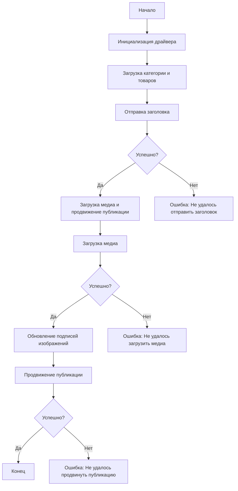

# Модуль для асинхронного сценария отправки сообщений в Facebook

## Обзор

Этот скрипт находится в каталоге `hypotez/src/endpoints/advertisement/facebook/scenarios` и предназначен для автоматизации процесса отправки сообщений в Facebook. Скрипт взаимодействует со страницей Facebook, используя локаторы для выполнения различных действий, таких как отправка сообщений, загрузка медиафайлов и обновление подписей.

## Ключевые возможности

1. **Отправка заголовка и описания**: Отправляет заголовок и описание кампании в поле сообщения для публикации в Facebook.
2. **Загрузка медиафайлов**: Загружает медиафайлы (изображения и видео) в публикацию в Facebook и обновляет их подписи.
3. **Продвижение публикации**: Управляет всем процессом продвижения публикации с заголовком, описанием и медиафайлами.

## Структура модуля



## Легенда

1. **Начало**: Начало выполнения скрипта.
2. **Инициализация драйвера**: Создание экземпляра класса `Driver`.
3. **Загрузка категории и товаров**: Загрузка данных о категории и товарах.
4. **Отправка заголовка**: Вызов функции `post_title` для отправки заголовка.
5. **Успешно?**: Проверка, была ли отправка заголовка успешной.
   - **Да**: Переход к загрузке медиа и продвижению публикации.
   - **Нет**: Вывод ошибки "Не удалось отправить заголовок".
6. **Загрузка медиа и продвижение публикации**: Вызов функции `promote_post`.
7. **Загрузка медиа**: Вызов функции `upload_media` для загрузки медиафайлов.
8. **Успешно?**: Проверка, была ли загрузка медиа успешной.
   - **Да**: Переход к обновлению подписей изображений.
   - **Нет**: Вывод ошибки "Не удалось загрузить медиа".
9. **Обновление подписей изображений**: Вызов функции `update_images_captions` для обновления подписей.
10. **Продвижение публикации**: Завершение процесса продвижения публикации.
11. **Успешно?**: Проверка, была ли публикация успешно продвинута.
    - **Да**: Конец выполнения скрипта.
    - **Нет**: Вывод ошибки "Не удалось продвинуть публикацию".


-----------------------

#### Функции

- **`post_title(d: Driver, category: SimpleNamespace) -> bool`**:
  - **Назначение**: Отправляет заголовок и описание кампании в поле сообщения для публикации в Facebook.
  - **Параметры**:
    - `d`: Экземпляр класса `Driver`, используемый для взаимодействия с веб-страницей.
    - `category`: Категория, содержащая заголовок и описание, которые необходимо отправить.
  - **Возвращает**: `True`, если заголовок и описание были успешно отправлены, иначе `None`.

- **`upload_media(d: Driver, products: List[SimpleNamespace], no_video: bool = False) -> bool`**:
  - **Назначение**: Загружает медиафайлы в публикацию в Facebook и обновляет их подписи.
  - **Параметры**:
    - `d`: Экземпляр класса `Driver`, используемый для взаимодействия с веб-страницей.
    - `products`: Список товаров, содержащих пути к медиафайлам.
    - `no_video`: Флаг, указывающий, следует ли пропускать загрузку видео.
  - **Возвращает**: `True`, если медиафайлы были успешно загружены, иначе `None`.

- **`update_images_captions(d: Driver, products: List[SimpleNamespace], textarea_list: List[WebElement]) -> None`**:
  - **Назначение**: Асинхронно добавляет описания к загруженным медиафайлам.
  - **Параметры**:
    - `d`: Экземпляр класса `Driver`, используемый для взаимодействия с веб-страницей.
    - `products`: Список товаров с деталями для обновления.
    - `textarea_list`: Список текстовых полей, в которые добавляются подписи.

- **`promote_post(d: Driver, category: SimpleNamespace, products: List[SimpleNamespace], no_video: bool = False) -> bool`**:
  - **Назначение**: Управляет процессом продвижения публикации с заголовком, описанием и медиафайлами.
  - **Параметры**:
    - `d`: Экземпляр класса `Driver`, используемый для взаимодействия с веб-страницей.
    - `category`: Детали категории, используемые для заголовка и описания публикации.
    - `products`: Список товаров, содержащих медиа и детали для публикации.
    - `no_video`: Флаг, указывающий, следует ли пропускать загрузку видео.
  - **Возвращает**: `True`, если публикация была успешно продвинута, иначе `None`.

### Использование

Чтобы использовать этот скрипт, выполните следующие действия:

1. **Инициализация драйвера**: Создайте экземпляр класса `Driver`.
2. **Загрузка локаторов**: Загрузите локаторы из JSON-файла.
3. **Вызов функций**: Используйте предоставленные функции для отправки заголовка, загрузки медиа и продвижения публикации.

#### Пример

```python
from src.webdriver.driver import Driver
from types import SimpleNamespace

# Инициализация драйвера
driver = Driver(...)

# Загрузка категории и товаров
category = SimpleNamespace(title="Заголовок кампании", description="Описание кампании")
products = [SimpleNamespace(local_image_path='path/to/image.jpg', ...)]

# Отправка заголовка
post_title(driver, category)

# Загрузка медиа и продвижение публикации
await promote_post(driver, category, products)
```

### Зависимости

- `selenium`: Для автоматизации работы с веб-страницами.
- `asyncio`: Для асинхронных операций.
- `pathlib`: Для работы с путями к файлам.
- `types`: Для создания простых пространств имен.
- `typing`: Для аннотаций типов.

### Обработка ошибок

Скрипт включает в себя надежную обработку ошибок, чтобы обеспечить продолжение выполнения, даже если некоторые элементы не найдены или возникают проблемы с веб-страницей. Это особенно полезно для обработки динамических или нестабильных веб-страниц.

### Вклад

Вклад в этот скрипт приветствуется. Пожалуйста, убедитесь, что любые изменения хорошо задокументированы и включают соответствующие тесты.

### Лицензия

Этот скрипт лицензирован по лицензии MIT. См. файл `LICENSE` для получения более подробной информации.