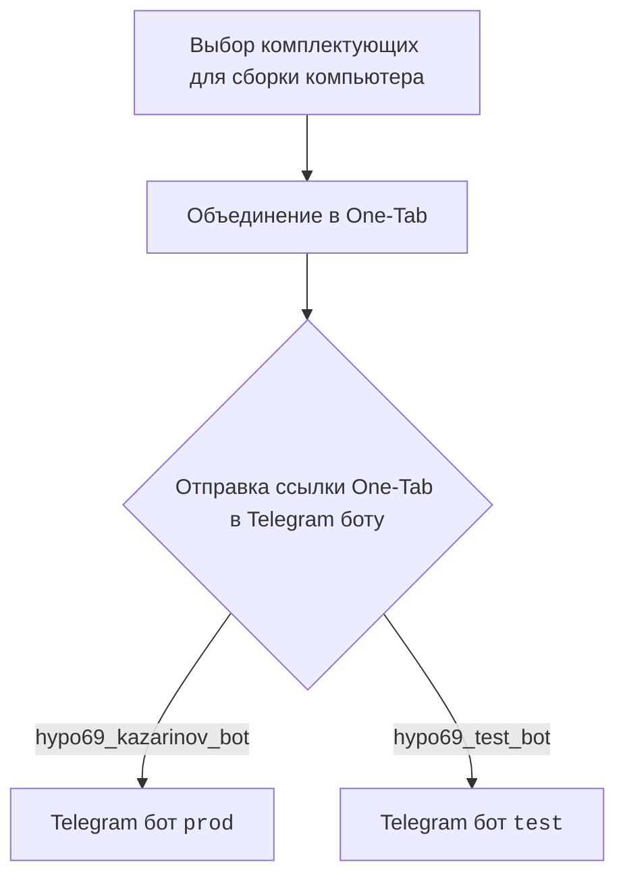
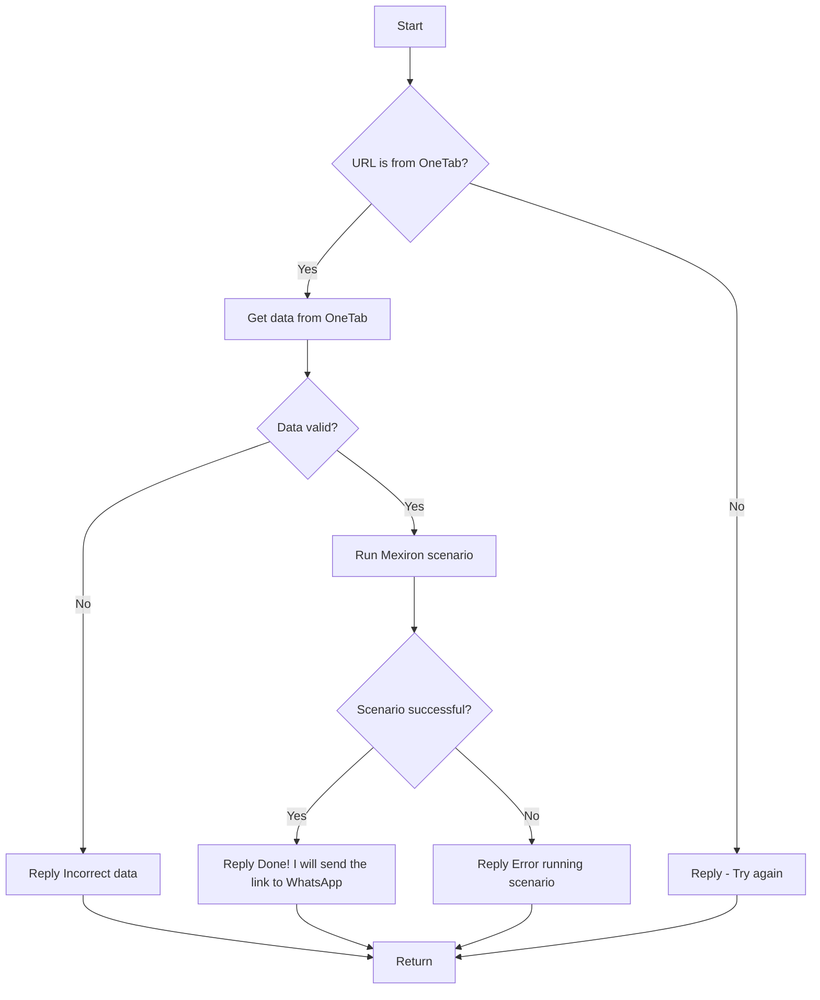

# Модуль: src.endpoints.kazarinov

## Обзор

Этот модуль содержит документацию для разработчиков, описывающую функциональность и архитектуру KazarinovTelegramBot, включая взаимодействие с Telegram ботами prod и test.

## Подробней

Модуль предоставляет информацию о структуре проекта, начиная с выбора комплектующих для сборки компьютера и заканчивая отправкой ссылки на WhatsApp после успешного выполнения сценария Mexiron. Включает диаграммы Mermaid для визуализации клиентской и серверной сторон взаимодействия.

## Схема работы

### Клиентская сторона (Kazarinov)

### Серверная сторона

## Следующие шаги

- [Kazarinov bot](https://github.com/hypo69/hypotez/blob/master/src/endpoints/kazarinov/kazarinov_bot.md)
- [Scenario Execution](https://github.com/hypo69/hypotez/blob/master/src/endpoints/kazarinov/scenarios/README.MD)