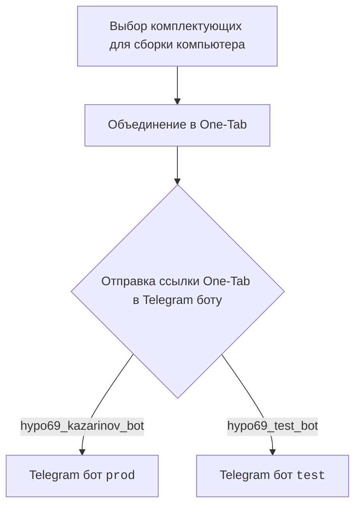
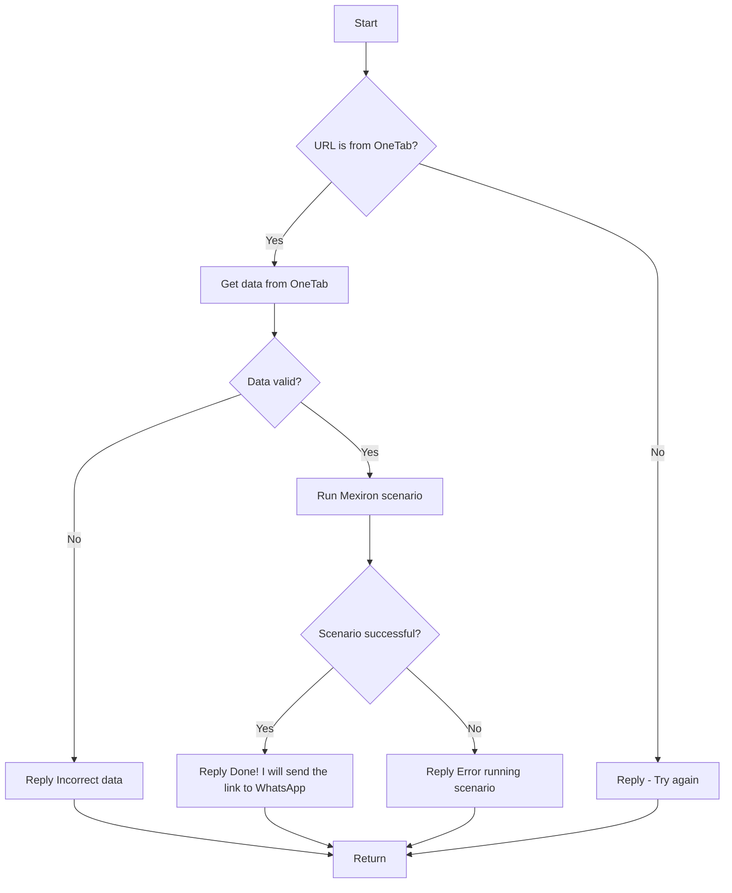

# Документация модуля `src.endpoints.kazarinov`

## Обзор

Данный модуль предназначен для работы с Kazarinov. PDF Mexiron Creator. Описывает взаимодействие клиентской и серверной частей, включая использование Telegram ботов `prod` и `test`, а также сценарии обработки данных из OneTab.

## Подробней

Модуль предназначен для автоматизации процесса создания PDF-файлов из ссылок, полученных из OneTab. Клиентская часть предполагает выбор комплектующих для сборки компьютера, объединение их в OneTab и отправку ссылки в Telegram бот. Серверная часть обрабатывает ссылку, проверяет данные и запускает сценарий Mexiron. В случае успеха, отправляет ссылку в WhatsApp.

## Содержание

- [KazarinovTelegramBot](#kazarinovtelegrambot)
- [BotHandler](#bothandler)
- [Клиентская сторона (Kazarinov)](#клиентская-сторона-kazarinov)
- [Код](#код)
- [Далее](#далее)

## KazarinovTelegramBot

- Ссылки на полезные ресурсы:
    - https://one-tab.co.il
    - https://morlevi.co.il
    - https://grandavance.co.il
    - https://ivory.co.il
    - https://ksp.co.il

## BotHandler

Описание обработчика бота.

## Клиентская сторона (Kazarinov)

Схема описывает взаимодействие клиента с Telegram ботами `prod` и `test` через OneTab.

## Код

Схема описывает логику обработки URL из OneTab, проверки данных и запуска сценария Mexiron.

## Далее

- [Kazarinov bot](https://github.com/hypo69/hypotez/blob/master/src/endpoints/kazarinov/kazarinov_bot.md)
- [Scenario Execution](https://github.com/hypo69/hypotez/blob/master/src/endpoints/kazarinov/scenarios/README.MD)