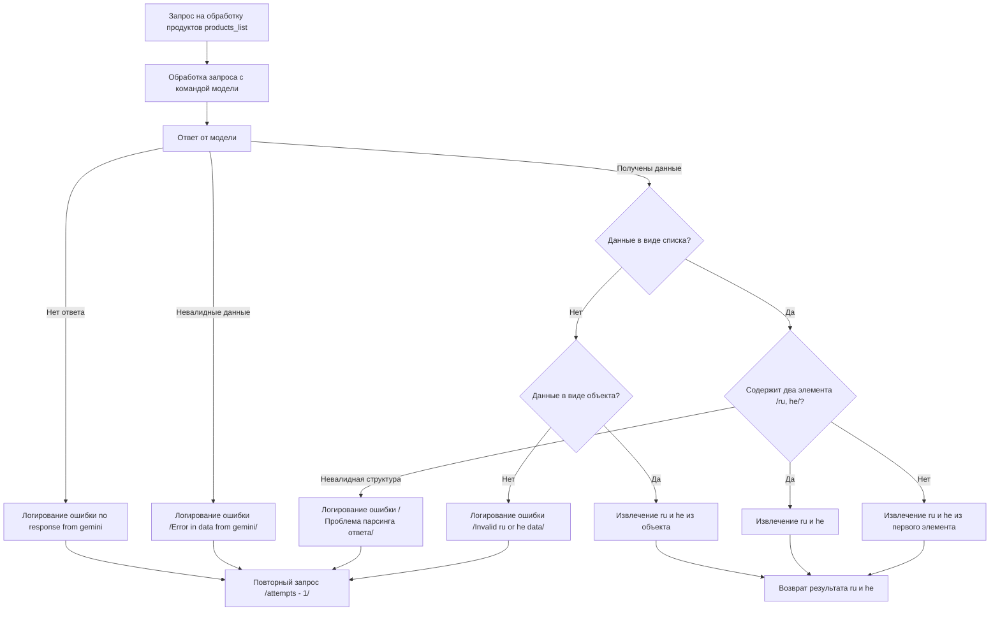

# README.MD

## Обзор

Этот файл содержит сценарии для обработки продуктов в API, использующего модели Gemini и OpenAI. 

## Подробности

Сценарии позволяют обрабатывать запросы, связанные с продуктами, с использованием AI-моделей.  Каждый сценарий включает в себя шаги, необходимые для получения валидных данных от модели,  обработки ошибок и возврата результата. 

## Сценарий



## Параметры

- **products_list**: список продуктов

## Возвращает

-  **ru**: Русский текст
- **he**: Ивритский текст

## Вызывает исключения

- **Exception**: В случае возникновения ошибки во время обработки.


## Примеры

```python
products_list = [
    {
        'product_id': 1,
        'name': 'Товар 1',
        'description': 'Описание товара 1',
        'price': 100,
    },
    {
        'product_id': 2,
        'name': 'Товар 2',
        'description': 'Описание товара 2',
        'price': 200,
    },
]

ru, he = process_products(products_list)

print(f'Русский текст: {ru}')
print(f'Ивритский текст: {he}')

```
```python
# Пример с ошибкой
products_list = [
    {
        'product_id': 1,
        'name': 'Товар 1',
        'description': 'Описание товара 1',
        'price': 100,
    },
    {
        'product_id': 2,
        'name': 'Товар 2',
        'description': 'Описание товара 2',
        'price': 200,
    },
    {
        'product_id': 3,
        'name': 'Товар 3',
        'description': 'Описание товара 3',
        'price': 300,
    }
]

try:
    ru, he = process_products(products_list)
except Exception as ex:
    print(f'Произошла ошибка: {ex}')