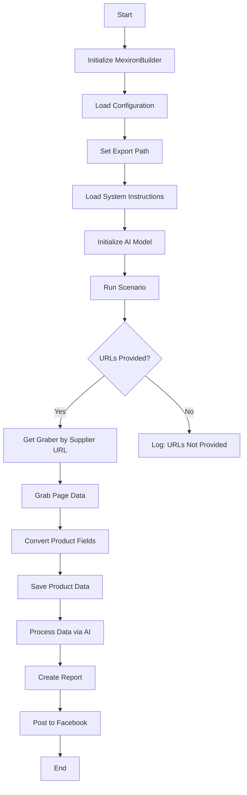
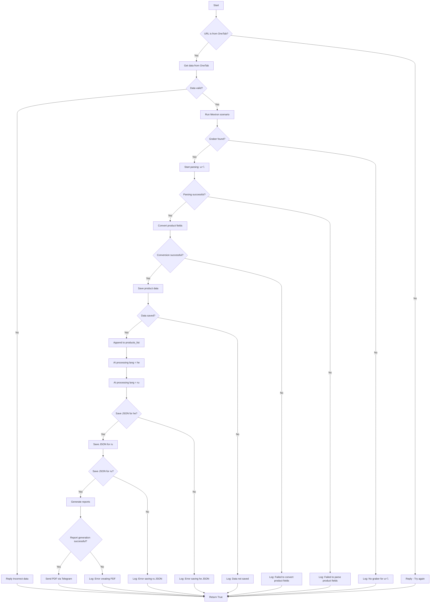

# Модуль `scenario`

## Обзор

Данный модуль является частью проекта `hypotez/src/endpoints/kazarinov/scenarios` и предназначен для автоматизации процесса создания "мехирона" для Сергея Казаринова. Скрипт извлекает, анализирует и обрабатывает данные о продуктах от различных поставщиков, подготавливает данные, обрабатывает их с помощью ИИ и интегрируется с Facebook для публикации продуктов.

## Подробнее

Этот скрипт автоматизирует процесс создания "мехирона", начиная с извлечения данных о продуктах из разных источников и заканчивая их публикацией в Facebook. Он включает в себя несколько этапов обработки данных, интеграцию с Google Generative AI для анализа данных и инструменты для создания отчетов. Модуль предназначен для упрощения и автоматизации задач, связанных с обработкой больших объемов данных о продуктах и их публикацией.

## Основные возможности

1.  **Извлечение и анализ данных**: Извлекает и анализирует данные о продуктах от различных поставщиков.
2.  **Обработка данных с использованием ИИ**: Обрабатывает извлеченные данные с использованием модели Google Generative AI.
3.  **Хранение данных**: Сохраняет обработанные данные в файлы.
4.  **Генерация отчетов**: Генерирует отчеты в форматах HTML и PDF на основе обработанных данных.
5.  **Публикация в Facebook**: Публикует обработанные данные в Facebook.

## Блок-схема модуля



## Легенда

1.  **Start**: Начало выполнения скрипта.
2.  **InitMexironBuilder**: Инициализация класса `MexironBuilder`.
3.  **LoadConfig**: Загрузка конфигурации из JSON-файла.
4.  **SetExportPath**: Установка пути для экспорта данных.
5.  **LoadSystemInstruction**: Загрузка системных инструкций для модели ИИ.
6.  **InitModel**: Инициализация модели Google Generative AI.
7.  **RunScenario**: Выполнение основного сценария.
8.  **CheckURLs**: Проверка, предоставлены ли URL-адреса для анализа.
9.  **GetGraber**: Получение соответствующего грабера для URL-адреса поставщика.
10. **GrabPage**: Извлечение данных страницы с использованием грабера.
11. **ConvertFields**: Преобразование полей продукта в словарь.
12. **SaveData**: Сохранение данных продукта в файл.
13. **ProcessAI**: Обработка данных продукта с помощью модели ИИ.
14. **CreateReport**: Создание отчетов в форматах HTML и PDF на основе обработанных данных.
15. **PostFacebook**: Публикация обработанных данных в Facebook.
16. **End**: Окончание выполнения скрипта.

## Классы

### `MexironBuilder`

**Описание**: Класс `MexironBuilder` предназначен для автоматизации процесса создания "мехирона", включающего извлечение, обработку и публикацию данных о продуктах.

**Атрибуты**:

*   `driver` (selenium.webdriver.remote.webdriver.WebDriver): Экземпляр Selenium WebDriver.
*   `export_path` (str): Путь для экспорта данных.
*   `mexiron_name` (str): Пользовательское имя для процесса "мехирон".
*   `price` (str): Цена для обработки.
*   `timestamp` (float): Временная метка для процесса.
*   `products_list` (List[dict]): Список обработанных данных о продуктах.
*   `model`: Модель Google Generative AI.
*   `config` (dict): Конфигурация, загруженная из JSON.

**Методы**:

#### `__init__`

```python
def __init__(self, driver: Driver, mexiron_name: Optional[str] = None) -> None:
    """
    Инициализирует класс `MexironBuilder` с необходимыми компонентами.

    Args:
        driver (Driver): Экземпляр Selenium WebDriver.
        mexiron_name (Optional[str], optional): Пользовательское имя для процесса "мехирон". По умолчанию `None`.
    """
    ...
```

#### `run_scenario`

```python
def run_scenario(self, system_instruction: Optional[str] = None, price: Optional[str] = None, mexiron_name: Optional[str] = None, urls: Optional[str | List[str]] = None, bot = None) -> bool:
    """
    Выполняет сценарий: анализирует продукты, обрабатывает их с помощью ИИ и сохраняет данные.

    Args:
        system_instruction (Optional[str], optional): Системные инструкции для модели ИИ. По умолчанию `None`.
        price (Optional[str], optional): Цена для обработки. По умолчанию `None`.
        mexiron_name (Optional[str], optional): Пользовательское имя для "мехирона". По умолчанию `None`.
        urls (Optional[str | List[str]], optional): URL-адреса страниц продуктов. По умолчанию `None`.
        bot (Any, optional): Бот для взаимодействия (например, Telegram-бот). По умолчанию `None`.

    Returns:
        bool: `True`, если сценарий выполнен успешно, иначе `False`.
    """
    ...
```

##### Блок-схема метода `run_scenario`



##### Легенда для блок-схемы `run_scenario`

1.  **Start**: Начало выполнения сценария.

2.  **URL Source Check (IsOneTab)**:
    *   Если URL-адрес из OneTab, данные извлекаются из OneTab.
    *   Если URL-адрес не из OneTab, пользователю отправляется сообщение "Попробуйте еще раз".

3.  **Data Validity Check (IsDataValid)**:
    *   Если данные недействительны, пользователю отправляется сообщение "Некорректные данные".
    *   Если данные действительны, начинается сценарий Mexiron.

4.  **Grabber Search (IsGraberFound)**:
    *   Если граббер найден, начинается анализ страницы.
    *   Если граббер не найден, генерируется сообщение журнала, указывающее, что для данного URL-адреса нет граббера.

5.  **Page Parsing (StartParsing)**:
    *   Если анализ успешен, данные преобразуются в требуемый формат.
    *   Если анализ не удался, регистрируется ошибка.

6.  **Data Conversion (ConvertProductFields)**:
    *   Если преобразование прошло успешно, данные сохраняются.
    *   Если преобразование не удалось, регистрируется ошибка.

7.  **Data Saving (SaveProductData)**:
    *   Если данные сохранены, они добавляются в список продуктов.
    *   Если данные не сохранены, регистрируется ошибка.

8.  **AI Processing (ProcessAIHe, ProcessAIRu)**:
    *   Данные обрабатываются AI для языков `he` (иврит) и `ru` (русский).

9.  **JSON Saving (SaveHeJSON, SaveRuJSON)**:
    *   Результаты обработки сохраняются в формате JSON для каждого языка.
    *   Если сохранение не удается, регистрируется ошибка.

10. **Report Generation (GenerateReports)**:
    *   HTML и PDF отчеты генерируются для каждого языка.
    *   Если генерация отчета не удалась, регистрируется ошибка.

11. **PDF Sending via Telegram (SendPDF)**:
    *   PDF-файлы отправляются через Telegram.
    *   Если отправка не удалась, регистрируется ошибка.

12. **Completion (ReturnTrue)**:
    *   Сценарий завершается возвратом `True`.

**Обработка ошибок**:
На каждом этапе, где могут возникнуть ошибки, предусмотрены узлы для регистрации ошибок (например, `LogNoGraber`, `LogParsingFailed`, `LogHeJSONError` и т.д.).

#### `get_graber_by_supplier_url`

```python
def get_graber_by_supplier_url(self, url: str) -> Any:
    """
    Возвращает соответствующий грабер для заданного URL-адреса поставщика.

    Args:
        url (str): URL-адрес страницы поставщика.

    Returns:
        Any: Экземпляр грабера, если найден, иначе `None`.
    """
    ...
```

#### `convert_product_fields`

```python
def convert_product_fields(self, f: ProductFields) -> dict:
    """
    Преобразует поля продукта в словарь.

    Args:
        f (ProductFields): Объект, содержащий проанализированные данные продукта.

    Returns:
        dict: Отформатированный словарь данных продукта.
    """
    ...
```

#### `save_product_data`

```python
def save_product_data(self, product_data: dict) -> None:
    """
    Сохраняет данные продукта в файл.

    Args:
        product_data (dict): Отформатированные данные продукта.
    """
    ...
```

#### `process_llm`

```python
def process_llm(self, products_list: List[str], lang: str, attempts: int = 3) -> tuple | bool:
    """
    Обрабатывает список продуктов с помощью модели ИИ.

    Args:
        products_list (List[str]): Список словарей данных продукта в виде строк.
        lang (str): Язык обработки (`ru` или `he`).
        attempts (int, optional): Количество попыток повтора в случае неудачи. По умолчанию 3.

    Returns:
        tuple | bool: Обработанный ответ в форматах `ru` и `he`.
    """
    ...
```

#### `post_facebook`

```python
def post_facebook(self, mexiron: SimpleNamespace) -> bool:
    """
    Выполняет сценарий публикации в Facebook.

    Args:
        mexiron (SimpleNamespace): Обработанные данные для публикации.

    Returns:
        bool: `True`, если публикация прошла успешно, иначе `False`.
    """
    ...
```

#### `create_report`

```python
def create_report(self, data: dict, html_file: Path, pdf_file: Path) -> None:
    """
    Генерирует отчеты в форматах HTML и PDF на основе обработанных данных.

    Args:
        data (dict): Обработанные данные.
        html_file (Path): Путь для сохранения HTML-отчета.
        pdf_file (Path): Путь для сохранения PDF-отчета.
    """
    ...
```

## Использование

Для использования этого скрипта выполните следующие действия:

1.  **Инициализация драйвера**: Создайте экземпляр класса `Driver`.
2.  **Инициализация MexironBuilder**: Создайте экземпляр класса `MexironBuilder` с драйвером.
3.  **Запуск сценария**: Вызовите метод `run_scenario` с необходимыми параметрами.

### Пример

```python
from src.webdriver.driver import Driver
from src.endpoints.kazarinov.scenarios.scenario_pricelist import MexironBuilder

# Инициализация драйвера
driver = Driver(...)

# Инициализация MexironBuilder
mexiron_builder = MexironBuilder(driver)

# Запуск сценария
urls = ['https://example.com/product1', 'https://example.com/product2']
mexiron_builder.run_scenario(urls=urls)
```

## Зависимости

*   `selenium`: Для автоматизации веб-страниц.
*   `asyncio`: Для асинхронных операций.
*   `pathlib`: Для работы с путями к файлам.
*   `types`: Для создания простых пространств имен.
*   `typing`: Для аннотаций типов.
*   `src.ai.gemini`: Для обработки данных с использованием ИИ.
*   `src.suppliers.*.graber`: Для извлечения данных от различных поставщиков.
*   `src.endpoints.advertisement.facebook.scenarios`: Для публикации в Facebook.

## Обработка ошибок

Скрипт включает надежную обработку ошибок для обеспечения непрерывного выполнения, даже если некоторые элементы не найдены или возникли проблемы с веб-страницей. Это особенно полезно для работы с динамическими или нестабильными веб-страницами.

## Вклад

Вклад в этот скрипт приветствуется. Пожалуйста, убедитесь, что любые изменения хорошо задокументированы и включают соответствующие тесты.

## Лицензия

Этот скрипт лицензирован в соответствии с лицензией MIT. Подробности см. в файле `LICENSE`.