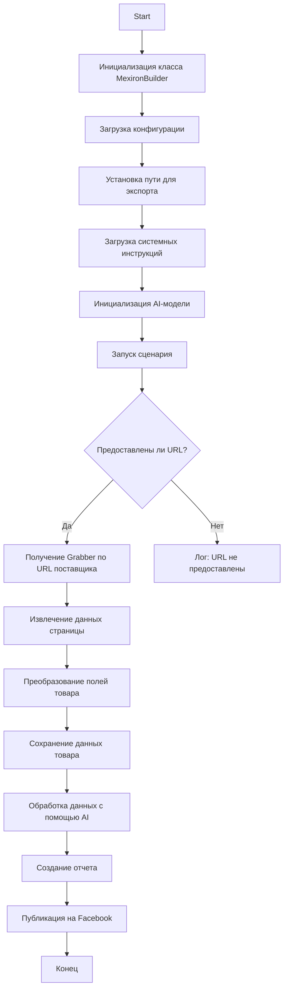

#  Модуль сценариев для Mechiron Сергея Казаринова

## Обзор

Данный модуль является частью каталога `hypotez/src/endpoints/kazarinov/scenarios` и предназначен для автоматизации процесса создания "mechiron" для Сергея Казаринова.  Скрипт извлекает, парсит и обрабатывает данные о товарах от разных поставщиков, подготавливает данные, обрабатывает их с помощью AI и интегрируется с Facebook для публикации товаров.

## Подробности

Модуль `scenario`  является главным сценарием проекта, который контролирует весь процесс сбора, обработки и публикации товаров. 

###  Схема работы модуля 



### Легенда

1. **Start**: Начало выполнения сценария.
2. **InitMexironBuilder**: Инициализация класса `MexironBuilder`.
3. **LoadConfig**: Загрузка конфигурации из JSON-файла.
4. **SetExportPath**: Установка пути для экспорта данных.
5. **LoadSystemInstruction**: Загрузка системных инструкций для AI-модели.
6. **InitModel**: Инициализация модели Google Generative AI.
7. **RunScenario**: Выполнение основного сценария.
8. **CheckURLs**: Проверка наличия URL для парсинга.
9. **GetGraber**: Получение соответствующего grabber для URL поставщика.
10. **GrabPage**: Извлечение данных страницы с помощью grabber.
11. **ConvertFields**: Преобразование полей товара в словарь.
12. **SaveData**: Сохранение данных товара в файл.
13. **ProcessAI**: Обработка данных товара с помощью AI-модели.
14. **CreateReport**: Создание отчетов в форматах HTML и PDF из обработанных данных.
15. **PostFacebook**: Публикация обработанных данных на Facebook.
16. **End**: Конец выполнения сценария.

-----------------------

#### Класс: `MexironBuilder`

- **Описание**: Класс, отвечающий за управление процессом создания "mechiron".
- **Атрибуты**: 
  - `driver`: Экземпляр WebDriver Selenium.
  - `export_path`: Путь для экспорта данных.
  - `mexiron_name`: Название Mechiron.
  - `price`: Цена за обработку.
  - `timestamp`: Метка времени для процесса.
  - `products_list`: Список обработанных данных о товарах.
  - `model`:  Модель Google Generative AI.
  - `config`: Конфигурация, загруженная из JSON.
- **Методы**: 

  - **`__init__(self, driver: Driver, mexiron_name: Optional[str] = None)`**:
    - **Назначение**:  Инициализирует класс `MexironBuilder` с необходимыми компонентами.
    - **Параметры**:
      - `driver`: Экземпляр WebDriver Selenium.
      - `mexiron_name`: Название Mechiron.
    ----
  - **`run_scenario(self, system_instruction: Optional[str] = None, price: Optional[str] = None, mexiron_name: Optional[str] = None, urls: Optional[str | List[str]] = None, bot = None) -> bool`**:
    - **Назначение**: Выполняет сценарий: парсит товары, обрабатывает их с помощью AI и сохраняет данные.
    - **Параметры**:
      - `system_instruction`: Системные инструкции для AI-модели.
      - `price`: Цена за обработку.
      - `mexiron_name`:  Название Mechiron.
      - `urls`: URL товарных страниц.
    - **Возвращает**: `True`, если сценарий выполнен успешно, в противном случае `False`.

    -  **Схема работы**: 
        ```mermaid
        flowchart TD
        Start[Start] --> IsOneTab{URL из OneTab?}
        IsOneTab -->|Да| GetDataFromOneTab[Получение данных из OneTab]
        IsOneTab -->|Нет| ReplyTryAgain[Ответ - Попробуйте снова]
        GetDataFromOneTab --> IsDataValid{Данные валидны?}
        IsDataValid -->|Нет| ReplyIncorrectData[Ответ: Некорректные данные]
        IsDataValid -->|Да| RunMexironScenario[Запуск сценария Mexiron]
        RunMexironScenario --> IsGraberFound{Найден grabber?}
        IsGraberFound -->|Да| StartParsing[Начало парсинга: <code>url</code>]
        IsGraberFound -->|Нет| LogNoGraber[Лог: Grabber для <code>url</code> не найден]
        StartParsing --> IsParsingSuccessful{Парсинг успешен?}
        IsParsingSuccessful -->|Да| ConvertProductFields[Преобразование полей товара]
        IsParsingSuccessful -->|Нет| LogParsingFailed[Лог: Не удалось распарсить поля товара]
        ConvertProductFields --> IsConversionSuccessful{Преобразование успешено?}
        IsConversionSuccessful -->|Да| SaveProductData[Сохранение данных товара]
        IsConversionSuccessful -->|Нет| LogConversionFailed[Лог: Не удалось преобразовать поля товара]
        SaveProductData --> IsDataSaved{Данные сохранены?}
        IsDataSaved -->|Да| AppendToProductsList[Добавление в products_list]
        IsDataSaved -->|Нет| LogDataNotSaved[Лог: Данные не сохранены]
        AppendToProductsList --> ProcessAIHe[AI-обработка, lang = he]
        ProcessAIHe --> ProcessAIRu[AI-обработка, lang = ru]
        ProcessAIRu --> SaveHeJSON{Сохранить JSON для he?}
        SaveHeJSON -->|Да| SaveRuJSON[Сохранить JSON для ru]
        SaveHeJSON -->|Нет| LogHeJSONError[Лог: Ошибка сохранения he JSON]
        SaveRuJSON --> IsRuJSONSaved{Сохранить JSON для ru?}
        IsRuJSONSaved -->|Да| GenerateReports[Генерация отчетов]
        IsRuJSONSaved -->|Нет| LogRuJSONError[Лог: Ошибка сохранения ru JSON]
        GenerateReports --> IsReportGenerationSuccessful{Генерация отчетов успешна?}
        IsReportGenerationSuccessful -->|Да| SendPDF[Отправка PDF через Telegram]
        IsReportGenerationSuccessful -->|Нет| LogPDFError[Лог: Ошибка создания PDF]
        SendPDF --> ReturnTrue[Возврат True]
        LogPDFError --> ReturnTrue[Возврат True]
        ReplyIncorrectData --> ReturnTrue[Возврат True]
        ReplyTryAgain --> ReturnTrue[Возврат True]
        LogNoGraber --> ReturnTrue[Возврат True]
        LogParsingFailed --> ReturnTrue[Возврат True]
        LogConversionFailed --> ReturnTrue[Возврат True]
        LogDataNotSaved --> ReturnTrue[Возврат True]
        LogHeJSONError --> ReturnTrue[Возврат True]
        LogRuJSONError --> ReturnTrue[Возврат True]
        ```

        - **Легенда**:

    1. **Start**: Начало выполнения сценария.

    2. **Проверка источника URL (IsOneTab)**:
       - Если URL из OneTab, данные извлекаются из OneTab.
       - Если URL не из OneTab, пользователю отправляется сообщение "Попробуйте снова".

    3. **Проверка валидности данных (IsDataValid)**:
       - Если данные невалидны, пользователю отправляется сообщение "Некорректные данные".
       - Если данные валидны, запускается сценарий Mexiron.

    4. **Поиск grabber (IsGraberFound)**:
       - Если найден grabber, начинается парсинг страницы.
       - Если grabber не найден, генерируется лог-сообщение о том, что grabber для заданного URL недоступен.

    5. **Парсинг страницы (StartParsing)**:
       - Если парсинг успешен, данные преобразуются в необходимый формат.
       - Если парсинг завершается ошибкой, записывается ошибка в лог.

    6. **Преобразование данных (ConvertProductFields)**:
       - Если преобразование успешно, данные сохраняются.
       - Если преобразование завершается ошибкой, записывается ошибка в лог.

    7. **Сохранение данных (SaveProductData)**:
       - Если данные сохранены, они добавляются в products_list.
       - Если данные не сохранены, записывается ошибка в лог.

    8. **AI-обработка (ProcessAIHe, ProcessAIRu)**:
       - Данные обрабатываются AI для языков `he` (иврит) и `ru` (русский).

    9. **Сохранение JSON (SaveHeJSON, SaveRuJSON)**:
       - Результаты обработки сохраняются в формате JSON для каждого языка.
       - Если сохранение завершается ошибкой, записывается ошибка в лог.

    10. **Генерация отчетов (GenerateReports)**:
        - Генерируются отчеты в форматах HTML и PDF для каждого языка.
        - Если генерация отчетов завершается ошибкой, записывается ошибка в лог.

    11. **Отправка PDF через Telegram (SendPDF)**:
        - PDF-файлы отправляются через Telegram.
        - Если отправка завершается ошибкой, записывается ошибка в лог.

    12. **Завершение (ReturnTrue)**:
        - Сценарий завершается, возвращая `True`.

#### **Запись ошибок в лог**:
- На каждом этапе, где могут возникнуть ошибки, добавлены узлы для записи ошибок в лог (например, `LogNoGraber`, `LogParsingFailed`, `LogHeJSONError` и т.д.).

----
  - **`get_graber_by_supplier_url(self, url: str)`**:
    - **Назначение**: Возвращает соответствующий grabber для заданного URL поставщика.
    - **Параметры**:
      - `url`: URL страницы поставщика.
    - **Возвращает**: Экземпляр grabber, если он найден, в противном случае `None`.
----
  - **`convert_product_fields(self, f: ProductFields) -> dict`**:
    - **Назначение**: Преобразует поля товара в словарь.
    - **Параметры**:
      - `f`: Объект, содержащий распарсенные данные о товаре.
    - **Возвращает**: Отформатированный словарь данных о товаре.
----
  - **`save_product_data(self, product_data: dict)`**:
    - **Назначение**: Сохраняет данные о товаре в файл.
    - **Параметры**:
      - `product_data`: Отформатированные данные о товаре.
----
  - **`process_llm(self, products_list: List[str], lang: str, attempts: int = 3) -> tuple | bool`**:
    - **Назначение**: Обрабатывает список товаров с помощью AI-модели.
    - **Параметры**:
      - `products_list`: Список словарей данных о товарах в виде строк.
      - `attempts`: Количество попыток повтора в случае неудачи.
    - **Возвращает**: Обработанный ответ в форматах `ru` и `he`.
----
  - **`post_facebook(self, mexiron: SimpleNamespace) -> bool`**:
    - **Назначение**: Выполняет сценарий публикации на Facebook.
    - **Параметры**:
      - `mexiron`: Обработанные данные для публикации.
    - **Возвращает**: `True`, если публикация прошла успешно, в противном случае `False`.
----
  - **`create_report(self, data: dict, html_file: Path, pdf_file: Path)`**:
    - **Назначение**: Генерирует отчеты в форматах HTML и PDF из обработанных данных.
    - **Параметры**:
      - `data`: Обработанные данные.
      - `html_file`: Путь для сохранения HTML-отчета.
      - `pdf_file`: Путь для сохранения PDF-отчета.


## Использование

Чтобы использовать данный сценарий, выполните следующие действия:

1. **Инициализация драйвера**: Создайте экземпляр класса `Driver`.
2. **Инициализация MexironBuilder**: Создайте экземпляр класса `MexironBuilder` с помощью драйвера.
3. **Запуск сценария**: Вызовите метод `run_scenario` с необходимыми параметрами.


#### Пример

```python
from src.webdriver.driver import Driver
from src.endpoints.kazarinov.scenarios.scenario_pricelist import MexironBuilder

# Инициализация драйвера
driver = Driver(...)

# Инициализация MexironBuilder
mexiron_builder = MexironBuilder(driver)

# Запуск сценария
urls = ['https://example.com/product1', 'https://example.com/product2']
mexiron_builder.run_scenario(urls=urls)
```

## Зависимости

- `selenium`: Для веб-автоматизации.
- `asyncio`: Для асинхронных операций.
- `pathlib`: Для работы с путями к файлам.
- `types`: Для создания простых пространств имен.
- `typing`: Для аннотаций типов.
- `src.ai.gemini`: Для обработки данных с помощью AI.
- `src.suppliers.*.graber`: Для извлечения данных от разных поставщиков.
- `src.endpoints.advertisement.facebook.scenarios`: Для публикации на Facebook.


## Обработка ошибок

Сценарий включает в себя надежную обработку ошибок, чтобы обеспечить продолжение выполнения даже если некоторые элементы не найдены или если возникли проблемы с веб-страницей. Это особенно полезно для работы с динамическими или нестабильными веб-страницами.

## Вклад

Вклад в данный сценарий приветствуется. Пожалуйста, убедитесь, что все изменения хорошо документированы и включают соответствующие тесты.

## Лицензия

Данный сценарий лицензирован под лицензией MIT. Подробнее см. в файле `LICENSE`.