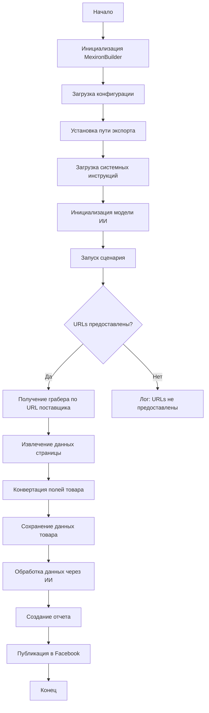
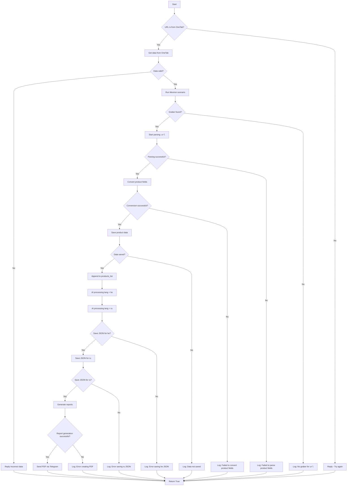

# Сценарий создания мехирона для Сергея Казаринова

## Обзор

Этот скрипт является частью директории `hypotez/src/endpoints/kazarinov/scenarios` и предназначен для автоматизации процесса создания "мехирона" для Сергея Казаринова. Скрипт извлекает, парсит и обрабатывает данные о товарах от различных поставщиков, подготавливает данные, обрабатывает их через ИИ и интегрирует с Facebook для публикации товаров.

## Основные возможности

1. **Извлечение и парсинг данных**: Извлекает и парсит данные о товарах от различных поставщиков.
2. **Обработка данных через ИИ**: Обрабатывает извлеченные данные через модель Google Generative AI.
3. **Хранение данных**: Сохраняет обработанные данные в файлы.
4. **Генерация отчетов**: Генерирует HTML и PDF отчеты из обработанных данных.
5. **Публикация в Facebook**: Публикует обработанные данные в Facebook.

## Блок-схема модуля



## Легенда

1. **Start**: Начало выполнения скрипта.
2. **InitMexironBuilder**: Инициализация класса `MexironBuilder`.
3. **LoadConfig**: Загрузка конфигурации из JSON файла.
4. **SetExportPath**: Установка пути для экспорта данных.
5. **LoadSystemInstruction**: Загрузка системных инструкций для модели ИИ.
6. **InitModel**: Инициализация модели Google Generative AI.
7. **RunScenario**: Выполнение основного сценария.
8. **CheckURLs**: Проверка, предоставлены ли URLs для парсинга.
9. **GetGraber**: Получение соответствующего грабера для URL поставщика.
10. **GrabPage**: Извлечение данных страницы с помощью грабера.
11. **ConvertFields**: Конвертация полей товара в словарь.
12. **SaveData**: Сохранение данных товара в файл.
13. **ProcessAI**: Обработка данных товара через модель ИИ.
14. **CreateReport**: Создание HTML и PDF отчетов из обработанных данных.
15. **PostFacebook**: Публикация обработанных данных в Facebook.
16. **End**: Конец выполнения скрипта.

## Классы

### `MexironBuilder`

**Описание**: Класс `MexironBuilder` отвечает за управление процессом создания мехирона. Он объединяет в себе функции для извлечения данных о товарах, обработки их через ИИ, генерации отчетов и публикации в Facebook.

**Атрибуты**:

- `driver`: Экземпляр Selenium WebDriver.
- `export_path`: Путь для экспорта данных.
- `mexiron_name`: Пользовательское имя для процесса мехирона.
- `price`: Цена для обработки.
- `timestamp`: Метка времени для процесса.
- `products_list`: Список обработанных данных о товарах.
- `model`: Модель Google Generative AI.
- `config`: Конфигурация, загруженная из JSON.

**Методы**:

#### `__init__(self, driver: Driver, mexiron_name: Optional[str] = None)`

- **Назначение**: Инициализирует класс `MexironBuilder` с необходимыми компонентами.
- **Параметры**:
  - `driver`: Экземпляр Selenium WebDriver.
  - `mexiron_name`: Пользовательское имя для процесса мехирона.

#### `run_scenario(self, system_instruction: Optional[str] = None, price: Optional[str] = None, mexiron_name: Optional[str] = None, urls: Optional[str | List[str]] = None, bot = None) -> bool`

- **Назначение**: Выполняет сценарий: парсит товары, обрабатывает их через ИИ и сохраняет данные.
- **Параметры**:
  - `system_instruction`: Системные инструкции для модели ИИ.
  - `price`: Цена для обработки.
  - `mexiron_name`: Пользовательское имя мехирона.
  - `urls`: URLs страниц товаров.
- **Возвращает**: `True`, если сценарий выполнен успешно, иначе `False`.
- **Блок-схема**:



- **Легенда**:
1. **Начало (Start)**: Сценарий начинает выполнение. 

2. **Проверка источника URL (IsOneTab)**:
   - Если URL из OneTab, данные извлекаются из OneTab.
   - Если URL не из OneTab, пользователю отправляется сообщение "Try again".
3. **Проверка валидности данных (IsDataValid)**:
   - Если данные не валидны, пользователю отправляется сообщение "Incorrect data".
   - Если данные валидны, запускается сценарий Mexiron.
4. **Поиск грабера (IsGraberFound)**:
   - Если грабер найден, начинается парсинг страницы.
   - Если грабер не найден, логируется сообщение о том, что грабер отсутствует для данного URL.
5. **Парсинг страницы (StartParsing)**:
   - Если парсинг успешен, данные преобразуются в нужный формат.
   - Если парсинг не удался, логируется ошибка.
6. **Преобразование данных (ConvertProductFields)**:
   - Если преобразование успешно, данные сохраняются.
   - Если преобразование не удалось, логируется ошибка.
7. **Сохранение данных (SaveProductData)**:
   - Если данные сохранены, они добавляются в список товаров.
   - Если данные не сохранены, логируется ошибка.
8. **Обработка через AI (ProcessAIHe, ProcessAIRu)**:
   - Данные обрабатываются AI для языков `he` (иврит) и `ru` (русский).
9. **Сохранение JSON (SaveHeJSON, SaveRuJSON)**:
   - Результаты обработки сохраняются в формате JSON для каждого языка.
   - Если сохранение не удалось, логируется ошибка.
10. **Генерация отчетов (GenerateReports)**:
    - Создаются HTML и PDF отчеты для каждого языка.
    - Если создание отчета не удалось, логируется ошибка.
11. **Отправка PDF через Telegram (SendPDF)**:
    - PDF-файлы отправляются через Telegram.
    - Если отправка не удалась, логируется ошибка.
12. **Завершение (ReturnTrue)**:
    - Сценарий завершается, возвращая `True`.

#### **Логи ошибок**:
- На каждом этапе, где возможны ошибки, добавлены узлы для логирования ошибок (например, `LogNoGraber`, `LogParsingFailed`, `LogHeJSONError` и т.д.).

#### `get_graber_by_supplier_url(self, url: str)`

- **Назначение**: Возвращает соответствующий грабер для данного URL поставщика.
- **Параметры**:
  - `url`: URL страницы поставщика.
- **Возвращает**: Экземпляр грабера, если найден, иначе `None`.

#### `convert_product_fields(self, f: ProductFields) -> dict`

- **Назначение**: Конвертирует поля товара в словарь.
- **Параметры**:
  - `f`: Объект, содержащий парсированные данные о товаре.
- **Возвращает**: Форматированный словарь данных о товаре.

#### `save_product_data(self, product_data: dict)`

- **Назначение**: Сохраняет данные о товаре в файл.
- **Параметры**:
  - `product_data`: Форматированные данные о товаре.

#### `process_llm(self, products_list: List[str], lang: str, attempts: int = 3) -> tuple | bool`

- **Назначение**: Обрабатывает список товаров через модель ИИ.
- **Параметры**:
  - `products_list`: Список словарей данных о товарах в виде строки.
  - `attempts`: Количество попыток повторного запроса в случае неудачи.
- **Возвращает**: Обработанный ответ в форматах `ru` и `he`.

#### `post_facebook(self, mexiron: SimpleNamespace) -> bool`

- **Назначение**: Выполняет сценарий публикации в Facebook.
- **Параметры**:
  - `mexiron`: Обработанные данные для публикации.
- **Возвращает**: `True`, если публикация успешна, иначе `False`.

#### `create_report(self, data: dict, html_file: Path, pdf_file: Path)`

- **Назначение**: Генерирует HTML и PDF отчеты из обработанных данных.
- **Параметры**:
  - `data`: Обработанные данные.
  - `html_file`: Путь для сохранения HTML отчета.
  - `pdf_file`: Путь для сохранения PDF отчета.

## Использование

Для использования этого скрипта выполните следующие шаги:

1. **Инициализация Driver**: Создайте экземпляр класса `Driver`.
2. **Инициализация MexironBuilder**: Создайте экземпляр класса `MexironBuilder` с драйвером.
3. **Запуск сценария**: Вызовите метод `run_scenario` с необходимыми параметрами.

#### Пример

```python
from src.webdriver.driver import Driver
from src.endpoints.kazarinov.scenarios.scenario_pricelist import MexironBuilder

# Инициализация Driver
driver = Driver(...)

# Инициализация MexironBuilder
mexiron_builder = MexironBuilder(driver)

# Запуск сценария
urls = ['https://example.com/product1', 'https://example.com/product2']
mexiron_builder.run_scenario(urls=urls)
```

## Зависимости

- `selenium`: Для веб-автоматизации.
- `asyncio`: Для асинхронных операций.
- `pathlib`: Для обработки путей к файлам.
- `types`: Для создания простых пространств имен.
- `typing`: Для аннотаций типов.
- `src.ai.gemini`: Для обработки данных через ИИ.
- `src.suppliers.*.graber`: Для извлечения данных от различных поставщиков.
- `src.endpoints.advertisement.facebook.scenarios`: Для публикации в Facebook.

## Обработка ошибок

Скрипт включает надежную обработку ошибок, чтобы обеспечить продолжение выполнения даже в случае, если некоторые элементы не найдены или если возникли проблемы с веб-страницей. Это особенно полезно для обработки динамических или нестабильных веб-страниц.

## Вклад

Вклад в этот скрипт приветствуется. Пожалуйста, убедитесь, что любые изменения хорошо документированы и включают соответствующие тесты.

## Лицензия

Этот скрипт лицензирован под MIT License. Подробности смотрите в файле `LICENSE`.