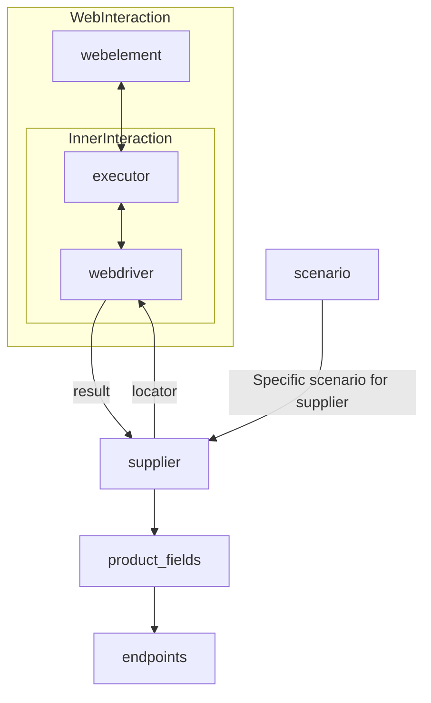

# ИНСТРУКЦИЯ

Предоставленный ниже код - часть проекта `hypotez`. Задача: создать документацию для разработчика в формате `Markdown` для каждого входного Python-файла.
Документация должна соответствовать следующим требованиям:

1. **Формат документации**:
   - Используй стандарт `Markdown (.md)`.
   - Каждый файл должен начинаться с заголовка и краткого описания его содержимого.

   Примеры документации: Пример загаоловка файла модуля:

        """
        Модуль для работы с ассистентом программиста
        =================================================

        Модуль содержит класс :class:`CodeAssistant`, который используется для взаимодействия с различными AI-моделями
        (например, Google Gemini и OpenAI) и выполнения задач обработки кода.

        Пример использования
        ----------------------

        >>>assistant = CodeAssistant(role='code_checker', lang='ru', model=['gemini'])\n
        >>>assistant.process_files()
        """

   - Для всех классов и функций используйте следующий формат комментариев:
     ```python
     class MyClass:
         """Описание назначения класса
         Inherits:
            Если класс наследует другой - дай описание наследования

         Attributes:
            param1 (str): Описание параметров (атрибуты) класса

         Methods:
            function_1(): Описание назаначения функций/методов класса
        """

         def function(param: str, param1: Optional[str | dict | str] = None) -> dict | None:
             """ Функция выполняет некоторое действия... <Тут Ты пишешь что именно делает функция>
             Args:
                 param (str): Описание параметра `param`.
                 param1 (Optional[str | dict | str], optional): Описание параметра `param1`. По умолчанию `None`.

             Returns:
                 dict | None: Описание возвращаемого значения. Возвращает словарь или `None`.

             Raises:
                 SomeError: Описание ситуации, в которой возникает исключение `SomeError`.
                ...\n
                <Выводить тело функции НЕ НАДО. Только docstring>
             """
             def inner_function():
                """ Внутрняя функция Функция выполняет некоторое действия... <Тут Ты пишешь что именно делает функция>
                    Args:
                        param (str): Описание параметра `param`.
                        param1 (Optional[str | dict | str], optional): Описание параметра `param1`. По умолчанию `None`.

                    Returns:
                        dict | None: Описание возвращаемого значения. Возвращает словарь или `None`.

                    Raises:
                        SomeError: Описание ситуации, в которой возникает исключение `SomeError`.

                    ...\n

                      НЕ ВЫВОДИ КОД ФУНКЦИИ. ТОЛЬКО DOCSTR

                    """
         ```
     - Все комментарии в фунцкии и docstring должны быть на русском языке в формате UTF-8
     - Если внутри рассматривемой функции есть внутренние функции - рассматривай подробно каждую из них по отдельности

   - Используй `ex` вместо `e` в блоках обработки исключений.
   - Для логгирования используй `logger` из моего модуля `src.logger`. Например:
     ```python
     from src.logger import logger
     logger.info('Some information message')
     ...\n
     except SomeError as ex:\n
         logger.error('Some error message', ex, exc_info = True), где ошибка передается вторым аргументом. exc_info определает надо ли выводить служебную информацию.
    ```

    _ Если в коде используется вебдрайвер, знай как его использовать
    наследуй Driver, Chrome, Firexox, Playwright
    Далее определи так
    # Создание инстанса драйвера (пример с Chrome)
    driver = Drivewr(Chrome)
    В модулях Driver И Chrome, Firexox, Playwright уже содержатся все настройки selenium.
    Основная комада, которая используется в коде: `driver.execute_locator(l:dict)`
    Она возвращает аначение вебэелемента по локатору.

   - Все комментарии и docstring должны быть на русском языке в формате UTF-8. Если в коде docsting на английском - сделай перевеод на русский

2. **Содержание (TOC)**:
   - В начале каждого файла документации добавь раздел с оглавлением и ссылками на функции и методы внутри кода
   - Структура оглавления должна включать ссылки на все основные разделы документации модуля.

3. **Форматирование документации**:
   - Используй синтаксис Markdown для всех заголовков, списков и ссылок.
   - Для документирования классов, функций и методов включай структурированные разделы с описаниями, деталями параметров, возвращаемых значений и вызываемых исключений. Пример:

    ## Классы

    ### `class_name`
    Описание назначения класса
        **Наследует**
            Если класс наследует другой - дай описание наследования

         **Аттрибуты**:
            param1 (str): Описание параметров (атрибуты) класса

         **Методы**:
            function_1(): Описание назаначения функций/методов класса

     ## Функции

     ### `function_name`

     **Назначение**: Назначение функции.

     **Параметры**:
     - `param` (str): Описание параметра `param`.
     - `param1` (Optional[str | dict | str], optional): Описание параметра `param1`. По умолчанию `None`.

     **Возвращает**:
     - `dict | None`: Описание возвращаемого значения.

     **Вызывает исключения**:
     - `SomeError`: Описание ситуации, в которой возникает исключение `SomeError`.

     Если внутри функции есть внутренние фуйнкции - рассмотри их по отдельности каждую
     **Внутренние функции**: Если есть

     **Как работает функция**:
     - Подробно объясни назначиение функции. Сдеалай подробное описание того, какие действия преобразования происходит в теле функции

     **Примеры**:
     - Создай несколько примеров вызова функции с разными параметрами, которые передающтся в функцию

4. **Заголовки разделов**:
   - Используйте заголовки первого уровня (`#`), второго уровня (`##`), третьего уровня (`###`) и четвёртого уровня (`####`) последовательно на протяжении всего файла.

5. **Пример файла**:

   # Название модуля

   ## Обзор

   Краткое описание назначения модуля.

   ## Подорбней

   Более подробное описание. Объясни как и зачем используется данный код в проекте.
   Анализируй предоставленный тебе ранее код

   ## Классы

   ### `ClassName`

   **Описание**: Описание класса.
   **Наследует**:
   **Атрибуты**:
   **Параметры**:

    **Принцип работы**:
        Объясни  работу класса. Если класс сложный сдеалай подорбный разбор кода

   Сделай документацию для КАЖДОЙ функции или метода. Объясни назначение каждой переменной.
   - Все комментарии и docstring должны быть на русском языке в формате UTF-8. Если в оригинальном коде текст написан на английском - переводи его на русский

   **Методы**: # если есть методы
   - `method_name`: Краткое описание метода.
   - `method_name`: Краткое описание метода.
   **Параметры**: # если есть параметры
   - `param` (str): Описание параметра `param`.
   - `param1` (Optional[str | dict | str], optional): Описание параметра `param1`. По умолчанию `None`.
   **Примеры**
   - Примеры определения класса и работы с классом

   ## Методы класса

   ### `function_name`

   ```python
   def my_func(param1:str, param2:Optional[int] = 0) -> bool:
       """ Функция выполняет некоторое действия... <Тут Ты пишешь что именно делает функция>
       Args:
           param1 (str): Описание параметра `param1`.
           param2 (Optional[int], optional): Описание параметра `param2`. По умолчанию 0.
       Returns:
           bool: Описание возвращаемого значения. Возвращает `True` или `False`.

        Raises:
             Ошибка выполнение

        Example:
            Примеры вызовов со всем спектром параметров. которы можно передать в функцию

       """
       - Не отдавай код функции. Только документацию и примеры вызова функции;
       - Все комментарии и docstring должны быть на русском языке в формате UTF-8
   ```

   ## Параметры класса
   - `param` (str): Более подробное Описание параметра `param`.
   - `param1` (Optional[str | dict | str], optional): Более подробное Описание параметра `param1`. По умолчанию `None`.

   **Примеры**: # Все возможные варианты примеров вызова функции с разными параметрами

   -------------------------------------------------------------------------------------

## Твое поведение при анализе кода:
- внутри кода ты можешь встретить выражение между `<` `>`. Например: <инструкция для модели gemini:Загрузка описаний продуктов в PrestaShop.>, <далее, если есть>. Это заготовки, куда ты вставляешь релевантное значение
- всегда смотри системную инструкцию для обработки кода проекта `hypotez`;
- анализируй расположение файла в проекте. Это поможет понять его назначение и взаимосвязь с другими файлами. Расположение файла ты найдешь в самой превой строке кода, начинающейся с `## \\file /...`;
- запоминай предоставленный код и анализируй его связь с другими частями проекта;
- В этой инструкции не надо предлагать улучшение кода. Четко следуй пункту 5. **Пример файла** при составлении ответа

# КОНЕЦ ИНСТРУКЦИИ
```

# Модуль `suppliers`

## Обзор

Этот файл документации предоставляет обзор и информацию о классе `Supplier` и связанных с ним поставщиках в проекте `hypotez`. Класс `Supplier` является базовым классом для всех поставщиков и унифицирует взаимодействие с различными источниками данных, такими как веб-сайты, документы и базы данных.

## Подробнее

В контексте данного кода `Supplier` представляет собой поставщика информации. Поставщик может быть производителем товаров, данных или информации. Источники поставщика включают целевую страницу веб-сайта, документ, базу данных или таблицу. Этот класс объединяет разных поставщиков под стандартизированным набором операций. У каждого поставщика есть уникальный префикс.

Класс `Supplier` служит основой для управления взаимодействием с поставщиками. Он обрабатывает инициализацию, конфигурацию, аутентификацию и выполнение рабочих процессов для различных источников данных, таких как `amazon.com`, `walmart.com`, `mouser.com` и `digikey.com`. Клиенты также могут определять дополнительных поставщиков.

## Классы

### `Supplier`

**Описание**: Базовый класс для всех поставщиков. Представляет собой поставщика информации, такого как производитель товаров, данных или информации.

**Наследует**: Отсутствует

**Атрибуты**:

*   отсутствуют явно в предоставленном тексте, но подразумеваются конфигурационные параметры и параметры аутентификации.

**Методы**:

*   В предоставленном тексте методы явно не указаны, но подразумеваются методы для инициализации, конфигурации, аутентификации и выполнения рабочих процессов.

**Принцип работы**:
Класс `Supplier` служит основой для управления взаимодействием с поставщиками. Он обрабатывает инициализацию, конфигурацию, аутентификацию и выполнение рабочих процессов для различных источников данных.

## Список реализованных поставщиков:

*   `aliexpress` - Реализован с двумя рабочими процессами: `webdriver` и `api`
*   `amazon` - `webdriver`
*   `bangood` - `webdriver`
*   `cdata` - `webdriver`
*   `chat_gpt` - Взаимодействует с интерфейсом ChatGPT (НЕ С МОДЕЛЬЮ!)
*   `ebay` - `webdriver`
*   `etzmaleh` - `webdriver`
*   `gearbest` - `webdriver`
*   `grandadvance` - `webdriver`
*   `hb` - `webdriver`
*   `ivory` - `webdriver`
*   `ksp` - `webdriver`
*   `kualastyle` - `webdriver`
*   `morlevi` - `webdriver`
*   `visualdg` - `webdriver`
*   `wallashop` - `webdriver`
*   `wallmart` - `webdriver`

## Диаграмма взаимодействия

Ниже представлена диаграмма взаимодействия между различными компонентами системы:



*   `WebInteraction`: Подграф, описывающий взаимодействие с веб-элементами через исполнитель (executor) и веб-драйвер (webdriver).
*   `InnerInteraction`: Подграф, описывающий внутреннее взаимодействие между исполнителем и веб-драйвером.
*   `webdriver`: Веб-драйвер, который получает локаторы от поставщика и возвращает результаты.
*   `supplier`: Поставщик, который предоставляет локаторы для веб-драйвера и определяет поля продукта.
*   `product_fields`: Поля продукта, которые используются для определения конечных точек.
*   `endpoints`: Конечные точки, которые используются для получения данных о продукте.
*   `scenario`: Сценарий, который определяет конкретный рабочий процесс для поставщика.

## Ссылки

*   [Details on WebDriver :class: `Driver`](../webdriver)
*   [Details on workflows :class: `Scenario`](../scenarios)