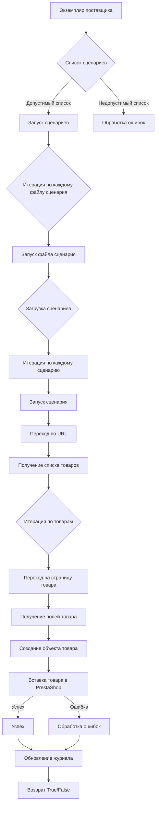

# Модуль `src.scenario`

## Обзор

Модуль `src.scenario` предназначен для автоматизации взаимодействия с поставщиками, используя сценарии, описанные в JSON-файлах. Он упрощает процесс извлечения и обработки данных о товарах с сайтов поставщиков, синхронизируя эту информацию с базой данных (например, PrestaShop). Модуль включает в себя функциональность для чтения сценариев, взаимодействия с веб-сайтами, обработки данных, ведения журнала выполнения, а также организации всего рабочего процесса.

## Таблица содержания

* [Модуль `src.scenario`](#module-src-scenario)
* [Обзор](#overview)
* [Основные функции модуля](#core-functions-of-the-module)
* [Основные компоненты модуля](#main-components-of-the-module)
    * [`run_scenario_files(s, scenario_files_list)`](#run_scenario_files-s-scenario_files_list)
    * [`run_scenario_file(s, scenario_file)`](#run_scenario_file-s-scenario_file)
    * [`run_scenario(s, scenario)`](#run_scenario-s-scenario)
    * [`dump_journal(s, journal)`](#dump_journal-s-journal)
    * [`main()`](#main)
* [Пример сценария](#example-scenario)
* [Как это работает](#how-it-works)

## Основные функции модуля

1. **Чтение сценариев**: Загрузка сценариев из JSON-файлов, содержащих информацию о товарах и URL-адресах на сайте поставщика.
2. **Взаимодействие с веб-сайтами**: Обработка URL-адресов из сценариев для извлечения данных о товарах.
3. **Обработка данных**: Преобразование извлеченных данных в формат, подходящий для базы данных, и сохранение их.
4. **Ведение журнала выполнения**: Сохранение журналов с подробной информацией о выполнении сценариев и результатах для отслеживания хода выполнения и выявления ошибок.




## Основные компоненты модуля

### `run_scenario_files(s, scenario_files_list)`

**Описание**: Принимает список файлов сценариев и последовательно выполняет их, вызывая функцию `run_scenario_file` для каждого файла.

**Параметры**:
- `s`: Объект настроек (например, для подключения к базе данных).
- `scenario_files_list` (list): Список путей к файлам сценариев.

**Возвращает**:
- None

**Вызывает исключения**:
- `FileNotFoundError`: Если файл сценария не найден.
- `JSONDecodeError`: Если файл сценария содержит неверный JSON.

### `run_scenario_file(s, scenario_file)`

**Описание**: Загружает сценарии из указанного файла и вызывает `run_scenario` для каждого сценария в файле.

**Параметры**:
- `s`: Объект настроек.
- `scenario_file` (str): Путь к файлу сценария.

**Возвращает**:
- None

**Вызывает исключения**:
- `FileNotFoundError`: Если файл сценария не найден.
- `JSONDecodeError`: Если файл сценария содержит неверный JSON.
- `Exception`: Для любых других проблем во время выполнения сценария.

### `run_scenario(s, scenario)`

**Описание**: Обрабатывает отдельный сценарий, переходя по URL-адресу, извлекая данные о товарах и сохраняя их в базу данных.

**Параметры**:
- `s`: Объект настроек.
- `scenario` (dict): Словарь, содержащий сценарий (например, с URL и категориями).

**Возвращает**:
- None

**Вызывает исключения**:
- `requests.exceptions.RequestException`: Если возникли проблемы с запросом к веб-сайту.
- `Exception`: Для любых других проблем во время обработки сценария.

### `dump_journal(s, journal)`

**Описание**: Сохраняет журнал выполнения в файл для последующего анализа.

**Параметры**:
- `s`: Объект настроек.
- `journal` (list): Список записей журнала выполнения.

**Возвращает**:
- None

**Вызывает исключения**:
- `Exception`: Если возникли проблемы с записью в файл.

### `main()`

**Описание**: Основная функция для запуска модуля.

**Параметры**:
- None

**Возвращает**:
- None

**Вызывает исключения**:
- `Exception`: Для любых критических ошибок во время выполнения.

## Пример сценария

Пример JSON-сценария описывает взаимодействия с категориями товаров на веб-сайте. Он включает в себя URL-адрес, название категории и идентификаторы категорий в базе данных PrestaShop.

```json
{
    "scenarios": {
        "mineral+creams": {
            "url": "https://example.com/category/mineral-creams/",
            "name": "mineral+creams",
            "presta_categories": {
                "default_category": 12345,
                "additional_categories": [12346, 12347]
            }
        }
    }
}
```

## Как это работает

Модуль `src.scenario` работает, последовательно обрабатывая сценарии, описанные в JSON-файлах. Для каждого сценария модуль выполняет следующие действия:

1. **Загрузка сценария**: Модуль загружает сценарий из JSON-файла, получая информацию о товарах и URL-адресах.
2. **Взаимодействие с веб-сайтом**: Модуль переходит на веб-сайт, используя URL-адрес из сценария.
3. **Извлечение данных о товарах**: Модуль извлекает данные о товарах с веб-сайта, используя информацию из сценария.
4. **Обработка данных**: Модуль преобразует извлеченные данные в формат, подходящий для базы данных.
5. **Сохранение данных**: Модуль сохраняет обработанные данные в базу данных (например, PrestaShop).
6. **Обновление журнала**: Модуль записывает информацию о выполнении сценария в журнал.

Модуль `src.scenario` использует веб-драйвер для взаимодействия с веб-сайтами. Веб-драйвер может быть установлен с использованием Selenium или Playwright. 

```python
from src.webdriver import Driver, Chrome, Firefox, Playwright, ...

driver = Driver(Chrome)

close_banner = {
  "attribute": null,
  "by": "XPATH",
  "selector": "//button[@id = 'closeXButton']",
  "if_list": "first",
  "use_mouse": false,
  "mandatory": false,
  "timeout": 0,
  "timeout_for_event": "presence_of_element_located",
  "event": "click()",
  "locator_description": "Закрываю pop-up окно, если оно не появилось - не страшно (`mandatory`:`false`)"
}

result = driver.execute_locator(close_banner)
```
 
Модуль также использует `logger` для ведения журнала выполнения. 

```python
from src.logger import logger
logger.info('Some information message')
...
except SomeError as ex:
    logger.error('Some error message', ex, exc_info = True) 
```

## Твое поведение при анализе кода:

- внутри кода ты можешь встретить выражение между `<` `>`. Например: <инструкция для модели gemini:Загрузка описаний продуктов в PrestaShop.>, <далее, если есть>. Это заготовки, куда ты вставляешь релевантное значение
- всегда смотри системную инструкцию для обработки кода проекта `hypotez`;
- анализируй расположение файла в проекте. Это поможет понять его назначение и взаимосвязь с другими файлами. Расположение файла ты найдешь в самой превой строке кода, начинающейся с `## \\file /...`;
- запоминай предоставленный код и анализируй его связь с другими частями проекта;
- В этой инструкции не надо предлагать улучшение кода. Четко следуй пункту 5. **Пример файла** при составлении ответа 

# КОНЕЦ ИНСТРУКЦИИ