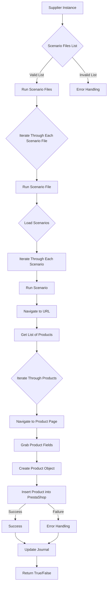

# Модуль `src.scenario`

## Обзор

Модуль `src.scenario` предназначен для автоматизации взаимодействия с поставщиками с использованием сценариев, описанных в JSON-файлах. Он оптимизирует процесс извлечения и обработки данных о товарах с веб-сайтов поставщиков и синхронизирует эту информацию с базой данных (например, PrestaShop). Модуль включает функциональность для чтения сценариев, взаимодействия с веб-сайтами, обработки данных, ведения журналов выполнения и организации всего рабочего процесса.

## Содержание

* [Модуль `src.scenario`](#модуль-srcscenario)
* [Обзор](#обзор)
* [Основные функции модуля](#основные-функции-модуля)
* [Основные компоненты модуля](#основные-компоненты-модуля)
    * [`run_scenario_files(s, scenario_files_list)`](#run_scenario_files-s-scenario_files_list)
    * [`run_scenario_file(s, scenario_file)`](#run_scenario_file-s-scenario_file)
    * [`run_scenario(s, scenario)`](#run_scenario-s-scenario)
    * [`dump_journal(s, journal)`](#dump_journal-s-journal)
    * [`main()`](#main)
* [Пример сценария](#пример-сценария)
* [Как это работает](#как-это-работает)

## Основные функции модуля

1. **Чтение сценариев**: Загрузка сценариев из JSON-файлов, содержащих информацию о товарах и URL-адреса на веб-сайте поставщика.
2. **Взаимодействие с веб-сайтами**: Обработка URL-адресов из сценариев для извлечения данных о товарах.
3. **Обработка данных**: Преобразование извлеченных данных в формат, подходящий для базы данных, и их сохранение.
4. **Ведение журнала выполнения**: Ведение журналов с подробной информацией о выполнении сценариев и результатах для отслеживания прогресса и выявления ошибок.



## Основные компоненты модуля

### `run_scenario_files(s, scenario_files_list)`

**Описание**: Принимает список файлов сценариев и выполняет их последовательно, вызывая функцию `run_scenario_file` для каждого файла.

**Параметры**:
- `s`: Объект настроек (например, для подключения к базе данных).
- `scenario_files_list` (list): Список путей к файлам сценариев.

**Возвращает**:
- `None`

**Вызывает исключения**:
- `FileNotFoundError`: Если файл сценария не найден.
- `JSONDecodeError`: Если файл сценария содержит неверный JSON.

### `run_scenario_file(s, scenario_file)`

**Описание**: Загружает сценарии из указанного файла и вызывает `run_scenario` для каждого сценария в файле.

**Параметры**:
- `s`: Объект настроек.
- `scenario_file` (str): Путь к файлу сценария.

**Возвращает**:
- `None`

**Вызывает исключения**:
- `FileNotFoundError`: Если файл сценария не найден.
- `JSONDecodeError`: Если файл сценария содержит неверный JSON.
- `Exception`: При любых других проблемах во время выполнения сценария.

### `run_scenario(s, scenario)`

**Описание**: Обрабатывает отдельный сценарий, переходя по URL-адресу, извлекая данные о товарах и сохраняя их в базе данных.

**Параметры**:
- `s`: Объект настроек.
- `scenario` (dict): Словарь, содержащий сценарий (например, с URL-адресом и категориями).

**Возвращает**:
- `None`

**Вызывает исключения**:
- `requests.exceptions.RequestException`: Если есть проблемы с запросом к веб-сайту.
- `Exception`: При любых других проблемах во время обработки сценария.

### `dump_journal(s, journal)`

**Описание**: Сохраняет журнал выполнения в файл для последующего анализа.

**Параметры**:
- `s`: Объект настроек.
- `journal` (list): Список записей журнала выполнения.

**Возвращает**:
- `None`

**Вызывает исключения**:
- `Exception`: Если есть проблемы с записью в файл.

### `main()`

**Описание**: Главная функция для запуска модуля.

**Параметры**:
- `None`

**Возвращает**:
- `None`

**Вызывает исключения**:
- `Exception`: При любых критических ошибках во время выполнения.

## Пример сценария

Пример JSON-сценария описывает взаимодействие с категориями товаров на веб-сайте. Он включает URL-адрес, название категории и идентификаторы категорий в базе данных PrestaShop.

```json
{
    "scenarios": {
        "mineral+creams": {
            "url": "https://example.com/category/mineral-creams/",
            "name": "mineral+creams",
            "presta_categories": {
                "default_category": 12345,
                "additional_categories": [12346, 12347]
            }
        }
    }
}
```
## Как это работает
Модуль `src.scenario` автоматизирует процесс взаимодействия с веб-сайтами поставщиков для сбора и синхронизации данных о товарах. Он использует JSON-сценарии для определения того, как взаимодействовать с сайтом поставщика, какие данные извлекать и как их преобразовывать для последующей загрузки в базу данных PrestaShop. 

В основе работы модуля лежит последовательное выполнение следующих шагов:

1. **Загрузка сценариев**: Функция `run_scenario_files` принимает список файлов сценариев, каждый из которых содержит один или несколько сценариев взаимодействия с сайтом поставщика. Функция `run_scenario_file` отвечает за загрузку этих сценариев из JSON-файлов.

2. **Выполнение сценариев**: Для каждого сценария функция `run_scenario` выполняет следующие действия:
   - Переходит по указанному URL-адресу на сайте поставщика.
   - Извлекает данные о товарах, используя определенные в сценарии селекторы и правила.
   - Преобразует извлеченные данные в формат, совместимый с базой данных PrestaShop.
   - Сохраняет полученные данные в базе данных PrestaShop.

3. **Ведение журнала**: В процессе выполнения каждого сценария модуль ведет журнал, в котором фиксируются все важные события и результаты. Это позволяет отслеживать прогресс выполнения сценариев, выявлять ошибки и анализировать полученные данные.

4. **Обработка ошибок**: В случае возникновения каких-либо ошибок в процессе выполнения сценария модуль регистрирует их в журнале и предпринимает соответствующие действия для их обработки. Это может включать в себя повторные попытки выполнения операции, уведомление администратора или прекращение выполнения сценария.

5. **Сохранение журнала**: После завершения выполнения всех сценариев модуль сохраняет журнал выполнения в файл для последующего анализа.

Главная функция `main` отвечает за запуск всего процесса. Она загружает необходимые настройки, определяет список файлов сценариев и запускает функцию `run_scenario_files` для их выполнения.

Таким образом, модуль `src.scenario` предоставляет гибкий и автоматизированный способ взаимодействия с веб-сайтами поставщиков для сбора и синхронизации данных о товарах, что позволяет существенно упростить и ускорить процесс наполнения базы данных PrestaShop.