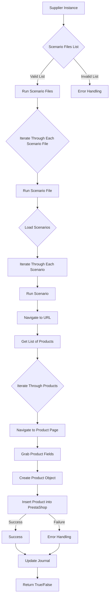

# Модуль `src.scenario`

## Обзор

Модуль `src.scenario` предназначен для автоматизации взаимодействия с поставщиками, используя сценарии, описанные в JSON-файлах. Он адаптирует процесс извлечения и обработки данных о продуктах с веб-сайтов поставщиков и синхронизирует эту информацию с базой данных (например, PrestaShop). Модуль включает чтение сценариев, взаимодействие с веб-сайтами, обработку данных, запись журнала выполнения и организацию всего процесса.

## Оглавление

* [Модуль `src.scenario`](#модуль-srcscenario)
* [Обзор](#обзор)
* [Подробнее](#подробнее)
* [Основные функции модуля](#основные-функции-модуля)
* [Основные компоненты модуля](#основные-компоненты-модуля)
    * [`run_scenario_files(s, scenario_files_list)`](#run_scenario_files-s-scenario_files_list)
    * [`run_scenario_file(s, scenario_file)`](#run_scenario_file-s-scenario_file)
    * [`run_scenario(s, scenario)`](#run_scenario-s-scenario)
    * [`dump_journal(s, journal)`](#dump_journal-s-journal)
    * [`main()`](#main)
* [Пример сценария](#пример-сценария)
* [Как это работает](#как-это-работает)

## Подробнее

Модуль `src.scenario` предоставляет инструменты для автоматизации процесса сбора и интеграции данных о товарах от различных поставщиков. Он позволяет настроить сценарии, описывающие, как извлекать информацию о товарах с веб-сайтов поставщиков и как её преобразовывать для последующей загрузки в базу данных, например, PrestaShop. Ведение журнала выполнения обеспечивает возможность отслеживания процесса и быстрого выявления ошибок.

## Основные функции модуля

1.  **Чтение сценариев**: Загрузка сценариев из JSON-файлов, содержащих информацию о продуктах и их URL на сайте поставщика.
2.  **Взаимодействие с веб-сайтами**: Обработка URL-адресов из сценариев для извлечения данных о продуктах.
3.  **Обработка данных**: Преобразование извлечённых данных в формат, подходящий для базы данных, и сохранение в неё.
4.  **Запись журнала выполнения**: Ведение журнала с деталями выполнения сценариев и результатами работы для отслеживания процесса и выявления ошибок.



## Основные компоненты модуля

### `run_scenario_files(s, scenario_files_list)`

**Описание**: Принимает список файлов сценариев и выполняет их по очереди, вызывая функцию `run_scenario_file` для каждого файла.

**Параметры**:

*   `s`: Объект настроек (например, для соединения с базой данных).
*   `scenario_files_list` (list): Список путей к файлам сценариев.

**Возвращает**:

*   `None`

**Вызывает исключения**:

*   `FileNotFoundError`: Если файл сценария не найден.
*   `JSONDecodeError`: Если файл сценария содержит невалидный JSON.

**Как работает функция**:

Функция `run_scenario_files` получает на вход объект настроек `s` и список путей к файлам сценариев `scenario_files_list`. Затем она итерируется по этому списку, вызывая для каждого файла функцию `run_scenario_file`, которая обрабатывает сценарии, содержащиеся в файле. Если во время обработки какого-либо файла возникает исключение, функция логирует ошибку, но продолжает выполнение со следующим файлом.

**Примеры**:

```python
# Пример вызова функции с объектом настроек и списком файлов сценариев
settings = {}  # Объект настроек (в данном примере пустой)
scenario_files = ['scenario1.json', 'scenario2.json', 'scenario3.json']
run_scenario_files(settings, scenario_files)
```

### `run_scenario_file(s, scenario_file)`

**Описание**: Загружает сценарии из указанного файла и вызывает `run_scenario` для каждого сценария в файле.

**Параметры**:

*   `s`: Объект настроек.
*   `scenario_file` (str): Путь к файлу сценария.

**Возвращает**:

*   `None`

**Вызывает исключения**:

*   `FileNotFoundError`: Если файл сценария не найден.
*   `JSONDecodeError`: Если файл сценария содержит невалидный JSON.
*   `Exception`: При любых других проблемах при работе со сценариями.

**Как работает функция**:

Функция `run_scenario_file` принимает объект настроек `s` и путь к файлу сценария `scenario_file`. Функция пытается открыть и прочитать JSON-файл, используя путь `scenario_file`. Если файл не существует или содержит невалидный JSON, функция фиксирует исключение. В случае успеха функция вызывает `run_scenario` для каждого сценария в файле.

**Примеры**:

```python
# Пример вызова функции с объектом настроек и путем к файлу сценария
settings = {}  # Объект настроек (в данном примере пустой)
scenario_file = 'scenario.json'
run_scenario_file(settings, scenario_file)
```

### `run_scenario(s, scenario)`

**Описание**: Обрабатывает отдельный сценарий. Переходит по URL, извлекает данные о продуктах и сохраняет их в базе данных.

**Параметры**:

*   `s`: Объект настроек.
*   `scenario` (dict): Словарь, содержащий сценарий (например, с URL, категориями).

**Возвращает**:

*   `None`

**Вызывает исключения**:

*   `requests.exceptions.RequestException`: Если есть проблемы с запросом к веб-сайту.
*   `Exception`: При любых других проблемах в процессе обработки сценария.

**Как работает функция**:

Функция `run_scenario` принимает объект настроек `s` и словарь `scenario`, содержащий параметры сценария, такие как URL и информацию о категориях товаров. Функция выполняет навигацию по указанному URL, извлекает данные о продуктах и сохраняет их в базе данных. В процессе работы функция может вызывать исключения, связанные с проблемами при запросе к веб-сайту или другими ошибками.

**Примеры**:

```python
# Пример вызова функции с объектом настроек и данными сценария
settings = {}  # Объект настроек (в данном примере пустой)
scenario_data = {
    "url": "https://example.com/category/mineral-creams/",
    "name": "минеральные+кремы",
    "presta_categories": {
        "default_category": 12345,
        "additional_categories": [12346, 12347]
    }
}
run_scenario(settings, scenario_data)
```

### `dump_journal(s, journal)`

**Описание**: Сохраняет журнал выполнения сценариев в файл для последующего анализа.

**Параметры**:

*   `s`: Объект настроек.
*   `journal` (list): Список записей журнала выполнения.

**Возвращает**:

*   `None`

**Вызывает исключения**:

*   `Exception`: При проблемах с записью в файл.

**Как работает функция**:

Функция `dump_journal` сохраняет журнал выполнения сценариев в файл для последующего анализа. Она принимает объект настроек `s` и список записей журнала `journal`. Функция пытается записать журнал в файл, но если возникают проблемы, то логирует исключение.

**Примеры**:

```python
# Пример вызова функции с объектом настроек и журналом
settings = {}  # Объект настроек (в данном примере пустой)
journal_data = [
    {"scenario": "scenario1", "status": "success", "message": "Scenario completed successfully"},
    {"scenario": "scenario2", "status": "failure", "message": "Scenario failed"}
]
dump_journal(settings, journal_data)
```

### `main()`

**Описание**: Основная функция для запуска модуля.

**Параметры**:

*   `None`

**Возвращает**:

*   `None`

**Вызывает исключения**:

*   `Exception`: При любых критических ошибках во время выполнения.

**Как работает функция**:

Функция `main` является основной точкой входа для запуска модуля. Она отвечает за инициализацию и запуск основных процессов, таких как чтение файлов сценариев и запуск сценариев. Если во время выполнения возникают какие-либо критические ошибки, функция перехватывает их и логирует.

**Примеры**:

```python
# Пример вызова функции main
main()
```

## Пример сценария

Пример сценария JSON описывает взаимодействие с категориями продуктов на веб-сайте. Он содержит URL, имя категории и идентификаторы категорий в базе данных PrestaShop.

```json
{
    "scenarios": {
        "минеральные+кремы": {
            "url": "https://example.com/category/mineral-creams/",
            "name": "минеральные+кремы",
            "presta_categories": {
                "default_category": 12345,
                "additional_categories": [12346, 12347]
            }
        }
    }
}
```

## Как это работает

Модуль загружает сценарии, извлекает данные с веб-сайтов, обрабатывает их и сохраняет в базе данных. Он ведёт журнал выполнения для отслеживания процесса и выявления ошибок. В целом, модуль автоматизирует взаимодействие с поставщиками, улучшая эффективность и надежность процесса.