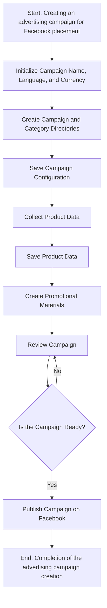
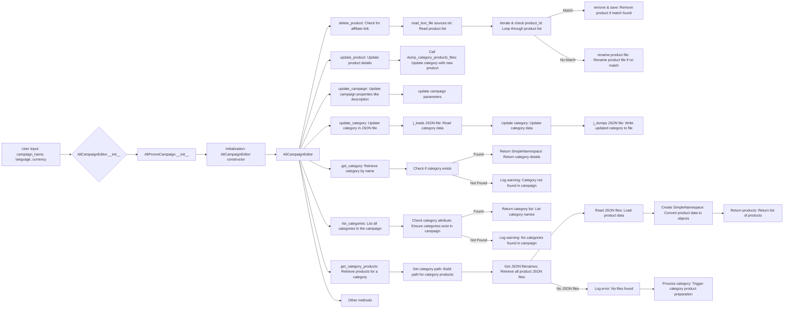

# Модуль `campaign`

## Обзор

Модуль `campaign` предназначен для управления процессом создания и публикации рекламных кампаний на Facebook. Он включает в себя функциональность для инициализации параметров кампании (название, язык, валюта), создания структуры каталогов, сохранения конфигураций для новой кампании, сбора и сохранения данных о товарах через `ali` или `html`, генерации рекламных материалов, просмотра кампании и публикации ее на Facebook.

## Подробней

Модуль предоставляет функциональность для управления процессом создания и публикации рекламных кампаний на Facebook.  Он включает в себя функциональность для инициализации параметров кампании (название, язык, валюта), создания структуры каталогов, сохранения конфигураций для новой кампании, сбора и сохранения данных о товарах через `ali` или `html`, генерации рекламных материалов, просмотра кампании и публикации ее на Facebook.



 - **Шаг 1**: Старт - Начало процесса.

 - **Шаг 2**: Инициализация деталей кампании - Определяются название кампании, язык и валюта. Пример: Название кампании: "Летняя распродажа", Язык: "Русский", Валюта: "USD"

 - **Шаг 3**: Создание каталогов кампании и категорий - Создаются необходимые каталоги или файлы для кампании. Пример: Создается структура папок в файловой системе для хранения ресурсов кампании.

 - **Шаг 4**: Сохранение конфигурации кампании - Сохраняются инициализированные детали кампании. Пример: Данные записываются в базу данных или конфигурационный файл.

 - **Шаг 5**: Сбор данных о товарах - Собираются данные, связанные с товарами, которые будут продвигаться в рамках кампании. Пример: Из системы инвентаризации извлекаются ID товаров, описания, изображения и цены.

 - **Шаг 6**: Сохранение данных о товарах - Сохраненные данные о товарах. Пример: Данные записываются в таблицу базы данных, предназначенную для товаров кампании.

 - **Шаг 7**: Создание рекламных материалов - Создаются или выбираются графика, баннеры и другие рекламные ресурсы. Пример: Изображения и описания адаптируются для привлечения клиентов.

 - **Шаг 8**: Обзор кампании - Процесс обзора подтверждает готовность компонентов кампании. Пример: Человек или система оценивает качество и полноту всех компонентов кампании.

 - **Шаг 9**: Готова ли кампания? - Проверка для определения, является ли кампания завершенной и готовой к публикации. Пример: Булевский флаг сигнализирует "Да", если все на месте, иначе "Нет", вызывая возврат к предыдущему шагу для внесения исправлений.

 - **Шаг 10**: Публикация кампании - Кампания становится активной на платформе, готовая к маркетинговым усилиям. Пример: Выполняются вызовы API для публикации кампании на соответствующей платформе.

 - **Шаг 11**: Завершение - Процесс создания кампании завершен.

## Редактирование кампании



## Подготовка кампании

```mermaid
flowchart TD
    A[Start] --> B{Process all campaigns?}
    B -->|Yes| C[Process all campaigns]
    B -->|No| D[Process specific campaign]
    
    C --> E{Language and Currency provided?}
    E -->|Yes| F[Process each campaign with provided language and currency]
    E -->|No| G[Process all locales for each campaign]
    
    D --> H{Categories specified?}
    H -->|Yes| I[Process specific categories for the campaign]
    H -->|No| J[Process entire campaign]
    
    F --> K[Process campaign category]
    G --> L[Process campaign for all locales]
    I --> K
    J --> L
    
    K --> M[Return]
    L --> M