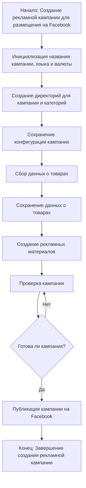

# Модуль `campaign`

## Обзор

Модуль `campaign` предназначен для управления процессом создания и публикации рекламных кампаний на Фейсбук. Он включает функционал для:

- **Инициализации параметров кампании**: Название, язык, валюта.
- **Создание структуры директорий**:  Для кампании и категорий товаров.
- **Сохранение конфигураций**: Для новой кампании.
- **Сбор и сохранение данных о товарах**: Через `ali` или `html`.
- **Генерация рекламных материалов**:  Для кампании.
- **Проверка кампании**: Перед публикацией.
- **Публикация кампании на Facebook**: После успешной проверки.

## Подорбней

Модуль `campaign` играет ключевую роль в автоматизации процесса запуска рекламных кампаний на Facebook. Он позволяет сократить время и усилия, необходимые для подготовки и публикации рекламных кампаний, обеспечивая:

- **Стандартизацию**:  Все рекламные кампании создаются с помощью единого шаблона, что гарантирует  последовательность и эффективность.
- **Автоматизация**:  Сбор и сохранение данных о товарах,  создание рекламных материалов и публикация кампании  автоматизированы, что позволяет сократить  ручной труд.
- **Управление**:  Модуль предоставляет инструменты для отслеживания  прогресса кампании и ее управления.

## Диаграмма рабочего процесса

## Принцип работы

1. **Инициализация**: Модуль `campaign`  инициализируется с заданными параметрами, такими как название кампании, язык и валюта.
2. **Создание структуры директорий**:  Создаются необходимые директории для хранения информации о кампании и ее категориях.
3. **Сохранение конфигурации**:  Сохраняются параметры кампании в конфигурационном файле.
4. **Сбор данных**:  Информация о товарах для кампании собирается из различных источников.
5. **Сохранение данных**:  Собранные данные о товарах сохраняются в структурированном формате.
6. **Создание рекламных материалов**:  Генерируются рекламные материалы  для кампании.
7. **Проверка кампании**:  Проводится  проверка  кампании перед ее публикацией.
8. **Публикация**:  Кампания публикуется на Facebook после успешной проверки.

## Классы

## Функции

## Методы

## Параметры

## Примеры

## Внутренние функции